# General - Diagrams AWS Batch and Scheduling 
## End-to-End Architecture Design Document

This document provides a structured reference for designing AWS batch-processing and scheduling systems using native AWS services. It groups patterns by architectural responsibility so you can separate **when work starts**, **how work is coordinated**, **where work runs**, and **how event-driven batches are formed**. [docs.aws.amazon](https://docs.aws.amazon.com/eventbridge/latest/userguide/using-eventbridge-scheduler.html)

***

## Architecture Layers

A good AWS batch design usually has four logical layers: **scheduler**, **orchestrator**, **compute runtime**, and **event-driven ingestion**. In practice, production systems often combine two or more of these layers, such as EventBridge Scheduler for timing, Step Functions for orchestration, and AWS Batch or Lambda for execution. [aws.amazon](https://aws.amazon.com/blogs/aws/step-functions-distributed-map-a-serverless-solution-for-large-scale-parallel-data-processing/)

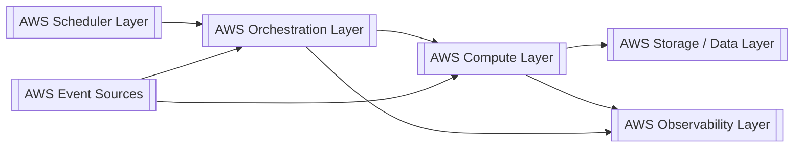
```mermaid
flowchart LR
    A[[AWS Scheduler Layer]] --> B[[AWS Orchestration Layer]]
    B --> C[[AWS Compute Layer]]
    C --> D[[AWS Storage / Data Layer]]
    E[[AWS Event Sources]] --> B
    E --> C
    C --> F[[AWS Observability Layer]]
    B --> F
```

**Decision notes**
- Use this as the baseline mental model for all designs.
- Separate **triggering** from **execution** whenever you need flexibility, retries, auditability, or workload evolution.
- Most enterprise-grade batch systems should not couple business logic directly into the schedule trigger.

***

# Scheduler Patterns

Schedulers determine **when** work starts. On AWS, the primary scheduling choices are EventBridge Scheduler and EventBridge Rules with schedule expressions. [docs.aws.amazon](https://docs.aws.amazon.com/scheduler/latest/UserGuide/managing-targets.html)

***

## AWS EventBridge Scheduler

**Purpose:** Managed time-based scheduler for cron, rate, and one-time invocations across AWS targets. It supports execution roles, retries, flexible windows, and DLQ integration. [docs.aws.amazon](https://docs.aws.amazon.com/scheduler/latest/APIReference/API_Target.html)

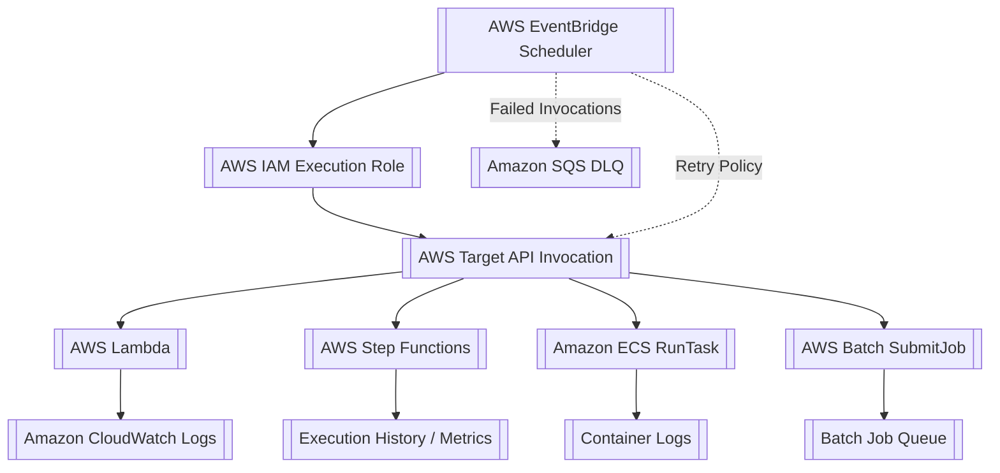
```mermaid
flowchart TD
    A[[AWS EventBridge Scheduler]] --> B[[AWS IAM Execution Role]]
    B --> C[[AWS Target API Invocation]]
    C --> D[[AWS Lambda]]
    C --> E[[AWS Step Functions]]
    C --> F[[Amazon ECS RunTask]]
    C --> G[[AWS Batch SubmitJob]]
    D --> H[[Amazon CloudWatch Logs]]
    E --> I[[Execution History / Metrics]]
    F --> J[[Container Logs]]
    G --> K[[Batch Job Queue]]
    A -. Retry Policy .-> C
    A -. Failed Invocations .-> L[[Amazon SQS DLQ]]
```

**Decision notes**
- Choose this for **new time-based scheduling implementations**.
- Best when schedules are independent resources and targets vary across services.
- Strong fit for enterprise scheduling because it decouples trigger management from business execution.
- Prefer it over older schedule-rule patterns for cleaner operational ownership.

***

## AWS EventBridge Rules with CRON

**Purpose:** Event routing engine that also supports schedule expressions. It works well when schedule-based and event-based triggers share the same event-routing model. [docs.aws.amazon](https://docs.aws.amazon.com/eventbridge/latest/userguide/using-eventbridge-scheduler.html)

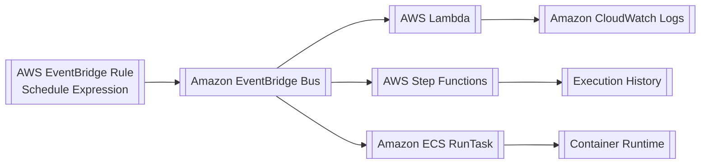
```mermaid
flowchart LR
    A[[AWS EventBridge Rule<br/>Schedule Expression]] --> B[[Amazon EventBridge Bus]]
    B --> C[[AWS Lambda]]
    B --> D[[AWS Step Functions]]
    B --> E[[Amazon ECS RunTask]]
    C --> F[[Amazon CloudWatch Logs]]
    D --> G[[Execution History]]
    E --> H[[Container Runtime]]
```

**Decision notes**
- Use when you already rely heavily on EventBridge bus rules and want one model for routing and scheduling.
- Avoid for large fleets of independent schedules where dedicated schedule management is cleaner.
- Good for simple scheduled triggers, but less purpose-built than EventBridge Scheduler.

***

# Orchestration Patterns

Orchestrators define **how work flows across steps**, including retries, branching, fan-out, compensation, and completion handling. AWS Step Functions, Glue Workflows, and MWAA are the primary orchestration choices. [docs.aws.amazon](https://docs.aws.amazon.com/step-functions/latest/dg/state-map.html)

***

## AWS Step Functions Standard Workflow

**Purpose:** Durable workflow orchestration for multi-step batch and scheduling pipelines with auditability, retries, branching, and integrations. [aws.amazon](https://aws.amazon.com/blogs/aws/step-functions-distributed-map-a-serverless-solution-for-large-scale-parallel-data-processing/)

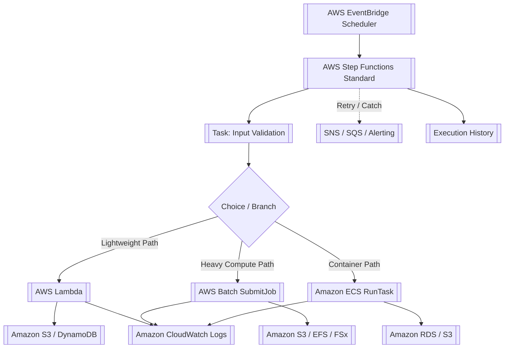
```mermaid
flowchart TD
    A[[AWS EventBridge Scheduler]] --> B[[AWS Step Functions Standard]]
    B --> C[[Task: Input Validation]]
    C --> D{Choice / Branch}
    D -->|Lightweight Path| E[[AWS Lambda]]
    D -->|Heavy Compute Path| F[[AWS Batch SubmitJob]]
    D -->|Container Path| G[[Amazon ECS RunTask]]
    E --> H[[Amazon S3 / DynamoDB]]
    F --> I[[Amazon S3 / EFS / FSx]]
    G --> J[[Amazon RDS / S3]]
    E --> K[[Amazon CloudWatch Logs]]
    F --> K
    G --> K
    B -. Retry / Catch .-> L[[SNS / SQS / Alerting]]
    B --> M[[Execution History]]
```

**Decision notes**
- Choose this when the process has **multiple steps**, **dependencies**, **human-readable flow**, or **strict operational visibility**.
- Best default orchestrator for enterprise batch systems that need audit trails.
- Particularly effective when mixing Lambda, ECS, Batch, DynamoDB, and data services in one flow.

***

## AWS Step Functions Express Workflow

**Purpose:** High-throughput orchestration for short-duration, high-frequency workflows. It is optimized for event-driven and micro-batch patterns. [docs.aws.amazon](https://docs.aws.amazon.com/step-functions/latest/dg/state-map.html)

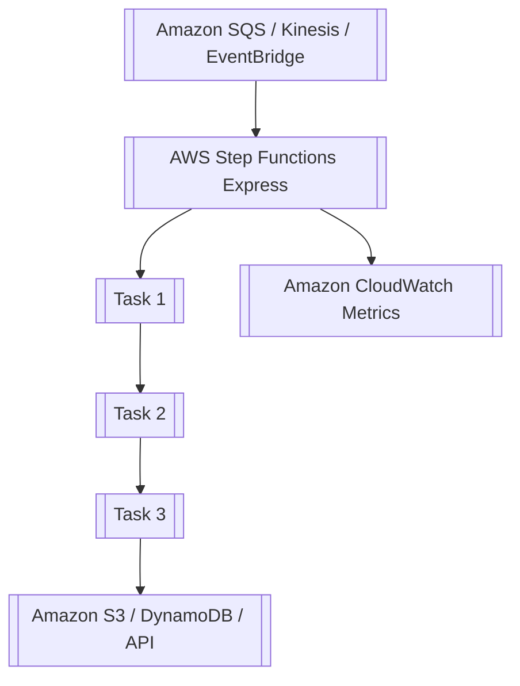
```mermaid
flowchart TD
    A[[Amazon SQS / Kinesis / EventBridge]] --> B[[AWS Step Functions Express]]
    B --> C[[Task 1]]
    C --> D[[Task 2]]
    D --> E[[Task 3]]
    E --> F[[Amazon S3 / DynamoDB / API]]
    B --> G[[Amazon CloudWatch Metrics]]
```

**Decision notes**
- Use this when execution volume is very high and each workflow is short-lived.
- Best for short orchestration around micro-batches, enrichment, and fan-out workers.
- Avoid when you need long-duration execution history and deep audit semantics.

***

## AWS Step Functions Distributed Map

**Purpose:** Large-scale parallel processing of datasets, especially S3-backed files and object collections. It supports high concurrency and child workflow isolation. [docs.aws.amazon](https://docs.aws.amazon.com/step-functions/latest/dg/state-map-distributed.html)

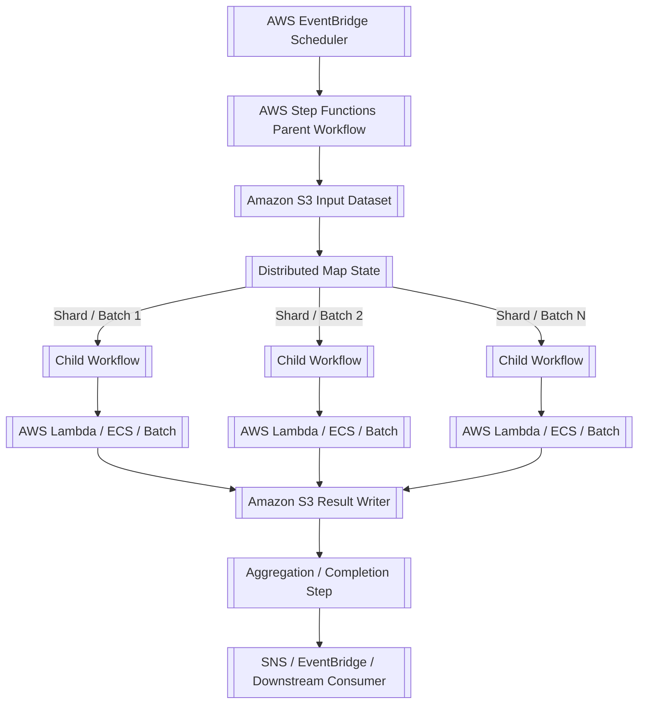
```mermaid
flowchart TD
    A[[AWS EventBridge Scheduler]] --> B[[AWS Step Functions Parent Workflow]]
    B --> C[[Amazon S3 Input Dataset]]
    C --> D[[Distributed Map State]]
    D -->|Shard / Batch 1| E1[[Child Workflow]]
    D -->|Shard / Batch 2| E2[[Child Workflow]]
    D -->|Shard / Batch N| E3[[Child Workflow]]
    E1 --> F1[[AWS Lambda / ECS / Batch]]
    E2 --> F2[[AWS Lambda / ECS / Batch]]
    E3 --> F3[[AWS Lambda / ECS / Batch]]
    F1 --> G[[Amazon S3 Result Writer]]
    F2 --> G
    F3 --> G
    G --> H[[Aggregation / Completion Step]]
    H --> I[[SNS / EventBridge / Downstream Consumer]]
```

**Decision notes**
- Use this for **large fan-out/fan-in workloads**, such as hundreds of thousands or millions of records.
- Best fit when input can be represented as S3 objects, file rows, or partitioned work units.
- Combine with Lambda for short stateless processing and with AWS Batch for heavy compute shards.

***

## AWS Glue Workflows and Glue Jobs

**Purpose:** Native orchestration and execution for Spark-centric ETL and data-lake pipelines tightly integrated with AWS Glue Catalog and S3. [docs.aws.amazon](https://docs.aws.amazon.com/wellarchitected/latest/analytics-lens/batch-data-processing.html)

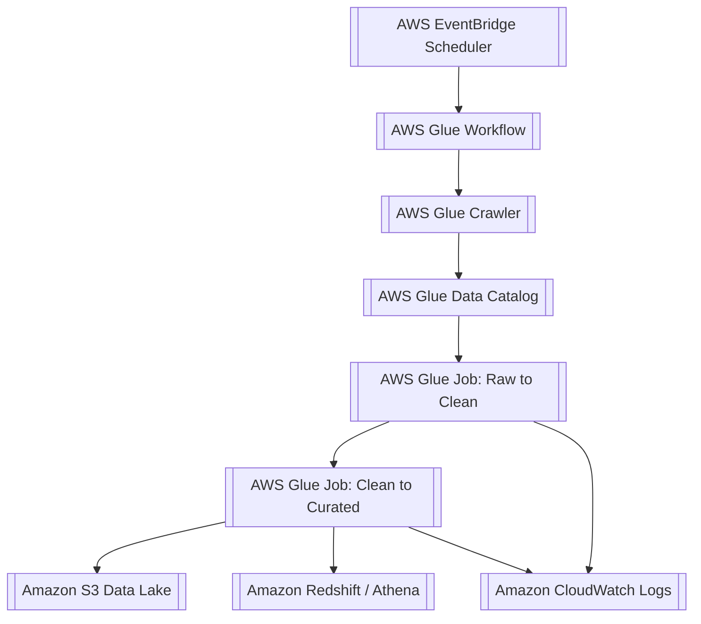
```mermaid
flowchart TD
    A[[AWS EventBridge Scheduler]] --> B[[AWS Glue Workflow]]
    B --> C[[AWS Glue Crawler]]
    C --> D[[AWS Glue Data Catalog]]
    D --> E[[AWS Glue Job: Raw to Clean]]
    E --> F[[AWS Glue Job: Clean to Curated]]
    F --> G[[Amazon S3 Data Lake]]
    F --> H[[Amazon Redshift / Athena]]
    E --> I[[Amazon CloudWatch Logs]]
    F --> I
```

**Decision notes**
- Choose when your batch system is really a **Spark ETL platform**.
- Strong fit for lakehouse, partitioned parquet pipelines, schema discovery, and data engineering teams.
- Avoid for application-centric workflows that do not need Spark.

***

## Amazon MWAA (Managed Airflow)

**Purpose:** Managed Apache Airflow for DAG-based workflow orchestration using Python and Airflow operators. [dzone](https://dzone.com/articles/a-comprehensive-comparison-of-aws-step-function-an)

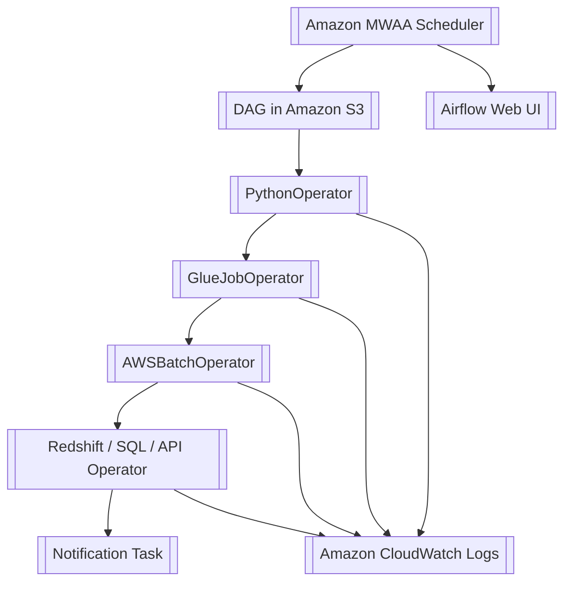
```mermaid
flowchart TD
    A[[Amazon MWAA Scheduler]] --> B[[DAG in Amazon S3]]
    B --> C[[PythonOperator]]
    C --> D[[GlueJobOperator]]
    D --> E[[AWSBatchOperator]]
    E --> F[[Redshift / SQL / API Operator]]
    F --> G[[Notification Task]]
    A --> H[[Airflow Web UI]]
    C --> I[[Amazon CloudWatch Logs]]
    D --> I
    E --> I
    F --> I
```

**Decision notes**
- Choose when your team is already comfortable with Airflow and DAG authoring.
- Best for data-platform teams managing many interdependent pipelines.
- Less ideal for small or purely AWS-native app teams that want a lower-overhead orchestration model.

***

# Compute Execution Patterns

Compute services determine **where the work runs** and how resources scale. Lambda, ECS/Fargate, AWS Batch, Glue, and EC2 Spot fill different execution niches. [docs.aws.amazon](https://docs.aws.amazon.com/batch/latest/APIReference/API_CreateJobQueue.html)

***

## AWS Lambda Batch Worker

**Purpose:** Serverless compute for short-running batch steps, lightweight transforms, polling workers, and fan-out processing. [docs.aws.amazon](https://docs.aws.amazon.com/decision-guides/latest/fargate-or-lambda/fargate-or-lambda.html)

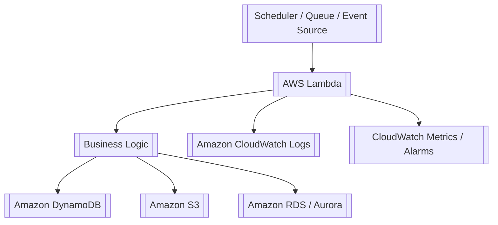
```mermaid
flowchart TD
    A[[Scheduler / Queue / Event Source]] --> B[[AWS Lambda]]
    B --> C[[Business Logic]]
    C --> D[[Amazon DynamoDB]]
    C --> E[[Amazon S3]]
    C --> F[[Amazon RDS / Aurora]]
    B --> G[[Amazon CloudWatch Logs]]
    B --> H[[CloudWatch Metrics / Alarms]]
```

**Decision notes**
- Choose for low-overhead, highly elastic workers with runtimes under Lambda limits.
- Strong fit for record-level processing, APIs, enrichment, small ETL tasks, and queue consumers.
- Avoid for long-running or memory/CPU-heavy jobs better handled by containers or Batch.

***

## Amazon ECS / AWS Fargate Scheduled Task

**Purpose:** Managed container execution for scheduled or on-demand jobs requiring custom runtimes and longer execution windows than Lambda. [builder.aws](https://builder.aws.com/content/34jTIHSM6RwweiUIMU4GJcgSVRs/how-to-schedule-ecs-tasks-choosing-between-eventbridge-scheduler-eventbridge-rules-and-step-functions)

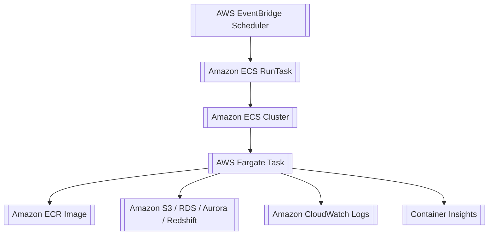
```mermaid
flowchart TD
    A[[AWS EventBridge Scheduler]] --> B[[Amazon ECS RunTask]]
    B --> C[[Amazon ECS Cluster]]
    C --> D[[AWS Fargate Task]]
    D --> E[[Amazon ECR Image]]
    D --> F[[Amazon S3 / RDS / Aurora / Redshift]]
    D --> G[[Amazon CloudWatch Logs]]
    D --> H[[Container Insights]]
```

**Decision notes**
- Best for jobs that need container packaging but not full AWS Batch queue semantics.
- Good for nightly jobs, scheduled ETL, custom binaries, or workloads beyond 15 minutes.
- Choose Fargate when you want minimal infrastructure management.

***

## AWS Batch

**Purpose:** Managed batch execution platform for queued, containerized, and compute-intensive jobs. It supports job queues, compute environments, and scheduling policies. [docs.aws.amazon](https://docs.aws.amazon.com/AWSCloudFormation/latest/TemplateReference/aws-resource-batch-jobqueue.html)

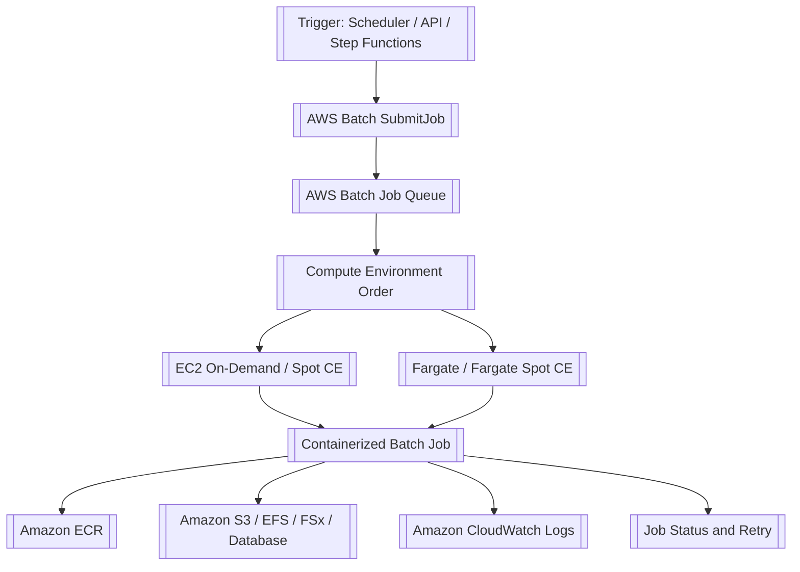
```mermaid
flowchart TD
    A[[Trigger: Scheduler / API / Step Functions]] --> B[[AWS Batch SubmitJob]]
    B --> C[[AWS Batch Job Queue]]
    C --> D[[Compute Environment Order]]
    D --> E[[EC2 On-Demand / Spot CE]]
    D --> F[[Fargate / Fargate Spot CE]]
    E --> G[[Containerized Batch Job]]
    F --> G
    G --> H[[Amazon ECR]]
    G --> I[[Amazon S3 / EFS / FSx / Database]]
    G --> J[[Amazon CloudWatch Logs]]
    G --> K[[Job Status and Retry]]
```

**Decision notes**
- Choose for **compute-heavy**, **long-running**, **parallel**, or **queue-driven** workloads.
- Best when you need job queueing, retries, vCPU/memory control, Spot optimization, array jobs, or GPUs.
- Prefer over plain ECS scheduling when workload management and queue semantics matter.

***

## AWS Batch with Step Functions

**Purpose:** Combined workflow orchestration plus heavy compute execution. This is a common enterprise pattern for long-running scheduled jobs. [docs.aws.amazon](https://docs.aws.amazon.com/batch/latest/userguide/best-practices.html)

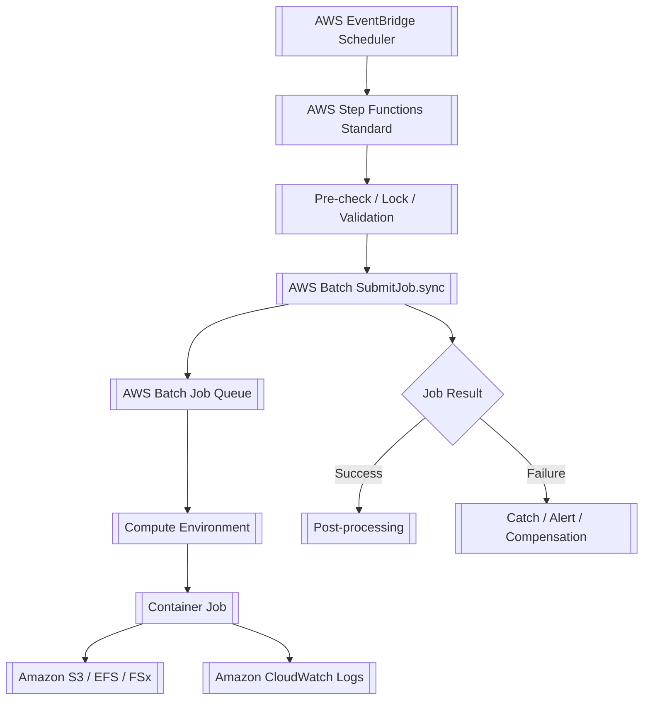
```mermaid
flowchart TD
    A[[AWS EventBridge Scheduler]] --> B[[AWS Step Functions Standard]]
    B --> C[[Pre-check / Lock / Validation]]
    C --> D[[AWS Batch SubmitJob.sync]]
    D --> E[[AWS Batch Job Queue]]
    E --> F[[Compute Environment]]
    F --> G[[Container Job]]
    G --> H[[Amazon S3 / EFS / FSx]]
    G --> I[[Amazon CloudWatch Logs]]
    D --> J{Job Result}
    J -->|Success| K[[Post-processing]]
    J -->|Failure| L[[Catch / Alert / Compensation]]
```

**Decision notes**
- Use when you need a robust business workflow around Batch execution.
- Best for scheduled jobs with approval, validation, aggregation, or downstream post-processing.
- This is often the cleanest pattern for enterprise nightly pipelines.

***

## EC2 Spot-Based Batch Processing

**Purpose:** Lowest-cost compute option for interruption-tolerant, checkpoint-capable workloads. Common for HPC, rendering, simulations, and ML training. [docs.aws.amazon](https://docs.aws.amazon.com/batch/latest/userguide/best-practices.html)

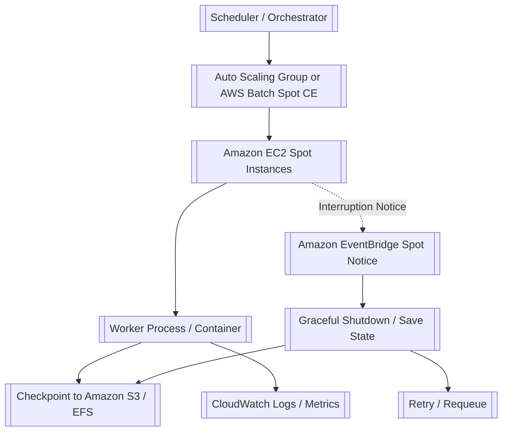
```mermaid
flowchart TD
    A[[Scheduler / Orchestrator]] --> B[[Auto Scaling Group or AWS Batch Spot CE]]
    B --> C[[Amazon EC2 Spot Instances]]
    C --> D[[Worker Process / Container]]
    D --> E[[Checkpoint to Amazon S3 / EFS]]
    D --> F[[CloudWatch Logs / Metrics]]
    C -. Interruption Notice .-> G[[Amazon EventBridge Spot Notice]]
    G --> H[[Graceful Shutdown / Save State]]
    H --> E
    H --> I[[Retry / Requeue]]
```

**Decision notes**
- Use when cost is the primary driver and the workload can recover from interruption.
- Only choose this if jobs can checkpoint or safely restart.
- This is highly effective for long-running, parallel compute jobs.

***

# Queue and Event-Driven Batch Patterns

These patterns start work based on **data arrival**, **queue depth**, or **stream windows** rather than explicit schedules. They are essential for near-real-time and micro-batch systems. [dev](https://dev.to/aws-builders/event-driven-batch-processing-on-aws-from-scheduled-tasks-to-auto-scaling-workloads-20a6)

***

## Amazon SQS + AWS Lambda + DLQ

**Purpose:** Durable asynchronous processing with automatic batching, scaling, retries, and poison-message isolation. [dev](https://dev.to/aws-builders/event-driven-batch-processing-on-aws-from-scheduled-tasks-to-auto-scaling-workloads-20a6)

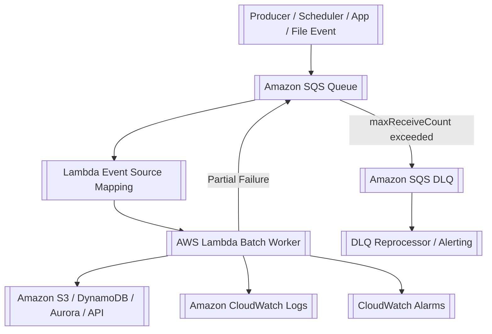
```mermaid
flowchart TD
    A[[Producer / Scheduler / App / File Event]] --> B[[Amazon SQS Queue]]
    B --> C[[Lambda Event Source Mapping]]
    C --> D[[AWS Lambda Batch Worker]]
    D --> E[[Amazon S3 / DynamoDB / Aurora / API]]
    D --> F[[Amazon CloudWatch Logs]]
    D --> G[[CloudWatch Alarms]]
    D -->|Partial Failure| B
    B -->|maxReceiveCount exceeded| H[[Amazon SQS DLQ]]
    H --> I[[DLQ Reprocessor / Alerting]]
```

**Decision notes**
- Choose for resilient, decoupled, high-scale asynchronous processing.
- Strong default for event-driven batch workloads.
- Add FIFO only when ordering or deduplication is required and lower throughput is acceptable.

***

## Amazon SQS FIFO Ordered Batch

**Purpose:** Ordered asynchronous processing with message groups and deduplication support. [dev](https://dev.to/aws-builders/event-driven-batch-processing-on-aws-from-scheduled-tasks-to-auto-scaling-workloads-20a6)

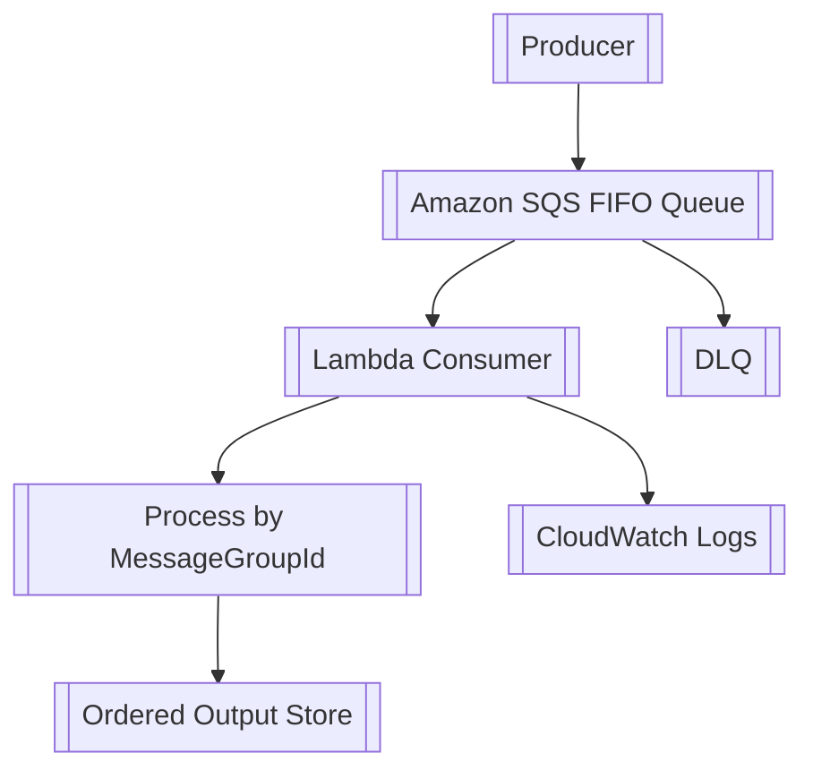
```mermaid
flowchart TD
    A[[Producer]] --> B[[Amazon SQS FIFO Queue]]
    B --> C[[Lambda Consumer]]
    C --> D[[Process by MessageGroupId]]
    D --> E[[Ordered Output Store]]
    C --> F[[CloudWatch Logs]]
    B --> G[[DLQ]]
```

**Decision notes**
- Use when ordering matters within a logical group such as customer, account, or ledger stream.
- Do not use for ultra-high-throughput unordered workloads unless ordering is a hard business requirement.

***

## Amazon S3 Event -> SQS -> Lambda / ECS

**Purpose:** File-arrival-driven batch ingestion with durable buffering and asynchronous processing. [dev](https://dev.to/aws-builders/event-driven-batch-processing-on-aws-from-scheduled-tasks-to-auto-scaling-workloads-20a6)

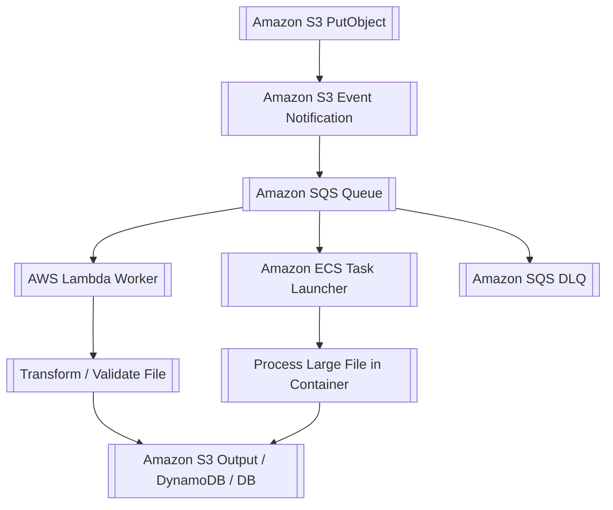
```mermaid
flowchart TD
    A[[Amazon S3 PutObject]] --> B[[Amazon S3 Event Notification]]
    B --> C[[Amazon SQS Queue]]
    C --> D[[AWS Lambda Worker]]
    C --> E[[Amazon ECS Task Launcher]]
    D --> F[[Transform / Validate File]]
    E --> G[[Process Large File in Container]]
    F --> H[[Amazon S3 Output / DynamoDB / DB]]
    G --> H
    C --> I[[Amazon SQS DLQ]]
```

**Decision notes**
- Use when files arrive unpredictably and polling would be wasteful.
- Good for inbound feeds, partner file drops, CSV ingestion, image/video preprocessing, and archival transforms.

***

## Amazon DynamoDB Streams -> Lambda Micro-Batch

**Purpose:** Change-data-capture triggered processing for table mutations and downstream aggregation. [docs.aws.amazon](https://docs.aws.amazon.com/wellarchitected/latest/analytics-lens/batch-data-processing.html)

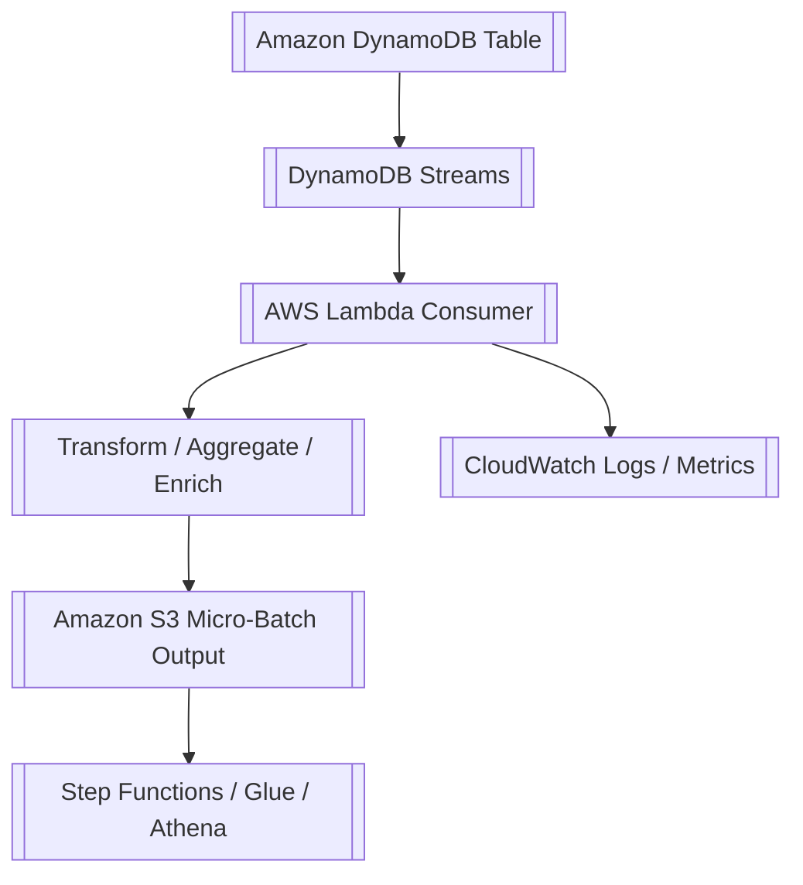
```mermaid
flowchart TD
    A[[Amazon DynamoDB Table]] --> B[[DynamoDB Streams]]
    B --> C[[AWS Lambda Consumer]]
    C --> D[[Transform / Aggregate / Enrich]]
    D --> E[[Amazon S3 Micro-Batch Output]]
    E --> F[[Step Functions / Glue / Athena]]
    C --> G[[CloudWatch Logs / Metrics]]
```

**Decision notes**
- Choose when changes in a DynamoDB table should trigger incremental downstream processing.
- Best for CDC pipelines, projections, derived views, and near-real-time materialization.

***

## Amazon Kinesis -> Lambda Tumbling Window

**Purpose:** High-throughput stream ingestion with time-window-based micro-batching. [docs.aws.amazon](https://docs.aws.amazon.com/wellarchitected/latest/analytics-lens/batch-data-processing.html)

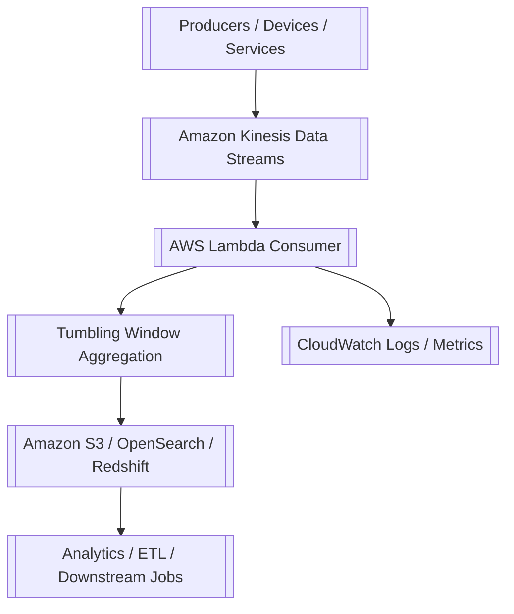
```mermaid
flowchart TD
    A[[Producers / Devices / Services]] --> B[[Amazon Kinesis Data Streams]]
    B --> C[[AWS Lambda Consumer]]
    C --> D[[Tumbling Window Aggregation]]
    D --> E[[Amazon S3 / OpenSearch / Redshift]]
    E --> F[[Analytics / ETL / Downstream Jobs]]
    C --> G[[CloudWatch Logs / Metrics]]
```

**Decision notes**
- Use when events are continuous and you want controlled micro-batches such as every 1 to 5 minutes.
- Strong fit for telemetry, clickstream, operational metrics, and streaming aggregation.

***

# Data Engineering / Legacy Comparison

These are not the primary recommendation categories for new application-led batch systems, but they are useful in platform comparisons. [docs.aws.amazon](https://docs.aws.amazon.com/wellarchitected/latest/analytics-lens/batch-data-processing.html)

***

## AWS Data Pipeline (Legacy Comparison Only)

**Purpose:** Older pipeline orchestration service historically used for data movement and batch activities. New systems should generally use newer AWS-native orchestration patterns. [docs.aws.amazon](https://docs.aws.amazon.com/wellarchitected/latest/analytics-lens/batch-data-processing.html)

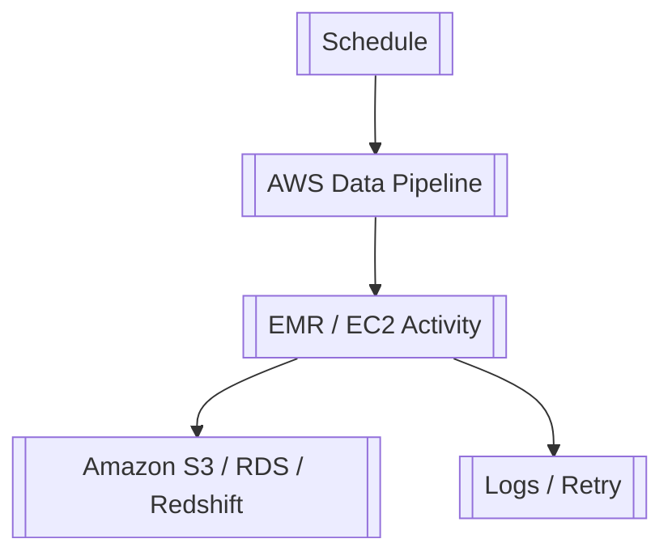
```mermaid
flowchart TD
    A[[Schedule]] --> B[[AWS Data Pipeline]]
    B --> C[[EMR / EC2 Activity]]
    C --> D[[Amazon S3 / RDS / Redshift]]
    C --> E[[Logs / Retry]]
```

**Decision notes**
- Mention only for migration or comparison.
- Do not choose this for new designs unless there is a legacy dependency you are actively unwinding.

***

# Cross-Cutting Best-Practice Patterns

These patterns apply across almost every batch architecture. They define how to build systems that survive retries, duplication, regional issues, and operational drift. [aws.amazon](https://aws.amazon.com/blogs/aws/step-functions-distributed-map-a-serverless-solution-for-large-scale-parallel-data-processing/)

***

## Fan-Out / Fan-In Pattern

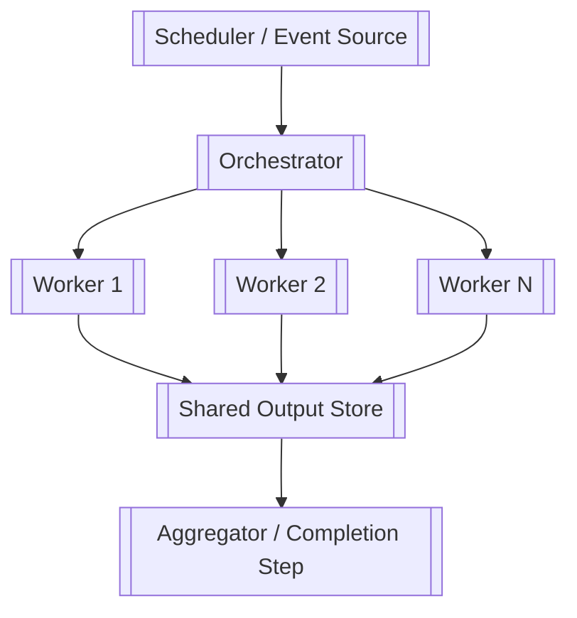
```mermaid
flowchart TD
    A[[Scheduler / Event Source]] --> B[[Orchestrator]]
    B --> C1[[Worker 1]]
    B --> C2[[Worker 2]]
    B --> C3[[Worker N]]
    C1 --> D[[Shared Output Store]]
    C2 --> D
    C3 --> D
    D --> E[[Aggregator / Completion Step]]
```

**Decision notes**
- Use when a large batch must be partitioned into independent parallel work units.
- Combine with Step Functions Distributed Map, SQS workers, or AWS Batch array jobs.

***

## Idempotent Processing Pattern

```mermaid
flowchart TD
    A[[Incoming Work Item]] --> B[[Idempotency Key Check]]
    B -->|Already Processed| C[[Skip / Return Success]]
    B -->|New Work| D[[Execute Business Logic]]
    D --> E[[Persist Result]]
    E --> F[[Store Processed Key]]
```

**Decision notes**
- Every retryable batch system should be idempotent.
- Use DynamoDB conditional writes, FIFO deduplication IDs, or application-level unique business keys.

***

## Error Handling and DLQ Pattern

```mermaid
flowchart TD
    A[[Work Item]] --> B[[Primary Processor]]
    B -->|Success| C[[Complete]]
    B -->|Transient Failure| D[[Retry Policy]]
    D --> B
    B -->|Permanent Failure| E[[DLQ]]
    E --> F[[Alert / Manual Review / Replay]]
```

**Decision notes**
- Design explicitly for transient versus terminal failures.
- Use DLQs for poison-pill events and replay queues for controlled recovery.

***

## Multi-Region Active/Active Batch Coordination

```mermaid
flowchart LR
    subgraph A1[Region 1]
        R1S[[EventBridge Scheduler]]
        R1O[[Step Functions / Batch]]
        R1D[(DynamoDB Global Table)]
        R1B[(Amazon S3 Bucket)]
        R1S --> R1O
        R1O --> R1D
        R1O --> R1B
    end

    subgraph A2[Region 2]
        R2S[[EventBridge Scheduler]]
        R2O[[Step Functions / Batch]]
        R2D[(DynamoDB Global Table)]
        R2B[(Amazon S3 Bucket)]
        R2S --> R2O
        R2O --> R2D
        R2O --> R2B
    end

    R1D <--> R2D
    R1B <--> R2B
```

**Decision notes**
- Use when scheduling and processing must continue during a regional event.
- Shared state coordination is required to avoid duplicate ownership and split-brain execution.

***

# Recommended Reference Architectures

These are practical end-to-end combinations that work well in real AWS environments. They combine the services above into production-ready patterns. [docs.aws.amazon](https://docs.aws.amazon.com/batch/latest/APIReference/API_CreateJobQueue.html)

***

## Reference Pattern A: Simple Scheduled Serverless Batch

```mermaid
flowchart TD
    A[[AWS EventBridge Scheduler]] --> B[[AWS Lambda]]
    B --> C[[Amazon DynamoDB / Amazon S3]]
    B --> D[[CloudWatch Logs]]
    A --> E[[Amazon SQS DLQ]]
```

**Best for**
- Small daily or hourly jobs
- Lightweight ETL
- Simple notifications or reconciliations

***

## Reference Pattern B: Enterprise Scheduled Workflow

```mermaid
flowchart TD
    A[[AWS EventBridge Scheduler]] --> B[[AWS Step Functions Standard]]
    B --> C[[Validation]]
    C --> D[[Parallel / Choice]]
    D --> E[[AWS Lambda]]
    D --> F[[Amazon ECS]]
    D --> G[[AWS Batch]]
    E --> H[[Amazon S3]]
    F --> H
    G --> H
    B --> I[[SNS / Alerting]]
```

**Best for**
- Multi-step batch processes
- Enterprise auditability
- Controlled retries and failure paths

***

## Reference Pattern C: Large Dataset Parallel Processing

```mermaid
flowchart TD
    A[[AWS EventBridge Scheduler]] --> B[[Step Functions Parent Workflow]]
    B --> C[[Amazon S3 Input File]]
    C --> D[[Distributed Map]]
    D --> E1[[Lambda Worker]]
    D --> E2[[Lambda Worker]]
    D --> E3[[Batch Worker]]
    E1 --> F[[Amazon S3 Result Writer]]
    E2 --> F
    E3 --> F
    F --> G[[Aggregation / Notification]]
```

**Best for**
- 300K+ record processing
- File-backed distributed workloads
- Fan-out/fan-in orchestration

***

## Reference Pattern D: Heavy Compute Nightly Processing

```mermaid
flowchart TD
    A[[AWS EventBridge Scheduler]] --> B[[AWS Step Functions]]
    B --> C[[AWS Batch SubmitJob.sync]]
    C --> D[[AWS Batch Job Queue]]
    D --> E[[EC2 Spot / On-Demand Compute]]
    E --> F[[Container Job]]
    F --> G[[Amazon S3 / EFS / FSx]]
    F --> H[[CloudWatch Logs]]
    B --> I[[Post-Process / Notify]]
```

**Best for**
- Long-running compute jobs
- HPC, ML, transcoding, simulations
- Cost-optimized Spot-capable workloads

***

## Reference Pattern E: Event-Driven Micro-Batching

```mermaid
flowchart TD
    A[[Amazon Kinesis / DynamoDB Streams / Amazon SQS]] --> B[[AWS Lambda]]
    B --> C[[Window / Aggregate]]
    C --> D[[Amazon S3 Micro-Batch]]
    D --> E[[AWS Glue / Athena / Step Functions]]
```

**Best for**
- Every-1-minute to every-5-minute aggregation
- Streaming-to-batch bridges
- Near-real-time analytics feeds

***

# Selection Guidance

Pick the pattern based on the dominant workload trait rather than starting from a preferred service. For example, **time-based single-step work** usually maps to EventBridge Scheduler plus Lambda, while **multi-step enterprise workflows** map better to EventBridge Scheduler plus Step Functions. **Compute-heavy jobs** usually belong on AWS Batch or ECS/Fargate, and **continuous event flows** typically fit SQS, Kinesis, or DynamoDB Streams. [docs.aws.amazon](https://docs.aws.amazon.com/scheduler/latest/UserGuide/managing-targets.html)

| Workload shape | Preferred scheduler | Preferred orchestrator | Preferred compute |
|---|---|---|---|
| Simple cron job | EventBridge Scheduler  [docs.aws.amazon](https://docs.aws.amazon.com/scheduler/latest/UserGuide/managing-targets.html) | None or minimal  [docs.aws.amazon](https://docs.aws.amazon.com/scheduler/latest/UserGuide/managing-targets.html) | Lambda  [docs.aws.amazon](https://docs.aws.amazon.com/decision-guides/latest/fargate-or-lambda/fargate-or-lambda.html) |
| Multi-step scheduled pipeline | EventBridge Scheduler  [docs.aws.amazon](https://docs.aws.amazon.com/scheduler/latest/UserGuide/managing-targets.html) | Step Functions Standard  [docs.aws.amazon](https://docs.aws.amazon.com/step-functions/latest/dg/state-map.html) | Lambda / ECS / Batch  [docs.aws.amazon](https://docs.aws.amazon.com/batch/latest/APIReference/API_CreateJobQueue.html) |
| Massive record fan-out | EventBridge Scheduler  [docs.aws.amazon](https://docs.aws.amazon.com/scheduler/latest/UserGuide/managing-targets.html) | Step Functions Distributed Map  [docs.aws.amazon](https://docs.aws.amazon.com/step-functions/latest/dg/state-map-distributed.html) | Lambda / Batch  [aws.amazon](https://aws.amazon.com/blogs/aws/step-functions-distributed-map-a-serverless-solution-for-large-scale-parallel-data-processing/) |
| Spark ETL | EventBridge Scheduler  [docs.aws.amazon](https://docs.aws.amazon.com/scheduler/latest/UserGuide/managing-targets.html) | Glue Workflow  [docs.aws.amazon](https://docs.aws.amazon.com/wellarchitected/latest/analytics-lens/batch-data-processing.html) | Glue Jobs  [docs.aws.amazon](https://docs.aws.amazon.com/wellarchitected/latest/analytics-lens/batch-data-processing.html) |
| Airflow-style data platform | EventBridge or Airflow schedule  [dzone](https://dzone.com/articles/a-comprehensive-comparison-of-aws-step-function-an) | MWAA  [dzone](https://dzone.com/articles/a-comprehensive-comparison-of-aws-step-function-an) | Mixed |
| Long-running compute batch | EventBridge Scheduler  [docs.aws.amazon](https://docs.aws.amazon.com/scheduler/latest/UserGuide/managing-targets.html) | Step Functions optional  [docs.aws.amazon](https://docs.aws.amazon.com/step-functions/latest/dg/state-map.html) | AWS Batch / ECS  [docs.aws.amazon](https://docs.aws.amazon.com/batch/latest/APIReference/API_CreateJobQueue.html) |
| Queue-driven async work | SQS  [dev](https://dev.to/aws-builders/event-driven-batch-processing-on-aws-from-scheduled-tasks-to-auto-scaling-workloads-20a6) | Optional Express workflow  [docs.aws.amazon](https://docs.aws.amazon.com/step-functions/latest/dg/state-map.html) | Lambda / ECS  [docs.aws.amazon](https://docs.aws.amazon.com/decision-guides/latest/fargate-or-lambda/fargate-or-lambda.html) |
| Real-time micro-batching | Kinesis / Streams  [docs.aws.amazon](https://docs.aws.amazon.com/wellarchitected/latest/analytics-lens/batch-data-processing.html) | Optional Express  [docs.aws.amazon](https://docs.aws.amazon.com/step-functions/latest/dg/state-map.html) | Lambda  [docs.aws.amazon](https://docs.aws.amazon.com/decision-guides/latest/fargate-or-lambda/fargate-or-lambda.html) |

***

# Authoring Notes

These Mermaid diagrams use consistent AWS-style labels such as `[[AWS Lambda]]`, `[[Amazon S3]]`, and `[[AWS Step Functions]]` for readability in Markdown renderers. Mermaid syntax and node rendering will vary slightly across GitHub, GitLab, Confluence plugins, and VS Code preview extensions, so minor formatting adjustments may be needed depending on where you publish the document.

***

If you want, I can next produce one of these three follow-ups:

1. A **version with themed Mermaid styling** for AWS-like colors and grouped subgraphs  
2. A **decision-tree Markdown document** that maps workload constraints to the right AWS option  
3. A **full end-to-end architecture playbook** with Why–What–How narrative under each diagram