# KYC - Diagrams AWS Batch and Scheduling 

## Mermaid theme

Use this front matter or paste the init block above each diagram so the diagrams render with an AWS-like color palette based on AWS orange and dark slate tones. [aws.amazon](https://aws.amazon.com/architecture/icons/)

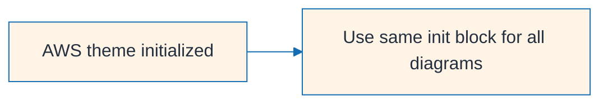

***

## 1) EventBridge Scheduler

EventBridge Scheduler is the best fit for centralized recurring schedules and one-time invocations with retries and DLQ support. It is a trigger service, not a workflow engine, so the diagram ends at the target service. [docs.aws.amazon](https://docs.aws.amazon.com/step-functions/latest/dg/using-eventbridge-scheduler.html)

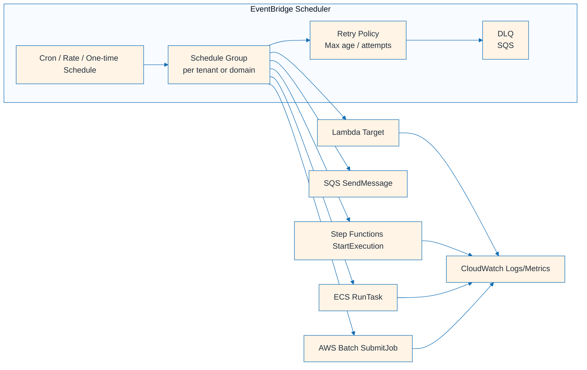

***

## 2) EventBridge Rules (CRON)

EventBridge Rules combine scheduling with event pattern routing and can also route events across Regions through event buses. This makes them useful when cron and event-routing logic belong in the same control plane. [aws.amazon](https://aws.amazon.com/blogs/compute/introducing-cross-region-event-routing-with-amazon-eventbridge/)

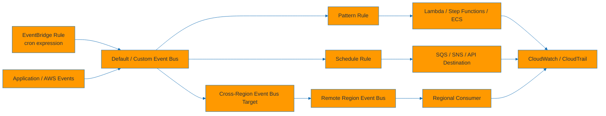

***

## 3) Step Functions Standard

Step Functions Standard is intended for durable, auditable workflows with branching, retries, and long-running coordination. It fits batch orchestration when the job needs workflow state, failure handling, and execution history. [docs.aws.amazon](https://docs.aws.amazon.com/step-functions/latest/dg/eventbridge-integration.html)

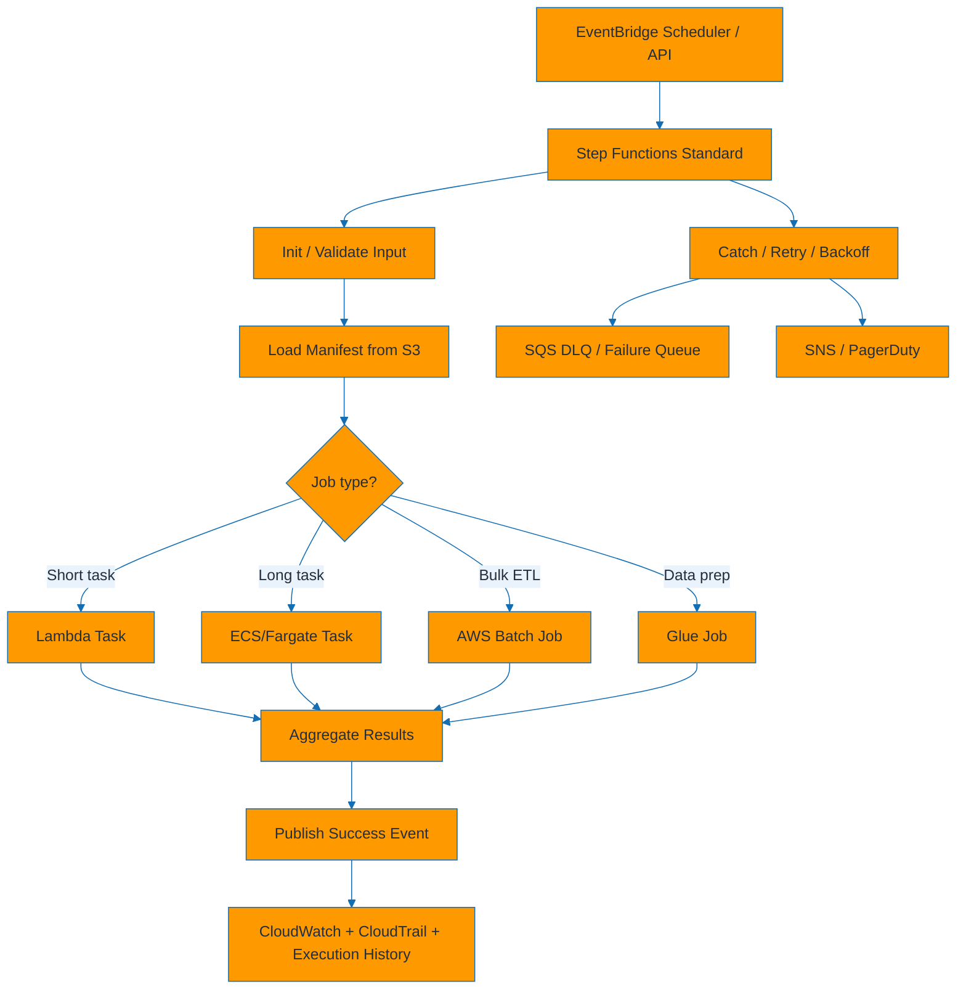

***

## 4) Step Functions Express

Express workflows are optimized for very high request rates and short-duration orchestration, commonly as micro-batch workers or child workflows. They trade full long-term execution history for lower cost and higher throughput. [dev](https://dev.to/aws-builders/step-functions-distributed-map-best-practices-for-large-scale-batch-workloads-55n2)

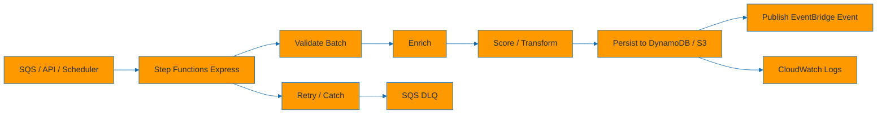

***

## 5) Step Functions Distributed Map

Distributed Map supports very large-scale parallel processing and can read input directly from Amazon S3, then spawn large numbers of child executions. This is one of the strongest options for your 300k+ daily records pattern. [docs.aws.amazon](https://docs.aws.amazon.com/step-functions/latest/dg/state-map-distributed.html)

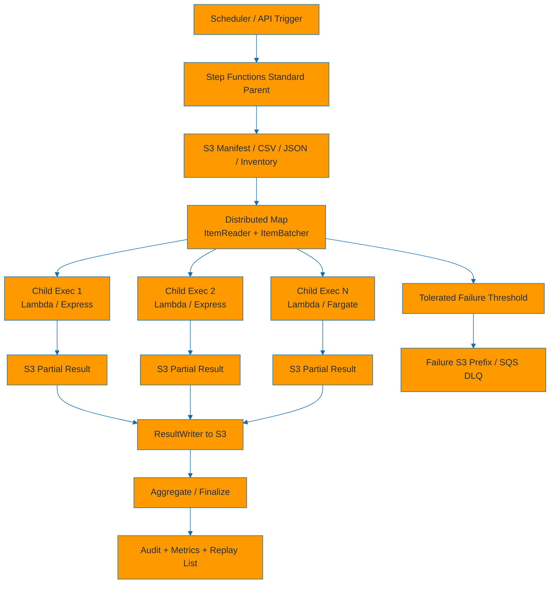

***

## 6) SQS + Lambda fan-out

SQS with Lambda event source mapping is a standard AWS pattern for decoupled, elastic fan-out processing with buffering and DLQ isolation. It works especially well for stateless record processing and CRUD-side asynchronous operations. [dev](https://dev.to/aws-builders/event-driven-batch-processing-on-aws-from-scheduled-tasks-to-auto-scaling-workloads-20a6)

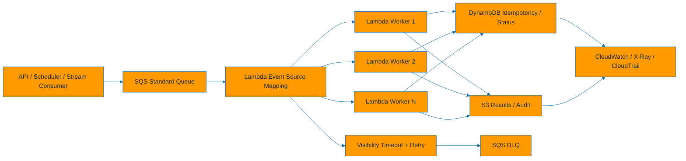

***

## 7) SQS FIFO + Fargate consumers

FIFO queues preserve ordered processing per message group, which is useful for tenant-entity ordering or customer-state transitions. ECS/Fargate consumers can long-poll FIFO queues while preserving per-group sequencing. [aws.amazon](https://aws.amazon.com/blogs/containers/cost-optimization-checklist-for-ecs-fargate/)

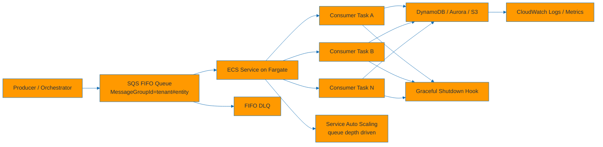

***

## 8) AWS Batch

AWS Batch provides managed batch queues, job definitions, and compute environments on ECS, EKS, EC2, or Fargate, reducing custom scheduler and capacity-management work. It is particularly suitable for long-running containerized jobs and array-job sharding. [docs.aws.amazon](https://docs.aws.amazon.com/batch/latest/userguide/best-practices.html)

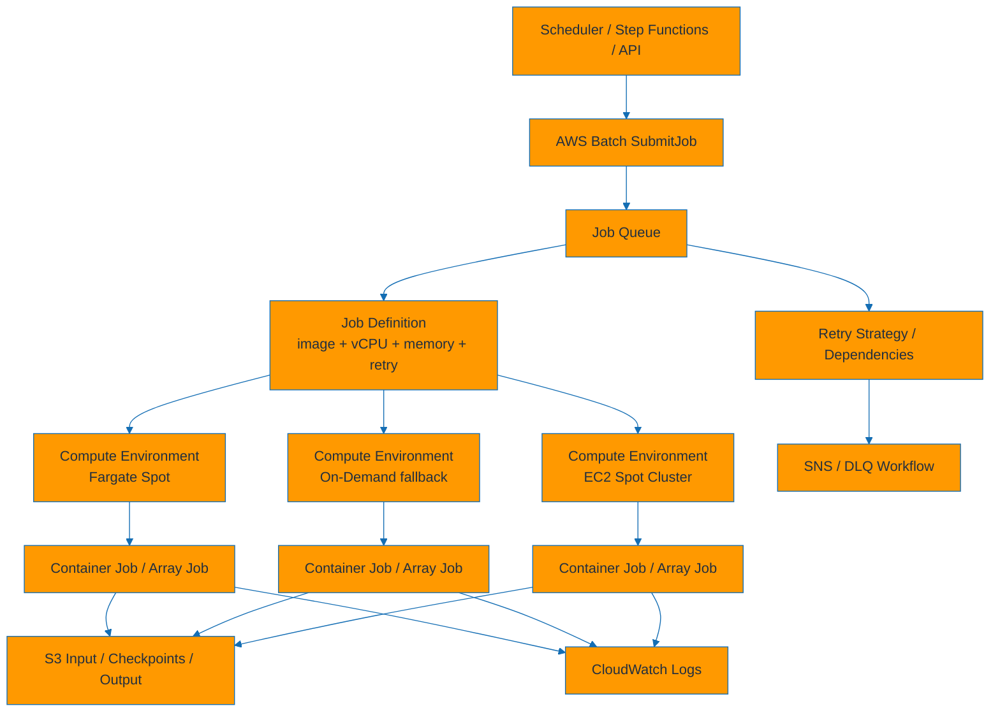

***

## 9) ECS/Fargate Scheduled Tasks

Scheduled ECS tasks are a straightforward pattern when a containerized task should run on a schedule without a larger workflow engine. EventBridge Scheduler or rules can invoke ECS `RunTask` directly. [builder.aws](https://builder.aws.com/content/34jTIHSM6RwweiUIMU4GJcgSVRs/how-to-schedule-ecs-tasks-choosing-between-eventbridge-scheduler-eventbridge-rules-and-step-functions)

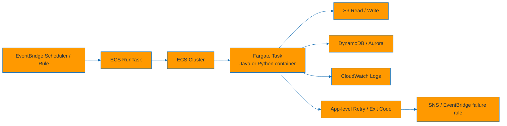

***

## 10) Glue Jobs / Glue Workflows

Glue provides managed Spark ETL and workflow chaining with native ties to the Glue Data Catalog and S3-based data lakes. It is a strong option for large-scale transformation and schema-aware ETL. [community](https://community.aws/content/2n7nKFwWWmJs5Bg9s2UNoQO0Ydn/how-to-architect-a-high-performance-batch-processing-pipeline-with-apache-spark-on-aws)

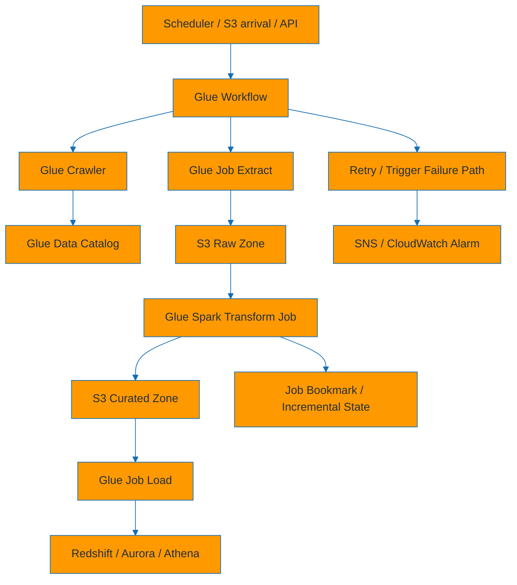

***

## 11) MWAA (Managed Airflow)

MWAA runs Apache Airflow as a managed service, with DAGs stored in S3 and workers executing task operators. It is most appropriate when the team prefers Airflow’s Python DAG model and operator ecosystem. [community](https://community.aws/content/2n7nKFwWWmJs5Bg9s2UNoQO0Ydn/how-to-architect-a-high-performance-batch-processing-pipeline-with-apache-spark-on-aws)

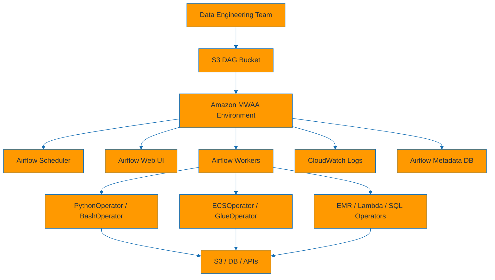

***

## 12) Lambda with DynamoDB Streams / Kinesis / S3 Events

These patterns are event-driven rather than schedule-driven, and they are useful when the source data change should immediately trigger downstream processing. They fit CRUD-side async operations and near-real-time enrichment especially well. [dev](https://dev.to/aws-builders/event-driven-batch-processing-on-aws-from-scheduled-tasks-to-auto-scaling-workloads-20a6)

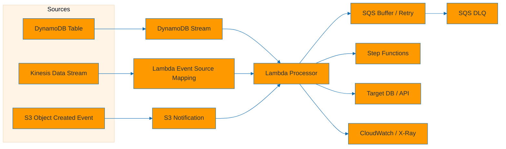

***

## 13) EC2 Spot-based batch clusters

EC2 Spot clusters provide the lowest compute cost for fault-tolerant batch but require interruption-aware design and more operational control. They are often paired with AWS Batch or a self-managed scheduler. [docs.aws.amazon](https://docs.aws.amazon.com/batch/latest/userguide/best-practices.html)

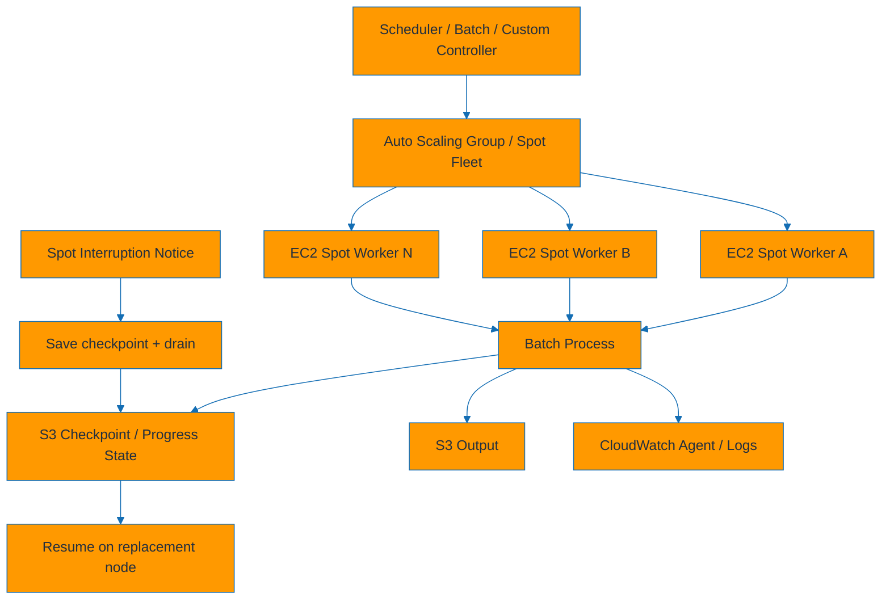

***

## 14) AWS Data Pipeline (legacy)

AWS Data Pipeline is legacy and generally replaced by newer AWS-native orchestration and ETL services such as Glue and Step Functions. The diagram is included only for comparison and migration context. [community](https://community.aws/content/2n7nKFwWWmJs5Bg9s2UNoQO0Ydn/how-to-architect-a-high-performance-batch-processing-pipeline-with-apache-spark-on-aws)

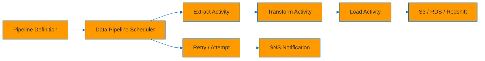

***

## 15) Multi-region active-active scheduler

Cross-Region event routing in EventBridge is supported, and active-active coordination patterns commonly combine regional schedulers with shared control state to avoid split-brain execution. For resilient scheduling, pair regional schedulers with a DynamoDB Global Table lease or idempotent downstream execution. [docs.aws.amazon](https://docs.aws.amazon.com/eventbridge/latest/userguide/eb-cross-region.html)

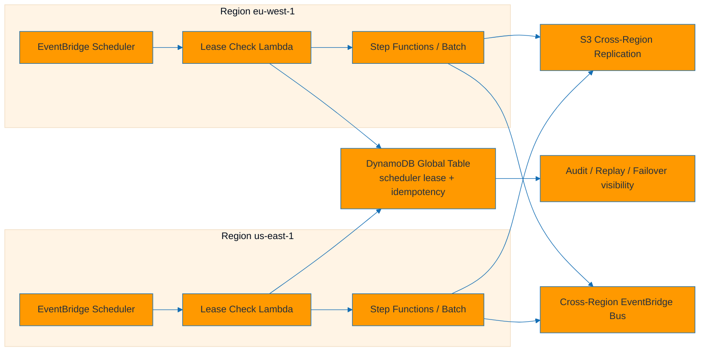

***

## 16) Best final architecture

This combined pattern aligns most directly with your workload constraints because it uses EventBridge Scheduler for schedules, Step Functions for orchestration, SQS for buffering, Lambda for short parallel work, and Batch or Fargate for long-running jobs. Cross-Region EventBridge routing and DynamoDB Global Tables support the active-active control plane, while S3 and DynamoDB support low-duplication storage, idempotency, and auditability. [docs.aws.amazon](https://docs.aws.amazon.com/step-functions/latest/dg/using-eventbridge-scheduler.html)

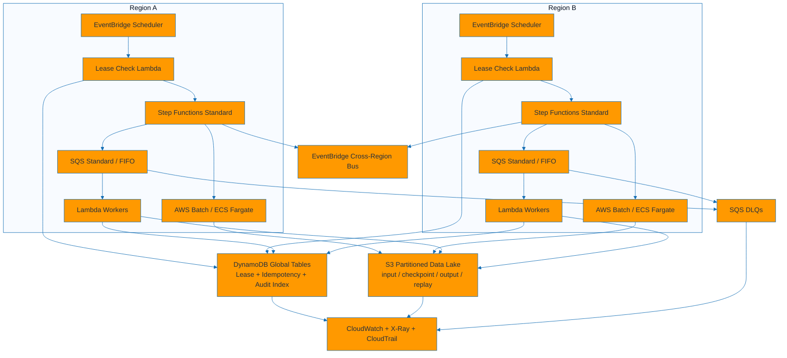

## Rendering notes

Mermaid architecture diagrams support grouped services and cloud-style layouts in newer Mermaid versions, but many markdown renderers still support flowcharts more consistently, which is why the document above uses mostly flowchart syntax for portability. If your renderer supports Mermaid icon packs, you can replace labels with AWS logos-based architecture syntax, but icon registration is renderer-dependent in tools like VS Code, GitHub Pages, and Obsidian. [stackoverflow](https://stackoverflow.com/questions/79123430/rendering-icons-in-mermaid-architecture-diagram)

Would you like the next step to be a single consolidated `.md` document with:
1. table of contents,
2. all diagrams grouped by category,
3. reusable AWS Mermaid style classes,
4. and your 8 workload-specific diagrams added in the same format?