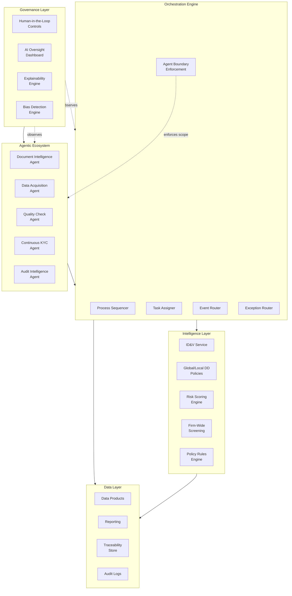
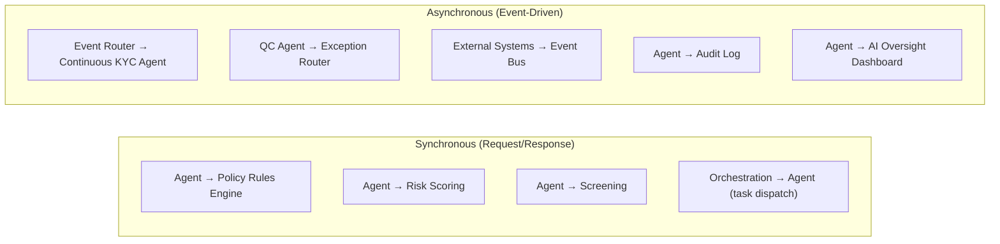
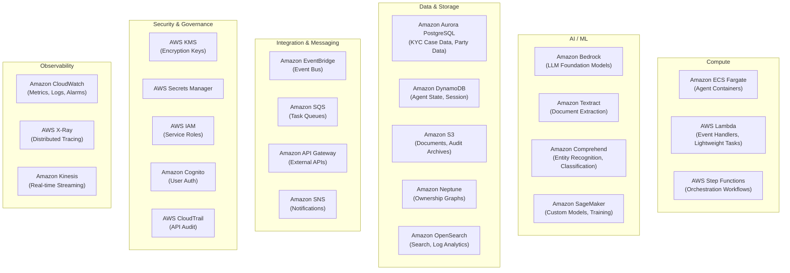
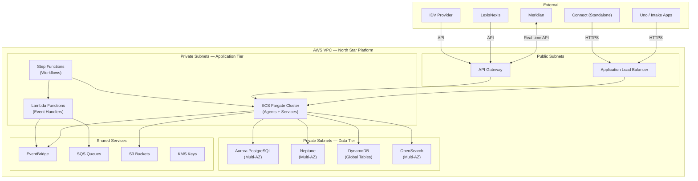

# 01 — System Architecture

> **Document Type:** Platform Architecture Design  
> **Version:** 1.0  
> **Date:** March 2026  
> **Status:** Draft  
> **Traceability:** Vision §7, §7.1, §7.2

---

## 1. Purpose & Scope

This document defines the end-to-end system architecture of the North Star KYC Platform, including:

- The five-layer platform architecture
- AWS service mapping per layer
- Deployment topology and infrastructure patterns
- Inter-layer communication patterns
- Non-functional requirements (scalability, availability, performance)

**Out of scope:** Individual agent internals (covered in documents 02–07), data model details (document 08), external integration specifics (document 09).

---

## 2. Requirements Addressed

| Requirement | Vision Reference |
|---|---|
| Five-layer platform architecture (Governance → Agentic → Orchestration → Intelligence → Data) | §7.1 |
| AWS as cloud provider | §7.2 |
| AI Agents with policy guardrails | §7.2 |
| Deterministic policy rules engine | §7.2 |
| Data products layer for reporting | §7.2 |
| Explainability engine, bias detection, full auditability | §7.2 |
| AI Oversight Dashboard (real-time agent monitoring) | §7.2 |

---

## 3. Platform Architecture — Five Layers

### 3.1 Layer Responsibilities

| Layer | Responsibility | Key Principle |
|---|---|---|
| **Governance** | Human oversight, AI monitoring, explainability, bias detection | Humans can always intervene, override, escalate |
| **Agentic Ecosystem** | Autonomous task execution within policy boundaries | Agents propose and execute; they do not make policy decisions |
| **Orchestration** | Workflow sequencing, task routing, event handling, exception routing | Single backbone coordinating all KYC processing |
| **Intelligence** | Deterministic policy decisions, risk scoring, screening, ID&V | All compliance decisions are deterministic and rule-based |
| **Data** | Persistent storage, reporting, audit trail, data products | Every data point is traceable to its source |

### 3.2 Inter-Layer Communication

| Pattern | Use Case | Protocol |
|---|---|---|
| **Synchronous** | Policy rule evaluation, risk scoring, screening lookups | REST/gRPC with circuit breaker |
| **Asynchronous** | Event-driven KYC triggers, monitoring signals, audit logging, telemetry | Amazon EventBridge / SQS |
| **Streaming** | Real-time agent performance metrics to AI Oversight Dashboard | Amazon Kinesis Data Streams |

---

## 4. AWS Service Mapping

### 4.1 Detailed Layer-to-Service Mapping

| Layer | Component | AWS Service(s) | Notes |
|---|---|---|---|
| **Governance** | AI Oversight Dashboard | Custom web app on ECS + Kinesis + CloudWatch dashboards | Real-time streaming of agent metrics |
| | Explainability Engine | Custom service on ECS + S3 (artifact storage) | Generates human-readable justifications |
| | Bias Detection | SageMaker (monitoring) + CloudWatch | Monitors demographic distribution of decisions |
| | HITL Controls | Custom UI embedded in Connect + Cognito auth | Role-based access per persona |
| **Agentic Ecosystem** | Document Intelligence Agent | ECS Fargate + Textract + Bedrock + Comprehend | OCR → extraction → classification pipeline |
| | Data Acquisition Agent | ECS Fargate + Lambda (source connectors) + Bedrock | Sub-agents per data source |
| | Quality Check Agent | ECS Fargate + Step Functions (QC workflow) | Parallel rule execution |
| | Continuous KYC Agent | ECS Fargate + EventBridge (triggers) + Bedrock | Event-subscription based |
| | Audit Intelligence Agent | ECS Fargate + Bedrock + OpenSearch | Query-based information collation |
| **Orchestration** | Process Sequencer | AWS Step Functions | State machine per KYC case type + jurisdiction |
| | Task Assigner | Lambda + SQS | Routes tasks to agent queues |
| | Event Router | EventBridge + Lambda | Pattern-matching rules for event routing |
| | Exception Router | Lambda + SNS | Persona-based routing with notification |
| | Agent Boundary Enforcement | IAM policies + custom middleware | Scope checks on every agent API call |
| **Intelligence** | Policy Rules Engine | ECS Fargate (deterministic rule service) | No AI — purely if/then/else logic |
| | Risk Scoring Engine | ECS Fargate | Deterministic scoring per GFCC-approved model |
| | Firm-Wide Screening | API Gateway → external providers (LexisNexis, etc.) | Adapter pattern per provider |
| | ID&V Service | API Gateway → external IDV provider | Abstract interface; provider swappable |
| | Global/Local DD Policies | Policy Rules Engine config (Aurora) | Jurisdiction-specific rule sets |
| **Data** | KYC Case Store | Aurora PostgreSQL | Primary relational store |
| | Party / Ownership Graph | Neptune (graph) + Aurora (attributes) | Graph for relationships; relational for attributes |
| | Document Store | S3 (raw) + Aurora (metadata) + TEM integration | Three-tier taxonomy metadata |
| | Audit Trail | S3 (immutable archive) + DynamoDB (hot query) + CloudTrail | Append-only, tamper-evident |
| | Data Products / Reporting | OpenSearch + Amazon QuickSight | Self-service analytics and dashboards |
| | Traceability Store | DynamoDB (per data-point lineage) | See `08-data-model-and-flows.md` |

---

## 5. Deployment Topology

### 5.1 Environment Strategy

| Environment | Purpose | Configuration |
|---|---|---|
| **Development** | Feature development, unit testing | Single-AZ, reduced instance sizes |
| **Integration (SIT)** | System integration testing with downstream stubs | Multi-AZ, production-like topology |
| **UAT** | User acceptance testing with operations/advisor personas | Multi-AZ, production data subset |
| **Pre-Production** | Final validation, performance testing | Production mirror |
| **Production** | Live platform | Multi-AZ, auto-scaling, full DR |

### 5.2 Availability & Disaster Recovery

| Component | Availability Target | DR Strategy |
|---|---|---|
| Orchestration Engine | 99.95% | Multi-AZ active-active; Step Functions built-in durability |
| Agent Cluster (ECS) | 99.9% | Multi-AZ with auto-scaling; circuit breaker for degraded mode |
| Aurora PostgreSQL | 99.99% | Multi-AZ with read replicas; automated backups; cross-region replica for DR |
| Neptune | 99.99% | Multi-AZ; automated snapshots |
| DynamoDB | 99.999% | Global tables for cross-region (future multi-region rollout) |
| S3 | 99.999999999% (11 nines durability) | Cross-region replication for audit archives |
| EventBridge | 99.99% | Regional; dead-letter queues for failed deliveries |

---

## 6. Scalability Design

### 6.1 Scaling Triggers

| Component | Metric | Scale-Up Threshold | Scale-Down Threshold |
|---|---|---|---|
| Agent containers (ECS) | CPU utilization | >70% sustained 5 min | <30% sustained 15 min |
| Agent containers (ECS) | SQS queue depth | >100 messages | <10 messages |
| Lambda functions | Concurrent invocations | Auto-scaled by AWS | N/A |
| Aurora read replicas | Read IOPS | >80% capacity | <20% capacity |
| OpenSearch | Search latency | >500ms p95 | <100ms p95 |

### 6.2 Expected Load Profile

| Scenario | Estimated Volume | Pattern |
|---|---|---|
| New individual onboarding | ~500 cases/day (USB) | Business-hours spike |
| Periodic reviews (transition period) | ~2,000 cases/day | Batch processing, distributed |
| Continuous KYC events | ~10,000 events/day | Continuous, bursty on screening batch refresh |
| Document processing | ~3,000 documents/day | Correlated with onboarding volume |
| Screening results | ~50,000 results/day (batch) transitioning to streaming | Nightly batch → real-time stream |

---

## 7. Technology Decision Records

### TDR-001: AWS Step Functions for Orchestration

**Decision:** Use AWS Step Functions as the orchestration workflow engine.

**Rationale:**
- Native AWS service with built-in durability, retries, and state management
- Visual workflow definition aligns with configurable jurisdiction-specific flows
- Express Workflows for high-throughput, short-duration tasks (QC checks)
- Standard Workflows for long-running KYC cases (days/weeks)
- Integration with ECS, Lambda, EventBridge, SQS out of the box

**Trade-offs:**
- Vendor lock-in to AWS (mitigated by keeping business logic in containers, not in Step Functions definitions)
- 25,000 state transition limit per execution (sufficient for KYC case lifecycle)

### TDR-002: Amazon Neptune for Ownership Graphs

**Decision:** Use Amazon Neptune (graph database) for entity ownership and relationship graphs alongside Aurora PostgreSQL for relational KYC data.

**Rationale:**
- Entity KYC requires traversal of complex ownership structures (beneficial owners, controlling persons, corporate hierarchies)
- Graph queries (e.g., "find all beneficial owners with >25% ownership across N levels") are orders of magnitude faster in a graph DB than in relational JOINs
- Neptune supports both property graph (Gremlin) and RDF (SPARQL) query models

**Trade-offs:**
- Adds operational complexity (two database engines)
- Data synchronization between Aurora and Neptune required (mitigated by event-driven sync via EventBridge)

### TDR-003: Amazon Bedrock for Agent LLM Foundation

**Decision:** Use Amazon Bedrock as the primary LLM provider for all agentic capabilities.

**Rationale:**
- Managed service — no model hosting infrastructure to maintain
- Access to multiple foundation models (Claude, Titan, etc.) — can select per-agent
- Built-in guardrails for responsible AI (content filtering, PII redaction)
- VPC endpoint support for private connectivity (no data traverses public internet)
- Pay-per-token pricing aligns with variable KYC processing volumes

**Trade-offs:**
- Model availability and version changes managed by AWS (mitigated by abstraction layer in agent code)
- Latency may be higher than self-hosted models for high-throughput scenarios (mitigated by async processing where possible)

---

## 8. Assumptions & Constraints

### Assumptions
1. AWS is the sole cloud provider — no multi-cloud requirement
2. Amazon Bedrock provides sufficient model quality for document extraction and agent reasoning tasks
3. Network connectivity to Meridian, LexisNexis, and IDV provider is available with acceptable latency (<500ms)
4. Existing Connect (Private Bank framework) supports embedding of custom React/MFE applications
5. TEM document storage API is available for integration

### Constraints
1. **All AI-assisted decisions must be explainable** — no opaque model outputs accepted as final
2. **Policy Rules Engine is deterministic only** — no ML/AI components in policy evaluation
3. **PII data must not leave the AWS VPC** — all AI model invocations via VPC endpoints
4. **Agent scope boundaries are enforced at infrastructure level** — not just application logic
5. **Multi-region rollout requires data residency compliance** — per-region data stores where required

---

## 9. Open Items

| # | Item | Impact | Owner |
|---|---|---|---|
| 1 | Confirm Neptune vs. Aurora-only for ownership graphs based on entity KYC complexity analysis | Architecture | Technology |
| 2 | Validate Bedrock model latency for real-time document extraction at target throughput | Performance | Technology |
| 3 | Confirm Connect framework MFE embedding capabilities and constraints | Integration | BAC Program |
| 4 | Define data residency requirements for non-US regions (IPB, Geneva, JKMA) | Data Layer | Compliance / Legal |
| 5 | Establish cross-account/cross-region networking topology for multi-region rollout | Infrastructure | Cloud Engineering |

---

*This document will be updated as technology decisions are validated through PoC and performance testing.*
