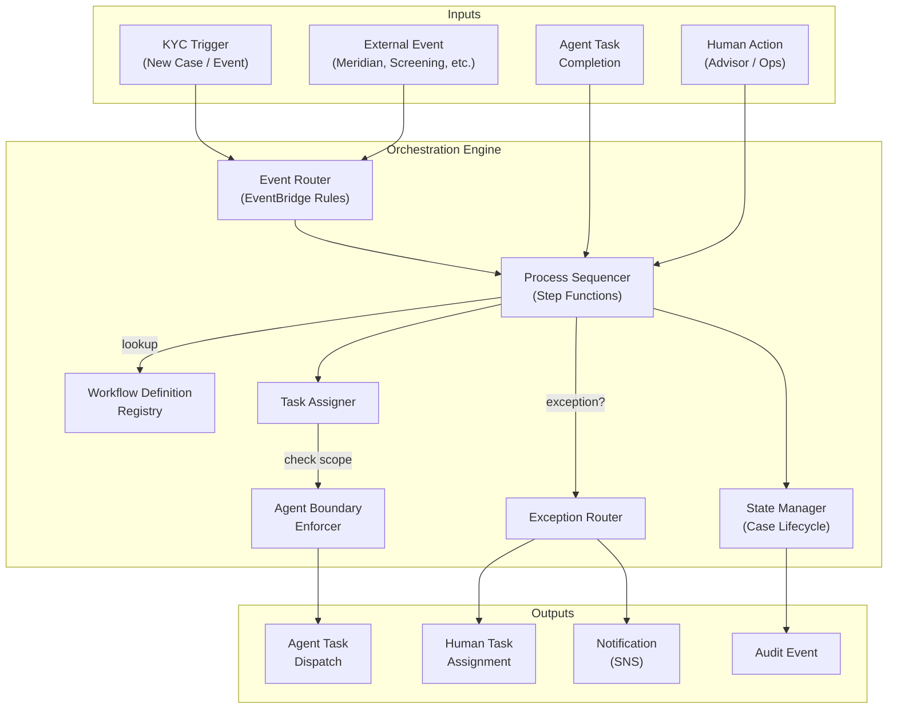
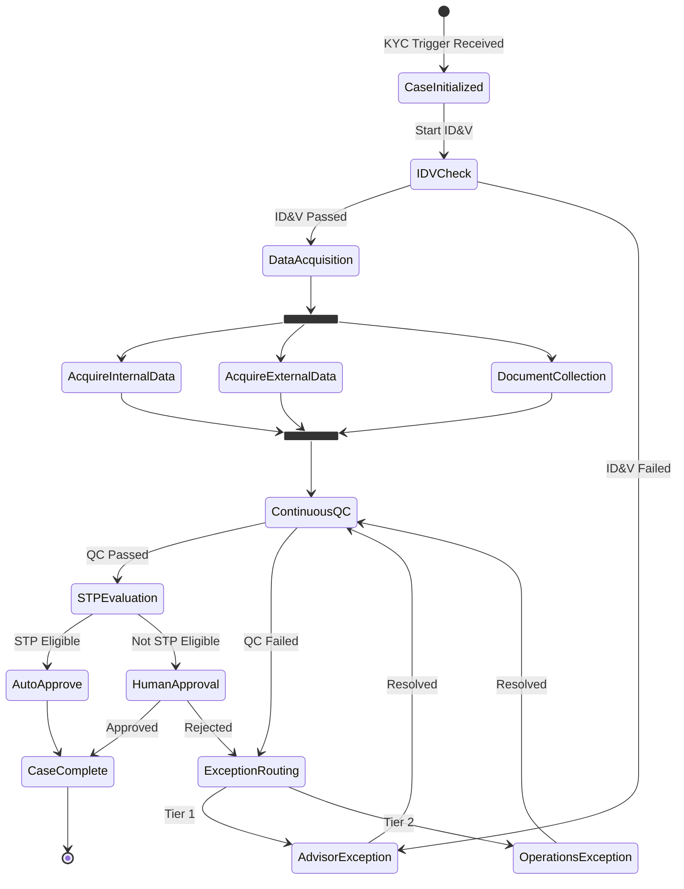
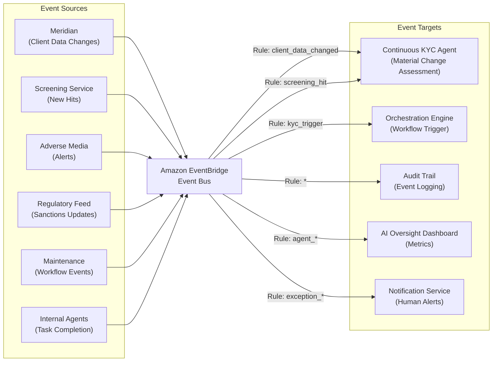
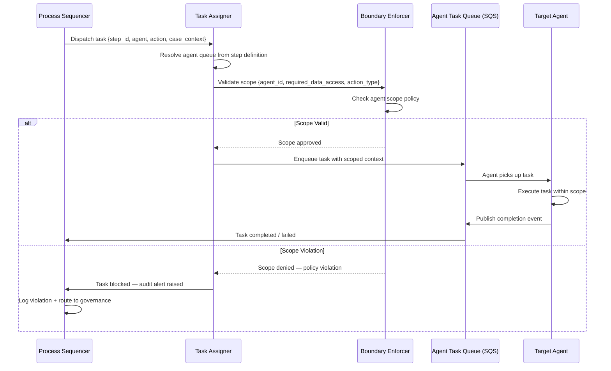
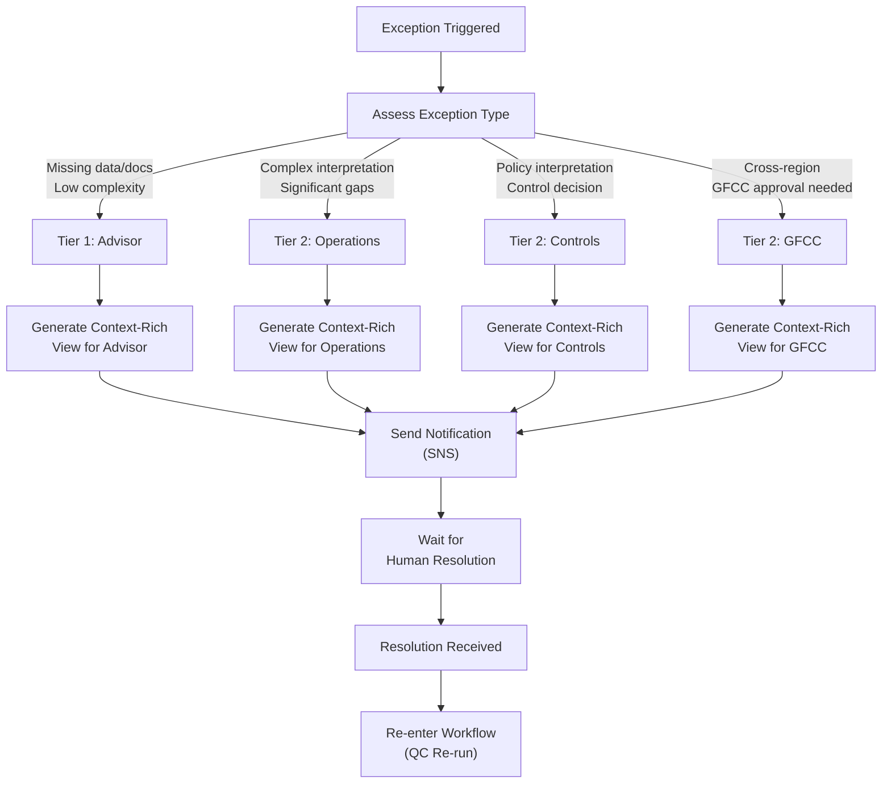
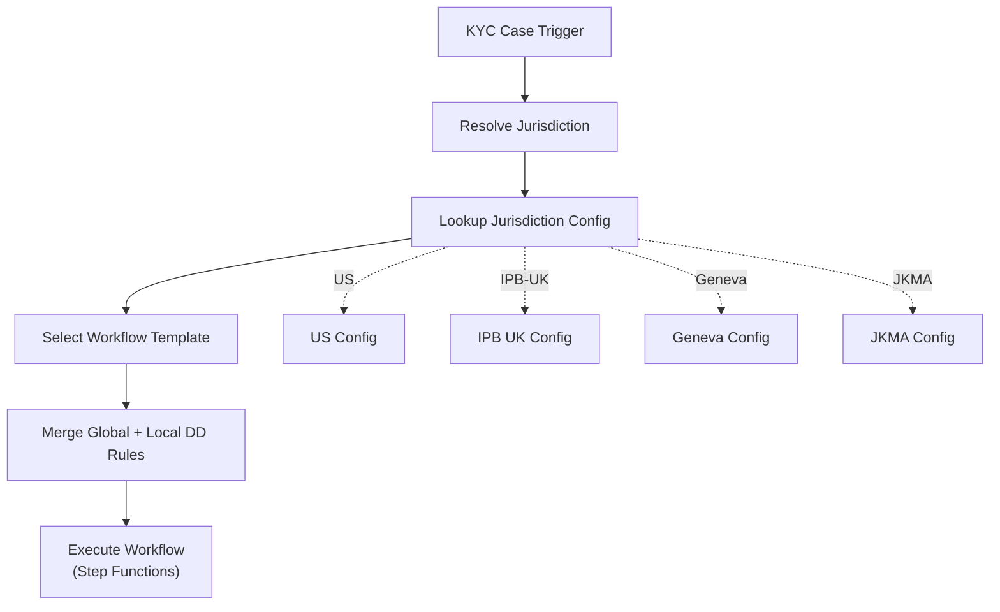

# 02 — Orchestration Engine

> **Document Type:** Component Design  
> **Version:** 1.0  
> **Date:** March 2026  
> **Status:** Draft  
> **Traceability:** Vision §8.1, §9

---

## 1. Purpose & Scope

The Orchestration Engine is the backbone of the North Star KYC Platform. It is responsible for:

- **Process sequencing** — determining the order of KYC steps based on client type and jurisdiction
- **Task assignment** — dispatching tasks to the appropriate agent with enforced scope boundaries
- **Event routing** — detecting material changes and triggering targeted flows in real time
- **Exception routing** — determining when human-in-the-loop intervention is required and routing to the correct persona

This document covers the Orchestration Engine's internal architecture, workflow definitions, routing logic, and interfaces with all other platform components.

**Out of scope:** Individual agent internals (documents 03–07), exception handling business rules (document 10).

---

## 2. Requirements Addressed

| Requirement | Vision Reference |
|---|---|
| Process sequencing based on client type and jurisdiction | §8.1 |
| Task assignment with enforced scope boundaries | §8.1 |
| Event routing for material changes / real-time triggering | §8.1 |
| Exception routing to correct human actor | §8.1 |
| Agent boundary enforcement / segregation of duty | §5.1, §8.1 |
| Three-tier exception model (STP / Advisor / Operations) | §9 |

---

## 3. Architecture



### 3.1 Component Responsibilities

| Component | Responsibility | Implementation |
|---|---|---|
| **Workflow Definition Registry** | Stores configurable workflow templates per client type × jurisdiction | Aurora PostgreSQL + JSON workflow definitions |
| **Process Sequencer** | Executes the KYC workflow as a state machine; manages transitions between steps | AWS Step Functions (Standard Workflows) |
| **Task Assigner** | Maps workflow steps to specific agents or human actors; manages task queues | Lambda + SQS queues (one per agent type) |
| **Event Router** | Receives internal/external events; matches against routing rules; triggers appropriate workflows | Amazon EventBridge with rule patterns |
| **Exception Router** | Evaluates routing criteria to determine which persona handles an exception | Lambda function with configurable routing rules |
| **Agent Boundary Enforcer** | Validates that every agent action is within its defined scope; blocks unauthorized data access | Custom middleware + IAM policy enforcement |
| **State Manager** | Tracks KYC case state through its lifecycle; persists state transitions | DynamoDB (case state) + Aurora (case history) |

---

## 4. Workflow Definitions

### 4.1 Workflow Template Structure

Each KYC workflow is defined as a configurable template:

```json
{
  "workflow_id": "kyc-individual-us-initial",
  "client_type": "INDIVIDUAL",
  "jurisdiction": "US",
  "case_type": "INITIAL",
  "version": "1.0",
  "steps": [
    {
      "step_id": "trigger",
      "type": "AUTO",
      "agent": "orchestration-engine",
      "action": "initialize_case",
      "next": "idv_check"
    },
    {
      "step_id": "idv_check",
      "type": "AUTO",
      "agent": "idv-service",
      "action": "verify_identity",
      "on_success": "data_acquisition",
      "on_failure": "advisor_exception_idv"
    },
    {
      "step_id": "data_acquisition",
      "type": "AUTO",
      "agent": "data-acquisition-agent",
      "action": "acquire_all_sources",
      "next": "document_collection",
      "parallel": true
    },
    {
      "step_id": "document_collection",
      "type": "AUTO",
      "agent": "document-intelligence-agent",
      "action": "process_documents",
      "next": "quality_check",
      "parallel_with": "data_acquisition"
    },
    {
      "step_id": "quality_check",
      "type": "AUTO",
      "agent": "quality-check-agent",
      "action": "run_full_qc",
      "on_success": "stp_evaluation",
      "on_failure": "exception_routing"
    },
    {
      "step_id": "stp_evaluation",
      "type": "AUTO",
      "agent": "orchestration-engine",
      "action": "evaluate_stp_eligibility",
      "on_stp_eligible": "auto_approve",
      "on_stp_ineligible": "human_approval"
    },
    {
      "step_id": "auto_approve",
      "type": "AUTO",
      "agent": "orchestration-engine",
      "action": "approve_case",
      "next": "complete"
    },
    {
      "step_id": "human_approval",
      "type": "HUMAN",
      "persona": "OPERATIONS",
      "action": "review_and_approve",
      "on_approve": "complete",
      "on_reject": "exception_routing"
    },
    {
      "step_id": "exception_routing",
      "type": "AUTO",
      "agent": "orchestration-engine",
      "action": "route_exception",
      "routing_rules": "exception_rules_us_individual"
    },
    {
      "step_id": "complete",
      "type": "AUTO",
      "agent": "orchestration-engine",
      "action": "finalize_case"
    }
  ]
}
```

### 4.2 Workflow Variants

| Client Type | Jurisdiction | Case Type | Workflow ID | Key Differences |
|---|---|---|---|---|
| Individual | US (USB) | Initial | `kyc-individual-us-initial` | Full flow with ID&V |
| Individual | US (USB) | Periodic | `kyc-individual-us-periodic` | Targeted data refresh; skip ID&V if still valid |
| Individual | US (USB) | Event-Triggered | `kyc-individual-us-event` | Scoped to changed attributes; auto-clear path |
| Entity | US (USB) | Initial | `kyc-entity-us-initial` | Ownership graph construction; multi-party |
| Individual | IPB (per market) | Initial | `kyc-individual-ipb-{market}-initial` | Market-specific DD appendices |
| Individual | Geneva | Initial | `kyc-individual-geneva-initial` | Swiss-specific CDD/EDD requirements |
| Individual | JKMA | Initial | `kyc-individual-jkma-initial` | Regional requirements |

### 4.3 Step Function State Machine — Individual US Initial



---

## 5. Event Routing

### 5.1 Event Bus Architecture



### 5.2 Event Schema

```json
{
  "version": "1.0",
  "id": "evt-uuid-001",
  "source": "meridian.client-data",
  "detail-type": "kyc.party.data_changed",
  "time": "2026-03-20T14:30:00Z",
  "detail": {
    "party_id": "PTY-12345",
    "case_ids": ["KYC-67890"],
    "change_type": "ADDRESS_UPDATE",
    "changed_fields": ["address_line_1", "city", "postal_code"],
    "previous_values": { "city": "New York" },
    "new_values": { "city": "Miami" },
    "change_source": "meridian",
    "materiality": "TO_BE_ASSESSED",
    "correlation_id": "corr-uuid-001"
  }
}
```

### 5.3 Event Routing Rules

| Event Pattern | Target | Action |
|---|---|---|
| `kyc.case.created` | Process Sequencer | Start new KYC workflow |
| `kyc.party.data_changed` | Continuous KYC Agent | Assess materiality of change |
| `screening.hit.new` | Continuous KYC Agent | Evaluate new screening hit |
| `screening.hit.cleared` | Orchestration Engine | Update case status if pending |
| `agent.task.completed` | Process Sequencer | Advance workflow to next step |
| `agent.task.failed` | Exception Router | Route to human or retry |
| `qc.check.passed` | Process Sequencer | Advance to STP evaluation |
| `qc.check.failed` | Exception Router | Determine exception tier |
| `maintenance.event.*` | Continuous KYC Agent | Assess impact on active KYC cases |
| `idv.verification.completed` | Process Sequencer | Resume workflow post-ID&V |

---

## 6. Task Assignment

### 6.1 Task Dispatch Flow



### 6.2 Agent Scope Definitions

| Agent | Allowed Data Access | Allowed Actions | Prohibited |
|---|---|---|---|
| **Document Intelligence** | Document content, document metadata, three-tier taxonomy config, KYC field mappings | Classify, extract, validate, reconcile document data | Risk scoring, screening, party creation, case approval |
| **Data Acquisition** | Approved external sources, internal CRM data, advisor conversation transcripts, Meridian party data (read-only) | Source data, normalize, score confidence, pre-fill fields, build ownership graph | Document processing, QC evaluation, case approval |
| **Quality Check** | All KYC case data (read-only), policy rules, QC rule definitions | Evaluate rules, aggregate results, determine pass/fail, produce QC report | Data modification, document extraction, risk scoring, case approval |
| **Continuous KYC** | Screening results, event stream, current case data (read-only), risk model parameters | Assess materiality, re-score risk, auto-clear false positives, escalate genuine risks | Direct case modification, document processing, direct approval |
| **Audit Intelligence** | All KYC case data (read-only), audit log, document metadata | Extract, collate, format audit response packages | Data modification, case state changes |

---

## 7. Exception Routing Logic

### 7.1 Decision Tree



### 7.2 Routing Criteria

| Criterion | Weight | Tier 1 (Advisor) | Tier 2 (Operations) | Tier 2 (Controls) |
|---|---|---|---|---|
| Missing data items | High | ≤3 simple fields | >3 fields or complex data | N/A |
| Missing documents | High | ≤2 standard docs | >2 or non-standard docs | N/A |
| Data interpretation required | Medium | No interpretation | Requires interpretation | Policy interpretation |
| Risk level | High | Low/Medium | Medium/High | High/Escalated |
| Regulatory judgment | Critical | None | Operational judgment | Compliance judgment |
| Cross-region impact | Medium | None | Single region | Multi-region |

---

## 8. Observability Contract

All agents and the Orchestration Engine itself emit telemetry through a standardized interface:

```json
{
  "ObservabilityContract": {
    "metrics": {
      "task_duration_ms": "histogram",
      "task_success_count": "counter",
      "task_failure_count": "counter",
      "task_retry_count": "counter",
      "queue_depth": "gauge",
      "stp_conversion_rate": "gauge"
    },
    "traces": {
      "correlation_id": "string (per KYC case)",
      "span_name": "string (step_id)",
      "parent_span": "string (workflow_id)",
      "attributes": {
        "agent_id": "string",
        "case_id": "string",
        "jurisdiction": "string",
        "client_type": "string"
      }
    },
    "logs": {
      "level": "INFO | WARN | ERROR",
      "message": "string",
      "structured_data": {
        "case_id": "string",
        "step_id": "string",
        "agent_id": "string",
        "action": "string",
        "result": "SUCCESS | FAILURE | EXCEPTION",
        "duration_ms": "number"
      }
    }
  }
}
```

---

## 9. Jurisdiction Configuration

### 9.1 Jurisdiction Registry

The Orchestration Engine maintains a registry of jurisdiction-specific configurations:

```json
{
  "jurisdiction_id": "US",
  "region": "AMERICAS",
  "lobs": ["USB", "US_SMALL"],
  "workflow_overrides": {
    "individual_initial": "kyc-individual-us-initial",
    "entity_initial": "kyc-entity-us-initial"
  },
  "required_dd_appendices": ["US_CDD", "US_EDD_HIGH_RISK"],
  "screening_providers": ["lexisnexis"],
  "idv_provider": "default",
  "approval_chain": {
    "standard": ["PRIMARY_APPROVER", "SECONDARY_APPROVER"],
    "high_risk": ["PRIMARY_APPROVER", "SECONDARY_APPROVER", "LOCAL_MLRO"],
    "cross_region": ["PRIMARY_APPROVER", "SECONDARY_APPROVER", "GFCC"]
  },
  "stp_eligible": true,
  "continuous_kyc_enabled": false,
  "periodic_review_lead_days": 120
}
```

### 9.2 Multi-Jurisdiction Support



---

## 10. Assumptions & Constraints

### Assumptions
1. AWS Step Functions Standard Workflows support the expected KYC case duration (up to 365 days for periodic review cycles)
2. EventBridge event payload size (256 KB max) is sufficient for all event types
3. Workflow definitions can be versioned and migrated without disrupting in-flight cases
4. SQS FIFO queues provide sufficient ordering guarantees for task dispatch

### Constraints
1. **No AI in orchestration decisions** — workflow routing is deterministic based on workflow definitions and configurable rules
2. **Agent boundary enforcement is non-negotiable** — every task dispatch is scope-checked before execution
3. **Audit trail for every state transition** — no "silent" state changes
4. **Workflow definitions must be jurisdiction-configurable** — no hard-coded jurisdiction logic in code
5. **120-day periodic review lead time** must be factored into all cutover workflows

---

## 11. Open Items

| # | Item | Impact | Owner |
|---|---|---|---|
| 1 | Define complete STP eligibility rules with GFCC for each jurisdiction | Determines Tier 0 auto-approval path | Product / GFCC |
| 2 | Confirm Step Functions execution history retention policy (90 days default) vs. audit requirements | May need to export execution history to S3 | Technology |
| 3 | Define the exact list of maintenance events that KYC should subscribe to | Determines event routing rules | Product / Maintenance Team |
| 4 | Confirm maximum parallel agent tasks per case (resource constraint) | Affects Step Functions parallelism design | Technology |
| 5 | Define workflow versioning strategy for in-flight cases during platform upgrades | Operational concern | Technology |

---

*This document will be updated as workflow templates are finalized for each jurisdiction and case type.*
