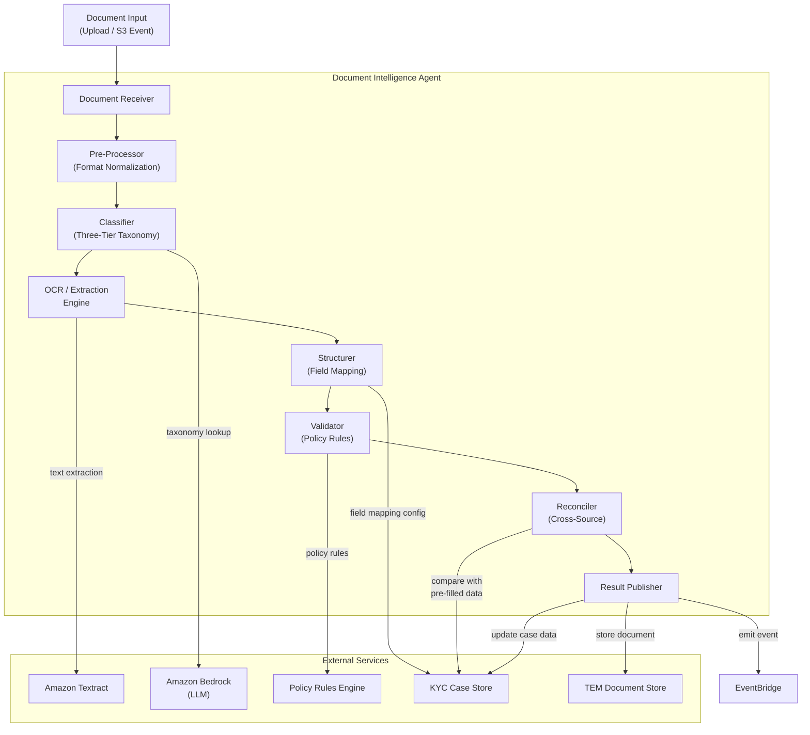
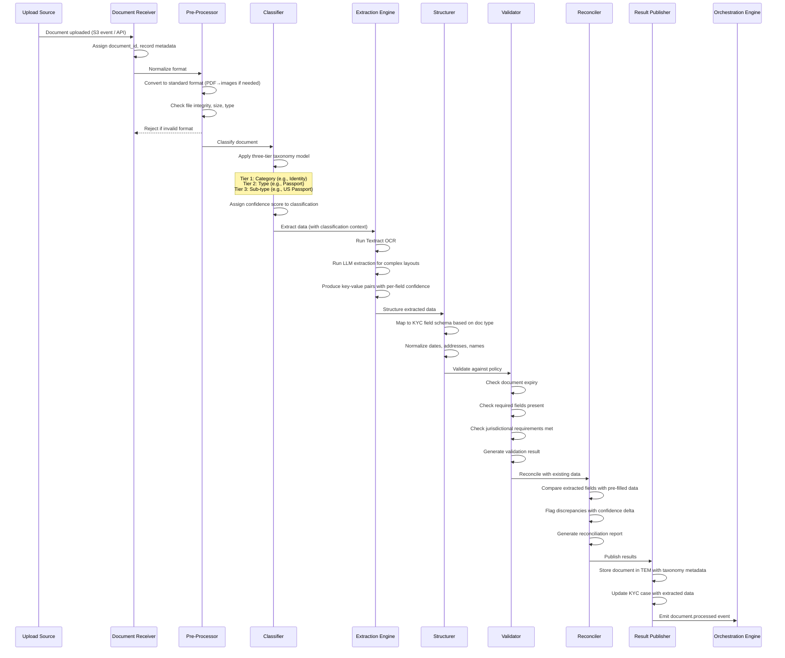
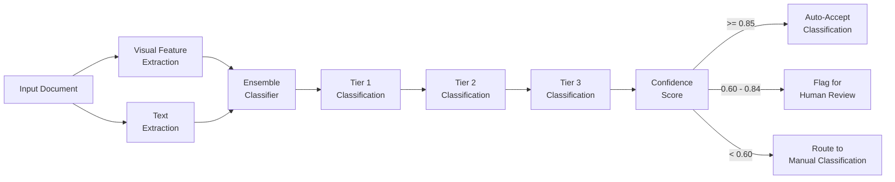
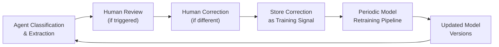

# 03 — Document Intelligence Agent

> **Document Type:** Agent Design  
> **Version:** 1.0  
> **Date:** March 2026  
> **Status:** Draft  
> **Traceability:** Vision §8.2

---

## 1. Purpose & Scope

The Document Intelligence Agent automates the end-to-end processing of documents received during KYC, replacing manual reading, classification, and data entry. Its responsibilities:

- **Classify** incoming documents using the three-tier taxonomy
- **Extract** structured data from documents automatically
- **Validate** extracted data against KYC policy requirements
- **Reconcile** extracted data against pre-filled data from other sources — flagging discrepancies

**Out of scope:** Sourcing documents from external registries (Data Acquisition Agent), evaluating whether gathered documents satisfy KYC completeness rules (Quality Check Agent), document storage infrastructure (TEM).

---

## 2. Requirements Addressed

| Requirement | Vision Reference |
|---|---|
| Classify documents using three-tier taxonomy (replacing legacy doc codes) | §8.2 |
| Extract data from documents automatically | §8.2 |
| Validate extracted data against KYC policy requirements | §8.2 |
| Reconcile against pre-filled data from third-party sources | §8.2 |
| Flag discrepancies between document data and other sources | §8.2 |
| Eliminate manual data entry from documents | §4.1 (pain point) |
| Eliminate "KYC General" misclassification | §4.1 (pain point) |

---

## 3. Agent Architecture



---

## 4. Processing Pipeline

### 4.1 Pipeline Stages



### 4.2 Three-Tier Document Taxonomy

| Tier 1 (Category) | Tier 2 (Type) | Tier 3 (Sub-type) Examples |
|---|---|---|
| **Identity** | Passport | US Passport, UK Passport, Swiss Passport |
| | National ID | US Driver's License, Swiss ID Card |
| | Other ID | Military ID, Tribal ID |
| **Address Proof** | Utility Bill | Electric Bill, Water Bill, Gas Bill |
| | Bank Statement | Checking Statement, Savings Statement |
| | Government Letter | Tax Assessment, Voter Registration |
| **Entity Formation** | Certificate of Incorporation | US Certificate, Swiss Handelsregister |
| | Articles of Association | Bylaws, Operating Agreement |
| | Partnership Agreement | LP Agreement, GP Agreement |
| **Financial** | Tax Return | Individual 1040, Corporate 1120 |
| | Financial Statement | Audited, Unaudited, Compiled |
| | Source of Wealth Evidence | Employment Letter, Investment Statement |
| **Regulatory** | Sanctions License | OFAC License, EU Authorization |
| | Regulatory Filing | SEC Filing, FINMA Registration |
| **KYC Specific** | CDD Form | Completed CDD Questionnaire |
| | ADD Form | Additional Due Diligence Form |
| | Source of Wealth Declaration | SOW Narrative and Supporting Evidence |

### 4.3 Classification Model



**Classification confidence thresholds:**

| Confidence | Action | Rationale |
|---|---|---|
| ≥ 0.85 | Auto-accept classification | High certainty; no human needed |
| 0.60 – 0.84 | Accept with review flag | Likely correct but QC will verify |
| < 0.60 | Route to human for manual classification | Insufficient confidence; prevents misclassification |

---

## 5. Interfaces & Contracts

### 5.1 Input Interface

```json
{
  "DocumentInput": {
    "document_id": "string (UUID, auto-generated)",
    "case_id": "string (KYC case reference)",
    "party_id": "string (party the document belongs to)",
    "upload_source": "ADVISOR | CLIENT_PORTAL | EXTERNAL_REGISTRY | DATA_ACQUISITION_AGENT",
    "file_reference": "string (S3 URI)",
    "file_type": "PDF | JPEG | PNG | TIFF",
    "file_size_bytes": "number",
    "uploaded_by": "string (user/agent ID)",
    "upload_timestamp": "ISO 8601",
    "expected_doc_type": "string (optional — hint from advisor or agent)",
    "correlation_id": "string (tracing)"
  }
}
```

### 5.2 Output Interface

```json
{
  "DocumentProcessingResult": {
    "document_id": "string",
    "case_id": "string",
    "party_id": "string",
    "classification": {
      "tier_1": "string (category)",
      "tier_2": "string (type)",
      "tier_3": "string (sub-type)",
      "confidence": "number (0.0–1.0)",
      "classification_method": "AUTO | HUMAN_ASSISTED"
    },
    "extracted_data": {
      "fields": [
        {
          "field_name": "string (KYC field key)",
          "value": "string",
          "confidence": "number (0.0–1.0)",
          "bounding_box": "object (page, coordinates — for audit)",
          "extraction_method": "OCR | LLM | HYBRID"
        }
      ]
    },
    "validation_result": {
      "status": "VALID | INVALID | PARTIALLY_VALID",
      "issues": [
        {
          "field_name": "string",
          "issue_type": "EXPIRED | MISSING | FORMAT_ERROR | POLICY_VIOLATION",
          "description": "string",
          "severity": "ERROR | WARNING"
        }
      ]
    },
    "reconciliation_result": {
      "status": "CONSISTENT | DISCREPANCIES_FOUND | NO_COMPARISON_DATA",
      "discrepancies": [
        {
          "field_name": "string",
          "document_value": "string",
          "existing_value": "string",
          "existing_source": "string (source_id)",
          "confidence_delta": "number"
        }
      ]
    },
    "processing_metadata": {
      "processing_time_ms": "number",
      "agent_version": "string",
      "model_versions": { "classifier": "string", "extractor": "string" },
      "audit_trail_ref": "string (UUID)"
    }
  }
}
```

### 5.3 Events Emitted

| Event | Detail-Type | Trigger |
|---|---|---|
| `document.received` | Document uploaded and registered | On receipt |
| `document.classified` | Classification complete | After classification stage |
| `document.extracted` | Data extraction complete | After extraction stage |
| `document.validated` | Validation complete | After validation stage |
| `document.processed` | Full pipeline complete | After reconciliation |
| `document.classification.low_confidence` | Classification below threshold | Confidence < 0.60 |
| `document.reconciliation.discrepancy` | Data mismatch found | Discrepancy detected |

---

## 6. Error Handling

| Error Scenario | Handling Strategy | Fallback |
|---|---|---|
| File corrupted / unreadable | Reject with clear error; notify uploader | Request re-upload via exception routing |
| Textract OCR failure | Retry once; if persistent, route to LLM-only extraction | Flag for manual data entry |
| Classification confidence too low | Route to human classifier with top-3 suggestions | Human selects correct classification |
| Extraction confidence too low on critical fields | Flag specific fields for human review | Human corrects extracted values |
| Reconciliation discrepancy on high-confidence data | Auto-flag for QC Agent; include in context-rich view | Human resolves in exception flow |
| TEM storage failure | Retry with exponential backoff; fall back to S3 direct store | Alert infrastructure; document remains in S3 |

---

## 7. Feedback Loop



- **Correction signals** are captured whenever a human overrides an agent classification or corrects extracted data
- Correction data is stored in a dedicated training dataset with the original + corrected values
- Model retraining runs on a scheduled basis (weekly or on threshold of correction volume)
- New model versions go through A/B testing before deployment
- The AI Oversight Dashboard tracks classification accuracy trends over time

---

## 8. Assumptions & Constraints

### Assumptions
1. Amazon Textract provides sufficient accuracy for KYC document types (passports, utility bills, corporate filings)
2. The three-tier taxonomy is finalized before Phase 1 go-live and maintained by the document management team
3. Documents are uploaded in supported file types (PDF, JPEG, PNG, TIFF)
4. TEM storage API is available and supports metadata tagging with taxonomy codes

### Constraints
1. **No document content stored outside TEM/S3** — Textract processing happens via S3 integration, results stored in KYC case store
2. **PII in extracted data** must be encrypted at rest and in transit, with access restricted to authorized agents/users
3. **Classification model must be explainable** — top contributing features must be available for audit
4. **Agent cannot modify KYC policy rules** — only reads them for validation
5. **Maximum document size:** 50 MB per file; multi-page PDFs up to 500 pages

---

## 9. Performance Requirements

| Metric | Target | Notes |
|---|---|---|
| Classification latency (per document) | < 3 seconds | Excluding network transfer |
| Extraction latency (per document) | < 10 seconds | Varies by page count |
| Full pipeline (classify → extract → validate → reconcile) | < 30 seconds | Per document |
| Classification accuracy | > 95% (Tier 1), > 90% (Tier 2) | Measured against human-labeled test set |
| Extraction accuracy (critical fields) | > 92% | Name, DOB, address, document number |
| Throughput | 3,000 documents/day | Phase 1 target |

---

## 10. Open Items

| # | Item | Impact | Owner |
|---|---|---|---|
| 1 | Finalize three-tier taxonomy with document management team | Classification model training | Document Team / Product |
| 2 | Obtain labeled training dataset for initial classification model | Model accuracy | Technology / Operations |
| 3 | Validate Textract accuracy on non-English documents (IPB markets) | Multi-language support | Technology |
| 4 | Confirm TEM API contract for metadata storage | Integration | Document Team / Technology |
| 5 | Define retention policy for extracted data vs. original documents | Compliance | Legal / Compliance |

---

*This document will be updated as the three-tier taxonomy is finalized and initial model accuracy benchmarks are established.*
