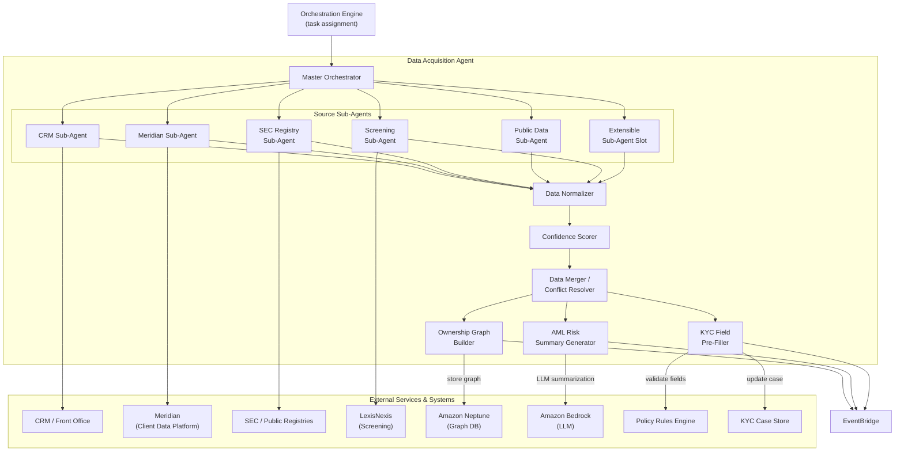
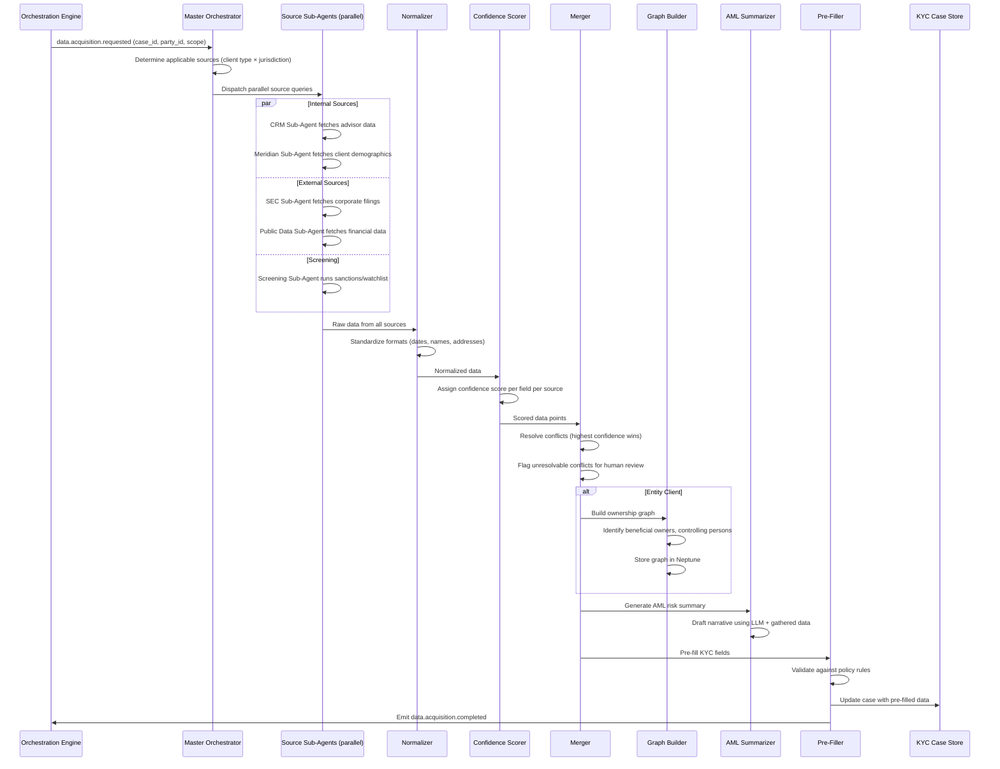
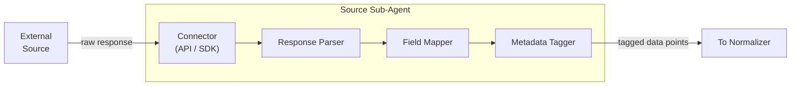
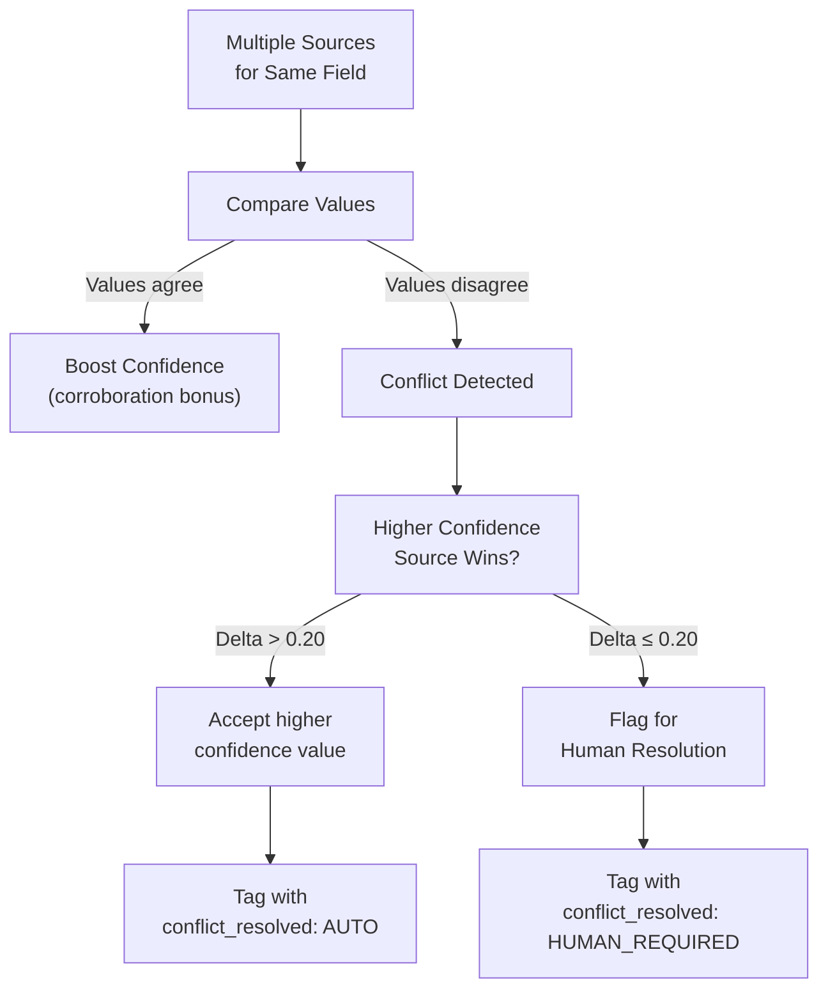
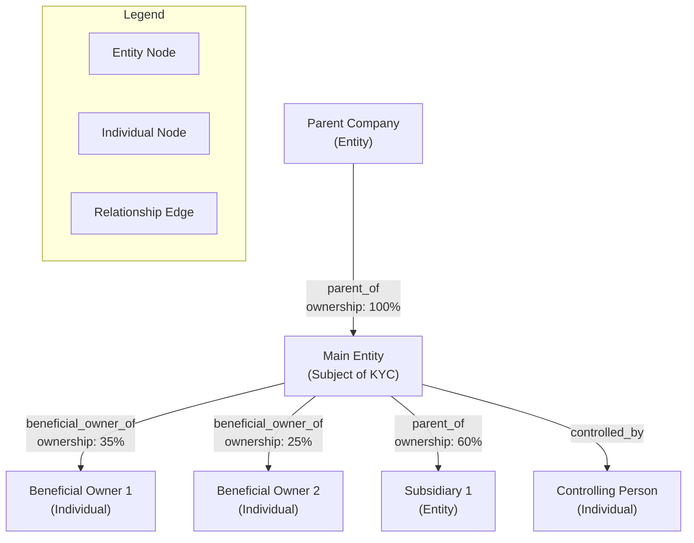
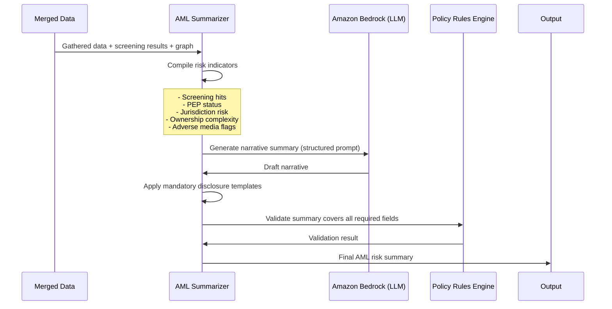

# 04 — Data Acquisition Agent

> **Document Type:** Agent Design  
> **Version:** 1.0  
> **Date:** March 2026  
> **Status:** Draft  
> **Traceability:** Vision §8.3

---

## 1. Purpose & Scope

The Data Acquisition Agent automates the sourcing, normalization, and enrichment of KYC client data from internal and external sources. It removes the need for manual data gathering by proactively pre-filling KYC fields, constructing ownership graphs, and producing AML risk summaries.

**Responsibilities:**
- Source client data from approved internal systems (CRM, Meridian, advisor conversations) and external registries (SEC, public financial data)
- Normalize data across heterogeneous sources, applying a **confidence score** per data point
- Construct **ownership graphs** for entity clients (beneficial owners, controlling persons, related parties)
- Draft **AML risk summaries** based on gathered data
- Pre-fill KYC fields and validate in real time
- Coordinate specialized sub-agents (one per source) through a master orchestrator pattern

**Out of scope:** Document processing (Document Intelligence Agent), quality evaluation of completeness (Quality Check Agent), ongoing monitoring after case completion (Continuous KYC Agent).

---

## 2. Requirements Addressed

| Requirement | Vision Reference |
|---|---|
| Source data from internal and external systems | §8.3 |
| Normalize data and generate confidence scores | §8.3, §5.4 |
| Construct ownership graphs for entity clients | §8.3 |
| Draft AML risk summaries | §8.3 |
| Pre-fill KYC fields, validate in real time | §8.3 |
| Eliminate data duplication across cases | §4.1 (pain point), §3 ("Data Collected Once") |
| Data traceability: source attribution, confidence, audit trail | §5.4 |
| All external sources must be GFCC pre-approved | §8.3 (constraint) |

---

## 3. Agent Architecture



---

## 4. Processing Pipeline

### 4.1 Master Orchestrator Flow



### 4.2 Source Sub-Agent Pattern

Each sub-agent follows a standard interface:



Every data point emitted by a sub-agent carries:

```json
{
  "field_name": "string",
  "raw_value": "any",
  "source_id": "string (registered source identifier)",
  "source_type": "INTERNAL | EXTERNAL_REGISTRY | THIRD_PARTY | SCREENING",
  "retrieval_timestamp": "ISO 8601",
  "source_confidence_tier": "HIGH | MEDIUM | LOW",
  "correlation_id": "string"
}
```

---

## 5. Confidence Scoring Methodology

### 5.1 Scoring Model

Confidence scores range from **0.0 to 1.0** and are computed as a composite of:

| Factor | Weight | Description |
|---|---|---|
| **Source Tier** | 40% | Pre-assigned tier based on GFCC source approval (HIGH=0.9, MEDIUM=0.7, LOW=0.5) |
| **Data Freshness** | 25% | Time since data was last confirmed/updated at source |
| **Extraction Certainty** | 20% | How reliably the data was extracted (API structured > OCR > manual) |
| **Corroboration Count** | 15% | Number of independent sources confirming the same value |

### 5.2 Confidence Thresholds

| Confidence | Action |
|---|---|
| ≥ 0.80 | Auto-accept; use as pre-filled value |
| 0.60 – 0.79 | Pre-fill with review flag; presented to advisor/ops for confirmation |
| < 0.60 | Do not pre-fill; flag as data gap requiring manual input |

### 5.3 Multi-Source Conflict Resolution



---

## 6. Ownership Graph Construction

### 6.1 Graph Model (Amazon Neptune)



### 6.2 Graph Entities

| Node Type | Properties |
|---|---|
| **Individual** | party_id, name, dob, nationality, role, pep_status, sanctions_status |
| **Entity** | party_id, legal_name, jurisdiction_of_incorporation, entity_type, registration_number |
| **Relationship Edge** | relationship_type, ownership_percentage, effective_date, source_id, confidence |

### 6.3 Graph Traversal Use Cases

| Use Case | Query Pattern |
|---|---|
| Identify all beneficial owners (≥25%) | Traverse ownership edges; sum direct + indirect paths ≥ 25% |
| Detect circular ownership | Cycle detection on ownership subgraph |
| Find shared parties across KYC cases | Match party_id across multiple case subgraphs |
| Assess jurisdictional risk | Aggregate jurisdiction properties along ownership chains |
| UBO (Ultimate Beneficial Owner) determination | Recursive traversal to natural persons at top of chain |

---

## 7. AML Risk Summary Generation



**AML Summary Structure:**

| Section | Content |
|---|---|
| Client Overview | Entity type, jurisdiction, industry, incorporation details |
| Ownership Structure | Summary of UBO chain, % ownership, controlling persons |
| Screening Results | Sanctions/watchlist hits, PEP flags, adverse media |
| Risk Indicators | Jurisdiction risk, complexity risk, industry risk |
| Recommended Risk Rating | Suggested rating with reasoning (subject to human review) |
| Data Gaps | Missing information that could affect risk assessment |

---

## 8. Interfaces & Contracts

### 8.1 Input Interface

```json
{
  "DataAcquisitionRequest": {
    "case_id": "string",
    "party_id": "string",
    "client_type": "INDIVIDUAL | ENTITY",
    "jurisdiction": "string (ISO 3166-1)",
    "scope": "INITIAL | PERIODIC_REVIEW | EVENT_TRIGGERED | TARGETED",
    "requested_sources": ["string (optional — specific source IDs)"],
    "existing_data_snapshot": "object (current KYC field values for reconciliation)",
    "correlation_id": "string"
  }
}
```

### 8.2 Output Interface

```json
{
  "DataAcquisitionResult": {
    "case_id": "string",
    "party_id": "string",
    "pre_filled_fields": [
      {
        "field_name": "string",
        "value": "string",
        "confidence": 0.85,
        "source_id": "string",
        "source_type": "INTERNAL | EXTERNAL_REGISTRY | THIRD_PARTY",
        "retrieval_timestamp": "ISO 8601",
        "conflict_status": "NONE | AUTO_RESOLVED | HUMAN_REQUIRED"
      }
    ],
    "ownership_graph": {
      "graph_id": "string (Neptune graph reference)",
      "node_count": "number",
      "ubo_list": [
        {
          "party_id": "string",
          "name": "string",
          "ownership_percentage": "number",
          "determination_method": "DIRECT | INDIRECT | COMBINED"
        }
      ]
    },
    "aml_risk_summary": {
      "narrative": "string (LLM-generated text)",
      "risk_indicators": ["string"],
      "suggested_risk_rating": "LOW | MEDIUM | HIGH | VERY_HIGH",
      "data_gaps": ["string"],
      "model_version": "string"
    },
    "screening_results": {
      "sanctions_hits": "number",
      "pep_flags": "number",
      "adverse_media_hits": "number",
      "details_ref": "string (link to full screening report)"
    },
    "metadata": {
      "sources_queried": ["string"],
      "sources_succeeded": ["string"],
      "sources_failed": ["string"],
      "processing_time_ms": "number",
      "agent_version": "string"
    }
  }
}
```

### 8.3 Events Emitted

| Event | Detail-Type | Trigger |
|---|---|---|
| `data.acquisition.started` | Acquisition pipeline initiated | On task receipt |
| `data.source.completed` | Individual source query completed | Per sub-agent |
| `data.source.failed` | Source query failed | On sub-agent error |
| `data.conflict.detected` | Multi-source conflict found | During merge |
| `data.graph.constructed` | Ownership graph built | After graph builder |
| `data.aml_summary.generated` | AML risk summary produced | After AML summarizer |
| `data.acquisition.completed` | Full pipeline complete | After all stages |

---

## 9. Approved Source Registry

All external data sources must be registered and GFCC-approved before use:

| Source ID | Source Name | Type | Tier | Data Provided | Status |
|---|---|---|---|---|---|
| `INT-CRM` | CRM / Front Office | Internal | HIGH | Advisor-provided client data | Active |
| `INT-MER` | Meridian | Internal | HIGH | Client demographics, party data | Active |
| `EXT-LEX` | LexisNexis | Third-Party | HIGH | Individual screening | Active |
| `EXT-SEC` | SEC EDGAR | External Registry | MEDIUM | Corporate filings, officer data | Pending Approval |
| `EXT-PUB` | Public financial data | External Registry | LOW | Financial statements, news | Pending Approval |
| `EXT-ENT-SCR` | Entity Screening (new) | Third-Party | HIGH | Entity-level screening | Under Evaluation |

> **Expansion model:** New sources are added by registering them in the Approved Source Registry, building a sub-agent connector, and receiving GFCC sign-off.

---

## 10. Error Handling

| Error Scenario | Handling Strategy | Fallback |
|---|---|---|
| External source API unavailable | Retry with exponential backoff (3 attempts) | Mark source as failed; continue with available sources |
| Source returns partial data | Accept partial; flag gaps in output | Data gaps reported for human follow-up |
| All external sources fail | Continue with internal sources only | Flag case for manual data gathering |
| Graph cycle detected (circular ownership) | Log anomaly; flag for compliance review | Human investigates ownership structure |
| Confidence score too low for all sources | Do not pre-fill; report as data gap | Advisor/ops must provide data manually |
| LLM generation failure for AML summary | Retry once; fall back to template-based summary | Structured summary without narrative |

---

## 11. Feedback Loop

- **Pre-fill accuracy tracking**: When advisors or operations modify a pre-filled value, the correction is captured as a feedback signal
- **Source quality monitoring**: Sources with consistently low accuracy have their confidence tier reviewed quarterly
- **Graph accuracy**: When human reviewers correct ownership relationships, corrections feed back into graph construction logic
- **AML summary quality**: Reviewer edits to AML narratives are captured for LLM fine-tuning

---

## 12. Performance Requirements

| Metric | Target | Notes |
|---|---|---|
| Internal source queries | < 5 seconds each | CRM, Meridian |
| External source queries | < 15 seconds each | Subject to third-party SLAs |
| Full pipeline (all sources + merge + graph + summary) | < 60 seconds | Individual client |
| Full pipeline (entity with ownership graph) | < 120 seconds | Complex entity structures |
| Pre-fill accuracy | > 85% acceptance rate | Measured by advisor override rate |
| Throughput | 1,500 cases/day | Phase 1 target |

---

## 13. Assumptions & Constraints

### Assumptions
1. GFCC will approve an initial set of external data sources before Phase 1 go-live
2. Meridian API is available for real-time read access to client demographics
3. Amazon Neptune is provisioned and accessible for ownership graph storage (see TDR-002 in system architecture)
4. LexisNexis integration is carried forward from the existing platform

### Constraints
1. **No unapproved external sources** — Every external data source must have GFCC approval before the sub-agent can be activated
2. **Read-only Meridian access** — The agent reads from Meridian but does not write demographic changes back (Vision §10.2)
3. **Source attribution is mandatory** — Every pre-filled field must carry source_id, confidence, and timestamp
4. **Agent cannot override policy** — Pre-filled data is subject to Policy Rules Engine validation
5. **PII handling** — All sourced data must be encrypted in transit and at rest; access logs maintained

---

## 14. Open Items

| # | Item | Impact | Owner |
|---|---|---|---|
| 1 | Define and document confidence scoring methodology with GFCC | Core to pre-fill quality | Product / Compliance |
| 2 | Finalize approved external source list for Phase 1 | Determines sub-agents to build | GFCC / Product |
| 3 | Confirm Meridian API contract for real-time reads | Integration dependency | Meridian Team |
| 4 | Define ownership threshold for beneficial ownership determination (25% or jurisdiction-specific) | Graph construction logic | Compliance |
| 5 | Determine sub-agent architecture: separate ECS tasks vs. in-process | Infrastructure design | Technology |
| 6 | Quantify data confidence scoring methodology (Vision §19 open question) | Scoring model parameters | Product / Technology |

---

*This document will be updated as GFCC-approved data sources are finalized and confidence scoring methodology is defined.*
