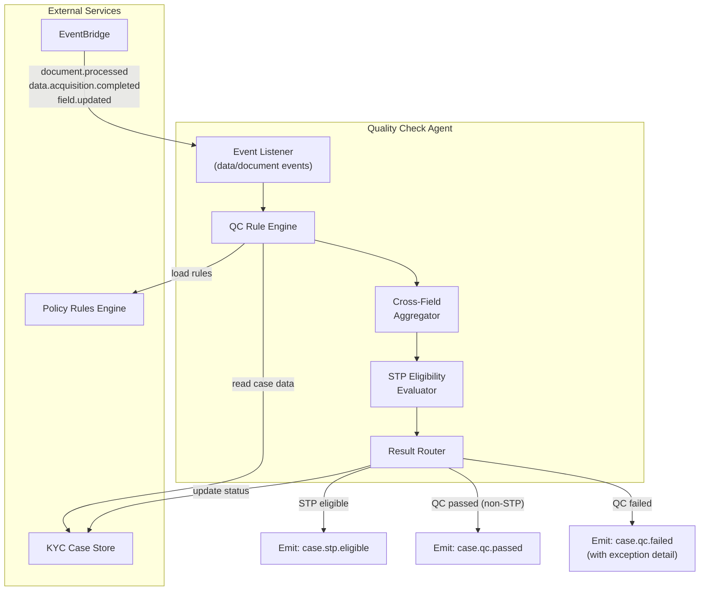
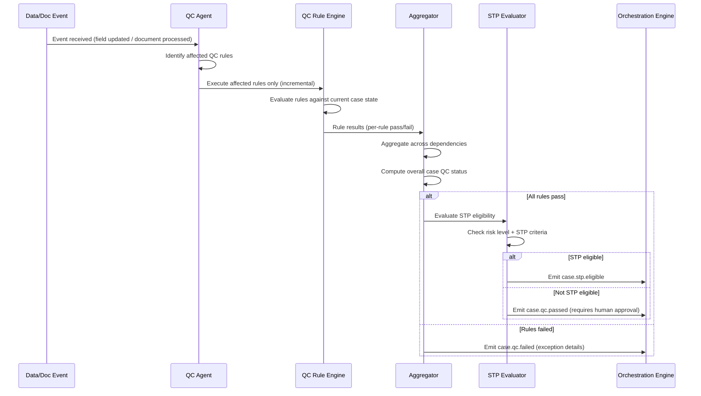
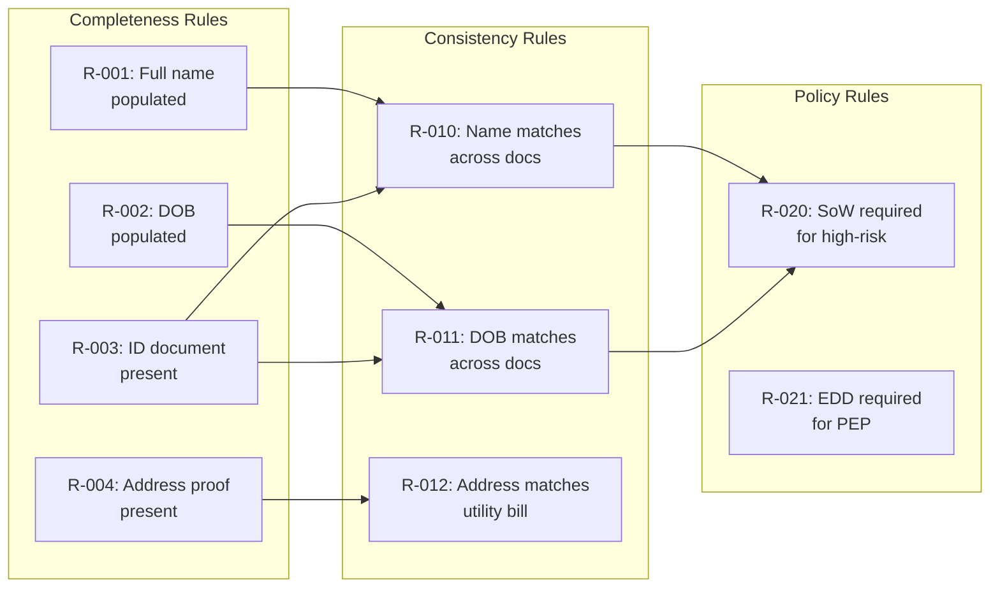
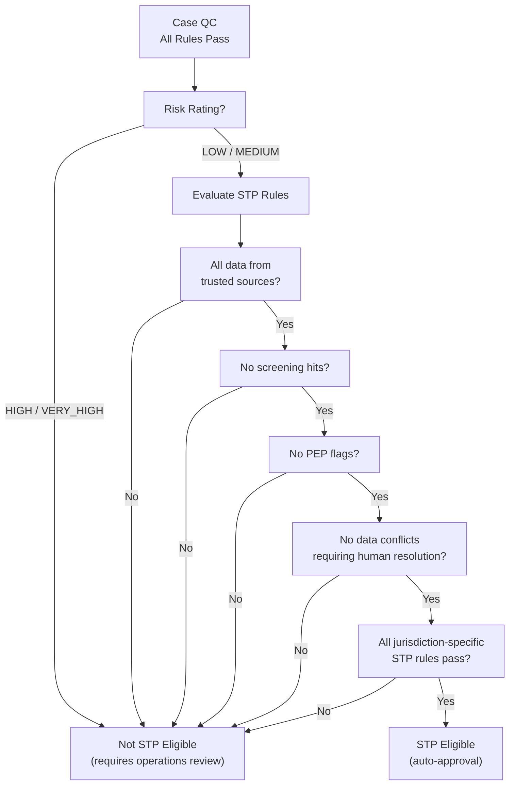

# 05 — Quality Check Agent

> **Document Type:** Agent Design  
> **Version:** 1.0  
> **Date:** March 2026  
> **Status:** Draft  
> **Traceability:** Vision §8.4

---

## 1. Purpose & Scope

The Quality Check (QC) Agent executes **parallel, continuous quality checks** as data and documents flow into a KYC case — not only at the end of the compose stage. It replaces the legacy model of a single end-of-process QC gate with ongoing verification that progressively validates case completeness, accuracy, and policy compliance.

**Responsibilities:**
- Execute QC rules continuously as each data point and document lands
- Aggregate results across cross-field dependencies
- Determine pass/fail status per rule and overall case readiness
- Determine **STP eligibility** for low/medium risk cases
- Route failed rules to the appropriate human actor via the exception model
- Route passed cases forward in the workflow

**Out of scope:** Data sourcing (Data Acquisition Agent), document extraction (Document Intelligence Agent), ongoing post-case monitoring (Continuous KYC Agent).

---

## 2. Requirements Addressed

| Requirement | Vision Reference |
|---|---|
| Parallel, continuous quality checks (not end-of-compose only) | §8.4 |
| Aggregate cross-field dependency results | §8.4 |
| Determine pass/fail and route accordingly | §8.4 |
| STP eligibility determination for low/medium risk | §3 (STP 100%), §8.4 |
| Eliminate "Not In Good Order" (NIGO) submissions | §3 (Zero NIGOs) |
| First-time right on every submission | §3 |

---

## 3. Agent Architecture



---

## 4. Continuous QC Model

### 4.1 Trigger-Based Execution

Unlike the legacy end-of-compose QC, this agent reacts to **every data event**:



### 4.2 Incremental vs. Full Evaluation

| Mode | Trigger | Behavior |
|---|---|---|
| **Incremental** | Single field or document event | Only rules affected by the changed data are re-evaluated |
| **Full** | Explicit request (e.g., advisor submits case) | All rules evaluated from scratch; definitive pass/fail |
| **Re-evaluation** | After exception is resolved | Re-run failed rules; re-aggregate |

---

## 5. QC Rule Categories

### 5.1 Rule Taxonomy

| Category | Examples | Dependency Type |
|---|---|---|
| **Completeness** | Required fields populated, mandatory documents present | Single-field / Single-document |
| **Validity** | Document not expired, date formats correct, valid country codes | Single-field |
| **Cross-Field Consistency** | DOB matches across documents, address matches utility bill | Multi-field |
| **Cross-Document Consistency** | Name on passport matches name on utility bill | Multi-document |
| **Jurisdictional** | Swiss MROS requirements met, US CIP requirements met | Multi-field + jurisdiction config |
| **Entity-Specific** | Ownership > 25% has UBO documentation, all directors identified | Multi-party + graph |
| **Policy Compliance** | Risk rating justified, SoW documentation sufficient for high-risk | Multi-field + risk |

### 5.2 Rule Definition Schema

```json
{
  "QCRule": {
    "rule_id": "string (unique identifier)",
    "rule_name": "string",
    "category": "COMPLETENESS | VALIDITY | CROSS_FIELD | CROSS_DOCUMENT | JURISDICTIONAL | ENTITY | POLICY",
    "description": "string",
    "applicable_to": {
      "client_types": ["INDIVIDUAL", "ENTITY"],
      "jurisdictions": ["US", "CH", "ALL"],
      "risk_levels": ["LOW", "MEDIUM", "HIGH", "ALL"]
    },
    "dependencies": {
      "fields": ["string (KYC field names)"],
      "documents": ["string (taxonomy tier-2 types)"],
      "parties": ["MAIN_CLIENT", "UBO", "CONTROLLING_PERSON", "ALL"]
    },
    "evaluation_logic": "string (rule engine expression or function reference)",
    "severity": "BLOCKING | WARNING",
    "exception_tier": "TIER_1_ADVISOR | TIER_2_OPERATIONS",
    "stp_relevant": "boolean"
  }
}
```

### 5.3 Cross-Field Dependency Graph



---

## 6. STP Eligibility Determination

### 6.1 STP Criteria



### 6.2 STP Rules (Pre-Approved by GFCC)

| Rule | Condition | Rationale |
|---|---|---|
| Risk level gate | LOW or MEDIUM only | High-risk requires human judgment |
| Data source quality | All critical fields from HIGH-confidence sources (≥ 0.80) | Ensures data reliability |
| Screening clear | Zero unresolved screening hits | Regulatory requirement |
| PEP status | Not a PEP (or PEP with pre-approved clearance) | Regulatory requirement |
| Document completeness | All mandatory documents present and valid | Completeness gate |
| No human-required conflicts | All data conflicts auto-resolved or no conflicts | Ensures data integrity |
| Jurisdiction STP enabled | STP rules defined and active for this jurisdiction | Controlled rollout |

> **Constraint:** STP rules must be formally defined and ratified by GFCC before activation (Vision §19 open question).

---

## 7. Interfaces & Contracts

### 7.1 Input Interface (Event-Driven)

The QC Agent is primarily event-driven. It listens for:

| Event | Source | Action |
|---|---|---|
| `document.processed` | Document Intelligence Agent | Run document-related QC rules |
| `data.acquisition.completed` | Data Acquisition Agent | Run data completeness + consistency rules |
| `field.updated` | KYC Case Store | Run rules dependent on updated field |
| `case.submit.requested` | Orchestration Engine | Run full QC evaluation |
| `exception.resolved` | Exception Handler | Re-run failed rules |

### 7.2 Output Interface

```json
{
  "QCResult": {
    "case_id": "string",
    "evaluation_mode": "INCREMENTAL | FULL | RE_EVALUATION",
    "trigger_event": "string (event that initiated QC)",
    "overall_status": "PASS | FAIL | PARTIAL",
    "stp_eligible": "boolean",
    "stp_evaluation": {
      "eligible": "boolean",
      "blocking_criteria": ["string (if not eligible)"]
    },
    "rule_results": [
      {
        "rule_id": "string",
        "rule_name": "string",
        "status": "PASS | FAIL | NOT_APPLICABLE | PENDING_DATA",
        "severity": "BLOCKING | WARNING",
        "failure_details": {
          "field_name": "string",
          "expected": "string",
          "actual": "string",
          "description": "string"
        },
        "exception_tier": "TIER_1_ADVISOR | TIER_2_OPERATIONS"
      }
    ],
    "summary": {
      "total_rules": "number",
      "passed": "number",
      "failed": "number",
      "warnings": "number",
      "pending": "number"
    },
    "metadata": {
      "evaluation_time_ms": "number",
      "agent_version": "string",
      "rules_version": "string"
    }
  }
}
```

### 7.3 Events Emitted

| Event | Detail-Type | Trigger |
|---|---|---|
| `case.qc.started` | QC evaluation initiated | On event receipt |
| `case.qc.rule.passed` | Individual rule passed | Per rule (incremental) |
| `case.qc.rule.failed` | Individual rule failed | Per rule (incremental) |
| `case.qc.passed` | All rules pass (not STP) | Full evaluation |
| `case.qc.failed` | Blocking rules failed | Full evaluation |
| `case.stp.eligible` | Case qualifies for STP | STP evaluation |
| `case.stp.not_eligible` | Case does not qualify for STP | STP evaluation |

---

## 8. QC Dashboard View

The QC Agent produces a real-time **case readiness view** for advisors and operations:

| Section | Content |
|---|---|
| **Progress Indicator** | X of Y rules passing; visual progress bar |
| **Blocking Issues** | Failed rules with clear remediation guidance |
| **Warnings** | Non-blocking issues that should be addressed |
| **Pending Items** | Rules that cannot be evaluated yet (awaiting data) |
| **STP Status** | Current STP eligibility with blocking criteria shown |
| **Next Actions** | AI-suggested next steps to resolve failures |

---

## 9. Error Handling

| Error Scenario | Handling Strategy | Fallback |
|---|---|---|
| Rule engine evaluation error | Log error; mark rule as EVALUATION_ERROR | Do not block case; flag for tech investigation |
| Case store read failure | Retry with backoff | Defer QC evaluation; re-trigger on next event |
| Circular dependency in rule graph | Detect at rule registration time | Reject rule; alert rule administrator |
| Rule version mismatch | Always load latest active rule set | Log version for audit |
| Event storm (many rapid updates) | Debounce: coalesce events within 2-second window | Single evaluation per debounce window |

---

## 10. Feedback Loop

- **False positive tracking**: When ops overrides a QC failure (marks as acceptable), this is captured
- **Rule effectiveness**: Rules that consistently produce overridden failures are flagged for review
- **STP accuracy**: Cases that pass STP but later require remediation are analyzed to refine STP criteria
- **Coverage analysis**: Periodic review of rule coverage vs. actual NIGO causes to identify missing rules

---

## 11. Performance Requirements

| Metric | Target | Notes |
|---|---|---|
| Incremental QC (per event) | < 2 seconds | Single rule subset evaluation |
| Full QC evaluation | < 10 seconds | All rules for a case |
| STP eligibility determination | < 3 seconds | After QC pass |
| Rule count support | Up to 500 active rules | Across all jurisdictions |
| Throughput | 5,000 evaluations/day | Phase 1 target |

---

## 12. Assumptions & Constraints

### Assumptions
1. A pilot QC Agent is in production in the US; learnings from this pilot inform the next-generation design
2. Policy Rules Engine provides deterministic rule evaluation and is the source of truth for compliance rules
3. STP rules will be defined and pre-approved by GFCC before Phase 1 activation
4. KYC Case Store supports event emission on field updates

### Constraints
1. **QC Agent does not make policy decisions** — it evaluates rules defined by the Policy Rules Engine
2. **Blocking rules prevent case progression** — no override without human action and audit trail
3. **STP auto-approval requires GFCC ratification** — cannot be enabled unilaterally by technology
4. **All QC results are auditable** — full rule evaluation history preserved per case
5. **Rule changes require versioning** — new rule versions do not retroactively affect completed evaluations

---

## 13. Open Items

| # | Item | Impact | Owner |
|---|---|---|---|
| 1 | Incorporate learnings from US pilot QC Agent | Rule refinement, architecture decisions | Technology / Product |
| 2 | Define and ratify STP rules with GFCC | STP enablement | GFCC / Product |
| 3 | Determine debounce strategy for high-frequency field updates | Performance | Technology |
| 4 | Define rule governance process (who creates, reviews, activates rules) | Operational readiness | Product / Compliance |
| 5 | Determine QC dashboard integration with advisor-facing UI | UX design | Product / UX |

---

*This document will be updated as STP rules are defined and pilot QC Agent learnings are incorporated.*
