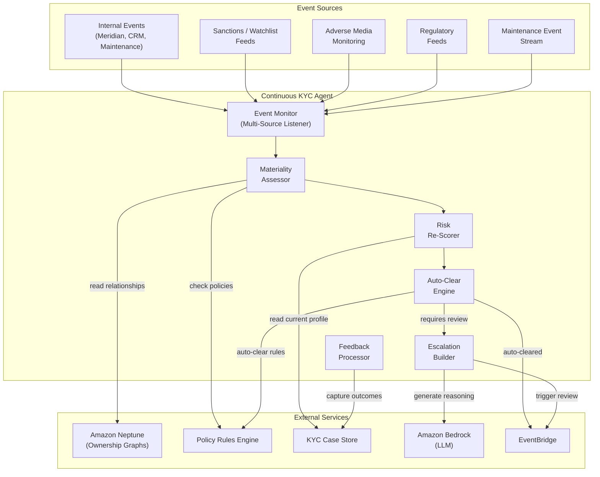
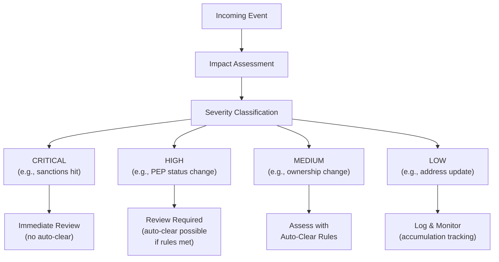
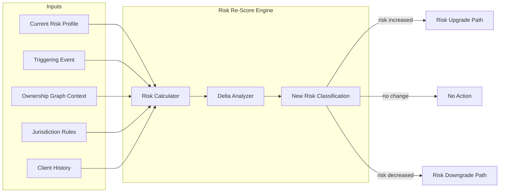
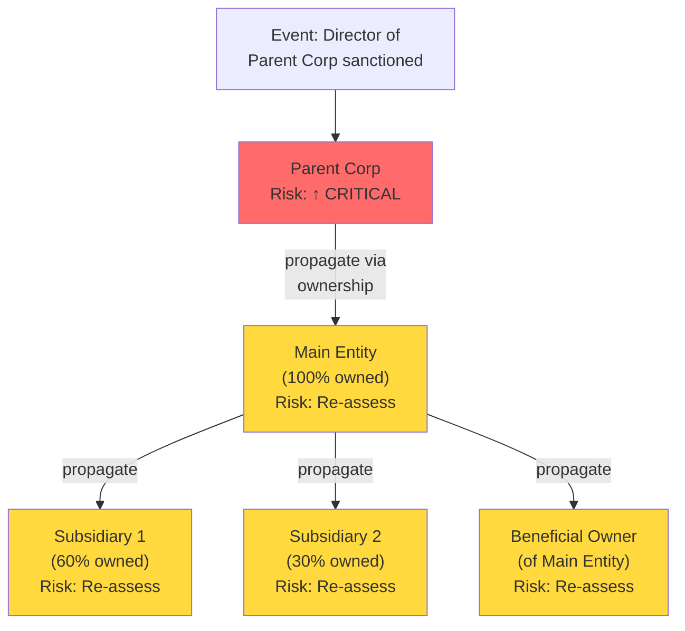
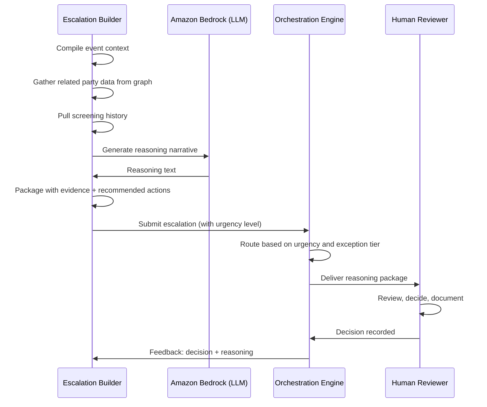

# 06 — Continuous KYC Agent

> **Document Type:** Agent Design  
> **Version:** 1.0  
> **Date:** March 2026  
> **Status:** Draft  
> **Traceability:** Vision §5.2, §8.5

---

## 1. Purpose & Scope

The Continuous KYC Agent replaces the traditional calendar-driven periodic review model with **event-driven, real-time monitoring** of client risk. It autonomously watches for material changes across internal and external data sources, evaluates risk implications, and triggers targeted reviews — reducing periodic review volumes by ~90%.

**Responsibilities:**
- Autonomously monitor client data from internal and external sources for material changes
- Pull context from sanctions lists, watchlists, adverse media, and regulatory feeds
- Evaluate risk considering entity relationships and jurisdiction-specific requirements
- Re-score client risk when material changes are detected
- Auto-clear false positives with documented reasoning
- Escalate genuine risks with **full reasoning packages** for human review
- Incorporate feedback loops to improve future decision quality
- Apply configurable rules for auto-close vs. human-required determinations

**Out of scope:** Initial KYC case processing (Orchestration Engine), data sourcing for initial cases (Data Acquisition Agent), document classification (Document Intelligence Agent).

---

## 2. Requirements Addressed

| Requirement | Vision Reference |
|---|---|
| Event-driven continuous KYC replacing periodic reviews | §5.2, §3 (~90% reduction) |
| Autonomous monitoring of internal/external sources | §8.5 |
| Pull screening context (sanctions, watchlists, adverse media) | §8.5 |
| Risk evaluation with entity relationships and jurisdiction rules | §8.5 |
| Auto-clear false positives | §8.5 |
| Escalate with full reasoning packages | §8.5 |
| Configurable auto-close vs. human review rules | §8.5 |
| Feedback loop for decision quality improvement | §8.5, §16 |
| GFCC policy for zero-event clients | §19 (open question) |

---

## 3. Agent Architecture



---

## 4. Event Monitoring Pipeline

### 4.1 Event Flow

```mermaid
sequenceDiagram
    participant SRC as Event Source
    participant EM as Event Monitor
    participant MCA as Materiality Assessor
    participant RS as Risk Re-Scorer
    participant ACE as Auto-Clear Engine
    participant ESC as Escalation Builder
    participant OE as Orchestration Engine
    participant HUM as Human Reviewer

    SRC->>EM: Change event detected
    EM->>EM: Classify event type and severity
    EM->>EM: Identify affected parties (direct + related via graph)
    
    EM->>MCA: Assess materiality
    MCA->>MCA: Check against materiality thresholds
    
    alt Not Material
        MCA->>MCA: Log event; no action
        MCA-->>EM: Event acknowledged (no review needed)
    else Material Change
        MCA->>RS: Re-score risk
        RS->>RS: Apply jurisdiction-specific risk model
        RS->>RS: Factor in ownership relationships
        RS->>RS: Compute new risk score
        
        RS->>ACE: Evaluate auto-clear eligibility
        alt Auto-Clear Eligible
            ACE->>ACE: Document reasoning
            ACE->>OE: Emit ckyc.event.auto_cleared
        else Requires Human Review
            ACE->>ESC: Build escalation package
            ESC->>ESC: Gather full context
            ESC->>ESC: Generate reasoning narrative (LLM)
            ESC->>OE: Emit ckyc.review.required
            OE->>HUM: Route to appropriate reviewer
        end
    end
```

### 4.2 Monitored Event Types

| Event Category | Source | Examples | Frequency |
|---|---|---|---|
| **Screening Hits** | Sanctions/Watchlist feeds | New sanctions match, PEP status change | Real-time (replacing nightly batch) |
| **Adverse Media** | Media monitoring service | Negative news, litigation, regulatory action | Real-time |
| **Demographic Changes** | Meridian / maintenance stream | Address change, name change, nationality change | Event-driven |
| **Ownership Changes** | Public registries, Meridian | Director change, shareholder change, corporate restructure | Event-driven |
| **Financial Changes** | Internal systems | Unusual transaction patterns, large deposits | Event-driven |
| **Regulatory Changes** | Regulatory feeds | New sanctions regime, regulatory requirements change | Periodic |
| **Relationship Changes** | CRM, front office | New account, relationship upgrade/downgrade | Event-driven |
| **KYC Lifecycle Events** | KYC platform | Case completed, document expired, data aged out | Scheduled |

---

## 5. Materiality Assessment

### 5.1 Materiality Matrix



### 5.2 Materiality Thresholds

| Event Type | Severity | Auto-Clear Eligible | Rationale |
|---|---|---|---|
| Confirmed sanctions match | CRITICAL | No | Regulatory obligation; always requires human |
| PEP status change (new PEP) | CRITICAL | No | EDD required; human judgment needed |
| Significant adverse media | HIGH | No | Human interpretation required |
| Ownership change > 10% | HIGH | Conditional | Auto-clear if new owner already KYC'd |
| Address change (same jurisdiction) | LOW | Yes | No risk impact if same jurisdiction |
| Address change (new jurisdiction) | MEDIUM | Conditional | Depends on jurisdiction risk delta |
| Routine document expiry | LOW | Yes | Auto-trigger document refresh request |
| Minor beneficial ownership change (< 5%) | LOW | Yes | Below materiality threshold |

### 5.3 Accumulation Tracking

Individual low-severity events may not be material alone, but accumulation of multiple low-severity events within a time window may trigger a review:

| Accumulation Rule | Window | Threshold | Action |
|---|---|---|---|
| Multiple address changes | 12 months | ≥ 3 changes | Trigger targeted review |
| Multiple minor ownership changes | 6 months | Cumulative > 15% | Trigger ownership review |
| Multiple adverse media hits | 3 months | ≥ 2 distinct sources | Escalate for human review |
| Data source downgrades | 12 months | ≥ 2 sources downgraded | Re-assess data confidence |

---

## 6. Risk Re-Scoring

### 6.1 Re-Scoring Model



### 6.2 Risk Propagation via Ownership Graph

When a material event affects one party, related parties are assessed:



---

## 7. Auto-Clear Engine

### 7.1 Auto-Clear Rules

| Rule ID | Event Type | Auto-Clear Condition | Required Documentation |
|---|---|---|---|
| AC-001 | Address change (same jurisdiction) | Jurisdiction risk unchanged | Log old/new address, source |
| AC-002 | Document expiry (routine) | Replacement document request auto-sent | Log request sent, deadline |
| AC-003 | Minor share change (< 5%) | UBO determination unchanged | Log ownership delta |
| AC-004 | Screening false positive (known) | Matches known false positive registry | Log match details, registry ref |
| AC-005 | Name spelling correction | Identity confidence unchanged | Log old/new, verification source |

### 7.2 Auto-Clear Safeguards

- **Every auto-clear produces an audit record** with: event details, rule applied, reasoning, timestamp
- **Auto-clear is configurable per jurisdiction** — stricter jurisdictions may disable specific rules
- **Daily summary of auto-clears** is pushed to the AI Oversight Dashboard for compliance review
- **Auto-clear rate monitoring** — if auto-clear rate exceeds threshold (e.g., 95%), alert for review

---

## 8. Escalation with Reasoning Packages

### 8.1 Reasoning Package Structure

When human review is required, the agent produces a comprehensive context package:

```json
{
  "EscalationPackage": {
    "case_id": "string",
    "party_id": "string",
    "triggering_event": {
      "event_type": "string",
      "source": "string",
      "timestamp": "ISO 8601",
      "details": "object"
    },
    "risk_assessment": {
      "previous_risk_rating": "LOW | MEDIUM | HIGH | VERY_HIGH",
      "suggested_risk_rating": "LOW | MEDIUM | HIGH | VERY_HIGH",
      "risk_delta": "string (description of what changed)",
      "risk_factors": [
        {
          "factor": "string",
          "weight": "number",
          "evidence": "string"
        }
      ]
    },
    "affected_parties": [
      {
        "party_id": "string",
        "name": "string",
        "relationship": "string",
        "impact": "DIRECT | INDIRECT"
      }
    ],
    "reasoning_narrative": "string (LLM-generated human-readable explanation)",
    "recommended_actions": ["string"],
    "supporting_evidence": [
      {
        "source": "string",
        "data_point": "string",
        "timestamp": "ISO 8601"
      }
    ],
    "urgency": "IMMEDIATE | WITHIN_24H | WITHIN_WEEK",
    "assigned_to_role": "OPERATIONS | COMPLIANCE | MLRO"
  }
}
```

### 8.2 Escalation Flow



---

## 9. Zero-Event Client Handling

For clients with no triggering events over extended periods, the agent implements policy-defined safeguards:

| Duration Without Events | Action | Notes |
|---|---|---|
| 12 months | Log "quiet client" status | For internal tracking |
| 24 months | Generate minimal targeted review | Lightweight refresh of key risk indicators |
| 36 months (or policy-defined max) | Trigger full periodic review | Safety net per GFCC guidance |

> **Open Question:** GFCC policy for clients with zero triggering events over 5–10 years is pending (Vision §19). The thresholds above are provisional and will be updated when policy is defined.

---

## 10. Interfaces & Contracts

### 10.1 Events Consumed

| Event | Source | Action |
|---|---|---|
| `screening.hit.new` | Screening Service | Assess materiality; potentially escalate |
| `media.adverse.detected` | Media Monitoring | Assess materiality |
| `meridian.party.updated` | Meridian | Evaluate demographic changes |
| `ownership.change.detected` | Public Registry / Internal | Re-assess ownership and risk |
| `maintenance.event.published` | Maintenance Stream | Evaluate KYC impact |
| `document.expired` | KYC Platform (scheduled) | Trigger document refresh |

### 10.2 Events Emitted

| Event | Detail-Type | Trigger |
|---|---|---|
| `ckyc.event.received` | Change event captured | On event receipt |
| `ckyc.event.assessed` | Materiality assessment complete | After assessment |
| `ckyc.event.auto_cleared` | Event auto-cleared | Auto-clear rules met |
| `ckyc.review.required` | Human review needed | Escalation generated |
| `ckyc.risk.rescored` | Client risk rating changed | After re-scoring |
| `ckyc.periodic.triggered` | Zero-event safety net activated | Time threshold reached |
| `ckyc.review.completed` | Human review decision recorded | After human decision |

---

## 11. Error Handling

| Error Scenario | Handling Strategy | Fallback |
|---|---|---|
| Event source feed disruption | Alert monitoring; switch to polling mode if possible | Flag affected client cohort for manual review |
| Screening service unavailable | Queue events; retry when available | Do not auto-clear any events until screening confirmed |
| Graph database unavailable | Process direct-party events; defer relationship propagation | Re-process once Neptune is available |
| LLM reasoning generation failure | Retry once; fall back to template-based reasoning | Structured package without narrative |
| Materiality assessment ambiguous | Default to MEDIUM severity; flag for human review | Never default to LOW on ambiguity |

---

## 12. Feedback Loop

- **Decision outcome tracking**: When human reviewers make decisions on escalated events, outcomes are captured
- **Auto-clear accuracy**: Events that were auto-cleared but later proved material are analyzed
- **False positive learning**: Confirmed false positives are added to the known false positive registry
- **Materiality threshold tuning**: Thresholds are adjusted based on false positive/negative rates
- **Coverage analysis**: Events that caused issues but were not monitored are identified for source expansion

---

## 13. Performance Requirements

| Metric | Target | Notes |
|---|---|---|
| Event ingestion latency | < 5 seconds from source emission | Real-time processing |
| Materiality assessment | < 10 seconds per event | Including graph lookup |
| Auto-clear decision | < 5 seconds | For eligible events |
| Escalation package generation | < 30 seconds | Including LLM reasoning |
| Daily event processing capacity | 50,000 events/day | Across all monitored sources |
| False positive rate (auto-clear) | < 2% | Measured quarterly |

---

## 14. Assumptions & Constraints

### Assumptions
1. Screening services (LexisNexis and new entity screening) provide real-time event feeds (replacing nightly batch)
2. Meridian publishes change events to the maintenance event stream
3. GFCC will define policy for zero-event client handling before Phase 2 go-live
4. Ownership graph (Neptune) is populated and maintained by the Data Acquisition Agent

### Constraints
1. **Sanctions matches are never auto-cleared** — always require human review (regulatory requirement)
2. **PEP status changes are never auto-cleared** — always escalated
3. **Auto-clear rules must be GFCC-approved** — same governance as STP rules
4. **All events are retained** — even non-material events are logged for audit
5. **Agent cannot downgrade risk rating** without human approval — can only upgrade or maintain
6. **Relationship propagation depth** — limited to 3 hops in ownership graph to prevent cascade storms

---

## 15. Open Items

| # | Item | Impact | Owner |
|---|---|---|---|
| 1 | GFCC policy for zero-event clients (5–10 year horizon) | Safety net thresholds | GFCC / Compliance |
| 2 | Define maintenance event subscription model | Event source coverage | Technology / Maintenance Team |
| 3 | Transition plan from nightly batch screening to real-time | Screening architecture | Technology / Screening Vendor |
| 4 | Define relationship propagation rules with compliance | Graph cascade scope | Compliance / Technology |
| 5 | Establish auto-clear rule governance process | Operational readiness | GFCC / Product |
| 6 | Quantify expected event volumes per source for capacity planning | Infrastructure sizing | Technology |

---

*This document will be updated as GFCC continuous KYC policy guidance is received and real-time screening feed architecture is confirmed.*
