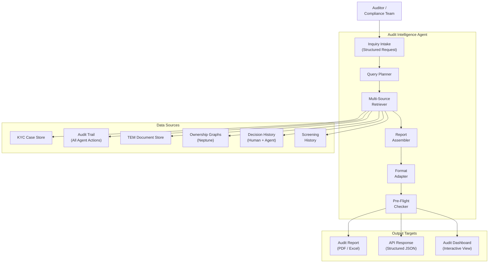

# 07 — Audit Intelligence Agent

> **Document Type:** Agent Design  
> **Version:** 1.0  
> **Date:** March 2026  
> **Status:** Draft — Concept Stage  
> **Traceability:** Vision §8.6

---

## 1. Purpose & Scope

The Audit Intelligence Agent is a **concept-stage** design for automating the labor-intensive process of responding to internal and external audit inquiries. Today, dedicated teams manually extract and collate KYC information for auditors. This agent automates that retrieval, formatting, and packaging.

**Responsibilities:**
- Accept audit inquiry requests (structured queries about a client, case, or portfolio)
- Automatically extract and collate relevant KYC information across systems
- Package information in the format required by auditors (internal audit, external regulators, risk & control)
- Produce audit-ready reports with full data lineage and traceability
- Support ad-hoc queries across KYC case history

**Out of scope:** Modifying KYC data for audit purposes, making compliance determinations, conducting the audit itself.

> **Note:** This agent is at concept stage (Vision §8.6). The design below establishes the target architecture; the implementation approach will be refined as audit team requirements are gathered.

---

## 2. Requirements Addressed

| Requirement | Vision Reference |
|---|---|
| Reduce manual effort in responding to audit inquiries | §8.6 |
| Automatically extract and collate KYC information | §8.6 |
| Format information per auditor requirements | §8.6 |
| Full traceability and auditability | §5.4 |

---

## 3. Agent Architecture



---

## 4. Inquiry Types

### 4.1 Supported Inquiry Categories

| Category | Description | Example Query |
|---|---|---|
| **Single Client** | Full KYC profile for one client | "Provide complete KYC file for Client X" |
| **Case History** | Timeline of all events/decisions for a case | "Show all actions taken on Case #12345" |
| **Portfolio Audit** | Cross-section of clients by criteria | "All high-risk clients onboarded in Q4 2025 in US jurisdiction" |
| **Decision Audit** | Explanation trace for specific decision | "Why was Client Y's risk rating set to MEDIUM?" |
| **Agent Action Audit** | All actions taken by an AI agent on a case | "What did the Document Intelligence Agent do on Case #12345?" |
| **STP Audit** | Validation of straight-through processed cases | "List all STP cases; show rule evaluation for each" |
| **Exception Audit** | Review of exception handling decisions | "Show all Tier 2 exceptions in January 2026 and their resolution" |
| **Data Lineage** | Source attribution for specific data points | "Where did the beneficial owner list for Entity Z come from?" |

### 4.2 Inquiry Request Schema

```json
{
  "AuditInquiry": {
    "inquiry_id": "string (UUID)",
    "requester": {
      "name": "string",
      "role": "INTERNAL_AUDIT | EXTERNAL_REGULATOR | COMPLIANCE | RISK_CONTROL",
      "authorization_ref": "string"
    },
    "inquiry_type": "SINGLE_CLIENT | CASE_HISTORY | PORTFOLIO | DECISION | AGENT_ACTION | STP | EXCEPTION | DATA_LINEAGE",
    "scope": {
      "client_ids": ["string (optional)"],
      "case_ids": ["string (optional)"],
      "date_range": { "from": "ISO 8601", "to": "ISO 8601" },
      "jurisdictions": ["string (optional)"],
      "risk_levels": ["string (optional)"],
      "agent_ids": ["string (optional)"]
    },
    "output_format": "PDF | EXCEL | JSON | INTERACTIVE",
    "deadline": "ISO 8601 (optional)",
    "special_instructions": "string (optional)"
  }
}
```

---

## 5. Processing Pipeline

```mermaid
sequenceDiagram
    participant AUD as Auditor
    participant INT as Inquiry Intake
    participant PLN as Query Planner
    participant RET as Multi-Source Retriever
    participant ASM as Report Assembler
    participant FMT as Format Adapter
    participant PFC as Pre-Flight Checker

    AUD->>INT: Submit audit inquiry
    INT->>INT: Validate request; check authorization
    INT->>PLN: Plan retrieval strategy

    PLN->>PLN: Decompose inquiry into data queries
    PLN->>PLN: Identify required data sources
    PLN->>PLN: Estimate data volume; plan pagination

    PLN->>RET: Execute data retrieval
    par Parallel Data Retrieval
        RET->>RET: Query KYC Case Store
        RET->>RET: Query Audit Trail logs
        RET->>RET: Query TEM for documents
        RET->>RET: Query Neptune for ownership graphs
        RET->>RET: Query screening history
        RET->>RET: Query decision history
    end

    RET->>ASM: Raw data from all sources
    ASM->>ASM: Correlate data across sources
    ASM->>ASM: Build timeline / narrative
    ASM->>ASM: Add data lineage annotations

    ASM->>FMT: Assembled report data
    FMT->>FMT: Apply requested output format
    FMT->>FMT: Generate PDF / Excel / JSON

    FMT->>PFC: Pre-flight check
    PFC->>PFC: Verify completeness (no missing data refs)
    PFC->>PFC: Verify PII handling rules met
    PFC->>PFC: Verify authorization scope

    PFC->>AUD: Deliver audit report
```

---

## 6. Report Templates

### 6.1 Single Client KYC Report

| Section | Content |
|---|---|
| **Client Overview** | Name, type, jurisdiction, risk rating, onboarding date |
| **KYC Case Summary** | Current case status, last review date, review type |
| **Identity Verification** | ID&V status, documents used, verification method |
| **Ownership Structure** | Graph visualization, UBO list, ownership percentages |
| **Screening Summary** | Current screening status, historical hits, resolution |
| **Document Inventory** | All documents with classification, dates, source |
| **Data Lineage** | Per-field source attribution and confidence scores |
| **Decision History** | Timeline of all decisions (human + agent), with reasoning |
| **Exception History** | All exceptions raised and their resolution |
| **Continuous Monitoring** | Events detected, actions taken, auto-clears |

### 6.2 Portfolio Audit Report

| Section | Content |
|---|---|
| **Population Summary** | Client count, risk distribution, jurisdiction breakdown |
| **STP Statistics** | % STP, common blocking criteria |
| **Exception Analysis** | Exception types, resolution times, escalation patterns |
| **Data Quality Metrics** | Pre-fill accuracy, NIGO rate, first-time-right rate |
| **Agent Performance** | Actions per agent, accuracy, human override rate |
| **Outlier Identification** | Cases with unusual patterns flagged for review |

---

## 7. Data Lineage & Traceability

Every data point in an audit report includes:

```json
{
  "AuditDataPoint": {
    "field_name": "string",
    "current_value": "string",
    "source_attribution": {
      "source_id": "string",
      "source_type": "ADVISOR_INPUT | DOCUMENT_EXTRACTION | EXTERNAL_REGISTRY | SCREENING",
      "retrieval_date": "ISO 8601",
      "confidence_score": 0.92
    },
    "modification_history": [
      {
        "timestamp": "ISO 8601",
        "previous_value": "string",
        "new_value": "string",
        "modified_by": "string (user/agent ID)",
        "reason": "string"
      }
    ],
    "verification_status": "VERIFIED | UNVERIFIED | CONFLICT_RESOLVED",
    "audit_trail_ref": "string (link to full audit log entry)"
  }
}
```

---

## 8. Interfaces & Contracts

### 8.1 Events Emitted

| Event | Detail-Type | Trigger |
|---|---|---|
| `audit.inquiry.received` | New inquiry submitted | On receipt |
| `audit.report.generating` | Report generation started | After query planning |
| `audit.report.ready` | Report available for delivery | After pre-flight check |
| `audit.report.delivered` | Report delivered to requester | On download/API response |

### 8.2 Access Control

| Requester Role | Allowed Inquiry Types | Data Scope |
|---|---|---|
| Internal Audit | All types | Full access (within audit authorization) |
| External Regulator | All types | As per regulatory authority scope |
| Compliance | All types | Full access |
| Risk & Control | Decision, Exception, STP | Risk-related data only |
| Operations Management | Portfolio, Exception | Operational metrics only |

---

## 9. Error Handling

| Error Scenario | Handling Strategy | Fallback |
|---|---|---|
| Data source unavailable | Partial report with missing section flagged | Retry; manual retrieval for missing section |
| Query returns excessive data (> threshold) | Paginate; offer summary + drill-down | Notify requester; suggest narrowing scope |
| PII exposure in report | Pre-flight checker redacts per authorization level | Never deliver report without PII check |
| Authorization check failure | Reject inquiry; log attempt | Notify compliance of unauthorized access attempt |

---

## 10. Performance Requirements

| Metric | Target | Notes |
|---|---|---|
| Single client report generation | < 60 seconds | Standard complexity |
| Portfolio report (up to 1,000 clients) | < 10 minutes | Batch processing |
| Ad-hoc query response | < 15 seconds | Interactive mode |
| Concurrent inquiry support | Up to 20 | Phase 1 target |

---

## 11. Assumptions & Constraints

### Assumptions
1. All agent actions are logged in a centralized audit trail with sufficient detail for reconstruction
2. KYC Case Store, TEM, and Neptune are query-accessible with appropriate read permissions
3. Audit teams will provide detailed format requirements during implementation planning

### Constraints
1. **Read-only agent** — never modifies KYC data; only reads and formats
2. **Authorization-gated** — every inquiry verified against requester's authorization scope
3. **PII handling** — reports must respect data classification; PII redacted per authorization level
4. **No AI-generated compliance assessments** — the agent presents data; it does not judge compliance

---

## 12. Implementation Approach (Phased)

| Phase | Scope | Target |
|---|---|---|
| **Concept Validation** | Identify top 5 most frequent audit inquiry types; build prototype | Phase 2 |
| **MVP** | Single client + case history reports; structured output only | Phase 2–3 |
| **Enhanced** | Portfolio reports, interactive dashboard, PDF/Excel output | Phase 3 |
| **Advanced** | Natural language inquiry parsing, auto-scheduled regulatory reports | Phase 4 |

---

## 13. Open Items

| # | Item | Impact | Owner |
|---|---|---|---|
| 1 | Gather detailed requirements from internal audit team | Report templates, data points | Audit Team / Product |
| 2 | Define external regulator report format requirements | Formatter specifications | Compliance / Legal |
| 3 | Determine implementation priority vs. other agents | Roadmap placement | Product |
| 4 | Assess audit trail completeness of current agent designs | Data availability | Technology |
| 5 | Define authorization model for audit data access | Security design | Security / Compliance |

---

*This document is at concept stage and will be substantially expanded as audit team requirements are gathered and implementation priority is confirmed.*
