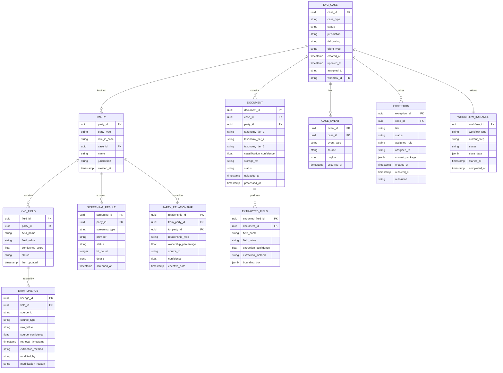
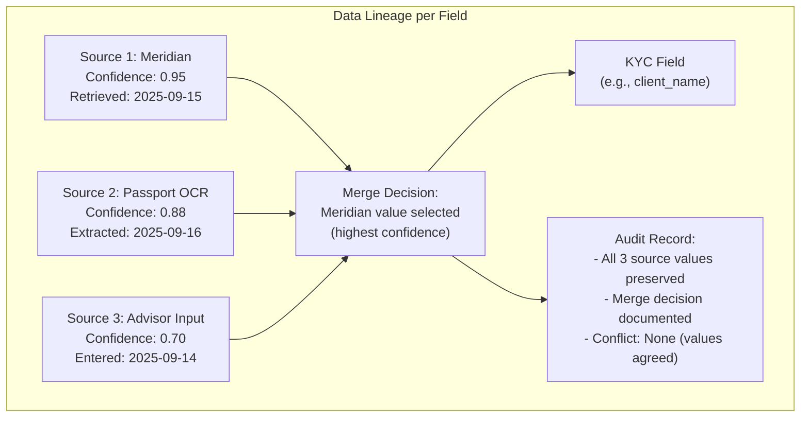
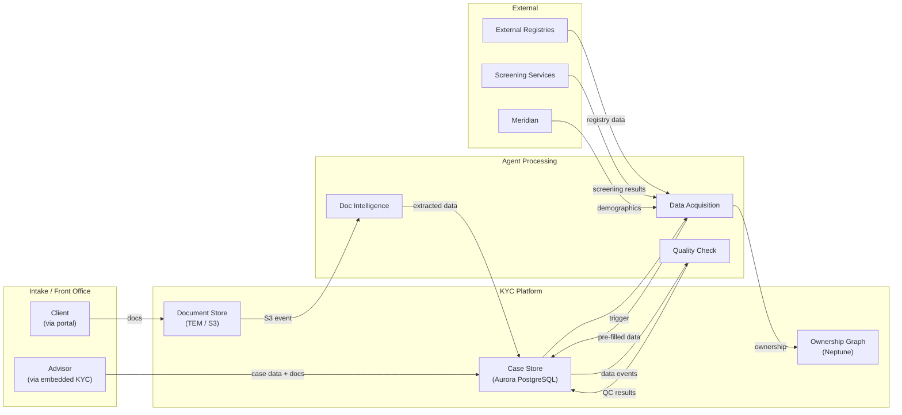
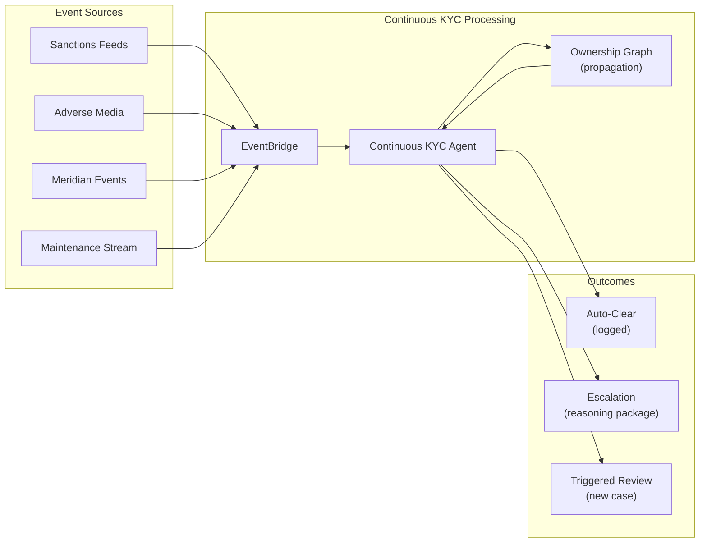
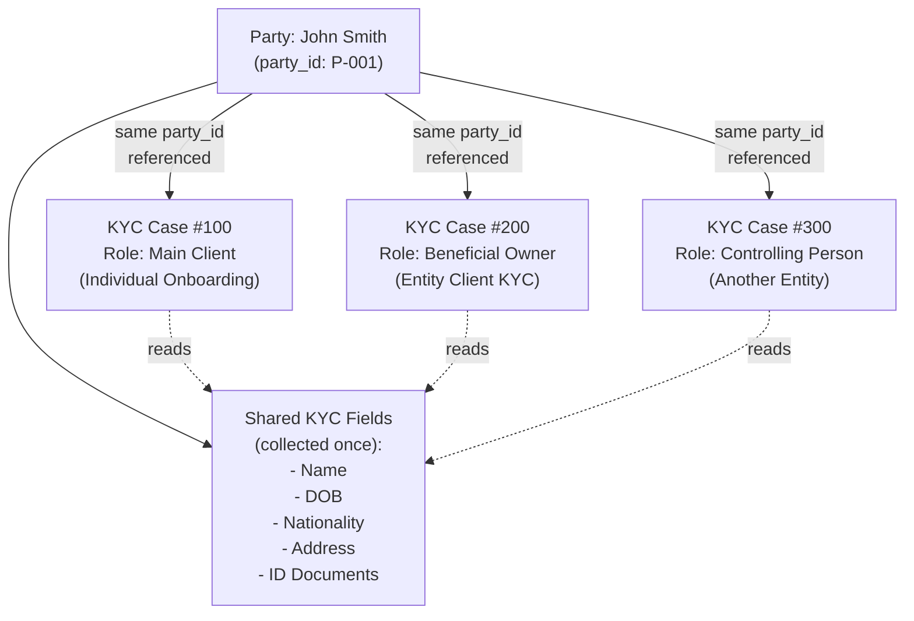

# 08 — Data Model & Flows

> **Document Type:** Data Architecture  
> **Version:** 1.0  
> **Date:** March 2026  
> **Status:** Draft  
> **Traceability:** Vision §5.4, §7, §10

---

## 1. Purpose & Scope

This document defines the core data model, data lineage framework, event schemas, and data flow patterns for the North Star KYC Platform. It establishes how data moves through the system, how every data point carries provenance, and how the "Data Collected Once" principle is enforced.

---

## 2. Requirements Addressed

| Requirement | Vision Reference |
|---|---|
| Data collected once, single source of truth | §3 |
| Source attribution per data point | §5.4 |
| Confidence score per data point | §5.4 |
| Full audit trail | §5.4 |
| Data products layer for clean reporting | §7.2 |

---

## 3. Core Entity Model



---

## 4. Data Lineage Model

### 4.1 Lineage Architecture

Every KYC field value carries a full provenance chain:



### 4.2 Lineage Record Schema

```json
{
  "DataLineageRecord": {
    "field_id": "uuid",
    "field_name": "string",
    "current_value": "string",
    "current_confidence": 0.95,
    "sources": [
      {
        "source_id": "string",
        "source_type": "INTERNAL | EXTERNAL_REGISTRY | THIRD_PARTY | DOCUMENT_EXTRACTION | ADVISOR_INPUT",
        "source_name": "string (e.g., Meridian, SEC EDGAR, Passport OCR)",
        "raw_value": "string",
        "confidence": 0.95,
        "retrieval_timestamp": "ISO 8601",
        "extraction_method": "API | OCR | LLM | MANUAL"
      }
    ],
    "merge_decision": {
      "strategy": "HIGHEST_CONFIDENCE | MOST_RECENT | HUMAN_SELECTED",
      "selected_source_id": "string",
      "conflict_detected": "boolean",
      "conflict_resolution": "AUTO | HUMAN | NONE"
    },
    "modification_history": [
      {
        "timestamp": "ISO 8601",
        "actor": "string (agent_id or user_id)",
        "actor_type": "AGENT | HUMAN",
        "action": "CREATED | UPDATED | VERIFIED | OVERRIDDEN",
        "previous_value": "string",
        "new_value": "string",
        "reason": "string"
      }
    ]
  }
}
```

---

## 5. Data Flow Patterns

### 5.1 Initial KYC Data Flow



### 5.2 Continuous KYC Data Flow



### 5.3 Data Collected Once — Shared Party Pattern



---

## 6. Event Schema Catalog

### 6.1 Base Event Envelope

All events follow a standard envelope:

```json
{
  "EventEnvelope": {
    "event_id": "uuid",
    "event_type": "string (e.g., document.processed)",
    "source": "string (emitting agent/service)",
    "timestamp": "ISO 8601",
    "correlation_id": "uuid (trace across event chain)",
    "case_id": "string (optional)",
    "party_id": "string (optional)",
    "version": "string (schema version)",
    "payload": "object (event-specific data)"
  }
}
```

### 6.2 Event Catalog

| Event Type | Source | Payload Summary | Consumed By |
|---|---|---|---|
| `case.created` | Orchestration Engine | case_id, type, jurisdiction, client_type | All agents |
| `case.step.started` | Orchestration Engine | case_id, step_name, assigned_agent | Assigned agent |
| `case.step.completed` | Agent | case_id, step_name, result | Orchestration Engine |
| `document.uploaded` | KYC UI / API | document_id, case_id, file_ref | Document Intelligence Agent |
| `document.processed` | Document Intelligence | document_id, classification, extracted_data | QC Agent, Case Store |
| `data.acquisition.completed` | Data Acquisition Agent | case_id, pre_filled_fields, graph_ref | QC Agent, Case Store |
| `data.conflict.detected` | Data Acquisition Agent | field_name, conflicting_values, sources | QC Agent, Exception Handler |
| `case.qc.passed` | Quality Check Agent | case_id, results_summary | Orchestration Engine |
| `case.qc.failed` | Quality Check Agent | case_id, failed_rules, exception_detail | Exception Handler |
| `case.stp.eligible` | Quality Check Agent | case_id, stp_criteria_results | Orchestration Engine |
| `exception.created` | Exception Handler | exception_id, tier, context | Assigned human actor |
| `exception.resolved` | Human Actor | exception_id, resolution, reasoning | QC Agent (re-evaluation) |
| `ckyc.event.received` | Continuous KYC Agent | event_type, party_id, source | Internal processing |
| `ckyc.event.auto_cleared` | Continuous KYC Agent | event_id, rule_applied, reasoning | Audit log |
| `ckyc.review.required` | Continuous KYC Agent | escalation_package | Orchestration Engine |
| `field.updated` | KYC Case Store | case_id, field_name, old_value, new_value | QC Agent |

---

## 7. Storage Architecture

### 7.1 Database Assignment

| Data Type | Storage | Rationale |
|---|---|---|
| KYC Cases, Parties, Fields, Lineage | **Aurora PostgreSQL** | Relational data with complex queries; ACID transactions |
| Ownership Graphs, Relationships | **Amazon Neptune** | Graph traversals, path queries, cycle detection |
| Documents (files) | **S3 via TEM** | Large binary objects; lifecycle policies |
| Document Metadata | **Aurora PostgreSQL** | Queryable metadata alongside case data |
| Events (real-time) | **EventBridge** | Event routing and fan-out |
| Event History (archive) | **DynamoDB** | High-write throughput; time-series queries |
| Agent State (workflow) | **Step Functions + DynamoDB** | Workflow state management |
| Screening Results | **Aurora PostgreSQL** | Queryable; joined with party data |
| Audit Trail | **DynamoDB (write) + S3 (archive)** | Append-only; immutable |
| Cache (hot data) | **ElastiCache (Redis)** | Low-latency reads for frequently accessed data |

### 7.2 Data Partitioning Strategy

| Store | Partition Key | Sort Key | Rationale |
|---|---|---|---|
| Aurora PostgreSQL | N/A (relational) | N/A | Standard relational partitioning by jurisdiction |
| DynamoDB (events) | case_id | timestamp | Efficient case timeline queries |
| DynamoDB (audit) | entity_id (case/party/doc) | timestamp | Audit trail per entity |
| S3 (documents) | case_id prefix | document_id | S3 prefix-based partitioning |

---

## 8. Data Classification & Sensitivity

| Classification | Examples | Storage Requirements | Access Control |
|---|---|---|---|
| **PII — High** | SSN, passport number, biometric data | Encrypted at rest (AES-256), field-level encryption | Strict RBAC; audit logged |
| **PII — Standard** | Name, DOB, address, phone | Encrypted at rest | RBAC |
| **Financial** | Tax returns, source of wealth, financial statements | Encrypted at rest; restricted retention | RBAC + need-to-know |
| **Risk & Screening** | Risk ratings, screening hits, PEP status | Encrypted at rest | RBAC; compliance access |
| **Operational** | Case status, workflow state, QC results | Encrypted at rest | Standard platform access |
| **Audit** | Agent actions, decision logs, timestamps | Encrypted, immutable, archived | Audit team, compliance |

---

## 9. Data Retention Policy

| Data Type | Active Retention | Archive Period | Deletion |
|---|---|---|---|
| KYC Case Data | Duration of client relationship + 7 years | Read-only archive (S3 Glacier) | Per regulatory schedule |
| Documents | Duration of client relationship + 7 years | Archived with case | Per regulatory schedule |
| Audit Trail | 10 years active | Additional 5 years archived | Per regulatory schedule |
| Screening Results | Duration of client relationship + 7 years | Archived with party | Per regulatory schedule |
| Ownership Graphs | Duration of entity relationship | Snapshot archived on changes | Per regulatory schedule |
| Events (DynamoDB) | 2 years hot storage | Archived to S3 after 2 years | Per regulatory schedule |
| Cache (Redis) | TTL-based (hours to days) | Not archived | Auto-evicted |

> **Note:** Retention periods are illustrative and must be confirmed with Legal and Compliance per jurisdiction.

---

## 10. Data Products Layer

The Data Products layer provides clean, curated views for reporting and analytics:

| Data Product | Source | Purpose | Consumers |
|---|---|---|---|
| **KYC Case Metrics** | Case Store | STP rate, first-time-right rate, NIGO rate | Management dashboards |
| **Agent Performance** | Audit Trail + Events | Accuracy, throughput, override rates per agent | AI Oversight Dashboard |
| **Risk Distribution** | Case Store + Screening | Client risk distribution by jurisdiction | Risk & Compliance |
| **STP Analytics** | QC Results + Case Store | STP pass/fail breakdown, blocking criteria | Product, Operations |
| **Data Quality** | Lineage Records | Source accuracy, pre-fill acceptance rates | Technology, Product |
| **Audit Readiness** | All sources (via Audit Agent) | Pre-built audit packages | Internal Audit |

---

## 11. Assumptions & Constraints

### Assumptions
1. Aurora PostgreSQL and Neptune are provisioned per system architecture (Design 01)
2. EventBridge is the sole event bus; all agents emit and consume via EventBridge
3. Field-level encryption is available via AWS KMS integration
4. TEM document storage API supports metadata tagging

### Constraints
1. **No data duplication across cases** — shared parties reference the same underlying party record
2. **Lineage is mandatory** — no field value can be stored without a lineage record
3. **Immutable audit trail** — audit records cannot be modified or deleted
4. **Encryption at rest** — all data stores encrypted using AWS KMS managed keys
5. **GDPR / data residency** — data for EU clients must reside in EU region deployments

---

## 12. Open Items

| # | Item | Impact | Owner |
|---|---|---|---|
| 1 | Confirm data retention requirements per jurisdiction with Legal | Retention policy | Legal / Compliance |
| 2 | Define field-level encryption scope (which fields get additional encryption) | Security design | Security / Technology |
| 3 | Confirm GDPR data residency requirements for multi-region deployment | Infrastructure | Legal / Technology |
| 4 | Define data products refresh cadence (real-time vs. batch) | Reporting timeliness | Product / Technology |
| 5 | Determine shared party deduplication strategy across cases | Data quality | Product / Technology |

---

*This document will be updated as data retention policies are confirmed and field-level encryption scope is defined.*
