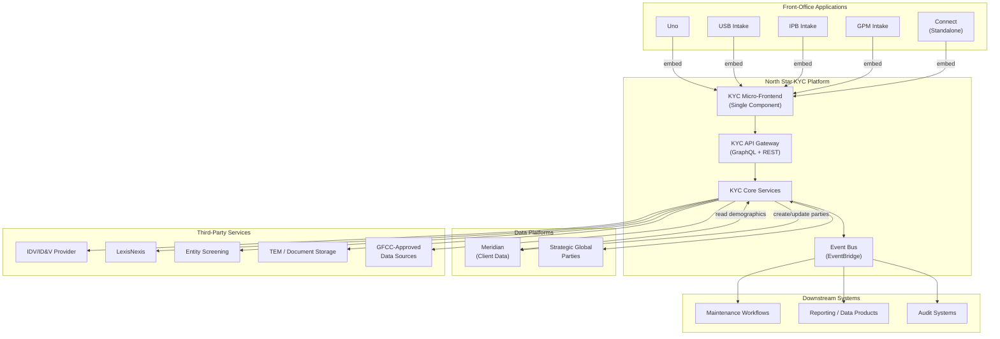
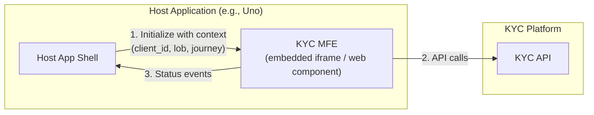
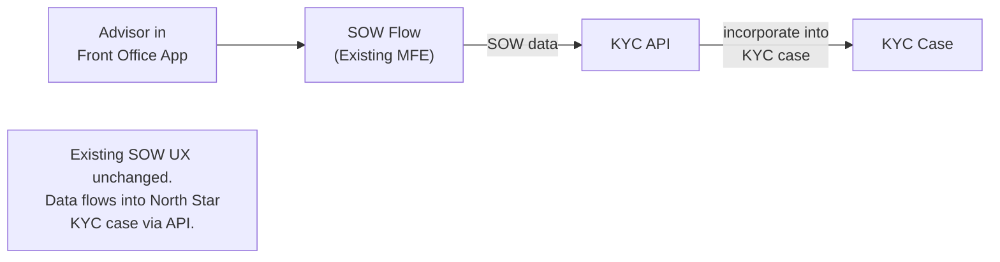
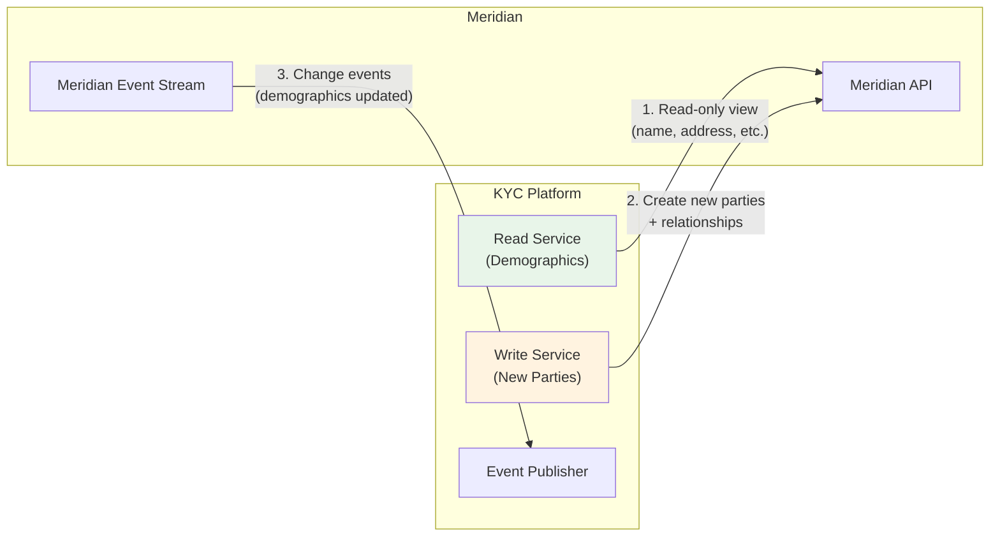
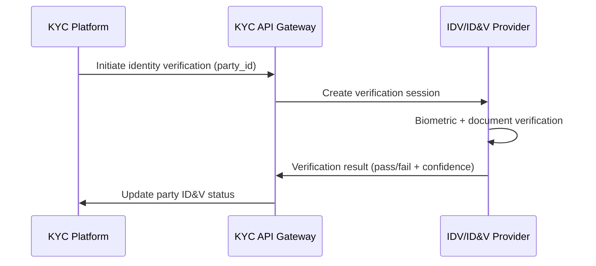
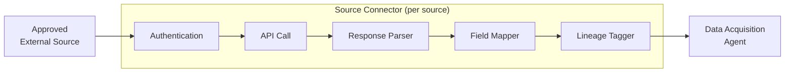
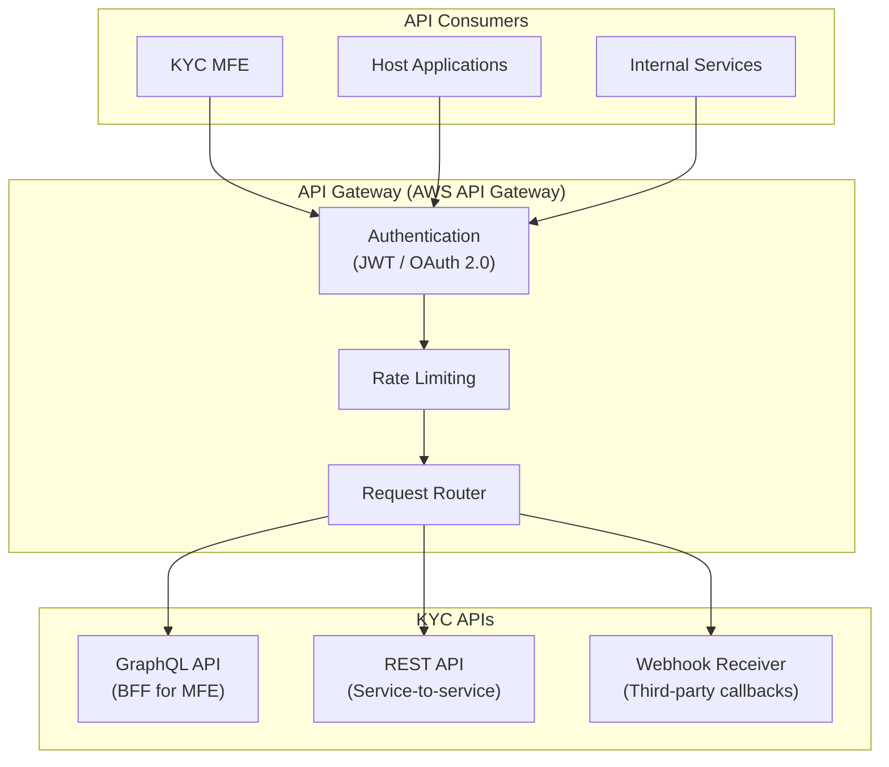

# 09 — Integration Architecture

> **Document Type:** Integration Design  
> **Version:** 1.0  
> **Date:** March 2026  
> **Status:** Draft  
> **Traceability:** Vision §10, §5.3, §12

---

## 1. Purpose & Scope

This document defines how the North Star KYC Platform integrates with front-office applications, Meridian (client data platform), third-party services, and downstream systems. It establishes the single integration point model, API contracts, and event-driven integration patterns.

---

## 2. Requirements Addressed

| Requirement | Vision Reference |
|---|---|
| Embed KYC into front-office intake applications (single integration point) | §5.3, §10.1 |
| Preserve existing advisor UX (e.g., Source of Wealth flow) | §5.3, §10.1 |
| KYC available as standalone in Connect | §5.3 |
| Meridian read-only view + real-time distribution to Meridian | §10.2 |
| Resolve Meridian address override issue | §10.2 |
| Maintenance event surfacing | §10.3 |
| Reusable KYC capabilities across Client Acquisition & Lifecycle | §10.3 |

---

## 3. Integration Landscape



---

## 4. Front-Office Integration

### 4.1 Single Micro-Frontend Component

All front-office applications embed the **same KYC Micro-Frontend (MFE)**. This eliminates the problem of multiple MFE versions with inconsistent mappings.



### 4.2 MFE Configuration Model

The KYC MFE is configurable per Line of Business (LOB):

| Configuration | Purpose | Examples |
|---|---|---|
| **Screen Visibility** | Show/hide screens based on LOB readiness | Hide entity screens for USB Phase 1 |
| **Field Configuration** | Required/optional/hidden per jurisdiction | Swiss-specific fields for Geneva |
| **Workflow Variant** | Which workflow template to invoke | Individual US Initial vs. Entity Swiss |
| **Theme / Branding** | Visual integration with host application | Uno theme vs. Connect theme |
| **Feature Flags** | Progressive rollout of new capabilities | STP enabled/disabled per LOB |

```json
{
  "MFEConfig": {
    "lob": "USB | IPB | GPM | CONNECT",
    "jurisdiction": "US | CH | SG | HK",
    "client_type": "INDIVIDUAL | ENTITY",
    "screens": {
      "source_of_wealth": { "visible": true, "mode": "ADVISOR_FACING" },
      "entity_structure": { "visible": false },
      "document_upload": { "visible": true },
      "screening_summary": { "visible": true, "mode": "READ_ONLY" }
    },
    "features": {
      "stp_enabled": true,
      "continuous_kyc_visible": false,
      "ai_suggestions_enabled": true
    },
    "theme": "uno-dark | connect-light"
  }
}
```

### 4.3 Host Application Integration Contract

| Integration Point | Direction | Protocol | Description |
|---|---|---|---|
| **Initialization** | Host → MFE | PostMessage / Props | Pass client context (client_id, LOB, journey) |
| **Navigation Events** | MFE → Host | PostMessage | Notify host of KYC step changes |
| **Status Updates** | MFE → Host | PostMessage | Case status (submitted, in-review, complete) |
| **DeepLink** | Host → MFE | URL parameters | Link directly to a specific case/step |
| **Exit / Handoff** | MFE → Host | PostMessage | KYC complete; hand back to host workflow |

### 4.4 Preserved Advisor Experience

The existing Source of Wealth (SOW) flow — already rolled out — is preserved:



---

## 5. Meridian Integration

### 5.1 Integration Model



### 5.2 Integration Rules

| Rule | Description | Vision Reference |
|---|---|---|
| **Read-only demographics** | KYC displays Meridian data but does not modify it. Name/address changes are maintenance activities, not KYC activities. | §10.2 |
| **New party creation** | KYC creates new parties and establishes relationships. This data is distributed to Meridian in real time. | §10.2 |
| **No demographic editing in KYC** | Maintenance UI handles demographic changes; KYC only consumes them. | §10.2, §18 |
| **Address override resolution** | KYC reads from Meridian's primary address record. No override logic in KYC — resolved at Meridian level. | §10.2 |
| **Change event subscription** | KYC subscribes to Meridian change events for continuous KYC monitoring. | §10.2 |

### 5.3 Meridian API Contract

| Endpoint | Method | Direction | Description |
|---|---|---|---|
| `/parties/{id}` | GET | KYC → Meridian | Read party demographics |
| `/parties/{id}/relationships` | GET | KYC → Meridian | Read party relationships |
| `/parties` | POST | KYC → Meridian | Create new party |
| `/parties/{id}/relationships` | POST | KYC → Meridian | Establish new relationship |
| `/events/subscribe` | POST | Meridian → KYC | Subscribe to change events |

### 5.4 Branch Silo Consideration

Meridian currently has branch-level data siloing. Until the Meridian modernization program resolves this:

| Scenario | KYC Behavior |
|---|---|
| Party exists in same branch | Read normally from Meridian |
| Party exists in different branch | Flag as potential shared party; request cross-branch read from Meridian |
| Shared client across regions (e.g., LatAm GFG) | Handle as exception; route per shared client strategy |

---

## 6. Third-Party Service Integration

### 6.1 IDV/ID&V Provider



| Aspect | Detail |
|---|---|
| **Status** | MSA/contract pending (Vision §12) |
| **Integration Pattern** | Async with webhook callback |
| **Data Exchanged** | Name, DOB, document image → verification result + confidence |
| **Fallback** | Manual ID verification process |

### 6.2 Screening Services

| Service | Pattern | Data Flow |
|---|---|---|
| **LexisNexis (US Individuals)** | Real-time API call during data acquisition | Party data → screening hits |
| **Entity Screening (new)** | Event-based (CAV-side) | Entity data → screening events |

### 6.3 Document Management (TEM)

| Operation | Direction | Description |
|---|---|---|
| Upload | KYC → TEM | Store document with taxonomy metadata |
| Retrieve | KYC ← TEM | Fetch document for viewing/extraction |
| Metadata Update | KYC → TEM | Update taxonomy, classification after processing |
| Delete / Archive | KYC → TEM | Per retention policy |

### 6.4 GFCC-Approved External Sources

Integration with external data sources follows a standardized connector pattern:



**Adding a new source requires:**
1. GFCC approval for the source
2. Build connector (authentication, parsing, mapping)
3. Define confidence tier
4. Register in Approved Source Registry
5. Deploy sub-agent

---

## 7. Downstream Integration

### 7.1 Maintenance Event Surfacing

Events detected during KYC that are relevant to maintenance workflows:

| KYC Event | Maintenance Action | Pattern |
|---|---|---|
| Address discrepancy found | Surface to maintenance team for address update | EventBridge → maintenance queue |
| New beneficial owner identified | Surface for relationship maintenance | EventBridge → maintenance queue |
| Client risk upgrade | Notify relationship management | EventBridge → CRM notification |
| Document expiry approaching | Trigger document refresh workflow | Scheduled event → maintenance |

### 7.2 Reporting & Data Products

| Data Product | Target Consumers | Delivery |
|---|---|---|
| KYC Case Metrics | Management dashboards | Real-time via data products layer |
| Agent Performance | AI Oversight Dashboard | Real-time via event stream |
| Regulatory Reports | Compliance | Scheduled batch |
| Audit Packages | Internal/External Audit | On-demand via Audit Intelligence Agent |

---

## 8. API Gateway Design

### 8.1 API Layer Architecture



### 8.2 API Categories

| API | Protocol | Consumers | Use Cases |
|---|---|---|---|
| **GraphQL BFF** | GraphQL | KYC MFE | Case queries, field updates, document management |
| **REST — Case** | REST | Host applications, internal services | Case lifecycle (create, submit, approve) |
| **REST — Party** | REST | Meridian, internal services | Party creation, relationship management |
| **REST — Document** | REST | TEM, front-office apps | Document upload, retrieval |
| **Webhook** | REST (inbound) | IDV provider, screening services | Async callback results |
| **Event** | EventBridge | All downstream consumers | Pub/sub for system-to-system |

---

## 9. Security & Authentication

| Integration Type | Authentication | Authorization |
|---|---|---|
| MFE → API | OAuth 2.0 / JWT (user context) | RBAC based on user role |
| Host App → API | OAuth 2.0 / service token | Service-level scoping |
| KYC → Meridian | Mutual TLS + service token | Pre-defined service account |
| KYC → Third-Party | Provider-specific (API key, OAuth) | Scoped per provider contract |
| Third-Party callbacks → KYC | HMAC signature verification | Verified per provider |
| Internal service-to-service | IAM roles + service mesh (mTLS) | Least-privilege IAM policies |

---

## 10. Error Handling & Resilience

| Pattern | Implementation | Use Case |
|---|---|---|
| **Circuit Breaker** | AWS SDK circuit breaker on all external calls | Prevent cascade failures |
| **Retry with Backoff** | Exponential backoff (3 retries, max 30s) | Transient external failures |
| **Timeout** | 30s default; 60s for screening; 5s for cache | Prevent resource exhaustion |
| **Bulkhead** | Separate connection pools per external service | Isolate failure domains |
| **Fallback** | Graceful degradation per integration | Continue with available data; flag gaps |
| **Dead Letter Queue** | SQS DLQ for failed event processing | Guarantee no event loss |

---

## 11. Assumptions & Constraints

### Assumptions
1. BAC (Becoming a Client) program will adopt the single MFE integration model
2. Meridian exposes read APIs and change event streams as described
3. IDV/ID&V vendor contract will be signed before Phase 1 go-live
4. All host applications support embedding via iframe or web component

### Constraints
1. **Single MFE version** — all host applications use the same MFE; no forked versions
2. **No direct database access** — all integrations are API-based (no shared database)
3. **Meridian write-back scope** — KYC only creates new parties/relationships; never modifies demographics
4. **GFCC data source approval** — no external source integrated without formal approval
5. **API versioning** — APIs are versioned (v1, v2); breaking changes require new version

---

## 12. Open Items

| # | Item | Impact | Owner |
|---|---|---|---|
| 1 | Confirm BAC program's MFE embedding architecture | Front-office integration | BAC Team / Technology |
| 2 | Finalize Meridian API contract (read + event stream) | Meridian integration | Meridian Team |
| 3 | Sign IDV/ID&V vendor MSA | Identity verification | Legal / Technology |
| 4 | Define shared client strategy for cross-region rollouts | Integration scoping | Product / Compliance |
| 5 | Confirm Meridian branch consolidation timeline | Branch silo handling | Meridian Team |
| 6 | Define maintenance event subscription scope | Downstream integration | Technology / Maintenance |

---

*This document will be updated as the BAC integration architecture is confirmed and Meridian API contracts are finalized.*
