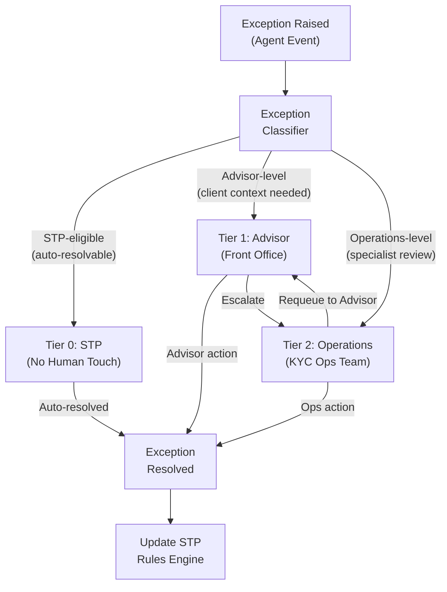
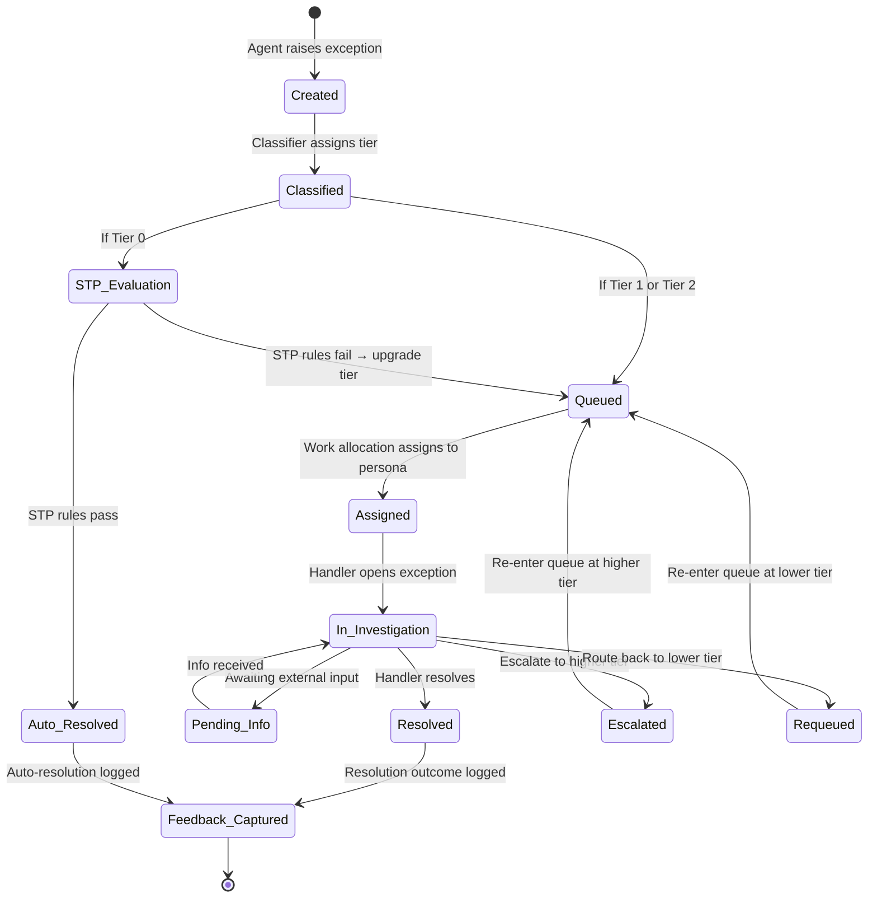
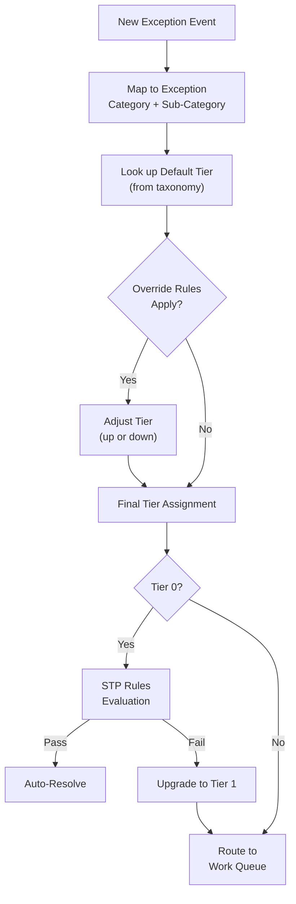
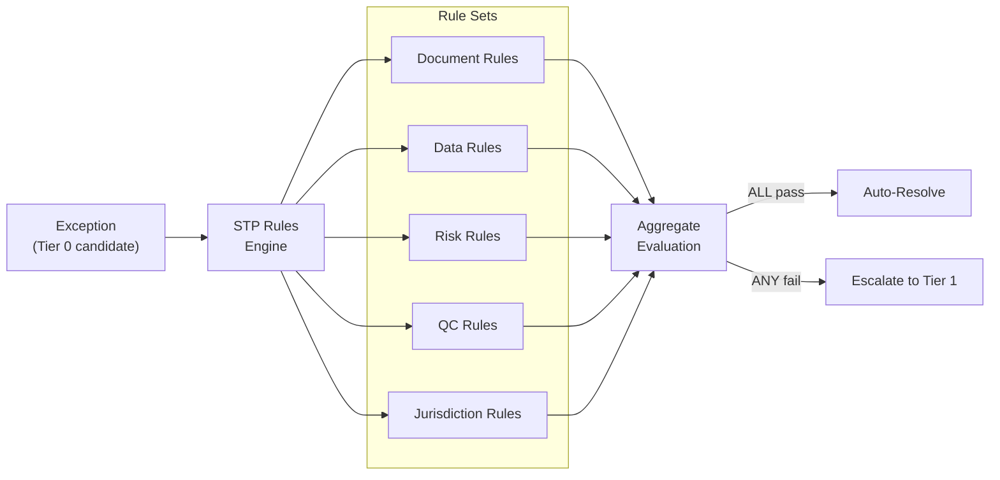
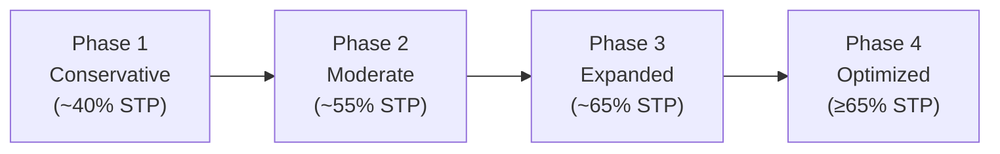
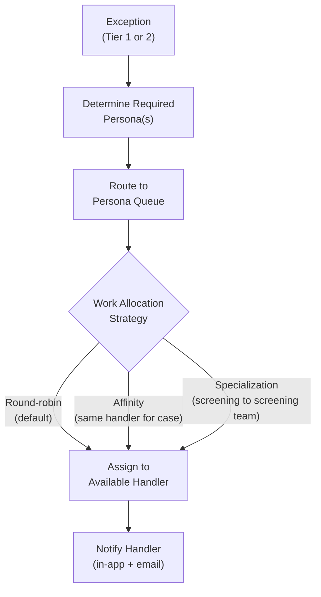

# 10 — Exception Handling Design

> **Document Type:** Exception Framework Design  
> **Version:** 1.0  
> **Date:** March 2026  
> **Status:** Draft  
> **Traceability:** Vision §9, §6.4, §6.5

---

## 1. Purpose & Scope

This document defines the three-tier exception handling model for the North Star KYC Platform. It details how exceptions are created, classified, routed, investigated, and resolved — with the goal of enabling Straight-Through Processing (STP) for low-risk cases while ensuring high-risk exceptions reach the right persona with full context.

---

## 2. Requirements Addressed

| Requirement | Vision Reference |
|---|---|
| Three-tier exception model (STP, Advisor, Operations) | §9 |
| Reduce case touches from 8 to ≤2 | §3 |
| Context-rich views for exception handlers | §9 |
| Persona-based (not title-based) routing | §9 |
| Progressive STP expansion | §9 |
| Requeue mechanisms for operational exceptions | §9 |
| 65% first-time STP rate target | §3 |

---

## 3. Three-Tier Exception Model



### 3.1 Tier Definitions

| Tier | Name | Handler | Description | Example |
|---|---|---|---|---|
| **Tier 0** | STP | System (automated) | Exception resolved without human intervention. Policy Rules Engine determines these are safe to auto-approve. | Document classification confidence ≥0.85; all data fields corroborated; no screening hits |
| **Tier 1** | Advisor | Relationship Manager / Front-office advisor | Exception requires client-facing context. Advisor has relationship knowledge to resolve. | Source of wealth clarification; missing document follow-up; client contact needed |
| **Tier 2** | Operations | KYC Operations specialist | Exception requires regulatory expertise, complex investigation, or cross-system analysis. | Screening match investigation; complex entity structure review; regulatory judgment call |

---

## 4. Exception Lifecycle



---

## 5. Exception Classification

### 5.1 Exception Taxonomy

| Category | Sub-Category | Default Tier | Example |
|---|---|---|---|
| **Document** | Missing required document | Tier 1 | Passport not uploaded for US individual |
| **Document** | Classification below threshold | Tier 2 | Document type ambiguous (confidence < 0.60) |
| **Document** | Extraction confidence low | Tier 2 | OCR quality insufficient for key fields |
| **Document** | Document expired | Tier 1 | ID document past expiry date |
| **Data** | Field value missing | Tier 0 or Tier 1 | Employer name missing (auto-fill from CRM → Tier 0) |
| **Data** | Cross-field inconsistency | Tier 2 | Nationality vs. tax residency mismatch |
| **Data** | Source conflict | Tier 2 | Two sources disagree on beneficial owner |
| **Screening** | Potential match (individual) | Tier 2 | Name match on sanctions list |
| **Screening** | Potential match (entity) | Tier 2 | Entity name match on PEP list |
| **Screening** | Negative media | Tier 2 | Adverse media flagged |
| **Risk** | Risk score above threshold | Tier 2 | Computed risk exceeds LOB tolerance |
| **Risk** | Materiality event (continuous KYC) | Tier 1 or Tier 2 | Significant change in client profile |
| **Compliance** | Jurisdiction-specific requirement | Tier 2 | Swiss-specific CDB obligation not met |
| **QC** | STP eligibility failed | Tier 1 | QC rules failed on otherwise clean case |

### 5.2 Classification Logic



**Override Rules** adjust the default tier based on context:

| Condition | Override | Rationale |
|---|---|---|
| Client is PEP | Tier always ≥ 2 | Regulatory requirement |
| Client risk rating = HIGH | Tier always ≥ 2 | Enhanced due diligence |
| Exception on shared client (multi-LOB) | Tier always ≥ 2 | Cross-LOB coordination needed |
| Missing field has single authoritative source | Downgrade to Tier 0 | System can auto-populate |
| Exception type has >90% auto-resolve history | Downgrade to Tier 0 | Graduated STP expansion |

---

## 6. STP Rules Engine

### 6.1 Architecture

The STP Rules Engine is a **deterministic policy engine** (not AI-based) that evaluates whether an exception can be auto-resolved:



### 6.2 STP Rule Examples

| Rule ID | Category | Rule | Pass Condition |
|---|---|---|---|
| STP-DOC-001 | Document | All required documents present and classified | Classification confidence ≥ 0.85 for all docs |
| STP-DOC-002 | Document | No expired documents | All doc expiry dates > today + 30 days |
| STP-DATA-001 | Data | All mandatory fields populated | 100% completeness for mandatory field set |
| STP-DATA-002 | Data | No cross-field inconsistencies | QC cross-field rules all pass |
| STP-DATA-003 | Data | All data points above confidence threshold | All field confidence scores ≥ 0.80 |
| STP-RISK-001 | Risk | Risk score within STP band | Risk score ≤ LOB-specific STP threshold |
| STP-RISK-002 | Risk | No screening hits | Zero unresolved screening matches |
| STP-QC-001 | QC | Full QC evaluation passed | All 7 QC categories pass (see doc 05) |
| STP-JURIS-001 | Jurisdiction | Jurisdiction-specific requirements met | All jurisdiction rules pass |

### 6.3 Progressive STP Expansion

STP rules evolve over time through a governed expansion process:



| Phase | STP Expansion | Governance |
|---|---|---|
| **Phase 1** | Individual US only; basic document + data rules | GFCC manual review of every STP decision for first 90 days |
| **Phase 2** | Add entity types; expand data confidence thresholds | Statistical sampling review (20% of STP decisions) |
| **Phase 3** | Add international jurisdictions; lower thresholds where data supports | Monthly STP accuracy reporting; exception-based review |
| **Phase 4** | Feedback-driven threshold optimization | Continuous monitoring; automated alerts on STP accuracy drops |

---

## 7. Persona-Based Routing

### 7.1 Routing Model

Exception routing is **persona-based**, not title-based. A persona represents a set of capabilities and permissions:

| Persona | Capabilities | Typical Role(s) |
|---|---|---|
| **Client Advisor** | Client relationship context; can request information from client | RM, Advisor, FA |
| **KYC Analyst** | KYC domain expertise; regulatory knowledge | KYC Ops Analyst |
| **Senior KYC Reviewer** | Complex investigation; final approval authority | Senior Analyst, Team Lead |
| **Screening Specialist** | Sanctions/PEP expertise; screening tool access | Screening Team Member |
| **Compliance Officer** | Regulatory judgment; policy exception authority | Compliance / GFCC |

### 7.2 Work Allocation



### 7.3 SLA Targets

| Tier | Initial Response | Resolution Target | Escalation Trigger |
|---|---|---|---|
| Tier 0 (STP) | Immediate | Immediate (auto) | N/A |
| Tier 1 (Advisor) | ≤ 4 hours | ≤ 2 business days | Auto-escalate to Tier 2 after 3 business days |
| Tier 2 (Operations) | ≤ 2 hours | ≤ 5 business days | Alert to team lead after 5 business days |
| Tier 2 (Screening) | ≤ 2 hours | ≤ 3 business days | Alert to compliance after 4 business days |

---

## 8. Context-Rich Exception Views

### 8.1 Exception View Schema

Each exception presented to a handler includes full context to enable resolution without switching between systems:

```json
{
  "exception_id": "exc-uuid",
  "case_id": "case-uuid",
  "party_id": "party-uuid",
  "tier": "TIER_1 | TIER_2",
  "category": "DOCUMENT | DATA | SCREENING | RISK | COMPLIANCE | QC",
  "sub_category": "MISSING_DOCUMENT | CROSS_FIELD_MISMATCH | ...",
  "severity": "CRITICAL | HIGH | MEDIUM | LOW",
  "created_at": "ISO-8601",
  "sla_deadline": "ISO-8601",
  
  "context": {
    "party_summary": {
      "name": "...",
      "type": "INDIVIDUAL | ENTITY",
      "risk_rating": "LOW | MEDIUM | HIGH",
      "jurisdiction": "US | CH | SG | HK",
      "lob": "USB | IPB | GPM"
    },
    "exception_details": {
      "field_name": "beneficial_owner_2.ownership_percentage",
      "expected": "value between 0-100",
      "actual": null,
      "source": "Data Acquisition Agent",
      "agent_reasoning": "Field not found in CRM; SEC filing shows entity but no percentage disclosed."
    },
    "related_data": {
      "documents": ["doc-uuid-1", "doc-uuid-2"],
      "screening_results": [],
      "data_lineage": [
        {
          "field": "beneficial_owner_2.name",
          "source": "SEC EDGAR",
          "confidence": 0.91,
          "collected_at": "ISO-8601"
        }
      ]
    },
    "ai_suggestion": {
      "suggested_action": "Request ownership percentage from client advisor",
      "confidence": 0.78,
      "reasoning": "SEC filing confirms beneficial owner exists but does not disclose exact percentage. Client-provided documentation is the most reliable source."
    },
    "case_history": {
      "total_exceptions": 3,
      "resolved_exceptions": 1,
      "case_status": "IN_REVIEW",
      "case_age_days": 2
    }
  }
}
```

### 8.2 View by Tier

| View Element | Tier 1 (Advisor) | Tier 2 (Operations) |
|---|---|---|
| Party summary | ✅ Full | ✅ Full |
| Exception details | ✅ Simplified | ✅ Full technical detail |
| AI suggestion | ✅ Action-oriented | ✅ With reasoning chain |
| Data lineage | ❌ Hidden | ✅ Full lineage |
| Agent processing log | ❌ Hidden | ✅ Available |
| Related screening hits | Summary only | ✅ Full detail |
| Resolution options | Accept / Reject / Escalate | Accept / Reject / Override / Requeue |

---

## 9. Exception Resolution Actions

| Action | Available At | Description |
|---|---|---|
| **Accept AI Suggestion** | Tier 1, Tier 2 | Approve the AI-recommended resolution |
| **Provide Information** | Tier 1 | Upload document, fill missing data |
| **Override Value** | Tier 2 only | Manually set a field value (with justification) |
| **Dismiss Exception** | Tier 2 only | Close as false positive (with reasoning) |
| **Escalate** | Tier 1 → Tier 2 | Route to operations for specialist review |
| **Requeue** | Tier 2 → Tier 1 | Send back to advisor with instructions |
| **Request Compliance Review** | Tier 2 | Escalate to compliance officer |

---

## 10. Exception Events

| Event | Published When | Key Payload |
|---|---|---|
| `exception.created` | New exception raised | Exception type, tier, case_id, party_id |
| `exception.classified` | Tier assigned | Final tier, override rules applied |
| `exception.stp.evaluated` | STP rules evaluated | Pass/fail, rules evaluated, result |
| `exception.assigned` | Work allocation assigns handler | Handler persona, handler_id |
| `exception.escalated` | Exception moved to higher tier | From tier, to tier, reason |
| `exception.requeued` | Exception moved to lower tier | From tier, to tier, instructions |
| `exception.resolved` | Exception resolved | Resolution type, resolution time, handler |
| `exception.sla.breached` | SLA deadline exceeded | Exception_id, tier, hours overdue |

---

## 11. Exception Metrics Dashboard

| Metric | Target | Aggregation |
|---|---|---|
| STP rate (Tier 0 auto-resolved / total) | ≥ 65% | Per LOB, jurisdiction, client type |
| Average resolution time (Tier 1) | ≤ 2 business days | Per exception category |
| Average resolution time (Tier 2) | ≤ 5 business days | Per exception category |
| Escalation rate (Tier 1 → Tier 2) | ≤ 15% | Per LOB |
| Requeue rate (Tier 2 → Tier 1) | ≤ 10% | Per exception category |
| SLA breach rate | ≤ 5% | Per tier |
| AI suggestion acceptance rate | Tracked (no target) | Per exception category |
| False positive rate (dismissed exceptions) | Tracked | Per exception category |

---

## 12. Assumptions & Constraints

### Assumptions
1. STP rules are defined and maintained by the Policy Rules Engine (deterministic, not AI)
2. Persona-to-role mapping is maintained in the platform's identity management system
3. Work allocation logic will be configurable per LOB
4. AI suggestions are advisory; all Tier 1 and Tier 2 resolutions require explicit human action

### Constraints
1. **No AI auto-resolution beyond Tier 0** — STP is the only tier where system resolves without human touch
2. **STP accuracy monitoring** — false auto-approve rate must remain < 1%; automatic STP suspension if exceeded
3. **Escalation always available** — handlers can always escalate; system never blocks escalation
4. **Full audit trail** — every exception action (create, assign, resolve, escalate, override) is logged immutably
5. **No cross-tier skip** — Tier 1 cannot directly route to Compliance; must escalate through Tier 2

---

## 13. Open Items

| # | Item | Impact | Owner |
|---|---|---|---|
| 1 | Define initial STP rule set for USB Phase 1 | Determines launch STP rate | Product / Compliance |
| 2 | Confirm persona definitions with HR / Operations | Work allocation routing | Operations Lead |
| 3 | Define SLA targets per LOB (currently platform-wide) | LOB-specific SLAs | Product |
| 4 | Determine exception view UX for advisor-facing vs. ops-facing | Frontend design | UX / Technology |
| 5 | Confirm STP accuracy monitoring thresholds with GFCC | STP suspension trigger | Compliance / GFCC |
| 6 | Define requeue instruction template for Tier 2 → Tier 1 | Handler experience | Operations / UX |

---

*This document will be refined as STP rules are defined in collaboration with Compliance and the Policy Rules Engine team.*
