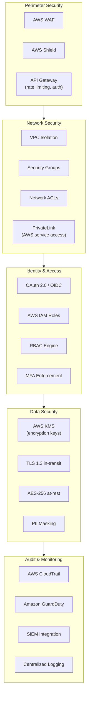
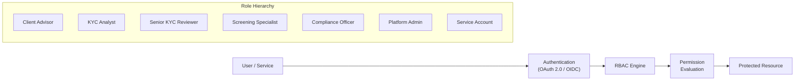
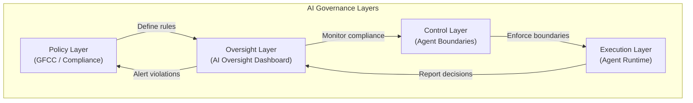
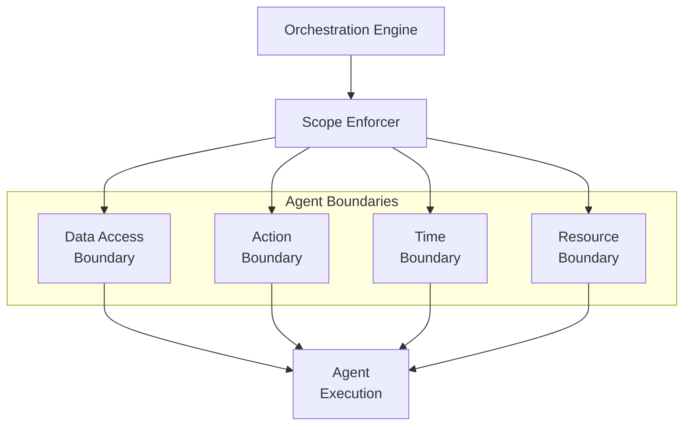
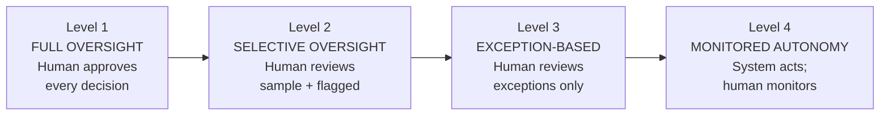
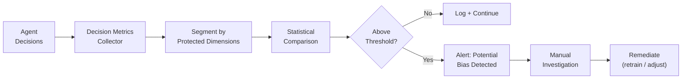
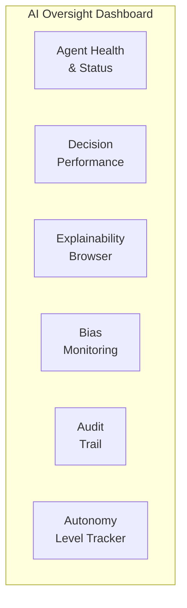
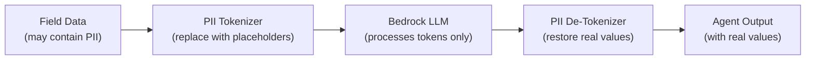

# 11 — Security, Governance & AI Controls

> **Document Type:** Security & Governance Design  
> **Version:** 1.0  
> **Date:** March 2026  
> **Status:** Draft  
> **Traceability:** Vision §11, §16, §17, §18

---

## 1. Purpose & Scope

This document defines the security architecture, AI governance framework, human-in-the-loop (HITL) controls, explainability requirements, and compliance safeguards for the North Star KYC Platform. It establishes how AI agents operate within controlled boundaries, how decisions are explained and audited, and how the platform earns progressive autonomy.

---

## 2. Requirements Addressed

| Requirement | Vision Reference |
|---|---|
| Human-in-the-Loop (HITL) progressive autonomy | §11 |
| Explainability for every AI-assisted decision | §11 |
| AI Oversight Dashboard | §16 |
| Bias detection and mitigation | §11 |
| Agent scope enforcement | §11 |
| Data governance and classification | §17, §18 |
| Regulatory evidence building for AI trust | §11 |
| Security posture (encryption, access control, audit logging) | §17 |

---

## 3. Security Architecture

### 3.1 Security Layers



### 3.2 Data Encryption

| Layer | Mechanism | Key Management |
|---|---|---|
| **At Rest** — Aurora PostgreSQL | AES-256 (RDS encryption) | AWS KMS with customer-managed CMK |
| **At Rest** — DynamoDB | AES-256 (DynamoDB encryption) | AWS KMS CMK |
| **At Rest** — S3 (documents) | AES-256 (SSE-S3 or SSE-KMS) | AWS KMS CMK |
| **At Rest** — Neptune | AES-256 (Neptune encryption) | AWS KMS CMK |
| **At Rest** — ElastiCache Redis | AES-256 (Redis encryption) | AWS KMS CMK |
| **In Transit** | TLS 1.3 (all API calls, service mesh) | Certificate Manager (ACM) |
| **PII Fields** | Application-level field encryption | Dedicated PII KMS key with restricted access |

### 3.3 Access Control Model



| Role | Cases | Documents | Exceptions | AI Config | Admin |
|---|---|---|---|---|---|
| Client Advisor | Read (own clients) | Upload | Resolve Tier 1 | — | — |
| KYC Analyst | Read/Write | Read/Write | Resolve Tier 2 | — | — |
| Senior KYC Reviewer | Full | Full | All + Override | — | — |
| Screening Specialist | Read (screening) | — | Screening only | — | — |
| Compliance Officer | Full (read) | Full (read) | Approve overrides | View | — |
| Platform Admin | — | — | — | Configure | Full |
| Service Account (Agent) | Agent-scoped | Agent-scoped | Create only | — | — |

### 3.4 Secrets Management

| Secret Type | Storage | Rotation |
|---|---|---|
| Database credentials | AWS Secrets Manager | Auto-rotate every 90 days |
| API keys (third-party) | AWS Secrets Manager | Per provider schedule |
| KMS keys | AWS KMS | Annual rotation with automatic re-wrap |
| Service tokens | IAM roles (no long-lived tokens) | Session-based (STS) |
| OAuth client secrets | AWS Secrets Manager | Annual rotation |

---

## 4. AI Governance Framework

### 4.1 Governance Model



### 4.2 Core Governance Principles

| Principle | Implementation |
|---|---|
| **Transparency** | Every AI decision includes an explainability artifact |
| **Accountability** | Every agent action is attributed and logged |
| **Fairness** | Bias detection runs continuously on agent outputs |
| **Controllability** | Agents operate within enforced scope boundaries |
| **Auditability** | Full decision lineage from input to output |
| **Progressive trust** | Autonomy expands only with demonstrated accuracy |

---

## 5. Agent Scope Enforcement

### 5.1 Scope Boundary Architecture

Each AI agent operates within a strictly defined scope. The Orchestration Engine enforces these boundaries:



### 5.2 Scope Definition per Agent

| Agent | Data Access | Permitted Actions | Time Limit | Resource Limit |
|---|---|---|---|---|
| **Document Intelligence** | Documents for assigned case only | Classify, extract, validate | 5 min per document | 2 vCPU, 4 GB RAM |
| **Data Acquisition** | Case party IDs + approved sources | Query sources, score confidence, build graph | 10 min per party | 4 vCPU, 8 GB RAM |
| **Quality Check** | Case data + rules engine | Evaluate rules, compute QC score | 2 min per evaluation | 2 vCPU, 4 GB RAM |
| **Continuous KYC** | Assigned portfolio events | Score materiality, trigger reviews | 1 min per event | 2 vCPU, 4 GB RAM |
| **Audit Intelligence** | Read-only across cases in scope | Query, assemble reports | 15 min per report | 4 vCPU, 8 GB RAM |

### 5.3 Scope Violation Handling

| Violation | Detection | Response |
|---|---|---|
| Data access outside scope | IAM policy deny + application-level check | Block request; log violation; alert |
| Unauthorized action | Orchestration Engine action whitelist | Reject action; log violation; alert |
| Time limit exceeded | Step Functions timeout | Terminate agent task; raise exception |
| Resource limit exceeded | ECS task resource limits | Terminate container; raise exception |
| Unexpected LLM output | Output guardrails (Bedrock Guardrails) | Reject output; retry with constraints; escalate |

---

## 6. Human-in-the-Loop (HITL) Progressive Autonomy

### 6.1 Autonomy Levels



### 6.2 Autonomy Level per Agent per Phase

| Agent | Phase 1 | Phase 2 | Phase 3 | Phase 4 |
|---|---|---|---|---|
| Document Intelligence | Level 1 | Level 2 | Level 3 | Level 3 |
| Data Acquisition | Level 1 | Level 2 | Level 3 | Level 3 |
| Quality Check | Level 2 | Level 3 | Level 3 | Level 4 |
| Continuous KYC | — | Level 1 | Level 2 | Level 3 |
| Audit Intelligence | — | — | Level 1 | Level 2 |
| STP Engine (Tier 0) | Level 2 | Level 3 | Level 4 | Level 4 |

### 6.3 Promotion Criteria

An agent's autonomy level is promoted when it meets all of the following:

| Criterion | Threshold | Measurement Period |
|---|---|---|
| Decision accuracy | ≥ 95% agreement with human reviewers | Rolling 90 days |
| False positive rate | ≤ 2% | Rolling 90 days |
| False negative rate | ≤ 1% (for risk-related decisions) | Rolling 90 days |
| Volume processed | ≥ 500 decisions | Cumulative |
| Zero critical errors | 0 critical-severity errors | Rolling 30 days |
| GFCC approval | Explicit sign-off | Per promotion event |

### 6.4 Demotion Triggers

| Trigger | Action |
|---|---|
| Accuracy drops below 90% for 7 consecutive days | Auto-demote one level; alert GFCC |
| Any critical-severity error | Immediate freeze; manual review required |
| Bias detected above threshold | Freeze agent; investigation required |
| Regulatory directive | Immediate compliance; adjust autonomy as directed |

---

## 7. Explainability Framework

### 7.1 Explainability Artifact Structure

Every agent decision produces an explainability artifact:

```json
{
  "decision_id": "dec-uuid",
  "agent": "DATA_ACQUISITION",
  "timestamp": "ISO-8601",
  "decision_type": "CONFIDENCE_SCORE",
  "input_summary": {
    "party_id": "party-uuid",
    "field": "beneficial_owner.name",
    "sources_consulted": ["CRM", "SEC_EDGAR", "PUBLIC_REGISTRY"]
  },
  "output": {
    "value": "John Smith",
    "confidence": 0.92,
    "selected_source": "SEC_EDGAR"
  },
  "reasoning": {
    "steps": [
      "Queried CRM: found 'J. Smith' (confidence 0.70, last updated 2024-01-15)",
      "Queried SEC EDGAR: found 'John Smith' as beneficial owner in latest 10-K filing (confidence 0.92)",
      "Queried Public Registry: no match found",
      "Selected SEC EDGAR value: highest confidence, authoritative source, recent filing"
    ],
    "factors": {
      "source_tier": "Tier 1 (regulatory filing)",
      "freshness": "Filed 2025-11-30 (4 months ago)",
      "corroboration": "Partial match with CRM (initial matches)"
    }
  },
  "alternative_outcomes": [
    {
      "value": "J. Smith",
      "source": "CRM",
      "confidence": 0.70,
      "why_not_selected": "Lower confidence; abbreviated name format"
    }
  ],
  "human_override_permitted": true
}
```

### 7.2 Explainability Level by Decision Type

| Decision Type | Explainability Level | Content |
|---|---|---|
| Document classification | Standard | Input features, confidence breakdown, top-3 classes |
| Data field confidence scoring | Detailed | Source-by-source comparison, selection rationale |
| Risk score computation | Detailed + regulatory | Factor weights, score components, regulatory basis |
| STP eligibility | Full audit | Every rule evaluated, pass/fail per rule, aggregate logic |
| Materiality assessment (cKYC) | Detailed + regulatory | Event context, threshold applied, historical comparison |
| Screening match evaluation | Full audit | Match details, scoring methodology, disposition rationale |

---

## 8. Bias Detection Framework

### 8.1 Monitoring Dimensions

| Dimension | What Is Monitored | Alert Threshold |
|---|---|---|
| **Nationality** | STP rate, exception rate, risk scores by nationality | >15% variance from population mean |
| **Jurisdiction** | Processing time, resolution time by jurisdiction | >20% variance from expected SLA |
| **Client type** | Individual vs. entity STP rates, risk distribution | >10% unexplained variance |
| **LOB** | Cross-LOB outcome consistency for similar profiles | >15% variance |
| **Agent confidence** | Confidence score distribution by demographic group | Skewness > 0.5 |

### 8.2 Bias Detection Pipeline



### 8.3 Remediation Actions

| Finding | Remediation |
|---|---|
| Training data imbalance | Rebalance training set; retrain model |
| Prompt bias in LLM calls | Revise prompt templates; add debiasing instructions |
| Source data bias | Flag source; adjust confidence weighting |
| Rule-based disparity | Review and adjust deterministic rules |

---

## 9. AI Oversight Dashboard

### 9.1 Dashboard Purpose

The AI Oversight Dashboard (Vision §16) provides real-time visibility into AI agent operations for compliance officers, operations leaders, and platform administrators.

### 9.2 Dashboard Sections



| Section | Key Metrics | Audience |
|---|---|---|
| **Agent Health** | Status (active/paused/error), throughput, latency, error rates | Platform Admin |
| **Decision Performance** | Accuracy, human agreement rate, confidence distributions | Operations / Compliance |
| **Explainability Browser** | Search/filter decisions; view reasoning artifacts | Compliance / Audit |
| **Bias Monitoring** | Variance metrics by dimension, trend charts, alerts | Compliance |
| **Audit Trail** | Chronological log of all agent actions and human overrides | Audit / Compliance |
| **Autonomy Level Tracker** | Current autonomy level per agent; promotion/demotion history | GFCC / Compliance |

### 9.3 Alert Configuration

| Alert Type | Trigger | Severity | Notification |
|---|---|---|---|
| Agent error rate spike | Error rate > 5% for 15 minutes | HIGH | Dashboard + email + PagerDuty |
| Accuracy degradation | Accuracy < 92% over 24 hours | HIGH | Dashboard + email |
| Bias threshold exceeded | Variance > threshold for any dimension | CRITICAL | Dashboard + email + GFCC notification |
| STP false approval | Post-review finds auto-approved case with issues | CRITICAL | Dashboard + email + immediate freeze evaluation |
| Scope violation | Agent access denied or action blocked | HIGH | Dashboard + security team |
| Autonomy demotion | Agent demoted to lower autonomy level | MEDIUM | Dashboard + operations lead |

---

## 10. Regulatory Evidence Building

### 10.1 Evidence Package Structure

For each regulatory interaction (audit, examination, inquiry), the platform can produce:

| Evidence Type | Source | Content |
|---|---|---|
| **Decision Lineage** | Explainability artifacts | Full chain: input → agent processing → decision → outcome |
| **Accuracy Reports** | Performance metrics | Statistical accuracy over configurable periods |
| **Bias Reports** | Bias monitoring pipeline | Demographic fairness analysis |
| **Human Override Log** | Exception handling | Every instance where human overrode AI recommendation |
| **Model Inventory** | AI configuration | Models used, versions, training data descriptions |
| **Policy Compliance** | STP Rules Engine | Rules in effect, how they map to regulatory requirements |

### 10.2 Regulatory Readiness Milestones

| Milestone | Phase | Evidence Deliverable |
|---|---|---|
| AI Framework approval | Phase 1 | Governance framework document + scope definitions |
| First production data | Phase 1 | Accuracy baseline report (90-day lookback) |
| STP launch | Phase 1 | STP rules inventory + 90-day monitoring report |
| Continuous KYC launch | Phase 2 | Materiality framework + threshold justification |
| Autonomy promotion events | Phase 2–4 | Promotion package (accuracy, volume, sign-off) |
| External audit readiness | Phase 3 | Full evidence package (all of the above) |

---

## 11. Data Governance

### 11.1 Data Classification

| Classification | Description | Examples | Controls |
|---|---|---|---|
| **Restricted** | Highly sensitive PII; regulatory exposure | SSN, passport number, biometric data | Field-level encryption, masking, access logging |
| **Confidential** | Sensitive business/PII data | Name, DOB, address, AML risk score | Encryption at rest/transit, RBAC |
| **Internal** | Internal operational data | Case status, workflow state, agent config | RBAC, encryption at rest |
| **Public** | Non-sensitive | Jurisdiction codes, document type labels | Standard controls |

### 11.2 PII Handling

| Control | Implementation |
|---|---|
| **Field-level encryption** | Restricted fields encrypted with dedicated KMS key |
| **Masking in logs** | PII fields masked (e.g., `***-**-1234`) in all log output |
| **Masking in LLM prompts** | PII replaced with tokens before sending to Bedrock; re-hydrated after response |
| **Data minimization in AI** | Agents receive only the fields needed for their scope |
| **Right to deletion support** | Data products layer supports field-level purge |

### 11.3 PII in LLM Prompts — Guardrail



---

## 12. Security Monitoring & Incident Response

### 12.1 Monitoring Stack

| Component | Tool | Purpose |
|---|---|---|
| Infrastructure monitoring | Amazon CloudWatch | Metrics, alarms, dashboards |
| Security threat detection | Amazon GuardDuty | Anomaly detection, threat intelligence |
| API audit trail | AWS CloudTrail | All API calls logged |
| Application logging | Centralized logging (CloudWatch Logs) | Agent activity, decision logs |
| SIEM integration | Export to enterprise SIEM | Cross-platform correlation |

### 12.2 Security Incident Severity

| Severity | Description | Response Time | Escalation |
|---|---|---|---|
| **P1 — Critical** | Data breach, unauthorized access to PII | 15 minutes | CISO + Legal + GFCC |
| **P2 — High** | Scope violation, agent producing anomalous outputs | 1 hour | Platform lead + Security |
| **P3 — Medium** | Authentication failure spike, rate limit breach | 4 hours | Security team |
| **P4 — Low** | Minor configuration issue, non-sensitive log anomaly | Next business day | Platform team |

---

## 13. Compliance Alignment

| Regulatory Requirement | Platform Implementation |
|---|---|
| **KYC/AML regulations** | Full audit trail, explainability, human oversight |
| **Data privacy (GDPR, etc.)** | PII classification, encryption, masking, right to deletion |
| **AI regulatory frameworks** | Bias detection, explainability, progressive autonomy, human-in-the-loop |
| **SOX (internal controls)** | Immutable audit log, separation of duties, access control |
| **GFCC internal standards** | STP rules governed by GFCC; autonomy promotion requires GFCC sign-off |

---

## 14. Assumptions & Constraints

### Assumptions
1. GFCC will define acceptable accuracy, bias, and STP thresholds
2. Enterprise IAM / OIDC provider is available for authentication federation
3. AWS KMS customer-managed keys are provisioned per environment
4. Bedrock Guardrails API supports PII detection and filtering
5. Enterprise SIEM accepts CloudWatch Logs export

### Constraints
1. **No PII in LLM prompts** — PII must be tokenized before any LLM interaction
2. **No agent self-modification** — agents cannot modify their own scope, rules, or configuration
3. **GFCC approval gate** — autonomy promotions require explicit GFCC sign-off
4. **No model training on client data** — platform uses pre-trained models; no fine-tuning on client PII
5. **30-day key rotation for PII encryption** — aligns with enterprise key management policy

---

## 15. Open Items

| # | Item | Impact | Owner |
|---|---|---|---|
| 1 | Define GFCC accuracy thresholds per agent | Autonomy promotion criteria | GFCC / Compliance |
| 2 | Confirm enterprise OIDC/SAML provider for authentication | IAM integration | Identity Team |
| 3 | Define bias monitoring dimensions and thresholds with GFCC | Bias detection framework | Compliance / Data Science |
| 4 | Confirm PII tokenization approach for Bedrock (Guardrails vs. custom) | LLM security | Technology / AWS |
| 5 | Define AI Oversight Dashboard MVP scope for Phase 1 | Dashboard delivery | Product / UX |
| 6 | Confirm data retention periods per classification tier | Retention policy | Legal / Compliance |
| 7 | Define incident response runbook for AI-specific incidents | Incident handling | Security / Platform |

---

*This document will be refined as GFCC defines AI governance thresholds and enterprise security standards are finalized.*
