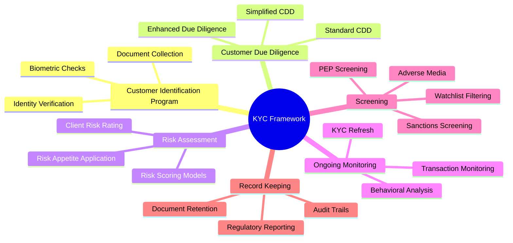

# 01 — KYC Fundamentals

> **Context Setting:** What KYC is, why it exists, what it's trying to prevent, and how Private Banking KYC differs from other segments.

---

## 1.1 What Is KYC?

**Know Your Customer (KYC)** is a set of regulated processes that financial institutions must perform to:

1. **Verify** the identity of their clients
2. **Understand** the nature and purpose of the client relationship
3. **Assess** the risk of financial crime (money laundering, terrorist financing, fraud, sanctions evasion, tax evasion)
4. **Monitor** the relationship on an ongoing basis for suspicious activity

KYC is not a one-time event at account opening — it is a **continuous, lifecycle-spanning obligation** that evolves with the client's risk profile and circumstances.

The term KYC is often used interchangeably with **Customer Due Diligence (CDD)**, though technically CDD is a specific component of the broader KYC framework.

---

## 1.2 Why Does KYC Exist? — The Policy Objectives

### 1.2.1 Anti-Money Laundering (AML)
Money laundering is the process of making illegally obtained funds appear legitimate. The classic three-stage model:

```
┌──────────────┐    ┌───────────────┐    ┌──────────────────┐
│  PLACEMENT   │───▶│  LAYERING     │───▶│  INTEGRATION     │
│              │    │               │    │                  │
│ Dirty money  │    │ Complex       │    │ Clean money      │
│ enters the   │    │ transactions  │    │ re-enters        │
│ financial    │    │ obscure the   │    │ economy as       │
│ system       │    │ money trail   │    │ legitimate       │
└──────────────┘    └───────────────┘    └──────────────────┘
```

KYC controls aim to detect and prevent all three stages. Private Banking clients — particularly those using complex offshore structures — present heightened risk for layering and integration.

### 1.2.2 Counter-Terrorist Financing (CTF)
Unlike money laundering (which moves large sums to legitimate uses), terrorist financing may involve **small amounts from legitimate sources** diverted to illegal purposes. KYC must therefore screen for:
- PEP connections and affiliations
- Sanctioned individuals and organisations
- Patterns of small, atypical transactions
- Jurisdictional exposure to high-risk / conflict regions

### 1.2.3 Fraud Prevention
KYC processes verify that the individual claiming to be the account holder actually is that person (identity fraud, impersonation, synthetic identity fraud).

### 1.2.4 Tax Compliance
Through **FATCA** (US) and **CRS** (OECD) frameworks, KYC processes now carry obligations to identify tax residency and reportable accounts. This is especially critical in Private Banking where clients often hold assets across multiple jurisdictions.

### 1.2.5 Sanctions Compliance
Financial institutions must ensure they do not facilitate transactions with or for:
- OFAC-designated Specially Designated Nationals (SDN list)
- EU Consolidated Sanctions List
- UN Security Council Sanctions
- National HM Treasury / SECO / other lists

---

## 1.3 Legal & Regulatory Basis for KYC

KYC obligations derive from multiple layers of law and guidance:

| Layer | Instrument | Scope |
|-------|-----------|-------|
| **Supranational** | FATF 40 Recommendations | Global AML/CTF standards adopted by 200+ jurisdictions |
| **EU** | AMLD4, AMLD5, AMLD6 | AML Directives binding on EU member states |
| **US** | Bank Secrecy Act (BSA), Patriot Act, FinCEN CDD Rule | US-based and US-dollar correspondent obligations |
| **UK** | Money Laundering Regulations 2017 (as amended), FCA SYSC | Post-Brexit UK regime mirroring EU standards |
| **APAC** | MAS Notice 626 (Singapore), HKMA AML Guidelines | Regional guidelines with granular private banking provisions |

---

## 1.4 KYC Across Banking Segments — Comparative Analysis

Understanding Private Banking KYC requires understanding how it differs fundamentally from other segments.

### Comparison Table

| Dimension | Retail Banking | Corporate / Commercial Banking | Private Banking / Wealth |
|-----------|---------------|-------------------------------|--------------------------|
| **Client Type** | Mass market, individuals | SMEs, large corporates | HNW / UHNW individuals, family offices |
| **Avg. AUM** | <$100K | Variable (loan-focused) | $1M – $50M+ per client |
| **ID Verification** | Passport + utility bill | CRC, Articles of Incorporation | Same + extensive beneficial ownership |
| **Structure Complexity** | Simple: 1 individual | Medium: corporate hierarchy | High: trusts, foundations, offshore SPVs |
| **Source of Wealth** | Salary, basic assets | Business income, declared | Complex: inheritance, business sale, property, investmentsRequires detailed narrative + documentary evidence |
| **PEP Exposure** | Rare | Occasional (directors) | Frequent — UHNW clients often have political/ government ties or family connections |
| **Screening Depth** | Name screening only | Name + UBO | Name + UBO + SoW + SoF + Adverse Media |
| **EDD Requirement** | Exceptional | For high-risk corporates | Routine for many clients |
| **Ongoing Monitoring** | Transaction rules-based | TM + event triggers | TM + behavioral + relationship manager alerts |
| **Relationship Model** | Transactional | Relationship + transactional | Highly personal, RM-led |
| **Regulatory Scrutiny** | Standard | Elevated for large exposures | High — targeted in most regulatory examinations |
| **Data Volume** | Low | Medium | High — multi-document, multi-jurisdiction |
| **Refresh Frequency** | 2–5 years | 1–3 years | 1–2 years (high risk: annual) |

### Key Insight: The Private Banking Paradox
Private Banking creates a tension between:
- **Client experience:** UHNW clients expect speed, discretion, and minimal bureaucratic friction
- **Compliance rigour:** Their wealth complexity demands the most intensive KYC scrutiny

This tension defines the operational and technology challenge in Private Banking KYC.

---

## 1.5 The KYC Framework — Core Components



---

## 1.6 Key Regulatory Concepts Underpinning KYC

### Risk-Based Approach (RBA)
The FATF RBA principle means institutions must:
- Not apply a "one size fits all" approach
- Allocate compliance resources proportionate to risk
- Have documented risk assessments for clients, products, geographies, and delivery channels

### Customer Acceptance Policy (CAP)
Before KYC even begins, banks must have a documented **Customer Acceptance Policy** defining:
- Who they will and will not accept as clients
- Criteria for requesting EDD
- Categories of Prohibited Customers (e.g., shell banks, certain high-risk companies)
- Thresholds for senior management approval

### Beneficial Ownership Threshold
FATF and most jurisdictions require identifying any individual who owns or controls **25% or more** of an entity. Some jurisdictions (e.g., Germany, UK) apply a **10% threshold** for higher-risk entities. In Private Banking, even **indirect control** (ability to direct decisions) triggers UBO identification obligations.

---

## 1.7 The Cost of Non-Compliance

KYC failures carry severe consequences:

| Penalty Category | Example Case | Fine / Consequence |
|-----------------|-------------|-------------------|
| **Regulatory Fine** | Deutsche Bank (2017, NYDFS) | $425M — mirror trading / AML failures |
| **Regulatory Fine** | Westpac (2020, AUSTRAC) | AUD 1.3B — KYC / TM failures |
| **Regulatory Fine** | HSBC (2012, DOJ) | $1.9B — sanctions and AML |
| **Regulatory Fine** | Goldman Sachs 1MDB (2020) | $2.9B — KYC and AML |
| **Reputational damage** | Client flight, shareholder value loss | Unquantifiable |
| **Business restriction** | Consent orders / Deferred Prosecution | Operational constraint |
| **Criminal charges** | Individual executives | Personal liability |

For Private Banking specifically, regulators increasingly hold **individual Relationship Managers and Compliance Officers personally liable** for failures in their client portfolios.

---

## Summary

KYC in financial services is a **multi-dimensional, risk-based compliance obligation** driven by international standards and enforced by national regulators. While the fundamentals apply across all banking segments, Private Banking introduces unique complexity — in client wealth structures, jurisdictional exposure, and the need to balance rigorous due diligence with premium client experience. The following sections of this reference explore each dimension in depth.

---

> **Next:** [02 — Private Banking Context](./02-private-banking-context.md)
