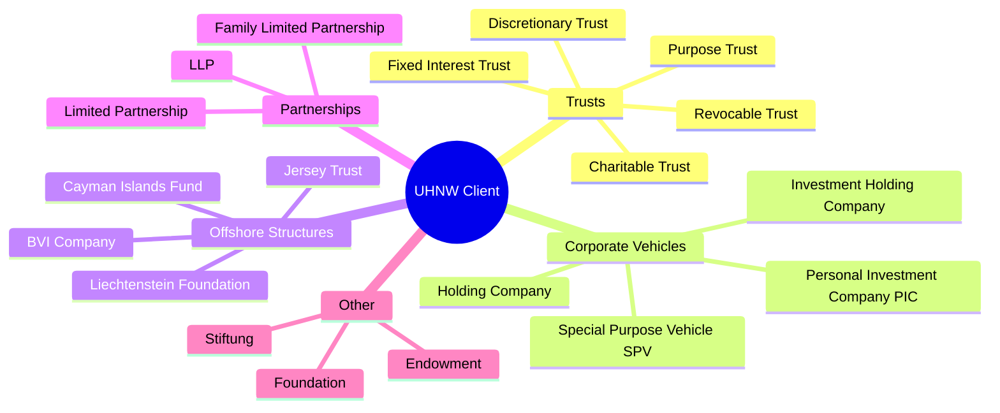

# 02 — Private Banking Context

> **Focus:** The unique nature of Private Banking clients, their wealth structures, and why they demand a different KYC approach.

---

## 2.1 Who Are Private Banking Clients?

Private Banking serves **High Net Worth (HNW)** and **Ultra High Net Worth (UHNW)** individuals. Thresholds vary by institution and jurisdiction, but commonly:

| Segment | AUM Threshold | Typical Profile |
|---------|--------------|-----------------|
| **Affluent** | $250K – $1M | Senior professionals, small business owners |
| **HNW** | $1M – $5M | Business owners, senior executives, inherited wealth |
| **Upper HNW** | $5M – $30M | Large business owners, entrepreneurs, real estate investors |
| **UHNW** | $30M+ | Billionaires, dynastic families, family offices |
| **Family Office** | $100M+ | Multi-generational wealth management structures |

### Source of Wealth Archetypes

```
┌─────────────────────────────────────────────────────────────────┐
│                    UHNW Wealth Sources                          │
├────────────────┬───────────────────────────┬────────────────────┤
│ ENTREPRENEURIAL│ INHERITED / DYNASTIC      │ EXECUTIVE / SALARY │
│                │                           │                    │
│ Business sale  │ Family trust              │ Corporate equity   │
│ IPO proceeds   │ Estate inheritance        │ Stock options      │
│ PE/VC exits    │ Real property dynasties   │ Deferred comp      │
│ Crypto/tech    │ Old money families        │ C-Suite bonuses    │
├────────────────┼───────────────────────────┼────────────────────┤
│ REAL ESTATE    │ POLITICAL / PUBLIC        │ PROFESSIONAL       │
│                │                           │                    │
│ Commercial dev │ Government salaries       │ Legal / medical    │
│ Property sales │ Politically exposed       │ Consulting income  │
│ REIT profits   │ State-owned enterprise    │ Royalties          │
└────────────────┴───────────────────────────┴────────────────────┘
```

---

## 2.2 Regulatory Classification of Private Banking Clients

### 2.2.1 Private Banking as a High-Risk Product Category

Multiple global regulations **explicitly designate Private Banking as high-risk**:

- **FATF Recommendation 22 & 23**: Designate PEP screening and beneficial ownership requirements specifically in the context of private banking
- **AMLD5 (EU)**: Identifies "management of trusts or similar legal arrangements acting as intermediaries..." as inherently elevated risk
- **MAS Notice 626** (Singapore): Devotes a dedicated annex to Private Banking EDD requirements
- **US FinCEN CDD Rule**: Private banking accounts for foreign clients trigger additional suitability and EDD requirements by virtue of account type

### 2.2.2 Why Private Banking Is Inherently Higher Risk

| Risk Factor | Retail Banking | Private Banking |
|------------|----------------|-----------------|
| Wealth complexity | Simple (salary) | Layered (trusts, offshore, SPVs) |
| Geographic footprint | Domestic | Multi-national, tax haven exposure |
| PEP proximity | Rare | Common — clients are often PEPs, or connected to PEPs |
| Transaction opacity | Transparent | Complex wire patterns, nominee accounts |
| Anonymity potential | Low | Higher — trusts and nominees can obscure ownership |
| Products used | Standard | Complex: structured products, private equity, offshore bonds |
| Client leverage | Low | High — relationship and revenue pressure |
| Discretion expectations | Standard | High — clients demand confidentiality |

---

## 2.3 Complex Client Structures in Private Banking

The defining challenge of Private Banking KYC is **entity complexity**. A single UHNW client may hold their wealth through a web of entities across multiple jurisdictions.

### 2.3.1 Common Entity Types



### 2.3.2 Typical UHNW Ownership Structure

```
                          ┌─────────────────────┐
                          │   Individual Client  │
                          │   (Natural Person)   │
                          └──────────┬──────────┘
                                     │ Settlor / Protector
                    ┌────────────────▼───────────────────┐
                    │         FAMILY TRUST                │
                    │         (Jersey / Cayman)           │
                    │    Trustee: ABC Trust Co.           │
                    └──┬──────────────┬──────────────────┘
                       │              │              │
              ┌────────▼──────┐ ┌────▼────────┐ ┌──▼──────────────┐
              │  Holding Co.  │ │ Investment  │ │ Real Estate      │
              │  (BVI)        │ │ Company     │ │ Holding (Cayman) │
              └───────┬───────┘ │ (Guernsey)  │ └──────┬──────────┘
                      │         └─────┬───────┘         │
          ┌───────────┴────────┐      │         ┌───────┴──────────┐
          │                    │      │         │                  │
   ┌──────▼──────┐  ┌──────────▼┐  ┌─▼───────┐ │ Property 1      │
   │ Operating   │  │ Operating  │  │ Listed  │ │ (Dubai)         │
   │ Business A  │  │ Business B │  │ Portfolio│ │                 │
   │ (UK Ltd)    │  │ (Swiss AG) │  │ Accounts │ │ Property 2      │
   └─────────────┘  └───────────┘  └─────────┘ │ (Singapore)     │
                                                 └─────────────────┘
```

**KYC Implication:** To onboard this client, the bank must:
- Identify and verify the **individual** at the top (Natural Person)
- Map the **entire ownership chain** through every intermediate entity
- Identify all **UBOs** (25%+ ownership/control) at each layer
- Verify the **Trust Deed** and understand trustee discretion vs. named beneficiaries
- Conduct **entity-level KYC** for each material intermediate entity
- Screen **all named parties** (trustees, protectors, settlors, beneficiaries) against sanctions/PEP lists

---

## 2.4 Trust Structures — Deep Dive

Trusts are the most common vehicle used by UHNW clients and require specialist KYC treatment.

### Trust Parties and Their KYC Significance

| Party | Role | KYC Obligation |
|-------|------|----------------|
| **Settlor** | Transferred assets into trust; has residual influence | Must be identified and screened; often the original client |
| **Trustee** | Legal owner; manages assets per trust deed | Full entity KYC or individual verification + screening |
| **Beneficiaries** (named) | Named individuals entitled to distributions | Identity verification + screening required |
| **Beneficiaries** (class) | Defined class (e.g., "descendants of settlor") | Class described; named individuals verified upon distribution |
| **Protector** | Has power to hire/fire trustee; oversees trust | Must be identified and screened — exercises effective control |
| **Enforcer** | Enforces terms in purpose trusts | Identified and screened |

### Discretionary vs. Fixed Trusts — KYC Difference

```
DISCRETIONARY TRUST                     FIXED TRUST
────────────────────────────────────    ─────────────────────────────────
Trustee has full discretion on          Beneficiaries have fixed,
who receives distributions              legal entitlements

KYC Focus:                              KYC Focus:
• Identify all potential beneficiaries  • Identify all named beneficiaries
• Risk-rate the class broadly           • Verify each individual's identity
• Trigger re-review at distribution     • Screen all identified persons
• Watch for trustee control patterns    • Calculate UBO % per beneficiary
```

---

## 2.5 Offshore Jurisdictions — Risk Considerations

Private Banking clients frequently use offshore financial centres (OFCs). From a KYC perspective:

### High-Risk Jurisdictions (FATF Grey / Black List — As of 2026)

| Category | Jurisdictions | Risk Action |
|----------|--------------|-------------|
| **FATF High-Risk** (Black) | North Korea, Iran | Prohibited — Enhanced scrutiny minimum |
| **FATF Increased Monitoring** (Grey) | Syria, Yemen, Haiti, Nicaragua, etc. | EDD mandatory; senior approval required |
| **EU High-Risk Third Countries** | Various — updated periodically | EDD required for EU-regulated entities |

### Offshore Structuring — Red Flags vs. Legitimate Use

**Legitimate Reasons for Offshore Structures:**
- Multi-jurisdictional business operations
- Estate planning and succession (dynastic wealth)
- Regulatory arbitrage for investment products
- Currency diversification

**KYC Red Flags:**
- Multiple shell companies without clear business purpose
- Frequent changes in ownership structure
- Use of jurisdictions with weak AML regimes (beyond typical legitimate OFCs)
- Nominee directors / shareholders without traceable beneficial owners
- Complex chains with no apparent economic rationale

---

## 2.6 PEP Proximity in Private Banking

Politically Exposed Persons (PEPs) are disproportionately represented in Private Banking because:
1. Political prominence often correlates with wealth
2. Governments in some regions distribute contracts, licenses, and concessions that generate UHNW wealth
3. Leadership positions in state-owned enterprises are common among UHNW clients

### PEP Categories Relevant to Private Banking

```
DOMESTIC PEP                    FOREIGN PEP                  INTERNATIONAL ORG PEP
──────────────────────────────  ───────────────────────────  ─────────────────────────
Head of state/government        Foreign HOS/HOG              UN officials
Cabinet ministers               Foreign ministers             IMF officials
Senior military officers        Military generals (foreign)   World Bank executives
Judges (senior courts)          Foreign judiciary             EU institution heads
Senior executives of state cos  Foreign central bank heads    
Parliamentary members
Central bank governors
```

### RCAs (Relatives and Close Associates)
Critically, **PEP obligations extend to family members and close associates**:
- **Relatives:** spouse, partner, children, parents
- **Close Associates:** business partners, advisors, trusted employees

In practice, a UHNW client who is the **adult child of a former head of state** is classified as a **PEP (relative)** even if they hold no political position themselves. This triggers EDD and higher-risk classification.

---

## 2.7 The "Relationship Revenue" Challenge

Unlike retail banking, Private Banking Relationship Managers manage a small client portfolio ($100M – $500M+ AUM) per RM, often personally cultivating the client relationship over years or decades.

This creates a specific KYC challenge:

```
┌─────────────────────────────────────────────────────────────┐
│                THE RM PRESSURE DYNAMIC                      │
├──────────────────────┬───────────────────────────────────── │
│ RM Perspective       │ Compliance Perspective               │
├──────────────────────┼──────────────────────────────────────┤
│ "This client has     │ "We cannot open the account until    │
│ $200M to deploy.     │ source of wealth documentation       │
│ Competitor is        │ is satisfactorily explained."        │
│ ready to onboard     │                                      │
│ them tomorrow."      │                                      │
│                      │                                      │
│ "The client refuses  │ "Refusal to provide documentation    │
│ to provide further   │ is itself a red flag. We cannot      │
│ documentation —      │ accept the client without it."       │
│ he's a known         │                                      │
│ billionaire."        │                                      │
└──────────────────────┴──────────────────────────────────────┘
```

**Best Practice:** Senior KYC committees with independent compliance veto authority. Revenue considerations must **never** override compliance gatekeeping.

---

## 2.8 Family Offices — A Special Class

**Single Family Offices (SFOs)** and **Multi-Family Offices (MFOs)** present unique KYC considerations:

| Characteristic | KYC Implication |
|---------------|-----------------|
| Serve one (SFO) or multiple families (MFO) | Must trace through to the families; MFOs treated like financial institutions in some contexts |
| May manage third-party assets without regulatory licence | Potential unlicensed fund management — must assess regulatory status |
| Staff may have PEP connections | All material principals must be screened |
| Complex investment strategies | SoF/SoW must cover all managed assets, not just held assets |
| Generational principals | Multi-generational wealth requires periodic UBO re-assessment |

---

## Summary

Private Banking clients are characterised by **wealth complexity, jurisdictional diversity, PEP exposure, and demands for discretion**. Their use of trusts, offshore holding companies, foundations, and family offices requires KYC practitioners to think in terms of entity networks, not just individuals. The risk is not that Private Banking clients are inherently criminal — it's that the **structures designed for legitimate wealth management can equally be exploited for illicit purposes**, making rigorous KYC non-negotiable.

---

> **Next:** [03 — KYC Lifecycle](./03-kyc-lifecycle.md)
