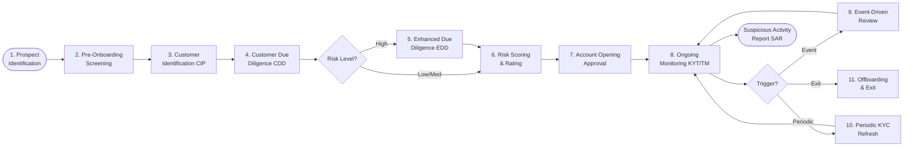
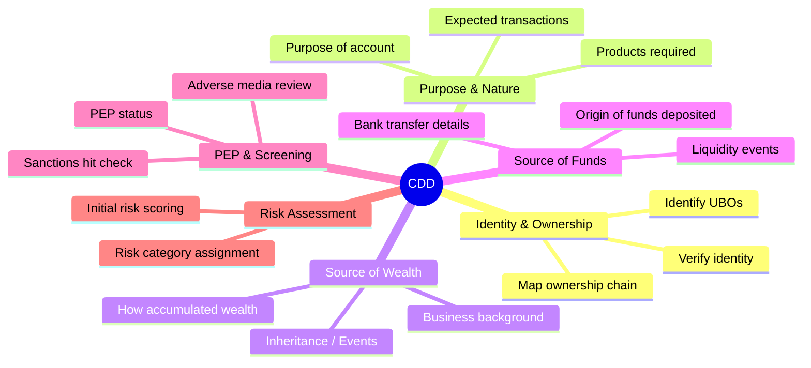
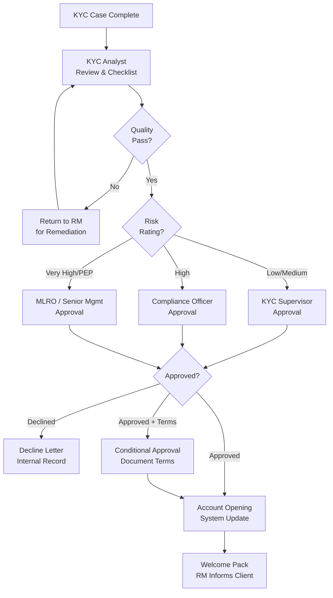
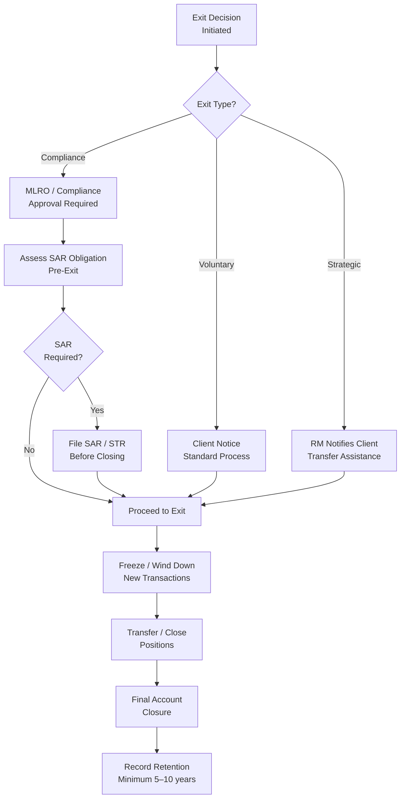

# 03 — KYC Lifecycle

> **Focus:** End-to-end KYC stages from first client contact to offboarding. Each stage is examined for Private Banking specifics.

---

## 3.1 Lifecycle Overview

The KYC lifecycle in Private Banking is not a linear pipeline — it is a **continuous loop** with multiple re-entry points driven by trigger events, periodic reviews, and ongoing surveillance.



---

## 3.2 Stage 1 — Prospect Identification & Pre-Onboarding

### What Happens
Before formal KYC begins, Relationship Managers qualify potential clients. This stage is often informal but carries formal compliance obligations.

### Activities

**Prospecting Due Diligence (Informal)**
- RM performs reputational checks using open source intelligence (OSINT)
- Preliminary assessment of wealth plausibility and nature of business
- Initial conversation about the intended relationship purpose

**Pre-Onboarding Screening (Formal Gate)**
The bank's **Customer Acceptance Policy (CAP)** is applied:

```
Pre-Onboarding Checklist
━━━━━━━━━━━━━━━━━━━━━━━━━━━━━━━━━━━━━━━━━━━━━━━━
□ Does the prospect fall within client acceptance criteria?
□ Is the proposed business relationship consistent with bank's risk appetite?
□ Are there any known red flags from RM conversation / referral?
□ Does preliminary name screening reveal hits on sanctions / PEP?
□ Is the business/wealth source plausible at the claimed level?
□ Is there a conflict of interest with existing clients or ownership?
□ Is the jurisdiction of the client acceptable under bank's policy?
□ Is senior management referral or approval required (HNW threshold)?
━━━━━━━━━━━━━━━━━━━━━━━━━━━━━━━━━━━━━━━━━━━━━━━━
```

### Prohibited Client Categories
Banks typically maintain a list of **absolutely prohibited** client types regardless of relationship value:
- Shell banks (no physical presence, no regulated group membership)
- Entities in FATF black-listed jurisdictions without senior MLRO override
- Anonymous accounts / numbered accounts without beneficial owner
- Clients where senior management approval has been declined

---

## 3.3 Stage 2 — Customer Identification Program (CIP)

### Regulatory Basis
- **US:** FinCEN/banking agency Customer Identification Program rules (31 CFR 1020.220)
- **UK/EU:** Customer due diligence measures per MLR 2017 / AMLD4+
- **Global:** FATF Recommendation 10 — Customer Due Diligence

### CIP — Minimum Standards

For **natural persons** (individuals):

| Data Element | Standard Requirement | Private Banking Enhanced |
|-------------|---------------------|--------------------------|
| Full legal name | ✓ Required | ✓ Including middle names |
| Date of birth | ✓ Required | ✓ |
| Residential address | ✓ Required | ✓ All residential addresses |
| Nationality / Citizenship | ✓ Required | ✓ All nationalities held |
| National identification | ✓ Passport / National ID | ✓ Passport mandatory |
| Tax Identification Number (TIN) | Country-dependent | ✓ All jurisdictions of tax residency |

For **entities** (companies, trusts, foundations):

| Data Element | Requirement |
|-------------|-------------|
| Legal name | ✓ Full registered name |
| Registration number | ✓ Jurisdiction-specific |
| Registered address | ✓ |
| Country of incorporation | ✓ |
| Nature of business | ✓ |
| List of directors / officers | ✓ |
| Ultimate Beneficial Owners | ✓ Identify all ≥25% (or lower threshold) |

### Identity Verification Methods

```
┌──────────────────────────────────────────────────────────────┐
│              IDENTITY VERIFICATION METHODS                   │
├─────────────────────────┬────────────────────────────────────┤
│ IN-PERSON (Face-to-Face)│ REMOTE / DIGITAL                   │
├─────────────────────────┼────────────────────────────────────┤
│ Original document review│ Certified copy by notary/lawyer    │
│ Wet ink signature       │ Video verification (eKYC)          │
│ Banker introduction     │ Electronic identity (eIDAS, iDIN)  │
│ Existing client referral│ Biometric liveness detection       │
│                         │ Bank transfer verification         │
└─────────────────────────┴────────────────────────────────────┘
```

**Reliance on Third Parties:**
Private Banking clients often prefer to be onboarded through their **lawyer or family office**. Regulatory frameworks allow reliance on third-party due diligence provided:
1. The third party is regulated and supervised in an acceptable jurisdiction
2. A formal reliance agreement is in place
3. The relying institution retains ultimate responsibility
4. Documentation can be obtained within 5 business days upon request

---

## 3.4 Stage 3 — Customer Due Diligence (CDD)

CDD goes beyond identity verification to understand **who the customer is** and **what their financial relationship will be**.

### CDD Core Components



### CDD — Standard Requirements per Entity Type

**Individual Client (Natural Person)**

| Information | Documentation |
|-------------|--------------|
| Full identity | Passport (certified copy) |
| Residential address | Utility bill / bank statement (< 3 months) |
| Source of Wealth | Narrative statement + corroborating documents |
| Source of Funds | Bank transfer confirmation / wire details |
| Tax residency | Self-certification form (CRS/FATCA) |
| PEP status | Client self-declaration + screening results |

**Corporate Entity**

| Information | Documentation |
|-------------|--------------|
| Corporate identity | Certificate of Incorporation |
| Governance structure | Articles / Memorandum of Association |
| Registered address | Corporate registry extract |
| Directors | List + identity verification of all directors |
| UBOs | UBO declaration + verification of ≥25% owners |
| Business purpose | Description of business + financial accounts |

**Trust**

| Information | Documentation |
|-------------|--------------|
| Trust existence | Trust Deed (may be redacted to remove commercial sensitivities) |
| Trustees | Full KYC on corporate or individual trustee(s) |
| Settlor | Full identity + verification |
| Protector | Full identity + verification |
| Beneficiaries (named) | Identity + screening |
| Beneficiaries (class) | Description; individual KYC at distribution |
| Purpose | Stated purpose of trust in Trust Deed |

---

## 3.5 Stage 4 — Enhanced Due Diligence (EDD)

EDD is mandatory when higher risk factors are present. In Private Banking, **EDD is not exceptional — it is the norm for a significant portion of the client base**.

### Triggers for EDD

```
MANDATORY EDD TRIGGERS                     DISCRETIONARY EDD TRIGGERS
─────────────────────────────────────      ──────────────────────────────────
• Foreign PEP (any seniority)              • Domestic PEP (jurisdiction varies)
• Client from high-risk jurisdiction       • Adverse media hits
• Correspondent banking relationship       • Complex / opaque ownership chains
• Non-face-to-face onboarding (some       • Unexplained wealth inconsistency
  jurisdictions require EDD)               • High-risk occupation / industry
• Sanctions adjacent (not on list but      • Prior de-risking at another bank
  proximate to sanctioned persons)         • Volume / pattern of cash transactions
```

### EDD — Additional Requirements

**Beyond standard CDD, EDD requires:**

1. **Senior Management Approval**
   - Relationship Head or Deputy
   - Documented rationale for accepting high-risk client
   - Specific terms and conditions attached to approval

2. **Source of Wealth — Deep Documentation**
   - Not just narrative — corroborated with:
     - Company sale: Share purchase agreement / completion statement
     - Inheritance: Probate documents / inheritance statements
     - Real estate: Deeds, sale contracts, valuations
     - Investment returns: Brokerage statements, fund performance records
     - Business income: Audited financial statements (ideally 2-3 years)

3. **Source of Funds — Transaction-Level Tracing**
   - Bank statement of the originating account
   - Explanation of all material inflows in the prior 12–24 months

4. **Enhanced Ongoing Monitoring**
   - More frequent transaction review
   - Lower threshold for flagging unusual activity
   - Annual (vs. biennial) KYC refresh

5. **Enhanced Adverse Media Search**
   - Structured media searches in native language
   - Review of local / regional press coverage
   - Use of specialist research services for complex subjects

### EDD — PEP-Specific Requirements

For Foreign PEPs, additional measures typically include:
- Written approval from **MLRO / Chief Compliance Officer**
- Documented assessment of whether wealth is consistent with public office
- Ongoing monitoring of political developments in home country
- Assessment of legal basis for client's wealth (state assets vs. personal wealth)

---

## 3.6 Stage 5 — Risk Assessment & Scoring

Every KYC case culminates in a **risk rating** that drives the intensity of subsequent monitoring and review frequency.

### Risk Scoring Model — Example Framework

Risk scoring typically aggregates scores across multiple dimensions:

```
┌─────────────────────────────────────────────────────────────┐
│              KYC RISK SCORING MODEL                         │
├──────────────────────────┬──────────────────────────────────┤
│ DIMENSION                │ RISK FACTORS                     │
├──────────────────────────┼──────────────────────────────────┤
│ Customer Risk            │ PEP status, occupation, sector   │
│ Geographic Risk          │ Country of residence, nationality│
│                          │ Jurisdiction of entities         │
│ Product / Service Risk   │ Private banking, private equity  │
│                          │ Offshore accounts, anonymity     │
│ Transaction Risk         │ Cash intensity, volume, velocity │
│                          │ Cross-border, third party txns   │
│ Ownership Complexity     │ Layers in structure, nominees    │
│                          │ OFC exposure, trust use          │
│ Adverse Information      │ Media hits, regulatory actions   │
│                          │ Prior SAR filing, exits from     │
│                          │ other banks                      │
└──────────────────────────┴──────────────────────────────────┘
                                ▼
┌─────────────────────────────────────────────────────────────┐
│     COMPOSITE RISK SCORE → Risk Rating Assignment           │
│                                                             │
│  0–25    → LOW RISK     → Simplified monitoring, 5yr review │
│  26–50   → MEDIUM RISK  → Standard monitoring, 3yr review  │
│  51–75   → HIGH RISK    → Enhanced monitoring, 1yr review  │
│  76–100  → VERY HIGH    → Intensive monitoring, 6mo review │
│             (requires senior approval)                      │
└─────────────────────────────────────────────────────────────┘
```

### Overrides and Escalation
- **Upward override:** Compliance may escalate a computer-scored "Medium" to "High" based on qualitative assessment
- **Downward override:** Only allowed with documented justification and MLRO sign-off (rare in practice)
- **Absolute floors:** Certain triggers (e.g., foreign PEP + high-risk jurisdiction) result in mandatory High/Very High regardless of score

---

## 3.7 Stage 6 — Account Opening Approval

### Approval Workflow



### Conditional Approvals
Approvals are sometimes granted **with conditions**, for example:
- Ongoing monitoring threshold set below standard
- Specific transactions require pre-approval
- Additional documentation required within 90 days
- Geographic restrictions on transactions

---

## 3.8 Stage 7 — Ongoing Monitoring

Once a client is onboarded, KYC becomes an **operational function** integrated into day-to-day banking activity.

### Transaction Monitoring (TM)

Transaction monitoring systems apply rule-based and ML-based models to detect:

| Alert Type | Example Trigger | Private Banking Relevance |
|-----------|----------------|--------------------------|
| **Velocity** | 5+ wires in 24 hours above threshold | Unusual for typical PB client |
| **Value** | Single transaction >$X vs. expected | Key — expected patterns must be calibrated per client |
| **Geography** | Transaction to/from high-risk country | Very relevant — cross-border is common |
| **Counterparty** | Transfer to/from unknown third party | Critical — watch for third-party payment requests |
| **Cash** | Cash deposits above CTR threshold | Low for PB, but notable when it occurs |
| **Pattern** | Structuring (multiple transactions just below reporting threshold) | Rare but high significance |
| **Round Numbers** | Repeated exactly round-number transfers | Structuring indicator |

### Behavioural Analysis
Beyond rules, ML models detect **statistical anomalies** against a client's own baseline behaviour:
- Significant departure from expected transaction type / value
- Sudden account dormancy followed by large movement
- Geographic deviation (e.g., transaction from unusual country)
- New frequent counterparty appearing

### KYT (Know Your Transaction)
KYT is the transaction-level complement to KYC. Where KYC validates the client, KYT validates each transaction:
- **Purpose:** Is this transaction consistent with the stated relationship purpose?
- **Counterparty:** Is the counterparty known, verified, and risk-acceptable?
- **Geography:** Is the destination jurisdiction consistent with client's declared activity?
- **Timing:** Does timing correlate with any external event (political, market, regulatory)?

---

## 3.9 Stage 8 — Periodic KYC Review / Refresh

### Purpose
Even without trigger events, KYC must be **refreshed periodically** to capture:
- Changes in client circumstances (wealth, address, nationality)
- Changes in entity structure (new UBOs, new directors, dissolved entities)
- Changes in risk profile (new PEP connection, adverse media)
- Expiry of identity documents
- Regulatory changes requiring re-collection of information

### Review Frequency by Risk Rating

| Risk Rating | Review Frequency | Review Depth |
|------------|-----------------|--------------|
| Low | Every 5 years | Document refresh + screening |
| Medium | Every 3 years | Full CDD + screening |
| High | Every 1–2 years | Full CDD + EDD elements |
| Very High / PEP | Every 12 months | Full EDD rerun |

### Review Output
Each periodic review must produce:
1. **Updated KYC file** with refreshed documents
2. **Updated risk rating** (which may change up or down)
3. **Documented rationale** for any change to risk rating
4. **Regulatory review completion record** for audit trail

---

## 3.10 Stage 9 — Event-Driven Reviews

Some circumstances require an **immediate (out-of-cycle) review** of the KYC file, regardless of when the last periodic review was completed.

### Common Triggers

```
INTERNAL TRIGGERS                       EXTERNAL TRIGGERS
──────────────────────────────────      ─────────────────────────────────────
• Unusual or suspicious transaction     • Client's political appointment
• RM flag / intuition                   • Public adverse media coverage
• Change in account behaviour           • Client listed on sanctions list
• Significant new counterparty          • Client's associate sanctioned
• New product / service requested       • Death / incapacity of client
• New entity added to structure         • Regulatory request / court order
• Change in transaction volume/value    • STR/SAR filed by another institution
• Client attempt to provide cash        • Criminal investigation in client's
                                          home country
• Change in source of funds origin      • Change in UBO (M&A, inheritance)
```

### Event-Driven Review Process
1. **Trigger identified** by RM, Compliance, TM system, or external source
2. **Case opened** in KYC case management system
3. **Scope determined** — targeted review or full re-KYC?
4. **RM engaged** to gather additional information from client
5. **Analysis conducted** — new information weighed against existing profile
6. **Risk re-assessed** — may result in rating upgrade or SAR filing
7. **Decision documented** — continue, restrict, or exit relationship

---

## 3.11 Stage 10 — Offboarding & Exit

When a client relationship is exited, specific obligations apply.

### Grounds for Exit

| Category | Examples |
|----------|----------|
| **Compliance-initiated** | EDD completed; risk unacceptable; SAR filed; sanctions listed |
| **Voluntary** | Client request; death; relocation |
| **Strategic** | Bank withdraws from client segment; geographic exit |
| **Regulatory** | Regulator requires exit of certain client categories |

### Exit Process



### Tipping Off Risk
When a compliance-initiated exit is processed, **extreme care must be taken** not to "tip off" the client that a SAR has been filed. This is illegal in most jurisdictions. Close coordination between compliance, legal, and operations is required.

### Record Retention
Post-exit, all KYC records must be **retained** for the regulatory minimum period:
- **EU/UK:** 5 years post-relationship end (AMLD4), with possible extension to 10 years
- **US:** 5 years post-relationship end (BSA)
- **Singapore:** 5 years (MAS Notice 626)

---

## 3.12 KYC Lifecycle Summary Table

| Stage | Key Activities | Key Documents | Approval Authority |
|-------|---------------|---------------|-------------------|
| Pre-Onboarding | CAP check, preliminary screening | Pre-onboarding form | RM + compliance pre-check |
| CIP | Identity verification | Passport, utility bill | KYC Analyst |
| CDD | SoW, SoF, ownership mapping | Trust deed, corp docs, financial statements | KYC Analyst + Supervisor |
| EDD | Deep SoW, PEP assessment, senior approval | SPA, audit accounts, probate | MLRO / CCO |
| Risk Scoring | Composite risk rating | Risk assessment form | KYC Supervisor |
| Account Opening | Final approval, conditional terms | Approval memo | Tiered by risk level |
| Ongoing Monitoring | TM alerts, behavioural analysis | Alert records, STR/SAR where applicable | Compliance / TM Team |
| Periodic Review | Refresh documents, re-screen, re-rate | Updated KYC file | KYC Supervisor |
| Event-Driven Review | Trigger-based reassessment | Case notes, new documentation | Risk-dependent |
| Offboarding | SAR assessment, closure, record retention | Exit memo, SAR (if applicable) | MLRO / Compliance |

---

> **Next:** [04 — Key Concepts & Terminology](./04-key-concepts-terminology.md)
