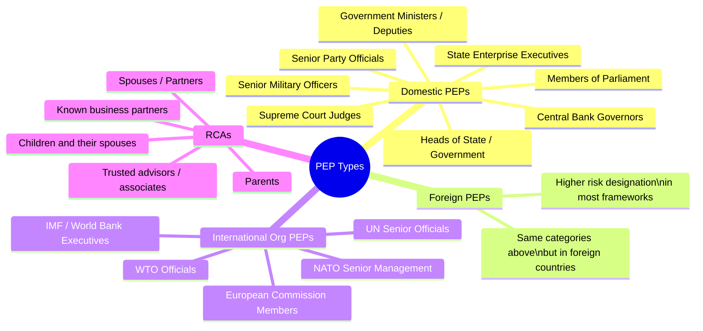

# 04 — Key Concepts & Terminology

> **Focus:** In-depth explanation of all core KYC concepts and terms — from UBO to FATCA, from Sanctions to KYT. This is the practitioner's glossary at expert level.

---

## 4.1 UBO — Ultimate Beneficial Owner

### Definition
The **Ultimate Beneficial Owner (UBO)** is the natural person(s) who ultimately owns or controls a customer or the natural person on whose behalf a transaction is conducted.

"Ultimately" is the operative word — you trace ownership UP through every layer of entities until you reach a human being.

### Threshold Rules

| Jurisdiction | Ownership Threshold | Notes |
|-------------|-------------------|-------|
| EU (AMLD5) | 25% | Lower threshold required for higher-risk entities |
| UK (MLR 2017) | 25% | Same; includes control without formal ownership |
| US (FinCEN CDD Rule) | 25% (beneficial) + control person | Dual-prong test: ownership + control |
| Singapore (MAS) | 25% | Additional "nominee" triggers |
| Germany | 25% / 10% for enhanced | 10% for specific asset management contexts |
| Switzerland (FINMA) | 25% | Also captures contractual control |

### Control Test
Even if no individual owns ≥25%, **control** triggers UBO identification:
- Ability to appoint/remove majority of board
- Voting rights >25%
- Right to direct investment decisions
- Trust protector rights
- Power of attorney over material decisions

### UBO Identification — Decision Tree

```
Step 1: Is the customer a natural person?
  └─ YES → Person themselves is the UBO. Verify and screen.
  └─ NO → Proceed to entity analysis

Step 2: List all shareholders / members who own / control ≥25%
  └─ Are they natural persons?
      └─ YES → These are the UBOs. Verify and screen.
      └─ NO (corporate shareholder) → Repeat Step 2 for that entity

Step 3: No individual reaches 25% threshold?
  └─ Identify the person(s) who exercise CONTROL
     (senior management, directors, effective decision makers)
  └─ These become UBOs by virtue of control

Step 4: Document the entire ownership chain with percentages
  └─ Ownership diagrams retained in KYC file
```

### UBO Register
Many jurisdictions now require **central UBO registers** (e.g., UK PSC Register, EU Member State registers). Banks must:
- Check these registers as part of CDD
- Document any discrepancy between register data and client-provided data
- Report discrepancies to the register authority (mandatory in EU)

---

## 4.2 PEP — Politically Exposed Person

### Definition
A **PEP** is an individual who holds or has held a **prominent public function**. Their position creates elevated exposure to corruption, bribery, and the potential misappropriation of public funds.

### PEP Categories



### PEP Duration
PEP status does **not expire immediately** when a person leaves office:
- **FATF:** No fixed de-PEP period; use risk-based judgment
- **EU/UK:** Typically 12 months minimum before reassessment
- **Many banks in practice:** 2–5 year continued elevated monitoring post-departure
- **Never fully de-PEP** if person retains significant influence or wealth built during tenure

### PEP Screening Challenges
1. **No definitive global PEP list** — commercial vendors (WorldCompliance, Refinitiv, Dow Jones) maintain proprietary lists with varying coverage
2. **Name variations** in different languages/scripts
3. **Transliteration** of Arabic, Chinese, Russian names
4. **RCA mapping** requires ongoing intelligence — business relationships change
5. **Self-declaration bias** — clients sometimes do not disclose PEP status

### PEP + Private Banking
When a PEP opens a Private Banking account, the bank must specifically assess whether:
- Their declared SoW is consistent with their known public sector income
- Their family members' wealth is reasonably explainable (ruling out corruption proceeds)
- The jurisdictional corruption index supports a plausible narrative
- The account purpose is transparent and legitimate

---

## 4.3 Sanctions Screening

### What Is Sanctions Screening?
The process of checking clients, counterparties, and transactions against **lists of prohibited individuals, entities, vessels, and jurisdictions** maintained by national and international authorities.

### Key Sanctions Lists

| Programme | Maintained By | Scope |
|-----------|--------------|-------|
| **SDN (Specially Designated Nationals)** | US OFAC | Global; applies to all US persons and US dollar transactions |
| **OFAC Country Programmes** | US OFAC | Comprehensive embargoes: Cuba, Iran, North Korea, Syria, Russia sectors |
| **EU Consolidated List** | European Commission | All EU-regulated entities |
| **UK Financial Sanctions (OFSI)** | HM Treasury | Post-Brexit UK list |
| **UN Security Council Sanctions** | UN SCWG | Subset of most national lists |
| **SECO** | Switzerland | Swiss sanctions list |
| **DFAT** | Australia | Australian sanctions |

### The "Long Arm" of OFAC
US sanctions have **extraterritorial reach** — they apply to:
- US citizens and permanent residents anywhere in the world
- Entities incorporated in the US
- Any transaction **involving US dollars** (de facto global application)
- Any entity that facilitates a prohibited transaction

This means a **Swiss private bank** must screen against OFAC for all USD transactions, not just its US clients.

### Sanctions Screening Architecture

```
                      ┌──────────────────────────┐
                      │   Sanctions Data Feed     │
                      │ (OFAC, EU, UN, UK, SECO)  │
                      └──────────────┬───────────┘
                                     │ Daily update
                      ┌──────────────▼───────────┐
                      │   Sanctions Screening     │
                      │       Engine              │
                      │  (Fuzzy matching, aliases,│
                      │   transliteration, DOB)   │
                      └──────────────┬───────────┘
                   ┌─────────────────┼──────────────────┐
                   ▼                 ▼                  ▼
           ┌───────────┐    ┌────────────────┐  ┌──────────────┐
           │   Client   │    │  Transaction   │  │  Counterparty│
           │ Screening  │    │  Screening     │  │  Screening   │
           │(Onboarding │    │ (Real-time /   │  │ (Wire        │
           │+ Ongoing)  │    │  Batch)        │  │  recipients) │
           └───────────┘    └────────────────┘  └──────────────┘
                   │                 │                  │
                   └─────────────────┼──────────────────┘
                                     ▼
                        ┌────────────────────────┐
                        │   Alert Triage          │
                        │ True Match → Block/SAR  │
                        │ False Positive → Clear  │
                        │ Fuzzy Match → Investigate│
                        └────────────────────────┘
```

### Fuzzy Matching & False Positives
Sanctions lists contain romanised names, aliases, date of birth ranges, and partial addresses. Matching algorithms must balance:
- **Sensitivity (recall):** Don't miss actual sanctions hits
- **Specificity (precision):** Don't flood analysts with false positives

Common matching techniques:
- Exact match
- Soundex / phonetic matching
- Edit distance (Levenshtein)
- Alias expansion
- DOB range matching
- Transliteration matching (e.g., Arabic → Latin script)

False positive rates in Private Banking can be 200:1 or higher — i.e., 200 alerts generated for every 1 true sanctions match.

---

## 4.4 Adverse Media / Negative News Screening

### Definition
**Adverse Media** refers to credible negative information about a person or entity from public sources — including news articles, court records, government publications, and regulatory databases.

### Types of Adverse Media

| Category | Examples |
|----------|---------|
| **Financial Crime** | Fraud conviction, money laundering investigation, embezzlement charges |
| **Corruption / Bribery** | Government contracts corruption, kickback schemes, bribery prosecution |
| **Regulatory Action** | FCA enforcement, SEC charges, regulatory bans, financial penalties |
| **Terrorism / WMD** | Links to terrorist financing, weapons trafficking |
| **Tax Evasion** | Criminal tax fraud, undeclared offshore assets |
| **Organised Crime** | Trafficking, drug cartel associations, organised crime memberships |
| **Reputational** | Significant litigation, controversial business practices |

### Adverse Media vs. Negative News
- **Adverse media** in a KYC context means information **relevant to financial crime risk**
- Not all negative news is adverse media — a client involved in a civil dispute or facing negative business press does not automatically trigger AML concerns
- **Materiality assessment** is required: Does the negative information suggest financial crime risk?

### Adverse Media Sources

```
Structured Sources                     Unstructured Sources
──────────────────────                 ─────────────────────────
• Regulatory enforcement databases    • News wire services
• Court records (public)              • Online newspapers
• Bankruptcy filings                  • Social media (selective)
• Official government gazettes        • Investigative journalism
• Commercial risk databases           • NGO reports (Global Witness,
  (WorldCheck, Dow Jones)               Transparency International)
• PEP databases                       • Leaked document databases
• Financial sanctions lists             (Panama Papers, Pandora Papers)
```

### Adverse Media in Private Banking — Considerations
1. **Language coverage:** UHNW clients may have adverse media only in local language press. Screening must include native-language search capabilities.
2. **Entity complexity:** Adverse media on a subsidiary or related entity of the client must be assessed for relevance.
3. **Historical review:** Information from years or decades ago may still be relevant (statute of limitations does not reset risk).
4. **Unverified allegations:** Must be documented as unverified but recorded for risk context.

---

## 4.5 Source of Wealth (SoW)

### Definition
**Source of Wealth** describes how the customer has **accumulated their total net worth** over their lifetime. It explains the overall picture of where wealth came from.

### SoW vs. Source of Funds
This distinction is critical and often confused:

| | Source of Wealth (SoW) | Source of Funds (SoF) |
|-|------------------------|----------------------|
| **What?** | Entire accumulated net worth | Specific funds being deposited now |
| **When?** | Lifetime wealth accumulation | This specific transaction / deposit |
| **Example** | "Built and sold a tech company for $50M in 2018" | "Wire transfer of $5M from ABC Bank, being partial proceeds from sale of Swiss property" |
| **Documents** | Share sale agreement, estate docs, business records | Wire confirmation, bank statement, sale contract |
| **Sufficiency** | Must explain entire wealth at the level declared | Must trace the specific incoming funds |

### SoW Assessment Framework

```
HIGH-RISK SoW INDICATORS:                  ACCEPTABLE SoW INDICATORS:
──────────────────────────────────         ────────────────────────────────
• Cannot be corroborated documentarily    • Business sale with clear documentation
• Inconsistent with professional history  • Inheritance with probate records
• Wealth inflated vs. plausible earnings  • Property sale with clear deeds
• Involves state-owned enterprise         • Investment portfolio with statements
  (possible misappropriation)             • Professional income over career
• Relies entirely on self-declaration     • IPO proceeds with stock records
• Involves politically sensitive          • Lottery / compensation (documented)
  country / sector                        
• Rapid, unexplained accumulation         
```

### SoW — Plausibility Check
KYC analysts must ask: **Is this level of wealth plausible given the client's age, career, and background?**

Example: A 35-year-old civil servant from a high-corruption jurisdiction claiming $50M in wealth from "business activities" requires much more rigorous SoW investigation than a 55-year-old tech entrepreneur from Silicon Valley claiming similar wealth from a documented company sale.

---

## 4.6 Source of Funds (SoF)

### Definition
**Source of Funds** refers specifically to the **origin of the funds being transferred or deposited** into the account. It validates that the specific money entering the banking relationship comes from a legitimate source.

### SoF Documentation Requirements

| Wealth Type | SoF Documentation |
|------------|------------------|
| Property sale | Sale contract + completion statement + solicitor letter |
| Business sale | SPA + completion statement + bank transfer confirmation |
| Investment liquidation | Brokerage closure confirmation + SWIFT MT103 |
| Inheritance | Grant of Probate + estate distribution letter |
| Liquidity event (IPO) | Lock-up expiry + broker transfer confirmation |
| Salary / Bonus | Payslip + bank statement showing credit |
| Loan proceeds | Loan agreement + disbursement confirmation |

### SoF Chain Tracing
For complex fund flows, a **chain of custody** must be traceable:

```
Origin Bank → SWIFT Transfer → Correspondent Bank → Receiving Bank
     │                                                     │
  Bank statement                                    MT103 / SWIFT copy
  confirming origin                                 confirming route
```

Breaks in the SoF chain (e.g., funds routed through shell company accounts) are a significant red flag.

---

## 4.7 Risk Rating

### Risk Rating Model Overview
Every client receives a formal **Risk Rating** that drives CDD/EDD depth, monitoring intensity, and review frequency. Refer to Section 3.6 of the [KYC Lifecycle](./03-kyc-lifecycle.md) for the scoring model.

### Risk Rating Tiers and Implications

| Rating | Tier | Monitoring | Review Cycle | Approval Level |
|--------|------|-----------|-------------|---------------|
| **Low** | 1 | Standard TM rules | 5 years | KYC Supervisor |
| **Medium** | 2 | Standard + enhanced alerts | 3 years | KYC Manager |
| **High** | 3 | Full TM + manual review quarterly | 1–2 years | Compliance Officer |
| **Very High** | 4 | Intensive TM + quarterly compliance review | 6–12 months | MLRO + Regional Head |

### Dynamic Risk Rating
Risk ratings should be **dynamic** — automatically adjusted when:
- Adverse media alert received
- Transaction pattern deviates from expected
- PEP appointment detected
- Sanctions list updated to include connected person

---

## 4.8 KYT — Know Your Transaction

### Definition
**KYT (Know Your Transaction)** extends the "know your customer" principle to the **transaction level**, ensuring each financial transaction is understood in terms of purpose, counterparty, and economic rationale.

### KYT vs. KYC

| | KYC | KYT |
|-|-----|-----|
| Subject | The customer | The transaction |
| Frequency | Periodic (with triggers) | Continuous, real-time |
| Purpose | Validate who the customer is | Validate what they are doing |
| Tool | Due diligence, document review | Transaction monitoring, TM systems |
| Output | Risk rating, approval | Alert, escalation, investigation |

### KYT in Private Banking
UHNW clients execute complex transactions — international wires, private equity capital calls, property settlements, FX conversions. Each must be evaluated:
- Against the client's expected transaction profile
- For jurisdiction and counterparty risk
- For consistency with stated wealth and business purpose

---

## 4.9 Name Screening / Watchlist Filtering

### Difference from Sanctions Screening
While sanctions screening checks against legally mandated prohibited lists, **name screening** (or watchlist screening) is broader — it checks against:
- Sanctions lists (OFAC, EU, UN, etc.)
- PEP databases (commercial)
- Adverse media risk profiles
- Internal bank watchlists (declined clients, exited clients)
- Regulatory debarment lists
- Know Your Correspondent bank blacklists

### Screening Frequency
- **Onboarding:** Full screening at initial CDD
- **Ongoing:** Daily batch re-screening against updated lists
- **Real-time:** Transaction-level screening for wires and payments
- **Event-triggered:** Immediate full re-screening upon trigger event

---

## 4.10 FATCA — Foreign Account Tax Compliance Act

### What Is FATCA?
A **US federal law** (enacted 2010, effective 2014) requiring:
1. Foreign Financial Institutions (FFIs) to identify and report accounts held by US persons to the IRS
2. US persons and entities to report foreign financial accounts
3. 30% withholding tax on certain US-source payments to non-compliant FFIs

### FATCA KYC Implications

```
For each client, the bank must determine:
┌─────────────────────────────────────────────────────────┐
│ Is the account holder a:                                │
│  □ US Citizen (anywhere in the world)                   │
│  □ US Resident (Green card holder)                      │
│  □ US Tax Resident (substantial presence test)          │
│  □ Entity that is US-controlled or US-incorporated      │
│                                                         │
│ If YES → Account is "US Reportable"                     │
│  → Collect W-9 (US persons) or W-8BEN / W-8BEN-E       │
│  → Report account details and balance annually to IRS   │
└─────────────────────────────────────────────────────────┘
```

### FATCA in Private Banking
UHNW clients with dual citizenship or US residency trigger FATCA obligations that must be captured during KYC. Critically, **US citizenship cannot be avoided** by opening accounts through trusts or offshore entities — FATCA looks through structures to find US beneficial owners.

---

## 4.11 CRS — Common Reporting Standard

### What Is CRS?
The **OECD Common Reporting Standard for Automatic Exchange of Financial Account Information (AEOI)** — the international equivalent of FATCA adopted by 100+ countries (not the US, which uses FATCA instead).

### CRS vs. FATCA

| Dimension | FATCA | CRS |
|-----------|-------|-----|
| Governing body | US IRS | OECD / participating countries |
| Scope | US persons globally | Non-resident account holders in participating jurisdictions |
| Reporting | FFIs report to IRS | Banks report to their own regulator, which exchanges with other countries |
| Forms | W-9, W-8BEN, W-8BEN-E | CRS Self-Certification (no standard form) |
| Adoption | Universal for USD transactions | 110+ countries |

### CRS KYC Implications
Banks must:
1. Collect a **CRS Self-Certification** from all reportable account holders
2. Identify all **tax residencies** of the account holder (individuals and entities)
3. Report account balances, income, and proceeds to reportable jurisdictions annually
4. Apply enhanced due diligence for **pre-existing accounts** above defined thresholds

For Private Banking, nearly every UHNW client has **multiple tax residencies** — making CRS compliance particularly complex.

---

## 4.12 AML — Anti-Money Laundering

### Overview
AML encompasses all policies, procedures, controls, and technology deployed to **detect and prevent money laundering** — the process of making illegally obtained funds appear legitimate.

### AML Programme Components (FATF-Compliant)

```
AML PROGRAMME
├── Customer Due Diligence (KYC)
├── Suspicious Activity Reporting (STR / SAR)
├── Transaction Monitoring (TM)
├── Record Keeping
├── Sanctions Compliance
├── Employee Training
├── Independent Audit
└── Risk Assessment (MLRO-led)
```

---

## 4.13 CTF — Counter-Terrorist Financing

### Distinguishing CTF from AML

| Characteristic | Money Laundering | Terrorist Financing |
|--------------|-----------------|---------------------|
| **Source of funds** | Illegal proceeds | May be legitimate |
| **Destination** | Back into legitimate economy | Terrorist operations |
| **Transaction size** | Often large | Often small |
| **Speed** | May be slow / layered | Often urgent |
| **Detection method** | Unusual wealth, patterns | Lists, networks, geography |

### CTF-Specific Controls
- Sanctions screening (terrorist organisations and individuals)
- PEP screening (government/military connections to state-sponsored terrorism)
- Geographic risk assessment (conflict regions, state sponsors of terrorism)
- Monitoring for unusual destinations or beneficiaries in high-risk regions

---

## 4.14 Shell Companies, Trusts, and Foundations

### Shell Companies
A **shell company** has no independent operations, assets, or employees — it exists purely as a legal vehicle. While legitimate uses exist (holding real estate, IP), shell companies are frequently misused to:
- Obscure beneficial ownership
- Layer transactions
- Store proceeds of crime

**KYC Flags for Shell Companies:**
- No physical address or only registered agent address
- No employees or business operations
- Nominee directors with no evident connection to the business
- Circular ownership structures
- Registered in high-opacity jurisdictions (BVI, Panama, Seychelles)

### Trusts in KYC Context
Covered in detail in [Section 2.4 — Trusts](./02-private-banking-context.md). Key KYC point: trusts **do not have legal personality** in all jurisdictions — the bank contracts with the trustee(s) but must KYC through to the beneficial parties.

### Foundations
**Foundations** (common in Liechtenstein, Panama, Netherlands) are hybrid structures with characteristics of trusts and companies:
- Established by a **Founder** (equivalent to settlor)
- Managed by a **Foundation Council** (equivalent to trustee)
- Benefits accrue to **Beneficiaries** or a **Purpose**
- Can have legal personality (unlike trusts)

KYC requirements mirror trusts — all material parties must be identified and screened.

---

## 4.15 Correspondent Banking

### What Is Correspondent Banking?
When Bank A provides services to Bank B to enable Bank B's customers to send/receive funds internationally or access products not available locally — Bank A is the **correspondent bank** and Bank B is the **respondent bank**.

### KYC Relevance
Correspondent banking carries **elevated AML/CTF risk** because:
- The correspondent bank cannot directly KYC the **end customers** of the respondent bank
- One correspondent relationship may process millions of transactions for thousands of unknown end customers
- If the respondent bank has weak AML controls, criminal proceeds can flow through anonymous correspondent channels

### Due Diligence on Correspondent Relationships
Under FATF R.13 and banking regulations, before establishing a correspondent relationship a bank must:
1. Gather sufficient information about the respondent bank to understand their business and AML standards
2. Assess the respondent's AML/CTF controls
3. Obtain senior management approval
4. Document the assessment
5. Prohibit relationships with **shell banks** (no physical presence, no regulated group)

---

## Key Terminology Quick Reference

| Term | Definition |
|------|-----------|
| **AML** | Anti-Money Laundering |
| **CAP** | Customer Acceptance Policy |
| **CDD** | Customer Due Diligence |
| **CIP** | Customer Identification Program |
| **CTF** | Counter-Terrorist Financing |
| **EDD** | Enhanced Due Diligence |
| **FATF** | Financial Action Task Force |
| **KYC** | Know Your Customer |
| **KYT** | Know Your Transaction |
| **MLRO** | Money Laundering Reporting Officer |
| **OFC** | Offshore Financial Centre |
| **PEP** | Politically Exposed Person |
| **RBA** | Risk-Based Approach |
| **RCA** | Relative or Close Associate |
| **SAR / STR** | Suspicious Activity / Transaction Report |
| **SDD** | Simplified Due Diligence |
| **SDN** | Specially Designated National (OFAC) |
| **SoF** | Source of Funds |
| **SoW** | Source of Wealth |
| **TM** | Transaction Monitoring |
| **UBO** | Ultimate Beneficial Owner |

---

> **Next:** [05 — Data Model & Information Capture](./05-data-model.md)
