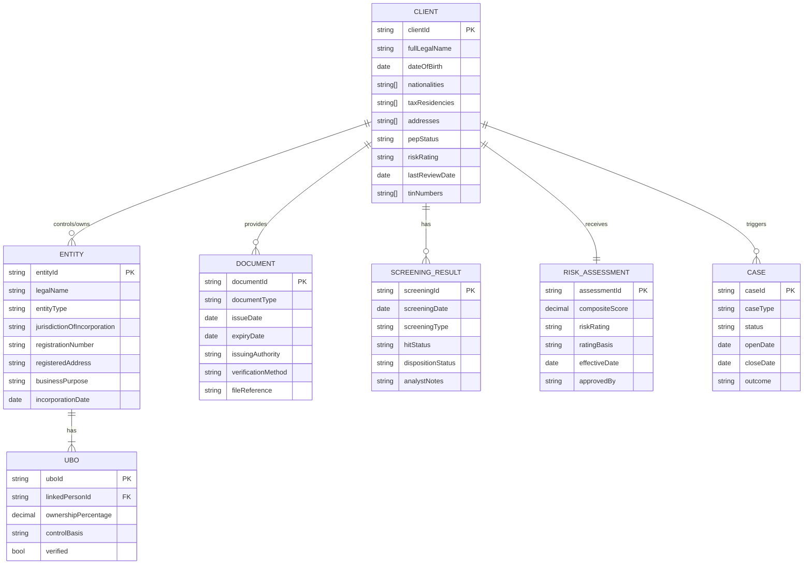

# 05 — Data Model & Information Capture

> **Focus:** What data is collected, when, from whom, and in what format — covering entity vs. individual KYC, document requirements, data fields, and complex ownership hierarchy modelling.

---

## 5.1 KYC Data Architecture Overview

KYC data is not a single collection event — it is a **structured data model** that captures information across multiple entities, lifecycle stages, and data types.



---

## 5.2 Data Collected per KYC Stage

### Stage 1: Pre-Onboarding

| Data Element | Source | Purpose |
|-------------|--------|---------|
| Prospect name | RM input | Initial screening |
| Country of residence | RM conversation | Jurisdiction risk assessment |
| Estimated AUM range | RM estimate | Product suitability |
| Source of wealth (preliminary) | RM conversation | Initial plausibility |
| Nature of proposed relationship | RM input | CAP check |
| Referrer / introducer | RM input | Conflict of interest check |
| Preliminary PEP assessment | RM awareness | High-risk flag |

### Stage 2: CIP (Customer Identification)

**For Natural Persons:**

| Data Field | Mandatory | Notes |
|-----------|-----------|-------|
| Full legal name (as per passport) | ✓ | All name variations |
| Date of birth | ✓ | dd/mm/yyyy |
| Place of birth | ✓ | City and country |
| All nationalities held | ✓ | Including dual/triple citizenship |
| Current residential address(es) | ✓ | All addresses if multiple residences |
| Permanent address (domicile) | ✓ | Legal domicile for correspondence |
| Passport number | ✓ | Issue date + expiry date |
| Alternative ID | Context-dependent | National ID, driving licence |
| Country of tax residence | ✓ | All jurisdictions |
| Foreign TIN(s) | CRS/FATCA | Required for tax reporting |
| Contact details | ✓ | Phone, email |
| Marital status | ✓ | For estate planning context and PEP linkage |
| Spouse / partner identity | If material | PEP / RCA screening |

**For Legal Entities:**

| Data Field | Mandatory | Notes |
|-----------|-----------|-------|
| Full registered legal name | ✓ | Including all trading names |
| Entity type | ✓ | Ltd, LLC, LP, Trust, Foundation |
| Jurisdiction of incorporation | ✓ | Country + state/territory if applicable |
| Registration number | ✓ | Company registration / charity number etc. |
| Date of incorporation | ✓ | |
| Registered address | ✓ | |
| Principal business address | ✓ | If different |
| Nature of business / purpose | ✓ | Detailed description |
| Industry / SIC code | ✓ | For risk profiling |
| Directors / Officers | ✓ | Full list; individual KYC on each |
| Beneficial owners (UBOs) | ✓ | All ≥25%; see UBO section above |
| Group structure (if applicable) | ✓ | Parent, subsidiaries, related entities |

### Stage 3: CDD

**Additional collection for CDD:**

| Data Element | Notes |
|-------------|-------|
| Source of Wealth narrative | Written explanation + corroboration |
| Source of Wealth documents | See Section 5.4 below |
| Source of Funds for initial deposit | Wire details, bank statement |
| Purpose and intended nature of the relationship | Written statement |
| Expected transaction patterns | Volume, frequency, types, geographies |
| Expected annual AUM / relationship size | In range bands |
| Investment objectives | For suitability |
| Products intended to use | Specific products KYC |
| External accounts | Primary bank details (origin of transferred funds) |
| PEP self-declaration | Signed declaration form |
| CRS / FATCA self-certification | Tax residency certification form |

### Stage 4: EDD (Enhanced Due Diligence)

**Additional to full CDD:**

| Data Element | Notes |
|-------------|-------|
| Detailed SoW narrative with timeline | Year-by-year wealth accumulation |
| Corroborating SoW documents | See Section 5.4 |
| Source of Funds — full chain tracing | Bank statements from originating account |
| PEP Assessment memo | Detailed compliance assessment |
| Adverse media research results | Research report from analyst / system |
| Business background research | Company filings, news search, OSINT |
| Network analysis | Connections to other known PEPs or high-risk persons |
| Senior management approval memo | Documented rationale for accepting high-risk |
| Relationship purpose justification | Why this client fits the bank's risk appetite |

---

## 5.3 Document Requirements by Client Type

### Individual Client — Document Matrix

| Document Category | Document Type | Validity Requirement |
|------------------|--------------|---------------------|
| **Primary ID** | Passport | In-date (>6 months remaining) |
| **Secondary ID** | National ID card | In-date |
| | Driving licence | In-date (not sole primary) |
| **Address Proof** | Utility bill | <3 months old |
| | Bank statement | <3 months old |
| | Government correspondence | <3 months old |
| **Tax Residency** | CRS Self-Certification | Signed at onboarding |
| | FATCA W-9 or W-8BEN | If US person indicators |
| **PEP Declaration** | Signed PEP self-declaration | At onboarding; refresh periodically |
| **SoW - Employment** | Employment contract + payslips | Last 3 months |
| **SoW - Business Sale** | Share Purchase Agreement | Redacted version acceptable |
| | Completion Statement | Proceeds confirmed |
| **SoW - Inheritance** | Grant of Probate | Or equivalent per jurisdiction |
| | Estate distribution letter | Confirmed share of estate |
| **SoW - Real Estate Sale** | Sale contract | |
| | Solicitor letter confirming proceeds | |
| **SoW - Investment** | Brokerage statements | Last 12 months |
| **SoW - Other** | Supporting evidence relevant to type | Case-by-case basis |

### Corporate Entity — Document Matrix

| Document Type | Notes |
|--------------|-------|
| **Certificate of Incorporation** | Certified copy; <6 months if recent |
| **Memorandum & Articles of Association** | Complete; current version |
| **Corporate Registry Extract** | Current; <3 months old |
| **Register of Directors** | Full current list |
| **Register of Shareholders** | Current |
| **UBO Declaration** | Signed by authorised officer |
| **Audited Financial Statements** | Latest 2–3 years (for high-risk or significant entities) |
| **Certificate of Good Standing** | For offshore entities; <3 months old |
| **Proof of Regulated Status** | If entity is a financial institution |
| **Authorised Signatory List** | Persons authorised to transact on behalf of entity |

### Trust — Document Matrix

| Document Type | Notes |
|--------------|-------|
| **Trust Deed** | Complete (may redact commercial sensitivity) |
| **Letter of Wishes** (if applicable) | Context-dependent; may be confidential |
| **Trustee KYC** | Full CDD/EDD on trustee company or individuals |
| **Settlor identity documents** | Full identity verification |
| **Protector identity documents** | Full identity verification |
| **Named Beneficiary documents** | Full identity verification + screening |
| **Certificate of Trust** | In some jurisdictions |
| **Trustee's Declaration** | Confirming trust details and their authority |
| **Legal opinion** | For complex / unusual trust structures in opaque jurisdictions |

---

## 5.4 Entity vs. Individual KYC — Structural Differences

### Individual KYC Flow

```
Natural Person
│
├── Identity Verification (Passport + Address)
├── PEP Screening
├── Sanctions Screening
├── Adverse Media Check
├── SoW Documentation
├── SoF Documentation
├── CRS / FATCA Self-Certification
└── Risk Assessment → Rating
```

### Entity KYC Flow

```
Legal Entity
│
├── Entity Identification (Certificate of Incorporation, Registry Extract)
├── Ownership Structure Mapping
│   ├── Shareholder 1 → (if corporate) → recurse
│   └── Shareholder 2 → (if natural person) → Individual KYC
├── UBO Identification (trace to natural persons ≥25%)
├── Director/Officer Identification → Individual verification for each
├── Entity Screening (sanctions, adverse media, regulatory debarment)
├── Business Purpose Assessment
├── Financial Assessment (for high-risk entities)
└── Risk Assessment → Rating
```

---

## 5.5 Ownership Hierarchy Modelling

For complex UHNW clients, the ownership hierarchy must be mapped as a **structured graph**.

### Hierarchy Data Model

```
Node Types:
  N = Natural Person
  C = Company
  T = Trust
  F = Foundation
  P = Partnership

Edge Types:
  OWN(x%) = Ownership at percentage x
  CTL = Control without formal % ownership
  SETTL = Settlor of a trust/foundation
  BEN = Beneficiary
  TRUST = Trustee
  PROT = Protector
```

### Example: Complex Ownership Graph

```
        [N: Alexander Petrov] ─── SETTL ───▶ [T: Petrov Family Trust]
               │                                        │
              OWN(100%)                         TRUST ──┴─── PROT
               │                                  │             │
        [C: Pelham Holdings BVI]          [C: Seaton Trustees]  [N: Advisor X]
               │
       ├─OWN(60%)──────────────────────┐
       │                               │
[C: OpCo UK Ltd]               [C: Alpine AG Switzerland]
   (Operating Co)                (Investment Vehicle)
       │                               │
   Revenue                     [F: Zurich Foundation]
   Dividends                   (Real Estate Holding)
```

**From this structure, KYC must capture:**
- Alexander Petrov: Full individual KYC + EDD (UHNW)
- Petrov Family Trust: Full trust KYC (deed, trustee KYC, beneficiary KYC)
- Seaton Trustees Ltd: Full corporate KYC
- Advisor X (Protector): Identity + screening
- Pelham Holdings BVI: Corporate KYC (Certificate + directors + UBO)
- OpCo UK Ltd: Corporate KYC (abbreviated if UK-registered and transparent)
- Alpine AG Switzerland: Corporate KYC
- Zurich Foundation: Foundation KYC

**Total KYC subjects from one client relationship: 8+**

---

## 5.6 Data Quality Standards

KYC data quality is a regulated obligation, not just a system hygiene issue.

### Data Quality Dimensions

| Dimension | Standard | Consequence of Failure |
|-----------|----------|----------------------|
| **Completeness** | All mandatory fields captured | Regulatory deficiency; unable to complete CDD |
| **Accuracy** | Data matches source documents | Identity fraud risk; AML exposure |
| **Timeliness** | Documents within validity windows | Stale CDD; regulatory non-compliance |
| **Currency** | Refreshed at review frequency | Missed risk changes |
| **Consistency** | Data consistent across systems | Duplicate records; screening gaps |
| **Auditability** | Full change history logged | Unable to evidence compliance during examination |

### Document Expiry Management

```
Document Validity Tracking
─────────────────────────────────────────────────────
Document Type          Validity Period    Alert Threshold
─────────────────────────────────────────────────────
Passport               Issue date to      90 days before expiry
                       expiry on doc
Address proof          3 months from      At capture (auto-reject
                       issue date         if >3 months old)
Certificate of         6 months for       60 days before expiry
Good Standing          offshore entities
Corporate Registry     3 months           At capture
Extract
Financial statements   Within 12 months   At capture; flag if
                       of year end        older than 18 months
─────────────────────────────────────────────────────
```

---

## 5.7 Cross-Jurisdiction Data Considerations

### Data Privacy vs. KYC Obligations
A critical tension exists between **data privacy regulations** (GDPR, PDPA, CCPA) and KYC data collection obligations:

| Issue | Tension |
|-------|---------|
| **Data minimisation** (GDPR principle) | vs. KYC requirement to collect extensive personal data |
| **Purpose limitation** (GDPR) | KYC purpose must be clearly documented as legal basis |
| **Data retention limits** | vs. 5–10 year KYC record retention requirements |
| **Subject access rights** | vs. AML "tipping off" prohibition (can't disclose SAR content) |
| **Cross-border data transfer** | vs. need to centralise KYC data across global bank network |

**Resolution approach:** KYC data collection is permissible under **legal obligation** as the lawful basis under GDPR Article 6(1)(c). However, the bank must:
- Collect only what is necessary for the stated legal obligation
- Retain data no longer than legally required
- Implement appropriate access controls
- Ensure cross-border transfers comply with adequacy requirements

---

## Summary

The KYC data model for Private Banking is a **multi-entity, multi-stage, multi-jurisdictional graph** that links individuals, entities, documents, screening results, and risk assessments. Understanding the data model is foundational for designing KYC platforms, training analysts, and ensuring regulatory completeness. The complexity scales exponentially with the number of entities in the client's ownership structure.

---

> **Next:** [06 — Operational Workflow & Case Management](./06-operational-workflow.md)
