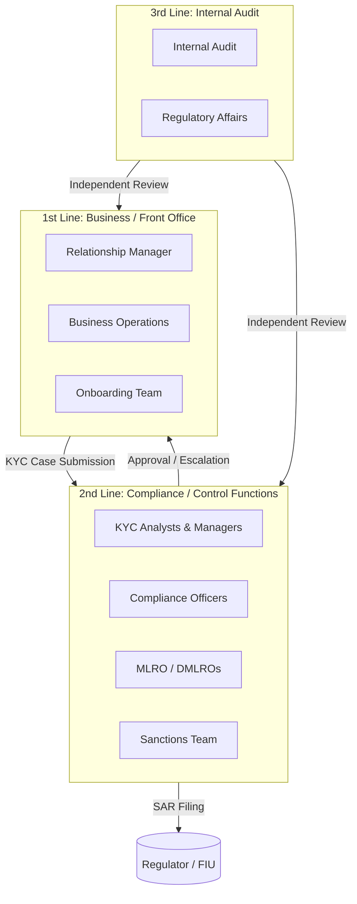
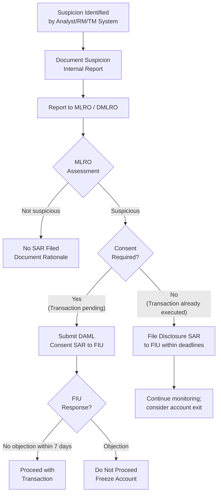

# 06 — Operational Workflow & Case Management

> **Focus:** How KYC operations are run in practice — roles, responsibilities, the Maker-Checker model, case management, SLAs, and how exceptions and escalations are handled.

---

## 6.1 Organisational Structure for KYC Operations

### The Three Lines of Defence Model



---

## 6.2 Role Definitions and Responsibilities

### Relationship Manager (RM)

The RM is the **front-line orchestrator** of the KYC process from the client-facing perspective.

| Responsibility | Detail |
|---------------|--------|
| **Client relationship owner** | Primary point of contact for client |
| **KYC information gatherer** | Explains KYC requirements; collects documents from client |
| **Case initiator** | Opens the KYC case; inputs client data into system |
| **Preliminary plausibility check** | First-pass assessment of whether SoW makes sense |
| **Client intermediary** | Communicates KYC queries and requests to client |
| **First-line alert owner** | Responsible for reviewing TM alerts on their clients |
| **Material change reporter** | Reports significant changes in client circumstances to compliance |

**What the RM must NOT do:**
- Override compliance decisions
- Finalise KYC independently without maker-checker
- Accept inadequate documentation due to client pressure
- Conduct their own sanctions / adverse media screening independently (without system)

### KYC Analyst (CDD Analyst)

KYC Analysts conduct the **technical due diligence** — they process cases assigned to them.

| Responsibility | Detail |
|---------------|--------|
| **Case review** | Review completeness and quality of RM-submitted KYC data |
| **Document verification** | Authenticate documents; identify inconsistencies |
| **Ownership structure mapping** | Map UBO chains; create ownership diagrams |
| **Risk scoring** | Apply risk model; calculate composite score |
| **Screening interpretation** | Review system-generated alerts; disposition hits |
| **Query drafting** | Raise information gaps as formal queries to RM |
| **Case recommendation** | Produce written recommendation: approve / EDD / decline |

### KYC Reviewer / Checker (Maker-Checker Second)

A **separate, more senior** individual reviews the analyst's work:

| Responsibility | Detail |
|---------------|--------|
| **Independent quality review** | Verify the analyst's work is complete and accurate |
| **Risk rating validation** | Confirm the risk rating is appropriate to the facts |
| **Approval authority** | Sign off cases within their delegation |
| **Escalation handling** | Refer high-risk cases upwards |

### Compliance Officer

| Responsibility | Detail |
|---------------|--------|
| **High-risk case approval** | Approve High and Very High risk clients |
| **Policy interpretation** | Resolve borderline cases using policy judgement |
| **Escalation recipient** | Receive escalated edge cases from KYC team |
| **PEP approval** | Approve PEP relationships |
| **SAR assessment** | Assess whether unusual activity needs SAR filing |

### MLRO (Money Laundering Reporting Officer)

The **MLRO** is a legally designated role in most jurisdictions:

| Responsibility | Detail |
|---------------|--------|
| **Senior AML oversight** | Owns the AML framework across the institution |
| **SAR filing authority** | Has the authority (and obligation) to file SARs with FIU |
| **Senior client approval** | Approves Very High risk, UHNW PEPs |
| **Regulatory interface** | Primary contact with AML regulators |
| **MLRO Annual Report** | Produces annual AML report for Board |
| **Policy ownership** | Owns AML Policy, KYC Policy, Sanctions Policy |

---

## 6.3 The Maker-Checker Model

The **Maker-Checker (4-eyes principle)** is a fundamental control in KYC operations that requires every decision to be made by one person and independently verified by another.

```
┌─────────────────────────────────────────────────────────────┐
│                   MAKER-CHECKER MODEL                       │
│                                                             │
│  MAKER (KYC Analyst)                CHECKER (Reviewer)      │
│  ─────────────────────────          ───────────────────     │
│  Prepares KYC case                  Reviews completed case  │
│  Collects documents                 Verifies accuracy       │
│  Runs initial screening             Independent screening   │
│  Calculates risk score              Validates risk score    │
│  Makes recommendation               Approves or challenges  │
│                                                             │
│  Grade: Analyst                     Grade: Senior Analyst   │
│                                     or Manager              │
│                                                             │
│  ▲ IMPORTANT: Maker and Checker must be different people   │
│  ▲ Checker cannot be subordinate to maker on this case     │
└─────────────────────────────────────────────────────────────┘
```

### Tiered Approval by Risk Level

| Risk Rating | Maker | Checker / Approver |
|------------|-------|-------------------|
| Low | KYC Analyst | KYC Supervisor |
| Medium | KYC Analyst | KYC Manager |
| High | Senior KYC Analyst | Compliance Officer |
| Very High | Senior KYC Analyst | MLRO + Regional Compliance Head |
| PEP (Foreign) | Senior KYC Analyst | MLRO (mandatory) + Senior Mgmt sign-off |

---

## 6.4 Case Management System

KYC cases are managed through a **dedicated case management platform** (e.g., Fenergo, Appway, Salesforce Financial Services, or proprietary systems).

### Case Lifecycle in the System

```mermaid
stateDiagram-v2
    [*] --> Draft : RM creates case
    Draft --> PendingDocuments : RM submits initial data
    PendingDocuments --> UnderReview : Documents received; case assigned to analyst
    UnderReview --> QueryRaised : Analyst identifies gaps
    QueryRaised --> PendingDocuments : RM obtains more info
    UnderReview --> EDD : EDD trigger identified
    EDD --> PendingApproval : EDD complete; pending senior sign-off
    UnderReview --> PendingApproval : CDD complete; recommendation made
    PendingApproval --> Approved : Approval granted
    PendingApproval --> Returned : Approval returned — more info needed
    Returned --> UnderReview
    Approved --> Active : Account opened
    Active --> TriggerReview : Event-driven trigger
    Active --> PeriodicReview : Review due date reached
    TriggerReview --> UnderReview
    PeriodicReview --> UnderReview
    Active --> OffboardingCase : Exit initiated
    OffboardingCase --> Closed : Account closed; records archived
```

### Case Data Fields

| Field | Description |
|-------|-------------|
| Case ID | Unique identifier |
| Case Type | New Onboarding / Periodic Review / EDD / Event-Driven |
| Priority | Standard / Urgent / Regulatory Deadline |
| Client Reference | Linked to Client Master Record |
| RM Assigned | Responsible RM |
| KYC Analyst | Assigned analyst |
| Reviewer | Assigned checker |
| Status | Current case status |
| Due Date | SLA deadline |
| Risk Rating (Pending) | Current working risk assessment |
| Outstanding Requirements | Checklist of missing items |
| Approval History | Record of all approvals, rejections, escalations |
| Audit Log | Time-stamped actions by all users |

---

## 6.5 SLA Framework (Service Level Agreements)

KYC SLAs balance **regulatory timeliness obligations** with **operational capacity**.

### Onboarding SLAs

| Client Type | Risk Level | Target Completion | Maximum (Regulatory) |
|------------|-----------|------------------|---------------------|
| New Individual | Low/Medium | 5–7 business days | 15 business days |
| New Individual | High | 10–15 business days | 30 business days |
| New Individual | PEP/Very High | 20–30 business days | 60 business days |
| New Entity | Low/Medium | 10–15 business days | 30 business days |
| New Entity | High/Complex | 20–30 business days | 60 business days |
| Complex Trust/Structure | Any | 30–45 business days | 90 business days |

### Periodic Review SLAs

| Review Type | Initiation | Completion Target |
|------------|-----------|------------------|
| Low Risk (5yr) | 90 days before review due | 30 days before due date |
| Medium Risk (3yr) | 90 days before review due | 30 days before due date |
| High Risk (1yr) | 120 days before review due | 45 days before due date |
| Very High / PEP (6-12mo) | 120 days before review due | 60 days before due date |

### SLA Breach Escalation

```
SLA Breach Threshold        Escalation Action
─────────────────────────   ─────────────────────────────────────
>10% past due date          KYC Team Lead review; RM warned
>25% past due date          KYC Manager escalation; RM manager informed
>50% past due date          Head of Compliance briefed; client may be restricted
100% past due (expired)     Account restrictions activated; SR Mgmt review
```

### Account Restrictions for KYC Expiry
Most banks have an automated **account restriction protocol**:
- KYC within 30 days of expiry: Warning only
- KYC expired: Restriction on new transactions (except inbound)
- KYC expired >90 days: Account freeze; MLRO review for exit consideration

---

## 6.6 Query and Exception Handling

### Queries to Clients

When KYC Analysts identify gaps, they raise **formal queries** through the case system. RM is responsible for resolving queries with the client.

**Query Lifecycle:**

```
Analyst identifies gap
        │
        ▼
Query logged in case system (with description)
        │
        ▼
RM notified via system notification
        │
        ▼
RM contacts client to obtain information
        │
        ▼
Client provides information / documentation
        │
        ▼
RM uploads to case system
        │
        ▼
Analyst reviews ─── Satisfied? ──▶ YES → Query closed
                      │
                      ▼ NO
               Further query raised / escalated
```

**Query Standards:**
- Queries must be specific (not "more documents needed")
- Each query must reference the specific regulatory/policy basis
- Response deadlines must be set (typically 10–20 business days from client)
- Unanswered queries escalate to RM manager after deadline

### Exception Handling

Exceptions arise when a case cannot be progressed through standard workflow:

| Exception Type | Example | Handling |
|---------------|---------|---------|
| **Missing document** | Client can't provide SoW document | Alternative documentation accepted; rationale documented |
| **Conflicting information** | Registry says X, client says Y | Investigation required; explanation documented; escalate if unresolved |
| **Expired document** | Passport expired during review | Flag to RM for re-collection; account restricted until updated |
| **Partial UBO information** | One UBO unresponsive | Limited account opening with terms; escalate at 30 days |
| **Unresolved screening hit** | Name match not confirmed as true hit | Full documentation; multi-level sign-off; monitoring terms |
| **Client uncontactable** | No response for >60 days | Account restrictions; MLRO consulted for exit consideration |

---

## 6.7 Escalation Framework

### Escalation Triggers

```
LEVEL 1 — KYC Manager:
• Analyst uncertainty on risk rating
• Query unresolved after client deadline
• Document authenticity concern
• Minor adverse media hit (civil litigation)

LEVEL 2 — Compliance Officer:
• Significant adverse media (criminal allegation)
• Undisclosed PEP status discovered
• SoW explanation implausible / inconsistent
• Client refuses to provide mandatory documents
• Conflict of interest identified

LEVEL 3 — MLRO:
• Client on sanctions list (true match)
• Suspicion of money laundering / terrorist financing
• PEP with unexplained wealth inconsistency
• Regulatory request (court order, regulator inquiry)
• Proposed SAR filing — MLRO consent required

LEVEL 4 — Senior Management / Board:
• MLRO requires additional authority
• Reputational risk matters
• Systemic AML programme issues
• Regulatory enforcement action against client's connected party
```

---

## 6.8 Suspicious Activity Reporting (SAR / STR)

When KYC review or transaction monitoring reveals **grounds for suspicion**, an SAR must be filed.

### SAR Decision Process



### SAR Key Principles
- **Legal obligation:** Failure to file a SAR when grounds for suspicion exist is a criminal offence
- **Tipping off prohibition:** The client must not be informed an SAR has been filed (criminal offence to tip off)
- **No safe harbour:** Filing an SAR does not automatically protect the bank — the transaction must not proceed without consent where required
- **Quality over quantity:** SARs must contain sufficient detail to be useful intelligence for the FIU

---

## 6.9 Metrics and Reporting

### KYC Operational KPIs

| Metric | Definition | Target |
|--------|-----------|--------|
| **Onboarding Cycle Time** | Days from case open to account opening | <15 days (standard) |
| **Review Cycle Time** | Days from review due to completion | <30 days |
| **SLA Breach Rate** | % of cases past due | <5% |
| **First-Time-Right Rate** | % of cases approved without query | >60% |
| **Query Resolution Rate** | % of queries closed within 20 days | >85% |
| **KYC Currency** | % of client files within review cycle | >95% |
| **High Risk Currency** | % of High/Very High risk files up to date | >99% |
| **False Positive Rate** | TM alerts closed as false positive | <90% (lower is better for efficiency) |
| **SAR Filing Rate** | SARs filed per 1000 clients | Benchmarked to industry |
| **Regulatory Finding Rate** | Deficiencies found during audits/exams | Target: 0 critical findings |

### Management Reporting
MLRO and senior management receive periodic dashboards covering:
- KYC pipeline status (open cases, SLA status)
- PEP and High Risk client inventory
- SAR statistics (filed, under consideration, declined)
- TM alert volume and disposition trends
- Regulatory examination findings and remediation status

---

> **Next:** [07 — Technology & Systems](./07-technology-systems.md)
