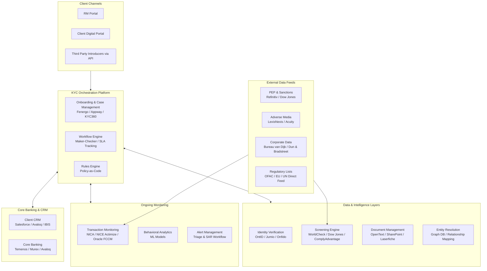
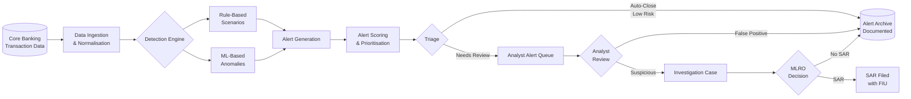

# 07 — Technology & Systems

> **Focus:** The technology stack that powers modern KYC operations — from onboarding platforms to screening engines, transaction monitoring systems, and the emerging role of AI/ML.

---

## 7.1 KYC Technology Landscape

The modern KYC technology ecosystem consists of several distinct but integrated layers:



---

## 7.2 KYC Onboarding & Case Management Platforms

### What They Do
These platforms are the **operational system of record** for KYC. They manage the entire lifecycle from case creation to approval to archival.

### Market Leaders

| Platform | Vendor | Strengths | Typical Use |
|---------|--------|-----------|------------|
| **Fenergo** | Fenergo | End-to-end client lifecycle; strong PB features; rule engine | Tier 1 banks; PB-specific journeys |
| **Appway** (now Objectway) | Objectway | Wealth management focus; flexible workflows | Boutique PB / Family Office |
| **Pega KYC** | Pega Systems | Case management depth; AI integration | Large universal banks |
| **KYC360** | RiskScreen | Mid-market; strong screening integration | Mid-tier banks |
| **AML360 / Temenos** | Temenos | Integrated with Temenos core banking | Temenos banking clients |
| **Oracle FCCM** | Oracle | Transaction monitoring + CDD integrated | Large institutions |
| **Financial Crime Studio** | HSBC internal | Proprietary; advanced AI/ML | HSBC specifically |

### Core Capabilities Required

```
Must-Have Capabilities:
├── Client master data management (MDM)
├── Workflow engine (configurable, not hardcoded)
├── Maker-checker support
├── SLA tracking and escalation
├── Document management and storage
├── Audit trail (immutable)
├── Risk scoring engine
├── Screening integration (API)
├── Core banking integration (CRM, accounts)
├── Reporting and analytics dashboard
└── Regulatory reporting exports

Nice-to-Have / Next-Gen:
├── AI-assisted document extraction (OCR + NLP)
├── Automated UBO graph construction
├── Real-time regulatory change management
├── Digital client portal (eKYC)
├── Natural language query for case notes
└── Predictive risk scoring
```

---

## 7.3 Identity Verification Systems

### Traditional vs. Digital Identity Verification

```
TRADITIONAL                     DIGITAL (eKYC)
──────────────────────────────   ────────────────────────────────────
Certified copy of passport       Biometric liveness check
(physical certification)         (Jumio / Onfido / iProov)
                                 
Bank statement / utility bill    Address verification via credit bureau
(physical document)              
                                 
Face-to-face meeting with RM     Video call with RM
                                 
Wet ink signature                Electronic signature (DocuSign / Adobe)
                                 
Notarised documents              Electronic notarisation
                                 
Relies on postal/courier         Instant; fully digital
```

### eKYC Components

| Component | Technology | What It Does |
|-----------|-----------|-------------|
| **Document Authentication** | OCR + ML | Scans and authenticates passports, IDs; detects forgeries |
| **Liveness Detection** | Biometrics + AI | Proves person is real (not a photo/video); FaceID-level |
| **Face Match** | Facial recognition | Matches selfie to document photograph |
| **Address Verification** | Credit bureau APIs | Verifies address against credit/electoral data |
| **Database Checks** | Company House APIs | Verifies corporate identities against public registries |

### Identity Fraud Risk in eKYC
Digital onboarding introduces new fraud vectors:
- **Synthetic identity fraud:** Fabricated identities combining real and fake data
- **Deepfake attacks:** AI-generated video bypassing liveness checks (increasingly sophisticated)
- **Credential stuffing:** Using stolen credentials to take over digital onboarding flows
- **Injection attacks:** Injecting pre-recorded biometric data into the camera stream

Banks must ensure eKYC vendors apply **ISO 30107 PAD (Presentation Attack Detection)** standards.

---

## 7.4 Screening Systems

### Architecture of a Screening Engine

```
Input: Name (+ optional DOB, address, country)
          │
          ▼
    ┌─────────────────────────────────────────┐
    │         PRE-PROCESSING                  │
    │  Tokenisation → Normalisation           │
    │  Transliteration → Alias Expansion      │
    └─────────────────┬───────────────────────┘
                      │
          ┌───────────┼──────────────┐
          ▼           ▼              ▼
    ┌──────────┐ ┌──────────┐ ┌──────────────┐
    │OFAC/SDN  │ │ PEP DB   │ │ Adverse Media│
    │EU/UN List│ │Commercial│ │  Database    │
    │UK OFSI   │ │(WorldCheck│ │(LexisNexis)  │
    └──────────┘ └──────────┘ └──────────────┘
          │           │              │
          ▼           ▼              ▼
    ┌─────────────────────────────────────────┐
    │         MATCHING ENGINE                 │
    │  • Exact match                          │
    │  • Phonetic (Soundex/Metaphone)         │
    │  • Levenshtein edit distance            │
    │  • N-gram similarity                    │
    │  • DOB range match                      │
    │  • Country/nationality filter           │
    └─────────────────┬───────────────────────┘
                      │
          ┌───────────┴────────────┐
          ▼                        ▼
    ┌──────────────┐         ┌───────────────────┐
    │ TRUE MATCH   │         │ POTENTIAL / FUZZY  │
    │ (High score) │         │  MATCH (Review)    │
    └──────────────┘         └───────────────────┘
    Block + Escalate          Analyst Review:
    immediately               Confirm / Clear
```

### Screening Vendors Comparison

| Vendor | Coverage | Strengths | Weaknesses |
|--------|---------|-----------|------------|
| **WorldCheck (Refinitiv)** | 500K+ profiles | Breadth; bank adoption | Cost; refresh frequency |
| **Dow Jones Risk & Compliance** | 1M+ profiles | News integration; quality | Complex pricing |
| **ComplyAdvantage** | ML-based; real-time | Speed; real-time adverse media | Newer; PEP coverage still growing |
| **LexisNexis RiskNarrative** | Broad data sources | Adverse media depth | Interface complexity |
| **ACUITY** | Unstructured data | Advanced NLP for media | Primarily adverse media; less PEP/sanctions |

---

## 7.5 Transaction Monitoring Systems

### Transaction Monitoring Architecture



### TM Rule Categories (Private Banking)

| Rule Type | Example | PB Relevance |
|-----------|---------|--------------|
| **Threshold** | Single wire >$500K | Calibrated per expected AUM |
| **Velocity** | 5+ wires in 24 hours | Low frequency expected for PB |
| **Structuring** | Multiple transactions just below CTR threshold | High-risk indicator |
| **Geography** | Wire to FATF high-risk jurisdiction | Very relevant for cross-border PB |
| **Round number** | Exact $100,000 wires repeatedly | Possible structuring |
| **Counterparty risk** | Payment to/from shell company | Must be parameterised for PB client structures |
| **Unusual hours** | Transaction processed off-business hours | Context dependent |
| **Cash** | Cash deposit above reporting threshold | Rare for PB; notable when occurs |
| **New counterparty** | First-time wire to new beneficiary >$X | Important for PB |
| **Dormancy break** | Account inactive for 6 months, then large credit | Classic layering pattern |

### TM Calibration Challenges in Private Banking
Default TM rules designed for retail banking generate **massive false positive rates** when applied to PB clients who legitimately:
- Execute large international wire transfers
- Have tax-haven connected counterparties (legitimate)
- Transact in round numbers (capital calls, property purchases)
- Send funds to nominee accounts (for legitimate estate planning)

**Best Practice:** Maintain **client-specific expected transaction profiles** and calibrate TM thresholds individually for UHNW clients. This reduces false positives while maintaining detection effectiveness.

---

## 7.6 Document Management Systems

### Requirements for KYC Document Management

| Capability | Requirement |
|-----------|-------------|
| **Storage** | Secure, encrypted; geo-restricted per data residency |
| **Version control** | Track all versions; know which is current |
| **Expiry tracking** | Alert when documents approach expiry |
| **Access control** | Role-based access; RM sees client docs; analyst sees processing docs |
| **Audit trail** | Who viewed/downloaded/modified; timestamp-stamped |
| **Retention enforcement** | Automatic deletion after retention period |
| **Integration** | API integration with KYC case management platform |
| **OCR & Classification** | Auto-classify document type; extract key data fields |

### Document Classification via AI

Modern systems use **OCR + NLP/ML** to:
1. Classify document type (passport, utility bill, trust deed)
2. Extract key fields (name, DOB, address, expiry)
3. Detect potential document tampering
4. Pre-populate KYC forms from extracted data

This reduces manual data entry and speeds time-to-completion significantly.

---

## 7.7 AI / ML in KYC — Use Cases Deep Dive

### Use Case 1: Intelligent Document Processing

```
Traditional:                     AI-Assisted:
────────────────                 ─────────────────────────
Analyst reads passport           OCR extracts: Name, DOB,
and manually types data  ──▶    Nationality, Expiry, MRZ
into the KYC system             System pre-fills KYC form
                                Analyst validates (not enters)

Benefit: 80% reduction in manual data entry time
```

### Use Case 2: UBO Graph Construction

```
Input: Corporate filings, registry data, trust documents

AI system:
1. Parses ownership percentages from PDFs (NLP)
2. Links entities using entity resolution (graph ML)
3. Constructs visual ownership graph
4. Identifies potential UBOs
5. Flags inconsistencies between documents

Analyst validates and supplements the auto-generated graph
```

### Use Case 3: Adverse Media — NLP Classification

Manual adverse media screening is slow and inconsistent. NLP models:
- Classify news articles as relevant vs. irrelevant to financial crime
- Extract entity mentions with high precision
- Assess sentiment and severity
- Filter across 50+ languages
- Distinguish between civil disputes (low risk) and criminal allegations (high risk)

### Use Case 4: Risk Scoring Enhancement

Traditional rule-based risk scoring uses a fixed questionnaire. ML-based models:
- Learn from **historical patterns** of high-risk clients
- Detect non-obvious combinations of factors that correlate with actual SARs
- Produce **continuous risk scores** (not just bands)
- Identify risk drift in existing clients based on behavioural signals
- Provide explainable outputs (regulatory requirement)

### Use Case 5: Transaction Monitoring — Anomaly Detection

```
Traditional TM:                  ML-Based TM:
────────────────────────────     ──────────────────────────────────────
If (amount > $500K)              For each client, build a behavioural
  AND (country in high_risk)     model of "normal" transactions
  → Generate Alert               
                                 Then detect statistical outliers
  Problem: High false positive   vs. that client's specific baseline
  rate; misses novel patterns    
                                 Lower false positives; higher recall
                                 Identifies patterns rules miss
```

### Use Case 6: Network / Relationship Analytics

Graph ML algorithms detect hidden connections between:
- Clients and sanctioned persons (2nd/3rd degree connections)
- Clients sharing addresses, phone numbers, or IP addresses
- Transaction counterparties that form circular payment rings
- Beneficial owners across multiple client structures (entity resolution)

This is particularly powerful for detecting shell company networks and nominee arrangements.

### AI/ML Governance Requirements

For regulated KYC AI use, banks must ensure:

| Requirement | Detail |
|------------|--------|
| **Explainability** | Model decisions must be explainable to regulators and analysts |
| **Bias testing** | Models must not discriminate by protected characteristics |
| **Model validation** | Independent validation before production deployment |
| **Ongoing monitoring** | Model performance monitored for drift |
| **Human oversight** | AI recommendations, not decisions — humans remain accountable |
| **Audit trail** | All AI outputs logged with inputs and model version |
| **Documentation** | Full model cards and risk assessments |

---

## 7.8 Integration Architecture

### KYC API Integration Map

```
┌───────────────────────────────────────────────────────────────┐
│                    KYC PLATFORM (Hub)                          │
└──────┬───────────┬──────────────┬────────────────┬────────────┘
       │           │              │                │
       ▼           ▼              ▼                ▼
┌──────────┐ ┌──────────┐ ┌─────────────┐ ┌────────────────┐
│ Identity │ │Screening │ │  Corporate  │ │   Core Banking │
│Providers │ │ Engines  │ │  Registries │ │   / CRM / MDM  │
│ Jumio    │ │WorldCheck│ │ Companies   │ │ Salesforce FSC │
│ Onfido   │ │Dow Jones │ │ House       │ │ Avaloq         │
│ iProov   │ │OFAC APIs │ │ BvD (Orbis) │ │ Temenos        │
└──────────┘ └──────────┘ └─────────────┘ └────────────────┘
       │           │              │                │
       └───────────┴──────────────┴────────────────┘
                              │
                   ┌──────────▼─────────┐
                   │  Transaction Mon.  │
                   │  Actimize / FCCM   │
                   │  Oracle SBC TM     │
                   └────────────────────┘
```

### Integration Standards
- **REST API:** Primary integration method for real-time data exchange
- **SWIFT/ISO 20022:** Transaction data standardisation
- **SFTP + EDI:** Batch data loads (end-of-day positions, screening list updates)
- **Webhooks:** Real-time event notification (e.g., screening hit detected)

---

## Summary

The KYC technology stack in Private Banking is a **complex, highly integrated ecosystem** spanning identity, case management, screening, transaction monitoring, documentation, and analytics. The trend is toward **AI-assisted processing** where intelligent tools handle data extraction, pattern recognition, and risk flagging — while human analysts and compliance officers retain decision authority and accountability. The key design principle is that technology should **reduce noise and accelerate review**, not replace human judgment.

---

> **Next:** [08 — Regulatory Landscape](./08-regulatory-landscape.md)
