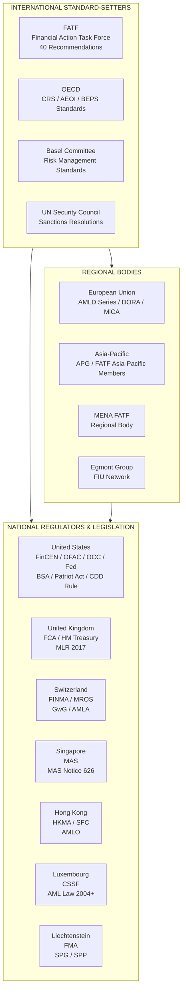

# 08 — Regulatory Landscape

> **Focus:** The global regulatory framework governing Private Banking KYC — from FATF standards to regional implementations, key directives, and the differences between major jurisdictions.

---

## 8.1 The International Architecture of KYC Regulation

KYC regulation operates at multiple levels — international standards setters, regional bodies, and national regulators — each building on the one above.



---

## 8.2 FATF — The Global AML Standard Setter

### What Is FATF?
The **Financial Action Task Force (FATF)** is an intergovernmental body established in 1989 by the G7. Its **40 Recommendations** form the de facto global standard for AML/CTF frameworks. FATF itself does not have regulatory authority, but its standards are adopted by 200+ jurisdictions.

### FATF's 40 Recommendations — Private Banking Relevant

| Recommendation | Content | Private Banking Relevance |
|---------------|---------|--------------------------|
| **R.10** | Customer Due Diligence | Foundation of all CDD requirements |
| **R.11** | Record-keeping | Document retention obligations |
| **R.12** | PEPs | Enhanced measures for PEPs; risk-based approach |
| **R.13** | Correspondent Banking | Due diligence on bank-to-bank relationships |
| **R.14** | Money or Value Transfer Services | Less relevant for PB |
| **R.15** | New Technologies | Risk assessment of new products/technologies |
| **R.16** | Wire Transfers | Payment message requirements; tracing |
| **R.17** | Reliance on Third Parties | Conditions for relying on introducers |
| **R.20** | Reporting of Suspicious Transactions | SAR/STR obligations |
| **R.21** | Tipping Off / Confidentiality | Prohibition on tipping off subjects of SARs |
| **R.22** | DNFBPs (Designated Non-Financial Businesses) | Lawyers, accountants — key introducers for PB |
| **R.29** | Financial Intelligence Units | FIU powers and SAR handling |

### FATF Mutual Evaluations
FATF conducts **peer reviews** of member jurisdictions, assessing the **effectiveness** (not just existence) of AML/CTF controls. Poor evaluations result in:
- Grey/Black listing
- Increased scrutiny for banks in flagged jurisdictions
- Mandatory EDD for clients from grey-listed jurisdictions

### FATF Lists (as of 2026)

| Status | Meaning | KYC Action Required |
|--------|---------|-------------------|
| **Black List (High-Risk)** | North Korea, Iran | Prohibit or apply extraordinary measures |
| **Grey List (Increased Monitoring)** | Updated periodically | Mandatory EDD; enhanced transaction monitoring; senior approval |

---

## 8.3 European Union — AMLD Framework

The EU has progressively strengthened its AML framework through a series of AML Directives:

### Evolution of EU AML Directives

```
AMLD1 (1991) → AMLD2 (2001) → AMLD3 (2005) → AMLD4 (2015) → AMLD5 (2018) → AMLD6 (2019)
     │               │               │               │               │               │
  Initial         Extends         Basel-aligned    FATF 2012      Crypto assets   Criminal
  framework       scope           standards        aligned        PEPs expanded   liability
                                                   Risk-based     UBO registers   extended
```

### AMLD5 — Key Provisions for Private Banking

| Provision | Impact on Private Banking |
|-----------|--------------------------|
| **UBO Register Access** | Public access to beneficial owner registers for companies/trusts |
| **Centralised Bank Account Registries** | FIUs can search who holds accounts across the EU |
| **Expanded list of obliged entities** | Broader scope including more service providers |
| **Enhanced EDD for high-risk 3rd countries** | Mandatory for FATF grey-listed countries |
| **Stricter PEP measures** | Defines domestic PEPs more broadly |
| **Crypto Asset Providers** | Brought under AML scope — relevant for PB clients using crypto |

### AMLD6 — Criminal Liability Extension

AMLD6 (implemented 2020) expanded the **criminal liability** framework:
- Standardised 22 predicate offences for money laundering across EU
- Extended liability to **legal persons** (not just individuals)
- Harmonised minimum criminal penalties
- **Private banking implication:** Individual RMs and Compliance Officers face personal criminal liability

### EU AML Authority (AMLA) — Upcoming
The EU is establishing a new pan-European **AML Authority (AMLA)** expected to:
- Directly supervise the highest-risk financial institutions (including major private banks)
- Create a single rulebook across EU member states
- Increase regulatory consistency across Luxembourg, Switzerland (EEA), Germany, etc.

---

## 8.4 United States

### Key US AML Framework

| Law / Regulation | Key Obligations | Enforced By |
|-----------------|----------------|------------|
| **Bank Secrecy Act (BSA) 1970** | Foundation of US AML; record-keeping, CTR filing | FinCEN via bank regulators |
| **USA PATRIOT Act 2001** | Customer Identification Program (CIP); correspondent banking EDD; special measures | FinCEN / OFAC |
| **FinCEN CDD Rule 2018** | Beneficial ownership identification (25% rule + control person) | FinCEN |
| **Corporate Transparency Act 2021** | Beneficial ownership reporting to FinCEN (CTA BOI Registry) | FinCEN |
| **OFAC Regulations** | Sanctions compliance; block transactions with SDNs | OFAC |

### US Private Banking Specific

**31 CFR 103.178 (Private Banking Accounts):**
The USA PATRIOT Act § 312 requires financial institutions to apply **enhanced due diligence** to private banking accounts maintained for senior foreign political figures:
- Determine if the senior foreign political figure is involved in corruption
- Conduct enhanced scrutiny of account activity
- Report suspicious transactions

This rule applies specifically to accounts with **>$1M aggregate** balance or transactions for a **non-US person**.

### OFAC — The Dominant Sanctions Authority

OFAC wields extraterritorial authority through the USD. Key programmes:
- **SDN List** — Individuals and entities; all US persons must block transactions
- **OFAC Country Programmes** — Comprehensive sanctions (Iran, North Korea, Cuba, etc. — blocking)
- **Sectoral Sanctions (SSI List)** — Russia, Ukraine — specific sector restrictions
- **Non-SDN Consolidated Sanctions List (NS-MBS, CMIC, etc.)** — Investment restrictions

**OFAC Primary vs. Secondary Sanctions:**
- **Primary:** Apply to US persons/businesses
- **Secondary:** Apply to non-US parties; can result in being cut off from US financial system

For Private Banking: Any global institution processing **USD transactions** is effectively subject to OFAC. This is the primary driver of USD being the dominant sanction weapon.

---

## 8.5 United Kingdom

### Post-Brexit UK AML Framework

The UK maintained equivalence with EU standards post-Brexit but has developed its own framework:

| Regulation | Content |
|-----------|---------|
| **Money Laundering Regulations 2017 (MLR 2017)** | Primary AML regulation; implements FATF and (pre-Brexit) AMLD |
| **Proceeds of Crime Act 2002 (POCA)** | Criminal law underpinning; offence to facilitate money laundering |
| **Terrorism Act 2000** | CTF offences; reporting obligations |
| **Sanctions and Anti-Money Laundering Act 2018** | Post-Brexit sanctions framework |
| **FCA Handbook SYSC/DEPP** | Supervisory standards; Senior Manager accountability |

### UK-Specific Private Banking Regime

**Senior Managers and Certification Regime (SM&CR):**
The FCA's SM&CR holds named senior individuals personally responsible for regulatory compliance within their remit. For Private Banking, this means:
- MLRO is a **named, approved individual** under SMF 17
- Compliance Officer is often an approved person
- **Personal liability** for failures within their area

**UK National Risk Assessment:**
Private Banking is explicitly identified in the UK's National Risk Assessment (NRA) as a **high-risk activity** requiring specific attention.

---

## 8.6 Switzerland — The Private Banking Capital

Switzerland is home to major global private banking activity and has its own robust AML framework.

### Swiss AML Framework

| Law / Regulator | Content |
|----------------|---------|
| **AMLA (Geldwäschereigesetz — GwG)** | Swiss AML Act; CDD, SAR, record-keeping |
| **FINMA** | Federal Financial Market Supervisory Authority; supervises banks |
| **MROS (MELANI)** | Swiss FIU; receives suspicious reports |
| **FATF Member** | Switzerland is a FATF member; 40 Recommendations apply |
| **Self-Regulatory Organisations (SROs)** | VSBC, PkbSRO — SRO frameworks for smaller PB participants |

### Swiss vs. EU Comparison

| Area | Switzerland | EU/UK |
|------|------------|-------|
| **Privacy** | Historically strong banking secrecy (Article 47 Banking Act) — greatly eroded by FATCA/CRS | Lower privacy expectations |
| **CRS participation** | Yes — full CRS participant | Yes |
| **FATCA** | IGA signed — reports to IRS | US persons report to IRS |
| **EDD for PEPs** | Required; strong regulatory attention | Required |
| **Sanctions** | SECO list + UN; with some divergence from US/EU | EU or UK-specific lists |
| **Regulatory culture** | Principles-based; strong industry dialogue | More prescriptive |

---

## 8.7 Asia-Pacific

### Singapore — MAS

Singapore is a major Private Banking hub in Asia. The **Monetary Authority of Singapore (MAS)** is one of the world's most rigorous AML supervisors.

**MAS Notice 626 (Private Banks):**
- Dedicated AML/CFT notice specifically for private banks
- Requires enhanced verification for unique and complex structures
- Mandates comprehensive SoW and SoF documentation
- Strong FI identification requirements
- Explicit requirements for trusts, foundations, and complex vehicles

**Singapore-Specific Features:**
- Active use of **Variable Capital Companies (VCCs)** — MAS must approve; KYC required
- **Trust Company Act** — Regulated trustees must conduct full KYC
- Strong enforcement history — MAS has revoked licences and imposed heavy fines (BSI Bank, Falcon Bank — 1MDB scandal)

### Hong Kong — HKMA / SFC

- **AMLO (Anti-Money Laundering and Counter-Terrorist Financing Ordinance)** — primary AML legislation
- **HKMA** supervises banks; **SFC** supervises securities firms
- Private banking requires EDD for **foreign PEPs** (consistent with global standards)
- CRS and FATCA both apply; strong AEOI programme

### APAC Different Risk Environments

| Country | Risk Level | Key Issues |
|---------|-----------|-----------|
| Singapore | Lower (well regulated) | Trust structuring; cross-border flows |
| Hong Kong | Medium | Mainland China flows; shell companies |
| Cayman Islands | Elevated | Offshore; fund administration |
| BVI | Elevated | Shell company prevalence |
| UAE (Dubai) | Medium-Elevated | Cash economy; FATF grey-listed 2022 (removed 2024) |

---

## 8.8 Key Regulations Summary Table

| Regulation | Jurisdiction | Scope | Private Banking Relevance |
|-----------|-------------|-------|--------------------------|
| FATF 40 Recommendations | Global | General AML/CTF | Framework basis for all KYC |
| AMLD5/6 | EU | AML Directives | UBO registers, EDD, PEP obligations |
| BSA + Patriot Act | US | AML programme | CIP, correspondent banking EDD, CTRs |
| OFAC Regulations | US (global reach) | Sanctions | All USD transactions; SDN screening |
| CDD Rule | US | Beneficial ownership | 25% UBO identification |
| MLR 2017 | UK | AML regulations | Full CDD/EDD obligations |
| GwG / AMLA | Switzerland | AML | Swiss private bank obligations |
| MAS Notice 626 | Singapore | Private banking | Dedicated PB requirements |
| AMLO | Hong Kong | AML | HK-based private banks |
| FATCA | US (global) | Tax reporting | US persons anywhere in world |
| CRS | OECD (global) | Tax transparency | Reportable accounts for 110+ countries |

---

## 8.9 Regulatory Examination Focus Areas

When regulators examine Private Banking KYC, their primary focus areas are:

```
TYPICAL REGULATORY EXAMINATION SCOPE — PRIVATE BANKING KYC:

1. GOVERNANCE & OVERSIGHT
   □ Does the MLRO have appropriate authority and resources?
   □ Does the Board receive adequate AML reporting?
   □ Is the three-lines model functioning effectively?

2. CUSTOMER RISK RATING
   □ Is the methodology risk-based and documented?
   □ Are PEPs correctly identified and rated?
   □ Are ratings reviewed and updated dynamically?

3. HIGH-RISK CLIENT FILES (Deep Dives)
   □ KYC completeness for highest-risk 5–10%
   □ EDD quality for PEPs and Very High risk
   □ SoW documentation — plausible and corroborated?

4. TRANSACTION MONITORING
   □ Are TM rules calibrated to the PB client population?
   □ Alert investigation quality
   □ SAR decision quality

5. PEP IDENTIFICATION
   □ Coverage of screening lists
   □ RCA identification
   □ Ongoing monitoring for political changes

6. SANCTIONS
   □ Screening list currency
   □ True hit escalation
   □ Secondary sanctions awareness

7. SAR QUALITY
   □ Timely filing
   □ Quality of intelligence provided
   □ Tipping off prevention

8. RECORD KEEPING
   □ Completeness; currency; accessible within regulatory timeframe
```

---

> **Next:** [09 — Risk & Challenges](./09-risk-challenges.md)
