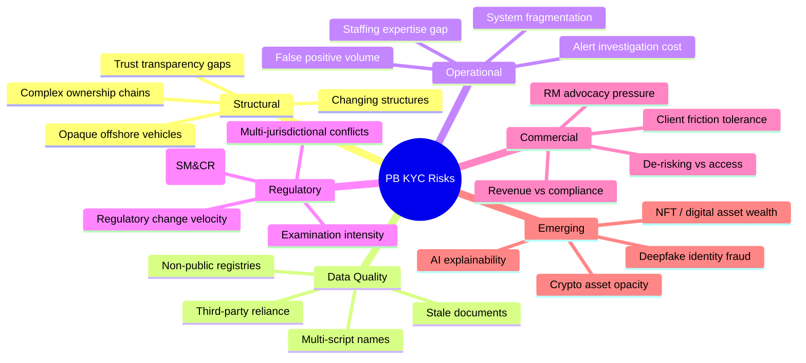

# 09 — Risk & Challenges in Private Banking KYC

> **Focus:** The distinctive complexity, practical pain points, and structural challenges encountered in executing KYC for Ultra-High-Net-Worth and High-Net-Worth clients. Covers structural risks, operational friction, regulatory tension, and emerging risks.

---

## 9.1 The Fundamental Challenge — Competing Objectives

Private Banking KYC sits at the intersection of several irreconcilable tensions:

```
              ┌─────────────────────────────────────────────────────────┐
              │           THE PRIVATE BANKING KYC PARADOX               │
              └─────────────────────────────────────────────────────────┘

         REGULATORY DEMAND                        BUSINESS DEMAND
         ─────────────────                        ────────────────
         Maximum information                vs    Minimum friction
         Comprehensive documentation        vs    Speed to revenue
         Risk proportionate scrutiny        vs    Consistent client experience
         Continuous monitoring              vs    Relationship discretion
         Objective risk assessment          vs    RM client advocacy
         
         "Know Thy Client Deeply"           vs    "Protect Client Privacy"
```

These tensions don't go away — they must be managed through policy, governance, and culture.

---

## 9.2 Complex Ownership Structures

### The Core Problem

UHNW clients typically use layered structures that:
- **Obscure beneficial ownership** intentionally or for legitimate estate planning
- **Span multiple jurisdictions** with different transparency requirements
- **Change over time** without proactive client notification

### Depth of Challenge by Entity Type

| Entity Type | Primary Challenge |
|------------|-----------------|
| **BVI Company** | No public UBO registry; must rely on client disclosure + registered agent |
| **Cayman Islands LP** | Complex fund structures; limited partner identity not always public |
| **Liechtenstein Foundation** | Unique civil law structure; beneficiaries may be unborn/unnamed |
| **Jersey Discretionary Trust** | Trustee has absolute discretion; beneficiaries may not be known at outset |
| **Panama Corporation** | Bearer shares historically; nominee directors common |
| **UAE Free Zone Company** | Various regulatory standards; some zones less transparent |
| **Offshore Fund** | Nominees, feeder funds, parallel structures |
| **Private Trust Company (PTC)** | Purpose company acting as trustee; ultimate ownership of PTC is the key |

### Ownership Depth Problem

```
Typical UHNW structure requiring KYC:

Individual Client (Viktor H.)
        │
        ├── Jersey Discretionary Trust
        │       └── Trustees: XYZ Trust Co. Ltd. (Jersey)
        │               └── KYC required for: Trust Company principals
        │
        │   Trust assets:
        │       └── BVI Holdco (XYZ Holdings Ltd.)
        │               └── Director: Nominee Director Company (BVI)
        │                       └── KYC required for: Nominees; +
        │                           UBO declaration pointing back to Viktor
        │
        │   BVI Holdco owns:
        │       ├── UK OPCo (XYZ UK Ltd.) ──▶ KYC: Directors + UBO
        │       ├── Swiss Fund Interest ──▶ KYC: Fund manager + UBO declaration
        │       └── Art Collection (via SPV) ──▶ KYC: SPV UBO
        │
        └── Personal Account (Viktor H. personally)

TOTAL KYC SUBJECTS REQUIRED: ~8–12 entities + individuals
JURISDICTIONS INVOLVED: 5 (Jersey, BVI, UK, Switzerland, and home country)
```

---

## 9.3 Data Quality & Document Sourcing

### Universal Data Quality Challenges

| Challenge | Impact | Common Cause |
|-----------|--------|-------------|
| **Stale photo ID** | Facial recognition mismatches | Passports not renewed |
| **Expired corporate documents** | KYC file non-compliant | Certificate of Incorporation / Good Standing not updated |
| **Outdated ownership structures** | UBO errors in file | Client changed structure; RM not informed |
| **Offshore registry gaps** | Cannot verify UBO | BVI, Cayman, Panama registries often non-public |
| **Translated documents** | Authenticity risk | Non-standard certified translations |
| **Names in multiple scripts** | Screening misses | Arabic, Cyrillic, Chinese names with multiple transliterations |

### The UBO Registry Problem

```
UBO REGISTRY AVAILABILITY BY JURISDICTION:

EU Member States:        ████████████████████ 95%+ (AMLD5 mandated)
UK:                      ████████████████████ 90%+ (PSC Register + ECCTA)
Switzerland:             ██████████░░░░░░░░░░ 40% (no fully public UBO register)
BVI:                     ████░░░░░░░░░░░░░░░░ 15% (no public access; BOSS system limited)
Cayman Islands:          ███░░░░░░░░░░░░░░░░░ 10% (CIMA has access; not public)
Panama:                  ██░░░░░░░░░░░░░░░░░░  5% (Panama Papers aftermath; limited reform)
UAE:                     ████████░░░░░░░░░░░░ 35% (improvement post-FATF grey list)
```

**Banks must rely on:** Client self-declaration + structured legal opinions + registered agent confirmation + open-source intelligence.

---

## 9.4 The False Positive Problem

### Scale of the Problem

In Private Banking, screening operations face a disproportionately high false positive rate due to:
- International client base = higher overlap with sanctions/PEP lists
- Multi-name, multi-transliteration clients
- Common names in Middle Eastern, Chinese, Russian populations

### False Positive Statistics (Industry Benchmarks)

| Screening Type | Typical False Positive Rate | Volume Impact |
|---------------|--------------------------|--------------|
| Sanctions screening (name only) | 1,000:1 to 10,000:1 per match | Every new client triggers hits |
| PEP screening | 50:1 to 500:1 | Large family names; common surnames |
| Adverse media | 200:1 to 2,000:1 | News corpus misattributions |
| TM alerts | 95–98% false positive | Only 2–5% of TM alerts are suspicious |

### Business Impact

```
FOR EVERY 1,000 SCREENING ALERTS IN PRIVATE BANKING:

     ┌─────── 1,000 Raw Alerts
     │
     ├── 950–990: FALSE POSITIVES
     │   ├─ Different person, same name
     │   ├─ Historical/outdated entries
     │   ├─ Fuzzy match on partial name
     │   └─ Already reviewed and cleared
     │
     └── 10–50: REQUIRE INVESTIGATION
         ├─ 8–45: CONFIRMED FALSE POSITIVE after research
         └─ 1–5: TRUE MATCH (suspicious or genuine PEP/sanction)

Cost to investigate each alert: £200–£1,000 (analyst time)
Annual TM alert volume (mid-size PB): 20,000–100,000 alerts
Annual wasted investigation cost: £4M–£95M on false positives
```

### Mitigation Strategies

1. **Fuzzy Match Threshold Tuning** — Adjust similarity scores to reduce noise without missing hits
2. **Contextual Disambiguation** — Use date of birth, nationality, address to disambiguate
3. **Negative News Consolidation** — Cluster news articles by person, not keyword
4. **Whitelisting With Re-screening** — Cleared false positives are automatically disclosed when new information appears
5. **AI-assisted Alert Triage** — ML models pre-score alert likelihood before human review
6. **Periodic List Quality Review** — Assess screening vendor list quality and currency

---

## 9.5 Regulatory Pressure vs. Client Experience

### The First-Class Client Dilemma

Private Banking clients are accustomed to **bespoke, frictionless service**. KYC due diligence — especially EDD — conflicts with that expectation.

| KYC Requirement | Client Friction Level | RM's Desire | Compliance Need |
|----------------|----------------------|------------|----------------|
| Request for source of wealth narrative | HIGH — "Why are you questioning my wealth?" | Minimise or skip | Mandatory EDD |
| Request for tax residency certificate | MEDIUM | Delay | FATCA/CRS legal requirement |
| Request for passport re-verification | LOW-MEDIUM | Delegate to assistant | CIP obligation regularly |
| Request for trust deed + beneficiary list | VERY HIGH — "My trust is private" | Provide summary | Full documentation needed |
| Request for sanctions questionnaire (RCA) | HIGH — "Are you calling my family criminals?" | Avoid topic | PEP rule requires it |
| Request for UBO declaration under corporate | MEDIUM | Sign quickly | CDD Rule requirement |

### RM Advocacy Problem

```
The "Advocacy Cycle":

   RM builds close relationship with client
         │
         ▼
   Client resists KYC requests
         │
         ▼
   RM advocates internally to "ease" requirements
         │
         ▼
   Compliance applies exceptions or reduces scrutiny
         │
         ▼
   Poor KYC file quality
         │
         ▼
   Regulatory examination finds gaps
         │
         ▼
   Bank faces regulatory action
         │
         ▼
   RM faces disciplinary action
```

**Solution:** Policies must be designed for **RM non-involvement** in KYC decisions — especially escalations and risk ratings. Independent KYC Analyst model reduces advocacy bias.

---

## 9.6 Cross-Border Regulatory Conflict

### Conflicting Regulatory Obligations

Private Banking clients often trigger overlapping and sometimes contradictory regulatory obligations:

| Conflict | Jurisdiction A | Jurisdiction B | How Banks Resolve |
|----------|---------------|----------------|-------------------|
| **Data Sharing** | GDPR requires client consent for data transfer | US Regulatory demands information without client consent | Legal opinions; Privacy Shield equivalent; data localisation |
| **Beneficial Owner Threshold** | EU/UK: 25% threshold | Australia: 25% threshold | Switzerland: no fixed threshold (control-based) | Apply most conservative threshold globally |
| **PEP Duration** | UK: PEP definition ends 12 months after leaving office | FATF: Risk-based, no fixed endpoint | Banks apply longer period as conservative approach |
| **Document Retention** | GDPR: Minimise retention | AML: Retain for 5–10 years post relationship | AML exception to GDPR; specific retention schedules |
| **Local Banking Secrecy** | Swiss Banking Act historically requires confidentiality | FATCA/CRS requires disclosure to IRS/partner states | FATCA IGAs override secrecy; consent/legal compulsion |
| **Sanctions** | US OFAC secondary sanctions (Russian oil companies) | EU member state primary sanctions (different scope) | Apply most restrictive; dual review |

---

## 9.7 Technology & System Limitations

### Common Technology Gaps in Private Banking KYC

| Gap | Description | Impact |
|-----|-------------|--------|
| **Fragmented Systems** | CRM, KYC platform, TM, screening not integrated | Manual re-keying; data inconsistency |
| **PDF-based Workflows** | Documents stored as PDFs, not structured data | Cannot auto-extract; OCR errors |
| **No Entity Graph** | Systems track individuals, not relationships between entities | UBO analysis requires manual effort |
| **Static Risk Ratings** | Ratings set at onboarding; not updated dynamically | Stale risk picture |
| **Siloed TM** | TM looks at one account; misses cross-account patterns | Smurfing, split transactions missed |
| **Poor Name Matching** | Legacy systems use exact name matching | Misses transliteration variants |
| **Limited API Connectivity** | No real-time registry lookups | Manual document collection |
| **No Audit Trail Granularity** | Cannot demonstrate reviewer decision logic | Regulatory finding risk |

---

## 9.8 Staffing & Expertise Challenges

### The KYC Talent Scarcity

Private Banking KYC is a **specialised skill set** that is in short supply globally:

```
SKILLS REQUIRED FOR PB KYC ANALYST:

Technical KYC Knowledge:
  ✓ UBO analysis (complex entity structures)
  ✓ PEP / Sanctions understanding
  ✓ SoW/SoF document analysis
  ✓ Offshore jurisdiction knowledge (BVI, Cayman, Jersey, Jersey trusts)

Legal / Regulatory:
  ✓ AMLD5/6 knowledge
  ✓ US Patriot Act § 312
  ✓ FATF interpretation
  ✓ GDPR data handling

Language Skills:
  ✓ Often need Russian, Mandarin, Arabic, French
    (to verify documents, review media)

Commercial Awareness:
  ✓ Understand wealth creation narratives (M&A, real estate, etc.)
  ✓ Assess plausibility of SoW claims
  ✓ Private equity, trust law basics

RESULT: Experienced PB KYC specialists command £80K–£150K+ salaries
        High attrition; competition from FS firms bidding for same talent
```

---

## 9.9 De-Risking & Client Exclusion Risk

### Over-Compliance as a Risk

The flip side of insufficient KYC is **over-compliance**: applying such strict standards that legitimate, high-value clients cannot be onboarded or are exited.

| Scenario | Risk |
|----------|------|
| Refusing all PEPs | Excludes legitimate senior public servants and their families |
| Refusing all clients from sanctioned-adjacent countries | Turns away legitimate diaspora and naturalised citizens |
| Requiring 100% public corroboration of SoW | Impossible for older wealth accumulated without formal records |
| Mechanical application of risk matrix without judgement | Risk scoring penalises legitimate complexity |

**The de-risking problem** is a documented concern of FATF, FATF-Style Regional Bodies, and the World Bank. Regulators explicitly acknowledge that **mechanical risk avoidance** is not compliant behaviour — proportionate risk management is required.

---

## 9.10 Risk Map Summary



---

> **Next:** [10 — Best Practices & Modern Trends](./10-best-practices-trends.md)
