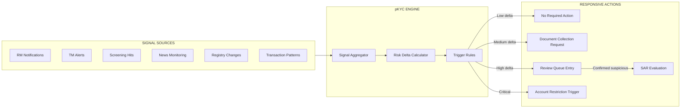
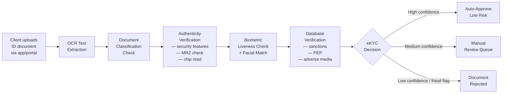

# 10 — Best Practices & Modern Trends

> **Focus:** How leading private banks are innovating the KYC function — from perpetual KYC and digital identity to AI/ML deployment and utility models. Covers both tactical best practices and strategic transformations.

---

## 10.1 Foundational Best Practices

Before discussing innovation, these foundational practices distinguish leading KYC programmes from laggards:

### Programme Maturity Ladder

```
LEVEL 1 — COMPLIANT (Minimum Viable)
□ Written AML policies and procedures
□ CIP / CDD / EDD documented
□ Manual screening against sanctions/PEP lists
□ Annual periodic reviews
□ SAR filing capability

LEVEL 2 — CONTROLLED (Industry Baseline)
□ Risk-based tiering with written criteria
□ Maker-Checker for KYC approvals
□ Automated screening with tuned thresholds
□ Rule-based transaction monitoring
□ Documented review trails / audit logs
□ MLRO reporting to Board

LEVEL 3 — OPTIMISED (Best Practice)
□ Dynamic risk rating (event-driven updates)
□ AI-assisted alert triage
□ Digital identity verification (biometric/eKYC)
□ Perpetual KYC (real-time monitoring triggers reviews)
□ Integrated data model (CRM + KYC + TM unified)
□ Predictive analytics (identify risk before event)
□ KYC utility/shared infrastructure participation

LEVEL 4 — LEADING (Emerging)
□ Graph-based entity network analysis
□ Federated identity model (client consent + portability)
□ Real-time regulatory reporting
□ Regulatory Intelligence automation (auto-update to rule changes)
□ Explainable AI decisions with regulator-ready audit trail
```

---

## 10.2 Perpetual KYC (pKYC)

### Traditional Periodic Review vs. Perpetual KYC

| Dimension | Traditional Periodic Review | Perpetual KYC |
|-----------|----------------------------|--------------|
| **Trigger** | Calendar-based (annual/bi-annual) | Event-driven + continuous signal monitoring |
| **Data freshness** | Stale between reviews | Near-real-time |
| **Effort distribution** | Batch peaks (all reviews at once) | Distributed, continuous low-level activity |
| **Client friction** | Periodic disruptive requests | Smaller, more frequent micro-interactions |
| **Regulatory alignment** | Compliant baseline | Proactive; exceeds minimum requirements |
| **Alert integration** | Disconnected from TM | TM alerts feed pKYC triggers |
| **Tech requirements** | Low (manual or basic workflow) | High (event streaming, APIs, data platform) |

### pKYC Architecture



### Threshold Design for pKYC Triggers

| Signal | Low Risk Trigger | High Risk Trigger |
|--------|-----------------|------------------|
| New negative news article | 2+ credible articles | 1 article + cross-reference |
| Transaction anomaly | Score >0.6 vs baseline | Score >0.85 vs baseline |
| Ownership change | Reported by client | Registry shows different owner |
| Legal proceedings filed | — | Any court filing |
| Sanctions list update | Fuzzy match >0.7 | Exact match |
| Jurisdiction change | Client moved to low-risk | Client moved to sanctioned/FATF grey list |

---

## 10.3 Digital Identity & eKYC

### The Digital KYC Journey



### Biometric Identity Verification Technologies

| Technology | Capability | Private Banking Use Case |
|-----------|-----------|------------------------|
| **Document OCR** | Extract text from passports, IDs | Automated CIP data population |
| **NFC Chip Reading** | Read e-Passport chip | Highest confidence ID verification |
| **Liveness Detection** | Active (challenge-response) / Passive | Prevent photo spoofing |
| **Facial Biometrics** | Match selfie to document photo | Identity binding |
| **Deepfake Detection** | Detect AI-generated video | Emerging; required for video KYC |
| **Voice Biometrics** | Customer authentication | Ongoing authentication, not onboarding |

### Deepfake Risk in Private Banking

With UHNW clients increasingly:
- Requesting remote onboarding
- Using video KYC (especially post-COVID)
- Being targeted by sophisticated fraud

**Deepfake attacks** present a real risk. Best practices:
1. **Active liveness tests** — require random head movements, blink patterns
2. **Randomised challenge during video** — unpredictable actions the AI cannot pre-generate
3. **ID + selfie + live video all simultaneously** — harder to spoof all three
4. **Document metadata verification** — file creation dates, device metadata

---

## 10.4 Risk-Based Approach (RBA) — Deep Dive

The Risk-Based Approach (RBA) is **the regulatory expectation** globally. It means allocating compliance resources in proportion to risk — not applying uniform treatment.

### RBA vs. Rules-Based Approach

| Dimension | Rules-Based | Risk-Based |
|-----------|-------------|-----------|
| **Standard** | Same for all clients | Proportionate to risk |
| **Documentation** | Checklist compliance | Justify your judgement |
| **Regulatory expectation** | Historically aligned | Current FATF/EU/FCA standard |
| **Risk of over-scrutiny** | Low (everyone treated equally) | Medium (must justify reduced CDD) |
| **Risk of under-scrutiny** | Medium (no differentiation) | Low (high risk gets more attention) |
| **Flexibility** | Low | High |
| **Effort** | Uniform | Optimal (focus on high-risk) |

### Risk Factor Framework

Risk factors combine to produce a composite risk rating. Leading institutions use a weighted model:

```
COMPOSITE RISK SCORE = 
    (Country Risk × w1) + 
    (Industry/SoW Risk × w2) + 
    (Product Risk × w3) + 
    (Delivery Channel Risk × w4) + 
    (Client Type Risk × w5) + 
    (PEP/Sanctions Flag × w6)

Weight design considerations:
    - Weights should reflect actual money laundering typologies
    - Senior management approve weight assignments
    - Back-test: Does the model flag known cases?
    - Reviewed annually; adjusted for emerging risks
```

### Calibrating RBA for Private Banking

| Risk Factor | Low PB Weight | High PB Weight Scenario |
|------------|--------------|-------------------------|
| Client type (individual HNW) | Lower than corporate | Higher if no formal employment record |
| Country of nationality | FATF compliant country | FATF grey/black listed |
| SoW type | Salaried income, public records | Complex corporate transactions, offshore |
| PEP status | No PEP connection | Direct PEP / Close associate of FPP |
| Offshore vehicle | Simple holding company | Multiple layers; opaque jurisdiction |
| Product | Standard investment account | Private equity, art financing |

---

## 10.5 KYC Utilities & Shared Infrastructure

### What Are KYC Utilities?

**KYC Utilities** are shared service platforms where multiple financial institutions collectively maintain client KYC data, reducing duplication and cost.

| Utility Model | Description | Key Players |
|--------------|-------------|------------|
| **SWIFT KYC Registry** | Centralised correspondent banking KYC profiles | SWIFT member banks |
| **Shared Onboarding Platforms** | Banks share a KYC platform; data stays isolated | Fenergo, Genpact, Synechron |
| **Client KYC Passporting** | Client completes KYC once; shares with multiple FIs with consent | Various national proposals |
| **National Utilities** | Government-sponsored shared KYC (e.g., Finland, Singapore MyInfo) | National ID systems |

### Benefits and Limitations

| Benefit | Limitation |
|---------|-----------|
| Reduced duplication (clients fill forms once) | Competitive sensitivity (banks share client data) |
| Lower compliance cost | Liability for others' KYC quality |
| Better client experience | Regulatory acceptance varies by country |
| Standardised data quality | Privacy regulations complicate data sharing |

---

## 10.6 Automation Balance: What to Automate vs. What to Keep Human

Not all KYC can or should be automated. Leading banks define clear boundaries:

```mermaid
quadrantChart
    title KYC Functions: Automate vs Human
    x-axis Low Value --> High Value
    y-axis Low Complexity --> High Complexity

    Document Collection: [0.2, 0.2]
    Data Entry from Docs: [0.2, 0.3]
    Sanctions Screening: [0.4, 0.4]
    TM Alert Triage (AI): [0.5, 0.5]
    PEP Identification: [0.5, 0.6]
    SoW Plausibility: [0.8, 0.7]
    EDD Judgement: [0.85, 0.85]
    SAR Decision: [0.9, 0.9]
    Risk Rating Override: [0.9, 0.8]
```

**Critical principle:** AI should **assist** human judgement for high-complexity decisions, not replace it. Regulators (FCA, MAS, FinCEN) expect human accountability for SAR filings and EDD approvals.

---

## 10.7 Explainability & Auditability

As AI moves into KYC, regulators are increasingly asking: **"Why did you make this decision?"**

### Requirements for Explainable KYC Decisions

| Decision Type | Minimum Explainability Standard |
|--------------|-------------------------------|
| **Risk Rating** | Show which factors were rated, what weights applied, what the final score was |
| **EDD Trigger** | Document which risk flag triggered EDD and why |
| **SAR Filing** | Full narrative: typology, timeline of suspicious behaviour, amounts |
| **SAR Non-Filing** | Record why a suspicious activity was investigated but not filed |
| **Account Restriction** | Document trigger; client notification standards |
| **Client Exit** | Detailed exit memo; regulator subpoena readiness |
| **AI Model Decisions** | Feature importance; ability to explain in plain language |

### Audit Trail Requirements

```
MINIMUM AUDIT TRAIL FOR REGULATORY EXAMINATION:

For each KYC decision point, record:
  [1] What data was reviewed?          ← Input evidence
  [2] Who reviewed it?                 ← Accountable individual
  [3] When was it reviewed?            ← Timestamp (immutable)
  [4] What was the conclusion?         ← Decision + rationale
  [5] What approval was obtained?      ← Approval chain (maker + checker)
  [6] What exceptions were applied?    ← Exception log with approver
  [7] What monitoring was set up?      ← Ongoing monitoring parameters
```

---

## 10.8 Regulatory Technology (RegTech)

### The RegTech Landscape for Private Banking KYC

| Category | What It Does | Leading Vendors |
|----------|-------------|----------------|
| **Identity Verification** | Digital identity; biometric onboarding | Onfido, Jumio, Veriff, iProov |
| **Corporate Data Aggregation** | Pull registry data; build ownership graphs | LexisNexis, Refinitiv, Dun & Bradstreet |
| **Sanctions/PEP Screening** | Consolidated list management | LSEG World-Check, Dow Jones, ACURIS |
| **Adverse Media** | News intelligence; NLP monitoring | Ripjar, ACURIS Now, Castellum.AI |
| **Transaction Monitoring** | Pattern-based and ML-based TM | NICE Actimize, Oracle FCCM, FICO, Feedzai |
| **KYC Orchestration** | Case management; workflow automation | Fenergo, Pega, Appway, Encompass |
| **Graph Analytics** | Network analysis; entity relationships | Quantexa, ThetaRay, DataWalk |
| **Regulatory Change Management** | Track/translate regulatory updates | Ascent RegTech, Clausematch |

---

## 10.9 Digital Asset & Crypto KYC

As UHNW clients increasingly hold:
- Crypto assets (Bitcoin, Ethereum)
- NFTs
- DeFi positions
- Tokenised real-world assets

Private banks must evolve KYC to handle these:

| Challenge | Traditional KYC Can Do | New Capability Needed |
|-----------|----------------------|----------------------|
| Source of crypto wealth | Verify fiat-to-crypto origin | Blockchain analytics (Chainalysis, Elliptic) |
| Wallet ownership verification | — | Cryptographic proof of ownership / signing |
| DeFi exposure | — | Protocol risk assessment |
| NFT valuation | — | NFT market / auction provenance |
| Mixer history | — | Chain analysis for obfuscation flags |

---

## 10.10 Key Trends Summary

```
PRIVATE BANKING KYC TRENDS 2025–2027:

1. PERPETUAL / CONTINUOUS KYC                                [ADOPTED by top tier banks]
   Moving from calendar-based to event-driven reviews

2. DIGITAL IDENTITY & REMOTE ONBOARDING                     [WIDELY ADOPTED]
   Biometric ID; video KYC; NFC passport reading

3. AI-ASSISTED KYC (Not Autonomous)                         [MAINSTREAM, with guardrails]
   ML alert triage; NLP adverse media; graph UBO analysis

4. EXPLAINABLE AI GOVERNANCE                                 [REGULATORY REQUIREMENT]
   All AI decisions must be human-inspectable

5. KYC UTILITIES & DATA SHARING                             [EMERGING]
   National MyInfo-style systems; bank consortia

6. CRYPTO/DIGITAL ASSET KYC                                 [RAPIDLY DEVELOPING]
   Blockchain analytics as standard tool

7. ESG-KYC INTEGRATION                                      [EARLY STAGE]
   Using KYC data to identify ESG risks in client structures
   (e.g., arms dealing, environmental violations)

8. AMLA (EU) CONVERGENCE                                    [COMING 2027-2028]
   Direct supervision of largest EU private banks

9. PRIVACY-PRESERVING COMPLIANCE                            [EMERGING]
   Zero-knowledge proofs for identity verification without raw data sharing

10. REAL-TIME REGULATORY REPORTING                          [FUTURE STATE]
    Direct electronic SAR/STR pipelines to FIUs
```

---

> **Next:** [11 — Real-World Example: UHNW Onboarding Case Study](./11-real-world-example.md)
