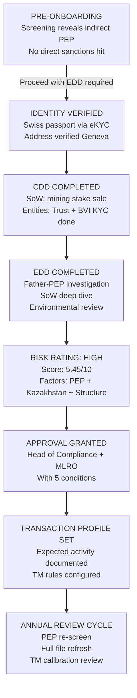

# 11 — Real-World Example: UHNW Onboarding Case Study

> **Focus:** A complete, end-to-end worked example of KYC for an Ultra-High-Net-Worth client with maximum complexity — offshore trust structure, corporate layers, PEP exposure, and multi-jurisdictional considerations. This case study illustrates every stage of the KYC lifecycle using a realistic, fictional scenario.

---

## Client Profile

```
┌─────────────────────────────────────────────────────────────────────────────┐
│                         CLIENT PROFILE — FICTIONAL                          │
├─────────────────────────────────────────────────────────────────────────────┤
│  Name:          Viktor Aleksandr Harlov                                     │
│  Date of Birth: 14 March 1971                                               │
│  Nationality:   Swiss (naturalised 2009; born Kazakh SSR)                   │
│  Passport:      Swiss (CHE_1234567X), valid 2023–2033                       │
│  Residency:     Geneva, Switzerland                                         │
│  Tax Residency: Switzerland (Swiss permit L holder → naturalised)           │
│  Former TIN:    Kazakhstan (surrendered on naturalisation)                  │
│  Languages:     Russian, German, English                                    │
│  Occupation:    Chairman, Harlov Industrial Group (private)                 │
│  Industry:      Mining and Industrial Manufacturing (Kazakhstan)            │
│  Net Worth Est: CHF 85–100M                                                 │
│  Wealth Origin: Sale of 65% stake in Harlov Mining JSC (2019)               │
│  Ref. By:       André Meier (existing client, asset manager partner)        │
│  PEP Status:    INDIRECT — Father is former Deputy Prime Minister of        │
│                 Kazakhstan (Sergei Harlov, served 2008–2016)                │
└─────────────────────────────────────────────────────────────────────────────┘
```

---

## Corporate & Trust Structure

```
                         VIKTOR HARLOV (Individual)
                                    │
                                    │ SETTLOR
                                    ▼
                    ┌───────────────────────────────┐
                    │  HARLOV FAMILY TRUST          │
                    │  (Discretionary Trust)        │
                    │  Jurisdiction: Jersey         │
                    │  Trustee: Meridian Trust Co.  │
                    │  Established: 2020            │
                    └───────────────┬───────────────┘
                                    │ OWNS 100%    
                                    ▼             
                    ┌───────────────────────────────┐
                    │  CRESTVIEW HOLDINGS LTD        │
                    │  (BVI Company)                │
                    │  Directors: (Nominee)         │
                    │  Shares: Bearer → Registered  │
                    └────────────┬──────────────────┘
                                 │
              ┌──────────────────┼───────────────────┐
              │ 60%              │ 30%               │ 10%
              ▼                 ▼                   ▼
 ┌────────────────────┐ ┌────────────────┐  ┌──────────────────┐
 │ HARLOV EUROPE LTD  │ │ ALPINE INVEST. │  │ ARAL ART SPV     │
 │ (UK Company)       │ │   SA           │  │ (Jersey SPV)     │
 │ Operating company  │ │ (Switzerland)  │  │ Art collection   │
 │ Directors: Viktor  │ │ Mgmt entity    │  │ ~CHF 8M assets   │
 └────────────────────┘ └────────────────┘  └──────────────────┘

BENEFICIARIES of Trust:
  - Viktor Harlov (lifetime)
  - Elena Harlov (spouse)
  - Maxim Harlov (son, b. 2001)
  - Sofia Harlova (daughter, b. 2005)

PROTECTOR of Trust: Sergei Harlov (Viktor's father — FORMER PEP)
```

---

## Stage 1 — Pre-Onboarding & Preliminary Screening

### 1.1 Initial Intake

The Relationship Manager (RM), Thomas Baumann, receives a warm introduction from André Meier and conducts an initial call with Viktor. Thomas fills the **Client Intake Form** and submits it to KYC for preliminary review.

### 1.2 Preliminary Screening Results

```
PRELIMINARY SCREENING — RESULTS SUMMARY:

[SEARCH 1] Viktor Aleksandr Harlov
  → Sanctions Lists (OFAC, EU, UK, UN, SECO): NO HIT
  → PEP Database: NO DIRECT HIT (Viktor has no public or political role)
  → Adverse Media: 2 articles in Russian-language press (2019)
      - "Harlov Mining sale to Chinese consortium" (business news)
      - "Harlov Mining environmental complaint" (local NGO, 2017)

[SEARCH 2] Sergei Harlov (Father — reported by André Meier)
  → PEP Database: HIT — Class 1 Foreign PEP
      Sergei Dmitrievich Harlov
      Deputy Prime Minister, Republic of Kazakhstan, 2008–2016
      Ministry: Economy and Finance
  → Adverse Media: 3 articles
      - 2013: "Kazakhstan corruption probe — Dept. of Energy" (generic, not named)
      - 2016: "Sergei Harlov steps down amid government reshuffle"
      - 2021: "Harlov family emerges as mining magnates" (Kyrgyz language source)

[SEARCH 3] Harlov Mining JSC
  → Sanctions: NO HIT
  → Adverse Media: Environmental NGO report (2017) — localised context
```

### 1.3 Pre-Onboarding Decision

| Factor | Status | Decision |
|--------|--------|----------|
| Direct sanctions hit | None | Proceed |
| Direct PEP | None (Viktor is not PEP) | Proceed |
| Indirect PEP (Father) | YES — Class 1 Foreign PEP | Flag for EDD |
| Source of wealth preliminary | Corporate sale — plausible | Proceed with documentation |
| Business activity | Mining — higher risk sector | Elevated risk; EDD scope |
| Adverse media — environmental | NGO complaint only | Note; low severity |

**Pre-onboarding Outcome:** Proceed. Pre-determined **Very High Risk** profile (PEP adjacent + mining sector + offshore structure). Senior approval required.

---

## Stage 2 — Client Identification (CIP)

### 2.1 Identity Documents Collected for Viktor

| Document | Issuing Authority | Expiry | Verification Method |
|----------|-----------------|--------|-------------------|
| Swiss Passport (CHE_1234567X) | Swiss Federal Administration | 2033 | eKYC: NFC chip read; facial biometric match |
| Swiss Residence Confirmation | Canton of Geneva | N/A | Document + address database check |
| Swiss Tax Identification Number | ESTV (Swiss federal) | N/A | Cross-referenced with CRS declarations |

### 2.2 Address Verification

Viktor's residence in Geneva is verified via:
- Kantonales Einwohneramt confirmation letter
- Utility bill (Électricité de France SA — Geneva branch), <3 months old

### 2.3 Complication: Former Kazakh Citizenship

Viktor's Kazakh origin is noted. His Tax Residency history is documented:
- Prior to 2009: Kazakhstan tax resident
- 2009–present: Switzerland only (naturalisation + surrender of Kazakh citizenship)
- FATCA Self-Certification: Non-US Person (Form W-8BEN equivalent)
- CRS: Tax Resident in Switzerland only → reportable if Swiss bank is in a CRS-reporting jurisdiction

> **KYC Decision Note:** No active Kazakh TIN to report. CRS declaration accepted as Switzerland-only. Document background in narrative.

---

## Stage 3 — Customer Due Diligence (CDD)

### 3.1 Business Relationships

Viktor is being onboarded for the following accounts:
1. **Personal Investment Account** — Discretionary Portfolio Management
2. **Trust Account (for Harlov Family Trust)** — Relationship with Meridian Trust Co. as trustee

### 3.2 Source of Wealth

**Narrative Documentation Required:**

Viktor's SoW is the 2019 sale of his 65% stake in Harlov Mining JSC.

| SoW Element | Documentation Provided |
|------------|----------------------|
| Ownership of Harlov Mining JSC | Share register extract (2018) + corporate registration |
| Sale transaction | Share Purchase Agreement (SPA) signed 2019 |
| Buyer identity | Kunlun Resources Group (Chinese — Hong Kong listed) |
| Sale price | USD 73M (65% stake in JSC) |
| Proceeds routing | Wire from HK listed subsidiary to BVI Holdco → then to trust |
| Tax on sale | Swiss capital gain (no canton tax for qualifying participation — documented) |
| Legal certificate | Confirmation from Swiss law firm re: transfer and ownership |

**Plausibility Assessment:**
- Harlov Mining JSC is a documented, registered entity (Kazakhstan company Reg: KZ-4421...)
- Kunlun Resources Group is an HK-listed publicly verifiable entity
- Sale announced via press release (archived, reviewed by KYC team)
- Proceeds are traced: USD 73M → Crestview Holdings (BVI) → Harlov Family Trust
- Trust established 2020 — one year after sale (consistent with tax planning narrative)

### 3.3 Entity KYC — Harlov Family Trust

```
Trust KYC Requirements:
────────────────────────────────────────────────────────────────────

1. TRUST DEED
   □ Full trust deed                              ← RECEIVED
   □ Date established: 14 March 2020
   □ Governing law: Jersey

2. TRUSTEE: Meridian Trust Co. Ltd. (Jersey)
   □ Jersey Financial Services Commission licence  ← VERIFIED (JFSC register)
   □ CDD on Meridian Trust Co. as legal entity     ← COMPLETED
   □ CDD on Meridian Trust Co. UBOs (principals)   ← COMPLETED

3. SETTLOR: Viktor Harlov
   □ CDD completed (main client)                   ← COMPLETED

4. BENEFICIARIES:
   □ Viktor Harlov — CDD done
   □ Elena Harlov (spouse) — CDD required          ← PENDING
   □ Maxim Harlov (born 2001) — minor; basic ID    ← COMPLETED
   □ Sofia Harlova (born 2005) — minor; basic ID   ← COMPLETED

5. PROTECTOR: Sergei Harlov (FATHER — PEP)
   □ Full EDD required as protector with          ← EDD TRIGGERED
     veto rights over trustee decisions
     
6. LETTER OF WISHES
   □ Provided; reviewed by KYC team               ← RECEIVED (non-binding)
```

### 3.4 Entity KYC — Crestview Holdings Ltd. (BVI)

| Requirement | Status | Notes |
|-------------|--------|-------|
| Certificate of Incorporation | Received | BVI Reg No: BVI-20180443 |
| Register of Directors | Received | 2 nominee directors; Viktor as UBO |
| UBO Declaration | Received | Viktor 100% via Trust |
| Beneficial Owner signed declaration | Received | Signed by Viktor; confirmed by Trustee |
| Registered Agent confirmation | Received | Butterfield Law Associates BVI |
| Good Standing Certificate | Received | Valid 2024 |
| Bank account in BVI Holdco name | Yes | Proceeds account at XYZ Bank (BVI) |

---

## Stage 4 — Enhanced Due Diligence (EDD)

### 4.1 EDD Triggers

| Trigger | Source | EDD Type |
|---------|--------|---------|
| Indirect PEP — Father (Protector of Trust) | Preliminary screening | PEP EDD |
| Origin country: Kazakhstan | Client profile | High-risk country EDD |
| Mining sector — SoW | SoW documentation | Higher-risk industry EDD |
| Offshore trust + BVI structure | Entity profile | Complex structure EDD |
| Assets > CHF 10M | Estimated net worth | Very High Risk EDD |

### 4.2 EDD: PEP Investigation (Sergei Harlov)

Sergei Harlov served as **Deputy Prime Minister of Kazakhstan, 2008–2016**.

**PEP Investigation Steps:**

```
STEP 1: Political Position Analysis
  - Deputy Prime Minister: Senior Foreign PEP — Class 1
  - Role covered Economy and Finance ministry
  - Period: 2008–2016 (left 8 years ago — still carries PEP status under FATF RBA)

STEP 2: Corruption/Adverse Media Analysis
  - Search period: 2008–2024
  - Sources reviewed: UK press, Reuters, OCCRP, KazTAG (Kazakh news), World Bank debarment
  - Findings:
    [a] 2013 Kazakhstan government "Energy tender corruption probe" — Sergei Harlov
        NOT named as suspect; probe was into a different ministry official
    [b] 2016: Confirmation of departure from government cited as "routine reshuffle"
        — No adverse news about cause of departure
    [c] 2021: Feature article on Harlov family wealth — mentions Viktor, not Sergei
    [d] OCCRP search: NO entries linking Sergei Harlov to known corruption networks
    [e] World Bank/EBRD debarment lists: NO HIT

STEP 3: Kazakhstan Context
  - Kazakhstan rated FATF 13th Round Mutual Evaluation (2022): Good (not grey listed)
  - Transparency International CPI 2023: 93rd out of 180 (medium corruption)
  - Major corruption scandals in Kazakhstan: "Kazakhgate" (2019), but unrelated to Harlov

STEP 4: Protector Role Significance
  - As Protector, Sergei has negative consent rights (veto) — not operational control
  - Legal advice obtained: Protector role does not make Sergei an account beneficial owner
  - Conclusion: Sergei is subject of EDD; his role noted but he is not a customer

STEP 5: Conclusion of PEP EDD
  - Sergei Harlov: Senior Foreign PEP — LOW-MEDIUM corruption risk
  - No material adverse media; no financial crime connection found
  - PEP status documented; ongoing monitoring set to "Enhanced"
  - Review annually or upon any adverse event
```

### 4.3 EDD: Source of Wealth Deep Dive

| Element | Required | Provided | Assessment |
|---------|---------|---------|-----------|
| Mine registration | Yes | Yes — Government gazette Kazakhstan | Verified |
| Ownership history | Yes | Share certificates from 2008 (founding) | Verified |
| Valuation of sale | Yes | Fairness opinion from Big 4 firm | Verified |
| Buyer background | Yes | Kunlun Resources — public company, HKEX | Verified publicly |
| Tax clearance | Recommended | Swiss Kaufmännische Certificate (capital gains) | Verified |
| Proceeds trace | Yes | Bank wires: $73M → BVI → Trust | Verified (bank statements) |

**SoW Conclusion:** Source of wealth is satisfactorily corroborated and plausibly consistent with Viktor's background. No unexplained wealth gaps identified.

### 4.4 EDD: Environmental Adverse Media (Harlov Mining)

The 2017 NGO report on environmental concerns at a Harlov Mining site is reviewed:

- Report from: Steppe Green NGO (Kazakhstan — small local NGO)
- Content: Ground water contamination at mine Site 7, reported as early 2017
- Follow-up: Kazakhstan Ministry of Environment issued notice, fine of KZT 2M (~CHF 4,000)
- Remediation: Completed per 2018 ministry sign-off
- Legal status: Case closed, no criminal proceedings
- **KYC Assessment:** Low severity; regulatory matter closed; no financial crime indicator

---

## Stage 5 — Risk Rating

### 5.1 Risk Scoring Calculation

| Risk Factor | Score (1–10) | Weight | Weighted Score |
|------------|-------------|--------|---------------|
| Country risk (Kazakhstan origin) | 6 | 20% | 1.20 |
| Country risk (Swiss resident) | 2 | 10% | 0.20 |
| PEP exposure (indirect) | 7 | 20% | 1.40 |
| Source of Wealth type | 5 | 15% | 0.75 |
| Entity complexity (layers) | 8 | 15% | 1.20 |
| Product/channel risk | 4 | 10% | 0.40 |
| Adverse media | 3 | 10% | 0.30 |
| **TOTAL** | — | 100% | **5.45 / 10** |

### 5.2 Risk Rating Outcome

| Score Range | Rating | Treatment |
|-------------|--------|-----------|
| 0.0 – 3.0 | Low | Standard CDD; 3-year review |
| 3.1 – 5.0 | Medium | Standard CDD; 2-year review |
| 5.1 – 7.0 | High | EDD; annual review |
| 7.1 – 10.0 | Very High | EDD + senior approval; 6-month review |

**Viktor Harlov RISK RATING: HIGH (5.45)**

> Rationale: Indirect PEP connection (Trust Protector) combined with mining sector SoW, Kazakhstan origin, and complex offshore vehicle structure. EDD satisfactorily completed; no material adverse findings.

---

## Stage 6 — Account Opening Approval

### 6.1 Approval Chain

| Role | Person | Decision | Conditions |
|------|--------|---------|-----------|
| KYC Analyst (Maker) | Sarah Lee | Recommend Approval | File complete; EDD satisfactory |
| KYC Reviewer (Checker) | James Koh | Approve | PEP documentation on file |
| Head of Compliance | Nadine Fuchs | Sign-off required (Very High per previous rating) | Approved with conditions |
| MLRO | Dr. Martin Wenger | No SAR required; file acceptable | Approved |
| Relationship Manager | Thomas Baumann | Cannot override compliance | Informed of conditions |

### 6.2 Approval Conditions

The following conditions are imposed as part of the account opening approval:

1. **Protector identity:** Sergei Harlov's full KYC profile must be maintained in file, updated annually
2. **Transaction profile:** Expected transaction profile documented and agreed:
   - Annual portfolio inflows: CHF 5–10M (investment capital movements)
   - No repatriation to CIS/Kazakhstan except documented dividend/investment flows
3. **Trust account operation:** All significant trust distributions require prior notification to KYC team
4. **Annual PEP re-screening:** Sergei Harlov rescreened annually; any new media triggers immediate review
5. **RM sign-off:** RM must promptly disclose any changes to client structure or beneficial ownership

---

## Stage 7 — Transaction Profile & Expected Activity

### 7.1 Expected Transaction Profile

| Activity | Expected Volume/Frequency | Monitoring Alert Threshold |
|---------|--------------------------|---------------------------|
| Portfolio deposits (initial) | CHF 25M on account opening | — |
| Investment trades | 2–5 per month | Flag if cash; flag if high-risk jurisdiction |
| Dividends from BVI | Quarterly, CHF 500K–2M | Flag if to/from non-declared jurisdictions |
| Advisory fees | Monthly, CHF 5–20K | — |
| Trust distributions to beneficiaries | Annual; CHF 500K–5M | EDD event if significant deviation |
| Wire transfers | Occasional; CHF 50K–500K | Flag all to Kazakhstan; CIS countries |

### 7.2 Transaction Monitoring Setup

TM ruleset configured for Viktor:
- **Rule PEP-01:** Alert on any transaction to politically sensitive jurisdictions not previously declared
- **Rule STR-01:** Alert on cash or cash-equivalent transactions >CHF 10,000
- **Rule KAZ-01:** Flag all transactions to/from Kazakhstan-linked accounts for review
- **Rule COMPLEX-01:** Alert on unusual layering patterns between Harlov accounts
- **Rule BENE-01:** Alert on trust distributions outside expected schedule

---

## Stage 8 — Ongoing Monitoring & Periodic Review

### 8.1 Review Schedule

| Review Type | Frequency | Next Due |
|-------------|-----------|---------|
| Full periodic review | Annual (High risk) | 12 months from onboarding |
| PEP re-screening (Sergei) | Annual | 12 months from onboarding |
| TM review | Continuous + Quarterly review | Quarterly |
| Trust structure review | On event / annually | Annual or on any structural change |

### 8.2 Year 1 Events

```
YEAR 1 — NOTABLE EVENTS:

Month 3:  Sergei Harlov's name appears in new article (Reuters):
          "Kazakhstan government investigates Mining sector land allocations 2010–2016"
          → Article mentions sectors; Sergei Harlov NOT named
          → Alert generated; reviewed; no new adverse finding; closed

Month 7:  Viktor requests addition of a new account: Company account for AlpineInvest SA
          → New account triggers full KYC for Alpine
          → Entity KYC completed; linked to existing Viktor Harlov profile
          → No new risks identified

Month 10: Viktor informs RM he is "exploring investments in UAE real estate"
          → RM discloses to KYC per policy
          → UAE risk assessment note added to file
          → UAE recently removed from FATF grey list (2024); medium risk
          → TM monitoring updated to flag UAE transactions
```

---

## SUMMARY: KYC Decisions Map



---

## Key Lessons from This Case Study

| Lesson | Detail |
|--------|--------|
| **PEP is not disqualifying** | Indirect PEP association with low-medium corruption risk can be accommodated with proper EDD and ongoing monitoring |
| **SoW must be corroborated** | Viktor's mining sale is verified through multiple third-party sources, not just client assertion |
| **Entity complexity adds to KYC subjects** | One client → 5+ KYC entities; each requiring its own documentation |
| **Offshore ≠ automatic refusal** | BVI and Jersey structures are legitimate; key is transparency and UBO identification |
| **Conditions are a valid outcome** | Approval with conditions (monitoring; disclosure requirements) is proportionate and regulatorily sound |
| **PEP protector is material** | Even non-ownership roles (Protector) must be considered if they carry veto or influence over assets |
| **Mining environmental risk is separate** | ESG/environmental issues don't automatically indicate financial crime; assess proportionately |
| **EDD reduces, not eliminates, risk** | The file still carries HIGH rating; conditions and proactive monitoring are the ongoing control |

---

> **Return to:** [README — KYC Domain Knowledge Base Index](./README.md)
