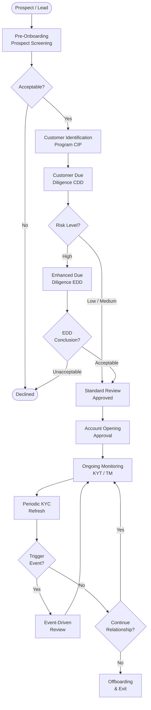

# KYC Domain: Private Banking — Expert Reference

> **Audience:** Senior KYC practitioners, Compliance Officers, KYC Platform Architects, Relationship Managers in Private Banking and Wealth Management.
> **Scope:** End-to-end KYC domain knowledge for High Net Worth (HNW) and Ultra High Net Worth (UHNW) clients.
> **Date:** March 2026

---

## Document Index

| # | Document | Description |
|---|----------|-------------|
| 01 | [KYC Fundamentals](./01-kyc-fundamentals.md) | Definition, objectives, AML/CTF context, and how Private Banking KYC differs from Retail and Corporate |
| 02 | [Private Banking Context](./02-private-banking-context.md) | HNW/UHNW client characteristics, complex structures, offshore entities, elevated risk profile |
| 03 | [KYC Lifecycle](./03-kyc-lifecycle.md) | End-to-end lifecycle: Onboarding → CIP → CDD → EDD → Risk Scoring → Monitoring → Periodic Review → Offboarding |
| 04 | [Key Concepts & Terminology](./04-key-concepts-terminology.md) | Deep-dive on UBO, PEP, SoW, SoF, Sanctions, Adverse Media, FATCA/CRS, KYT, and more |
| 05 | [Data Model & Information Capture](./05-data-model.md) | Data elements per stage, document requirements, entity vs. individual KYC, ownership hierarchies |
| 06 | [Operational Workflow & Case Management](./06-operational-workflow.md) | Roles, Maker-Checker, case management, SLAs, exception handling, escalation |
| 07 | [Technology & Systems](./07-technology-systems.md) | KYC platforms, integration architecture, AI/ML use cases in KYC |
| 08 | [Regulatory Landscape](./08-regulatory-landscape.md) | FATF, regional regulators, key directives (AMLD6, BSA, MAS, etc.) |
| 09 | [Risk & Challenges](./09-risk-challenges.md) | Complexity of HNW structures, false positives, data quality, cross-border issues |
| 10 | [Best Practices & Modern Trends](./10-best-practices-trends.md) | Digital KYC, Continuous KYC, Risk-Based Approach, automation vs. manual balance |
| 11 | [Real-World UHNW Onboarding Example](./11-real-world-example.md) | End-to-end case study: Offshore trust, PEP exposure, complex ownership — step-by-step walkthrough |

---

## What Is This Reference?

This knowledge base serves as a **master-level reference** for the KYC (Know Your Customer) domain in Private Banking. It is designed to be the single source of truth for:

- Understanding **why** each KYC control exists and its regulatory basis
- Learning **how** KYC is operationalised in private banking environments
- Designing or evaluating **KYC technology platforms** and workflows
- Training **KYC analysts, compliance officers, and relationship managers**
- Informing **AI/ML model design** for automation in KYC processes

---

## KYC at a Glance — High Level Flow

---

## Core Regulatory Pillars

| Pillar | Purpose | Key References |
|--------|---------|----------------|
| **AML** | Detect and prevent money laundering | FATF 40 Recommendations, AMLD6 |
| **CTF** | Counter terrorist financing | FATF R.6, UN Security Council Resolutions |
| **Sanctions** | Block dealings with prohibited individuals/entities | OFAC SDN, EU Consolidated List, UN Sanctions |
| **Tax Transparency** | Identify tax non-compliance and cross-border asset reporting | FATCA, CRS/AEOI |
| **Consumer Protection** | Ensure suitability and integrity of financial products | MiFID II, FCA COBS |

---

## Risk-Based Approach (RBA) — The Foundation

All modern KYC frameworks are built on the **Risk-Based Approach (RBA)**, a principle established by the Financial Action Task Force (FATF). The RBA mandates that:

1. Institutions **identify and assess** the money laundering and terrorist financing risks they face
2. They apply **proportionate measures** — enhanced controls for higher-risk customers, simplified for lower-risk
3. They **document and justify** their risk assessments

In Private Banking, the RBA is especially critical because the client base is inherently higher-risk due to wealth complexity, offshore exposure, and PEP proximity.

---

> Start with [01 — KYC Fundamentals](./01-kyc-fundamentals.md) for context-setting, or jump directly to any section in the index above.
